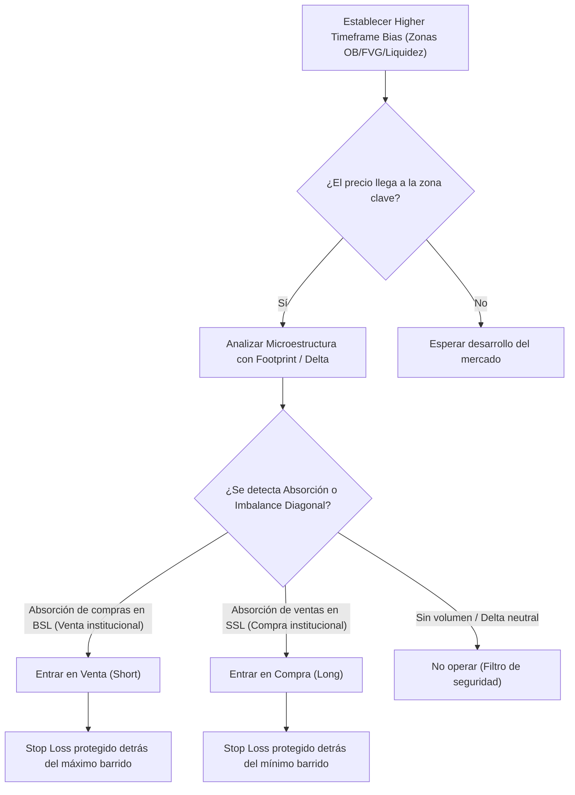

> [!NOTE]
> ### Resumen Causal
> - **Combinación Estratégica:** La acción del precio macro e [[Higher Timeframe Bias|SMC]] definen las zonas de alta probabilidad, mientras que el [[Order Flow]] (flujo de órdenes) brinda la confirmación micro exacta para entrar reduciendo el riesgo.
> - **Validación de Order Blocks:** No todos los [[Order Block (Bullish)|Order Blocks]] son válidos; se confirman mediante la presencia de imbalances de volumen acumulado (POCs o imbalances diagonales) y absorción en el footprint.
> - **Evitar Trampas de Stop Hunt:** Al cruzar la liquidez de [[Buy-Side Liquidity|BSL]] o [[Sell-Side Liquidity|SSL]], el flujo de órdenes permite diferenciar un rompimiento real de una absorción institucional que resultará en reversión rápida.

---

## Cronológico Breakdown

### `[00:00]` Introducción a los Dos Pilares
- Presentación de la sinergia entre Smart Money Concepts (SMC) y el flujo de órdenes profesional.
- Explicación de que SMC actúa como el mapa (macro) y el Order Flow (footprint, delta) actúa como el microscopio (micro) para afinar las entradas.

### `[08:15]` Identificación y Validación de Zonas de Interés
- Análisis de cómo se forman los [[Order Block (Bullish)|Order Blocks]] y [[Fair Value Gap|Fair Value Gaps (FVG)]].
- Criterios para determinar si una zona HTF retendrá el precio: búsqueda de imbalances de volumen acumulado y absorción límite activa en el footprint de la plataforma ATAS.

### `[15:30]` Barrido de Liquidez: BSL y SSL
- Cómo se visualizan las tomas de liquidez ([[Liquidity Sweep]]) en el flujo de órdenes.
- El comportamiento del Delta: un aumento masivo de compras a mercado en la zona de resistencia ([[Buy-Side Liquidity|BSL]]) que no logra desplazar el precio hacia arriba indica la presencia de órdenes institucionales pasivas de venta (Absorción).

### `[24:45]` El Footprint en Zonas Clave
- Lectura de los POCs (Point of Control) de la vela individuales en zonas de soporte/resistencia.
- Identificación de desequilibrios o imbalances diagonales que apoyan el cambio de dirección del precio.

### `[32:10]` Gestión de Entradas y Salidas Eficientes
- Cómo afinar el gatillo de entrada limitando el Stop Loss al extremo del barrido.
- La invalidación inmediata del setup si el precio atraviesa con volumen el POC de la vela de reversión.

---

## Mechanical Rules (IF/THEN)

- **IF** el precio llega a un [[Order Block (Bullish)|Order Block (OB)]] o [[Fair Value Gap|FVG]] de temporalidad mayor (HTF) **AND** el footprint en temporalidad menor muestra absorción pasiva y un giro en el Delta acumulado, **THEN** se ejecuta una entrada en compra protegida por debajo del mínimo de la estructura.
- **IF** ocurre un barrido de liquidez ([[Liquidity Sweep]]) sobre la resistencia ([[Buy-Side Liquidity|BSL]]) **AND** el Delta es fuertemente positivo pero la vela cierra por debajo del nivel barrido (absorción confirmada), **THEN** se entra en venta con Stop Loss por encima del máximo del sweep.
- **IF** entras a un trade de reversión **AND** la siguiente vela rompe y cierra con fuerza por debajo del POC defensor de la vela gatillo, **THEN** se cierra inmediatamente la operación (invalidación estructural).

---

## Mermaid Flowchart

