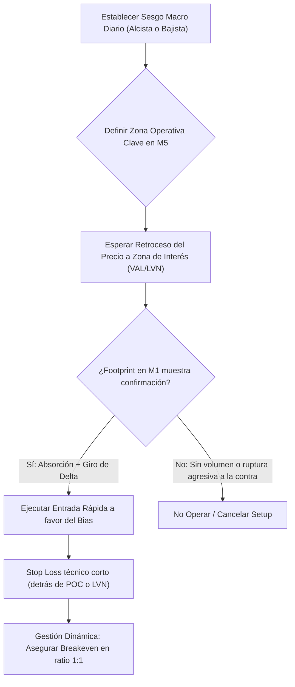

> [!NOTE]
> ### Resumen Causal
> - **Selección de Activos:** La estrategia se enfoca en futuros altamente líquidos como ES (S&P 500) y NQ (Nasdaq), aprovechando su alta volatilidad intradía para ejecuciones veloces en M1/M5.
> - **Identificación del Bias Diario:** Es mandatorio definir la tendencia macro al inicio de la sesión. Operar solo a favor del sesgo dominante reduce drásticamente las falsas entradas de scalping.
> - **Gestión de Riesgo Agresiva pero Controlada:** Al buscar movimientos rápidos de corta duración, el Stop Loss se reduce a mínimos técnicos (detrás de zonas de volumen o POC) y se asegura breakeven de forma dinámica.

---

## Cronológico Breakdown

### `[00:00]` Filosofía del Scalping Agresivo en Índices
- Introducción al scalping dinámico en ES y NQ.
- Por qué se prefieren temporalidades de 1 minuto (M1) y 5 minutos (M5) para la toma de decisiones basada en el flujo de órdenes.

### `[05:10]` Estableciendo el Contexto y la Dirección del Mercado
- Identificación del [[Higher Timeframe Bias|sesgo macro]] diario (bullish, bearish o consolidación).
- Mapeo de niveles clave: máximos/mínimos de sesiones anteriores ([[Session Highs - Lows|Session Highs/Lows]]), áreas de valor y POC de perfiles diarios.

### `[12:30]` Zonas de Interés Específicas para Entradas de Alta Velocidad
- Dónde buscar setups: retrocesos a nodos de bajo volumen (Low Volume Nodes - LVN), límites de áreas de valor de volumen, y retrocesos a [[Discount Zone|Discount]]/[[Premium Zone|Premium]] en el rango actual.
- Filtrado de ruido: ignorar señales que aparezcan fuera de las zonas operativas clave.

### `[21:40]` Modelos de Entrada con Delta y Footprint
- El gatillo de entrada: confirmación mediante aceleración de Delta o absorciones límite repentinas.
- Detección de agotamiento institucional: cuando la agresión disminuye en la punta del movimiento de corto plazo.

### `[30:20]` Gestión Dinámica del Trade
- Ejecución de la orden y colocación del Stop Loss justo detrás del POC de la vela de reversión o de la zona LVN de soporte.
- Regla de salida rápida: no esperar a que se toque el target final si el flujo de órdenes muestra una fuerza opuesta repentina.

---

## Mechanical Rules (IF/THEN)

- **IF** el sesgo macro diario es alcista **AND** el precio hace un retroceso a una zona de soporte clave (ej. VAL o LVN) en M1/M5 **AND** se detecta una absorción con Delta comprador en aumento, **THEN** se abre posición de compra.
- **IF** el trade avanza un ratio de 1:1 de beneficio/riesgo **OR** el precio completa la primera pierna impulsiva rápida, **THEN** se gestiona el Stop Loss a Breakeven o a un Stop dinámico ajustado tras el último POC alcista.
- **IF** el precio rompe a la contra una zona de imbalances que validaba la entrada agresiva, **THEN** se asume la pérdida manualmente o se ejecuta el Stop Loss (sin excepciones emocionales).

---

## Mermaid Flowchart

