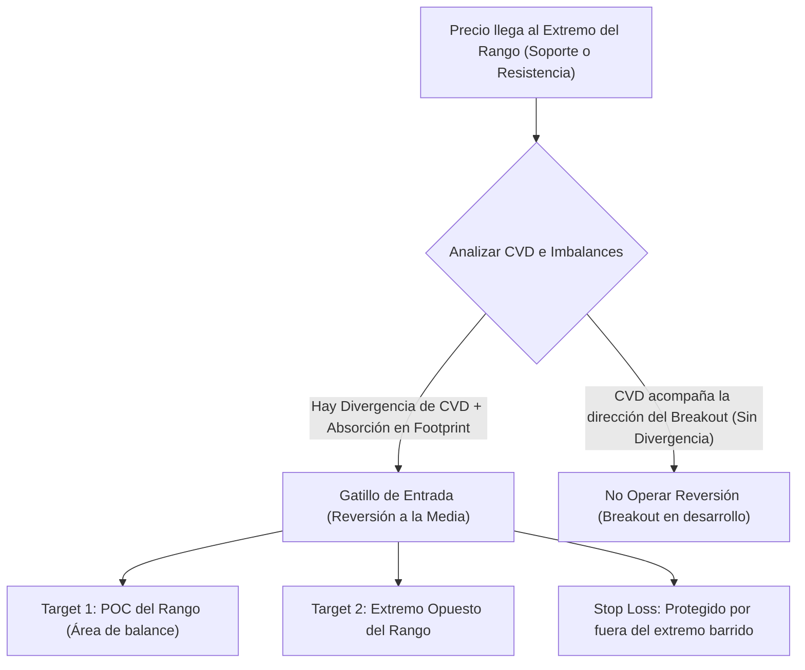

> [!NOTE]
> ### Resumen Causal
> - **Identificación de Rangos Claros:** El trading de rangos requiere ubicar los extremos definidos (soporte y resistencia) para buscar patrones de absorción y evitar operar en la zona central de indecisión.
> - **Uso Crítico de CVD (Cumulative Volume Delta):** El CVD acumulado nos permite encontrar divergencias clave en los extremos del rango, revelando si los rompimientos son falsos o tienen respaldo de agresión real.
> - **Absorción en los Extremos:** Un aumento sustancial del volumen negociado en los extremos sin desplazamiento de precio (absorción límite) confirma la defensa del rango por parte de las instituciones.

---

## Cronológico Breakdown

### `[00:00]` Estructura de Rango y Mecánica de Subasta
- Conceptos básicos de la subasta en mercados laterales (balance).
- Por qué la mayoría de los breakouts fallan en índices y criptomonedas (tomas de liquidez bajo mínimos y máximos relativos: [[Equal Highs|EQH]] / [[Equal Lows|EQL]]).

### `[06:30]` Introducción a Cumulative Volume Delta (CVD)
- Qué es el CVD y cómo diferencia la agresión neta total en una sesión o período determinado.
- Configuración de la herramienta de CVD en plataformas como ATAS y ExoCharts.

### `[14:15]` Identificación de Divergencias de CVD
- **Divergencia Alcista:** El precio marca un nuevo mínimo en el rango, pero el CVD muestra mínimos ascendentes (menor agresión vendedora a mercado, o ventas absorbidas por órdenes de compra límite).
- **Divergencia Bajista:** El precio marca un nuevo máximo, pero el CVD muestra máximos descendentes (compras absorbidas por órdenes de venta límite).

### `[22:45]` Confirmación con Delta e Imbalances de Footprint
- Búsqueda de velas de rechazo en los extremos del rango.
- Confirmación de volumen: el clúster de volumen (POC de la vela) debe estar ubicado en el extremo del wick (punta de la vela), atrapando a los breakouts minoristas.

### `[30:50]` Ejecución y Gestión del Trade dentro del Rango
- Entrada en reversión apuntando al POC del rango como primer objetivo de beneficios (reversión a la media) y al extremo opuesto como objetivo final.
- Stop Loss colocado por fuera del máximo/mínimo barrido.

---

## Mechanical Rules (IF/THEN)

- **IF** el precio visita un extremo del rango (soporte/resistencia) **AND** se observa una divergencia clara entre el CVD y el precio **AND** el footprint muestra absorción institucional (POC en el wick), **THEN** se abre posición de reversión con target en el POC del rango o el extremo opuesto.
- **IF** el precio rompe el extremo del rango con fuerza **AND** el CVD acompaña el rompimiento sin divergencias (haciendo nuevos máximos/mínimos junto al precio), **THEN** se cancela cualquier setup de reversión (rompimiento válido, no operar en contra).
- **IF** se ingresa en el trade **AND** el precio consolida por debajo del POC de la vela de reversión por más de 3 velas consecutivas, **THEN** se cierra el trade por falta de interés iniciador a favor de la reversión.

---

## Mermaid Flowchart

