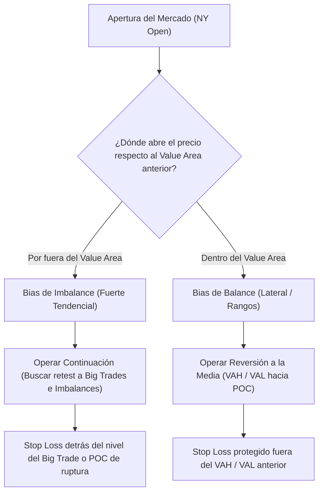

> [!NOTE]
> ### Resumen Causal
> - **Rotaciones de Valor (Balance vs. Imbalance):** El mercado se desplaza entre fases de equilibrio (rango/balance) y desequilibrio (tendencia/imbalance). Identificar en qué fase estamos determina si operamos reversión o breakout.
> - **Establecimiento del Bias con Volume Profile Open:** La apertura de la sesión americana y la relación del precio de apertura con el perfil de volumen previo definen la dirección probable de la subasta del día.
> - **Operar junto a Institucionales (Big Trades):** Las órdenes masivas ejecutadas a mercado (bloques de órdenes grandes detectados en el footprint) marcan niveles defensivos clave donde los institucionales protegerán sus posiciones.

---

## Cronológico Breakdown

### `[00:00]` Introducción a la Metodología para Futuros (Índices y Oro)
- Análisis de la estructura de subasta en futuros financieros (especialmente ES, NQ y Oro - GC).
- Comparativa de la velocidad y el comportamiento del oro frente a los índices bursátiles tradicionales.

### `[07:10]` Rotación de Valor: Balance vs. Imbalance
- Teoría de subasta y perfiles de volumen.
- Cómo se mueven las rotaciones de valor: cuando el mercado está en balance (consolida), operamos reversión a la media (POC); cuando entra en imbalance (tendencia), operamos continuación mediante retrocesos al valor previo.

### `[15:40]` Volume Profile Open y Bias Diario
- Cómo analizar la apertura de la sesión de Nueva York ([[NY Open]]) en relación al perfil de volumen del día anterior o de la sesión overnight (Asia y Londres).
- Regla de la apertura: si el precio abre dentro del Value Area anterior, es probable que se mantenga en rango; si abre por fuera, indica un fuerte potencial de tendencia.

### `[23:15]` Patrones de Entrada Simples con Footprint
- Identificación de POCs de vela prominentes y clústeres de imbalances diagonales de compra/venta.
- Cómo usar el footprint para gatillar la orden en retrocesos a los niveles de ruptura.

### `[31:00]` Big Trades y Bloques Institucionales
- Explicación de los indicadores de "Big Trades" (transacciones de gran volumen individual ejecutadas en un solo tick).
- Cómo operan las instituciones y cómo utilizar estos niveles de Big Trades como soportes o resistencias inmediatos en la sesión intradía.

---

## Mechanical Rules (IF/THEN)

- **IF** el precio abre por fuera del Value Area de la sesión anterior (Overnight/Previo) **AND** muestra aceptación de precios (se mantiene fuera las primeras velas de M5) con agresión direccional, **THEN** operamos a favor del imbalance (Bias direccional fuerte) buscando retrocesos a los imbalances institucionales.
- **IF** se detecta un clúster de "Big Trades" (compras masivas) en un nivel de soporte clave **AND** el precio reacciona positivamente, **THEN** se busca entrar en compra al retesteo de dicho clúster con Stop Loss colocado por debajo del nivel del Big Trade.
- **IF** el precio abre dentro del Value Area de la sesión anterior **AND** no se rompen los extremos VAH/VAL en la primera hora de la sesión, **THEN** se opera únicamente reversión a la media desde VAH hacia POC, y desde VAL hacia POC.

---

## Mermaid Flowchart

