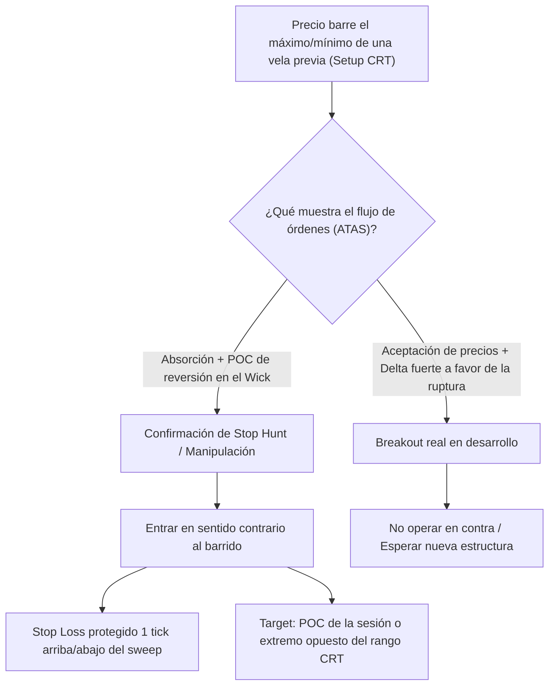

> [!NOTE]
> ### Resumen Causal
> - **Fusión CRT y Order Flow:** Candle Range Theory (CRT) define la estructura de manipulación a través del barrido de velas previas, mientras que el flujo de órdenes valida si ese barrido es un [[Stop Hunt]] genuino o un rompimiento fallido.
> - **Confirmación del Bias Contextual:** Es indispensable utilizar el volumen relativo de la sesión actual para definir la dirección del bias. La liquidez real no son líneas en el gráfico, sino nodos de órdenes límite acumuladas.
> - **Estrategia ante Stop Hunts:** Al producirse la manipulación, el footprint nos revela de inmediato la presencia de compradores o vendedores tardíos atrapados, permitiéndonos ingresar al trade antes de la aceleración del precio.

---

## Cronológico Breakdown

### `[00:00]` Introducción a Candle Range Theory (CRT)
- Explicación de los principios de CRT: cómo una vela diaria, semanal o de sesión define rangos de acumulación y manipulación.
- Cómo el barrido (sweep) de máximos/mínimos previos sirve de catalizador para movimientos direccionales agresivos.

### `[06:45]` Confirmación del Bias Contextual
- Cómo usar el Order Flow para validar el sesgo direccional de la sesión.
- Diferencia entre un mercado con intenciones alcistas/bajistas (agresión del Delta a mercado) y un mercado de simple distribución lateral.

### `[13:30]` Identificación de la Liquidez Real en el DOM y Footprint
- Búsqueda de órdenes institucionales en el libro de órdenes profundo (DOM).
- Diferenciación entre la liquidez fantasma (que se retira cuando el precio se acerca) y la liquidez real que absorbe y detiene el movimiento del precio.

### `[21:15]` Modelos de Entrada con Confirmación de Volumen
- Entrada tras el barrido (sweep) de una vela clave de CRT.
- Confirmación requerida: cierre de vela de reversión con POC localizado en el extremo barrido y imbalances opuestos en el inicio del cuerpo de la vela, confirmando la entrada de dinero institucional.

### `[29:00]` Reconociendo y Evitando Trampas (Stop Hunt)
- Cómo el flujo de órdenes nos salva de falsas reversiones.
- Si en un barrido de máximo el Delta sigue fuertemente positivo y el precio se acepta por encima del nivel barrido sin mostrar POCs en el wick, indica un breakout real y no un Stop Hunt.

---

## Mechanical Rules (IF/THEN)

- **IF** el precio realiza una toma de liquidez ([[Liquidity Sweep]] o CRT sweep) del máximo de una vela de sesión previa **AND** el footprint muestra absorción institucional (POC en el wick y Delta de reversión) **AND** el precio regresa dentro del rango de la vela previa, **THEN** se ingresa en venta (Short) con Stop Loss colocado 1 tick por encima del máximo barrido.
- **IF** se ejecuta una entrada CRT **AND** el precio avanza a favor rompiendo el POC de la estructura menor, **THEN** se mueve el Stop Loss para proteger la posición (a Breakeven o Stop Loss reducido).
- **IF** en un sweep de CRT el Delta apoya fuertemente la ruptura y no se detectan órdenes límite pasivas de absorción (el precio continúa subiendo velozmente sin volumen de reversión), **THEN** no se ejecuta ninguna orden en contra de la tendencia.

---

## Mermaid Flowchart

