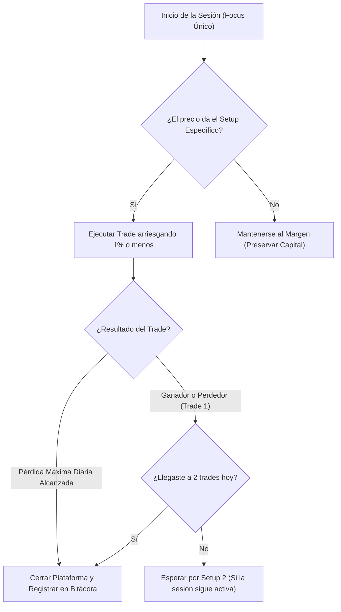

> [!NOTE]
> ### Resumen Causal
> - **El Concepto de Menos es Más:** El trading es una de las profesiones más difíciles; el éxito a largo plazo requiere simplicidad operativa, centrándose en dominar una sola configuración o setup.
> - **Especialización en una Sola Sesión:** No intentes operar todo el día. Selecciona una única sesión (como la apertura americana, [[NY Open]]) para concentrar tu atención y desarrollar un entendimiento profundo de su comportamiento.
> - **Estricta Gestión de Riesgo y Capital:** Limita tus trades diarios a un máximo de 1 o 2 operaciones de alta probabilidad, arriesgando un porcentaje fijo pequeño (ej. 1% o menos) y manteniendo una relación riesgo-beneficio favorable (mínimo 1:2).

---

## Cronológico Breakdown

### `[00:00]` La Dura Realidad del Trading Profesional
- Reflexión sobre los 6 años de experiencia del mentor en los mercados de futuros.
- Por qué la mayoría de los traders minoristas fracasan debido a la sobrecomplicación y la falta de enfoque.

### `[05:30]` El Gran Consejo: "Menos es Más"
- La importancia de la hiper-especialización: ser extremadamente bueno en un solo patrón o setup operativo.
- Desmitificación de la necesidad de conocer múltiples indicadores u operar todos los activos disponibles.

### `[12:15]` Dominar una Sola Sesión de Mercado
- Por qué es destructivo operar Asia, Londres y Nueva York al mismo tiempo.
- Enfocarse únicamente en la sesión de mayor liquidez ([[NY Open]]) y estudiar su comportamiento repetitivo a lo largo de meses.

### `[18:45]` La Disciplina de Parar tras 1 o 2 Trades
- Cómo el sobreoperar desgasta la psicología y nubla el análisis objetivo.
- Establecer límites estrictos de pérdidas diarias (Daily Loss Limit) para conservar el capital y proteger la psicología del trader.

### `[25:00]` Relación Riesgo-Beneficio como Pilar de Consistencia
- Explicación matemática de la rentabilidad: un sistema con un ratio mínimo de 1:2 o 1:3 permite ser rentable incluso con una tasa de acierto baja o media.
- Cómo gestionar la posición de manera pasiva una vez dentro, dejando que el mercado toque el Stop Loss o el Take Profit sin interferencias manuales.

---

## Mechanical Rules (IF/THEN)

- **IF** ejecutas 2 trades en una misma sesión (ya sean ganadores o perdedores), **THEN** cierras la plataforma ATAS y no vuelves a operar hasta la siguiente sesión (disciplina de cese de operaciones).
- **IF** el ratio de riesgo-beneficio del setup propuesto es menor a 1:2, **THEN** descartas la operación de inmediato (filtro de rentabilidad matemática).
- **IF** el precio alcanza la pérdida máxima diaria establecida (ej. 1.5% de la cuenta), **THEN** se apagan las pantallas de inmediato (regla de preservación de capital).

---

## Mermaid Flowchart

