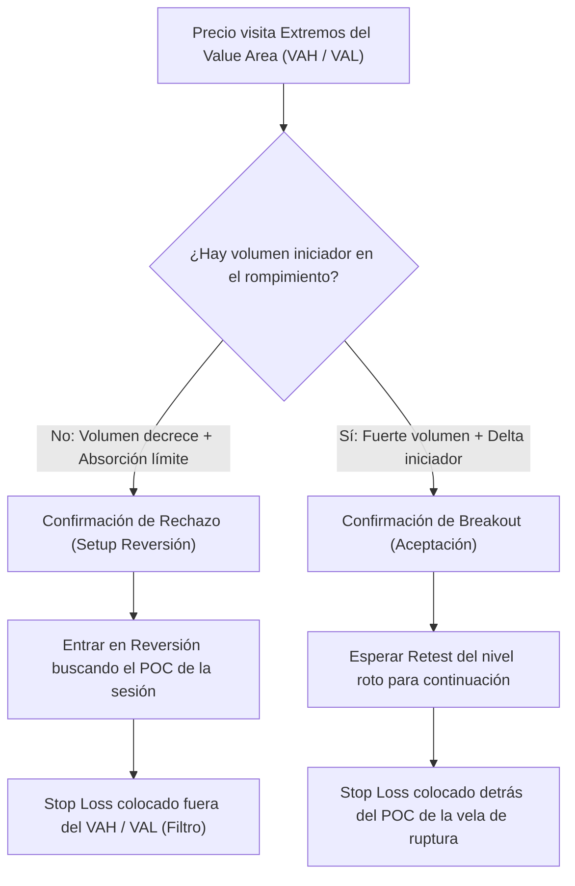

> [!NOTE]
> ### Resumen Causal
> - **Definición de Áreas de Valor:** El perfil de volumen identifica el 68% de las transacciones de una sesión en el Value Area (VAH a VAL). Operar cerca de los extremos (VAH y VAL) nos provee las mejores oportunidades de riesgo-beneficio.
> - **POC como Imán del Precio:** El Point of Control (POC) es el nivel con mayor volumen negociado y actúa como un imán para el precio. Evita buscar entradas cerca del POC ya que suele consolidar o tener alta indecisión.
> - **Estrategia ante Rechazo de Áreas de Valor:** Un rechazo en el VAH o VAL (con confirmación de volumen decreciente y absorción) indica una reversión fuerte hacia el POC opuesto del área de valor.

---

## Cronológico Breakdown

### `[00:00]` Introducción a la Estrategia de Perfil de Volumen
- Presentación de las herramientas clave para el perfil de volumen intradía.
- La diferencia entre el perfil de volumen fijo (rango específico) y el perfil de volumen de sesión (desarrollo diario).

### `[06:15]` Componentes del Volume Profile
- Definición de VAH (Value Area High), VAL (Value Area Low) y POC (Point of Control).
- Identificación de High Volume Nodes (HVN - áreas de aceptación) y Low Volume Nodes (LVN - áreas de rechazo rápido).

### `[14:30]` Bias de Apertura respecto al Perfil Previo
- Cómo analizar el comportamiento del precio de apertura en relación con el Value Area de la sesión overnight (Londres y Asia).
- Los tres escenarios de apertura: Apertura dentro del valor (in-value), apertura fuera con aceptación, y apertura fuera con rechazo (reingreso).

### `[21:45]` Setup de Reversión en VAH y VAL
- Cómo identificar el rechazo en los extremos del Value Area en gráficos de 5 minutos.
- Confirmación requerida: disminución drástica del volumen a medida que el precio toca el extremo, indicando falta de interés de los participantes en continuar el movimiento.

### `[29:30]` Colocación de Stop Loss y Take Profit
- El Stop Loss se coloca de forma segura 2-3 ticks por detrás del extremo del VAH o VAL (zona de invalidez).
- El primer Take Profit se sitúa en el POC del perfil de volumen de sesión, y el objetivo final en el extremo opuesto del Value Area.

---

## Mechanical Rules (IF/THEN)

- **IF** el precio abre dentro del Value Area de la sesión anterior **AND** visita el VAH o VAL sin romperlo con volumen iniciador **AND** se detecta absorción límite, **THEN** se abre posición de reversión buscando el POC con Stop Loss detrás del extremo.
- **IF** el precio rompe y se acepta por fuera del Value Area High (VAH) con fuerte agresión e incremento de volumen, **THEN** se cambia el bias a alcista y se busca comprar en el retesteo del VAH (ahora soporte).
- **IF** el precio se encuentra a menos de 5 ticks del POC de la sesión actual, **THEN** no se inician nuevas operaciones debido a la baja probabilidad y alta probabilidad de consolidación (rango estrecho).

---

## Mermaid Flowchart

