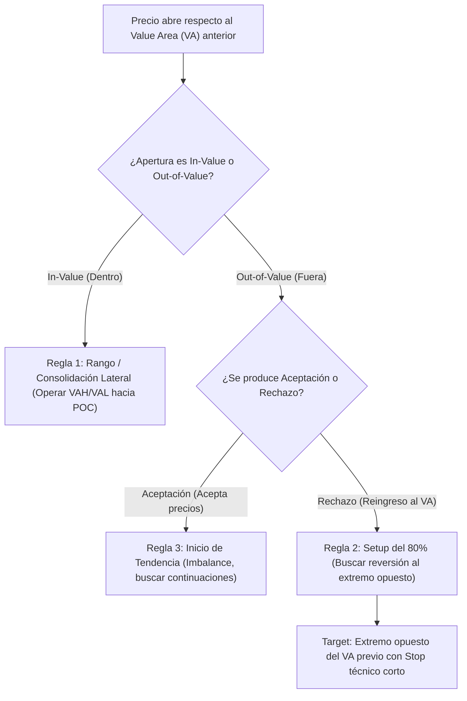

> [!NOTE]
> ### Resumen Causal
> - **Comprensión de Balance vs. Imbalance:** El mercado se encuentra en equilibrio (Balance) el 70-80% del tiempo, distribuyendo volumen en un rango. El 20-30% restante se desplaza en tendencia (Imbalance) en busca de nuevas zonas de valor.
> - **Las 5 Reglas Fundamentales del Value Area:** Reglas de comportamiento que dictan la probabilidad de que el precio regrese al valor o lo rompa definitivamente en base a la aceptación de precios.
> - **Uso del Perfil para Lectura de Contexto:** El perfil de volumen nos dice quién tiene el control (compradores o vendedores) analizando la migración del POC y la forma geométrica de la distribución de volumen.

---

## Cronológico Breakdown

### `[00:00]` Introducción a la Subasta de Mercado y Áreas de Valor
- Explicación de la subasta bidireccional continua del mercado.
- Cómo el Perfil de Volumen agrupa la información del precio en función del volumen negociado, eliminando la distorsión del factor tiempo puro.

### `[02:15]` Concepto Clave: Balance e Imbalance
- **Balance:** Distribución normal en forma de campana de Gauss, donde compradores y vendedores acuerdan que los precios actuales son justos.
- **Imbalance:** Distribución del volumen asimétrica u horizontal alargada, donde una parte domina y empuja el precio agresivamente buscando aceptación en niveles más altos o bajos.

### `[10:30]` Las 5 Reglas Fundamentales del Value Area
1. Si el precio abre dentro del Value Area, tiende a mantenerse en el rango de la sesión anterior.
2. Si el precio reingresa al Value Area tras haber salido, hay un 80% de probabilidad de que visite el extremo opuesto.
3. Si el precio abre fuera del Value Area y encuentra aceptación (múltiples velas cerrando fuera), se iniciará una fuerte tendencia a favor del rompimiento.
4. Si el precio abre fuera pero es rechazado de inmediato, volverá al interior del valor previo.
5. El POC actúa como el centro de gravedad o equilibrio del rango actual.

### `[18:45]` Cómo Leer la Forma de la Campana de Volumen
- Perfiles en forma de "D": Mercado en balance absoluto (consolidación lateral).
- Perfiles en forma de "b" (minúscula): Liquidación o tendencia bajista fuerte que se detiene en la parte inferior para consolidar.
- Perfiles en forma de "P" (mayúscula): Cobertura de posiciones cortas o tendencia alcista fuerte que consolida en máximos.

### `[26:00]` Aplicación Práctica del Contexto en el Gráfico
- Cómo trazar perfiles semanales y mensuales de volumen para identificar zonas institucionales macro de mediano plazo.
- Ensamble de la estrategia: operar únicamente en las zonas de mayor asimetría del perfil.

---

## Mechanical Rules (IF/THEN)

- **IF** el precio rompe fuera del Value Area anterior **AND** cierra dos velas de M15 consecutivas fuera de los límites (VAH o VAL), **THEN** se asume aceptación e inicio de tendencia (Imbalance), y se opera únicamente a favor de la ruptura en retrocesos.
- **IF** el precio sale del Value Area anterior pero reingresa en la siguiente vela cerrando por dentro, **THEN** se ejecuta el "Setup del 80%" buscando la reversión hacia el extremo opuesto del Value Area previo (ej. de VAH reingresando -> VAL).
- **IF** el POC de la sesión actual migra continuamente hacia arriba o abajo a lo largo del día, **THEN** se opera únicamente a favor de la tendencia de migración (sesgo dinámico alcista/bajista fuerte).

---

## Mermaid Flowchart

