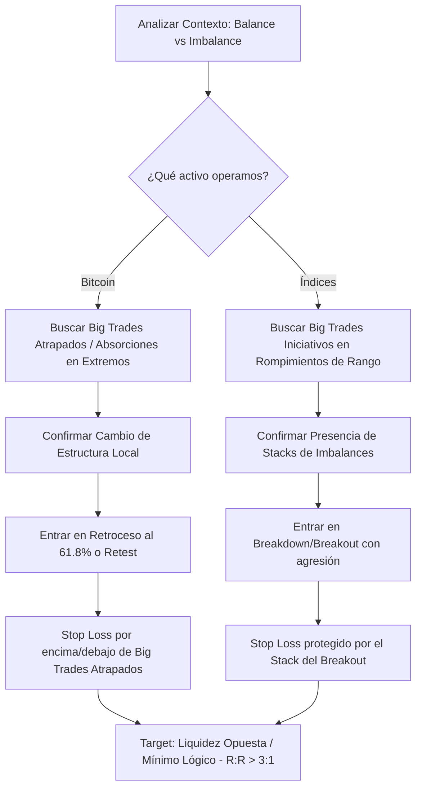

> [!NOTE]
> **Resumen Causal:**
> - **Foco en Big Trades:** El uso de grandes burbujas de órdenes de volumen (Big Trades) ayuda a identificar zonas de posicionamiento institucional y traders atrapados, evitando la predicción a ciegas y permitiendo operar a favor del flujo.
> - **Diferencia Bitcoin vs. Índices:** En Bitcoin (cripto) los Big Trades suelen indicar absorciones o traders atrapados (el precio se mueve en sentido contrario al delta acumulado). En índices (S&P 500 / Nasdaq), el precio suele moverse a favor del delta y de los Big Trades iniciativos.
> - **Stop Loss Protegido:** La validez del trade se define ubicando el Stop Loss inmediatamente detrás de los Big Trades confirmados, garantizando un ratio mínimo de 3:1 al buscar objetivos de liquidez lógica.

## Cronológico Breakdown
- **[00:00]** Introducción a la estrategia principal basada en Big Trades para identificar la participación institucional y estructurar operaciones.
- **[01:18]** Análisis del máximo histórico de Bitcoin del 6 de octubre: identificación de 11 millones de compras institucionales/atrapadas en el pico exacto de la mecha, lo cual anticipó la reversión.
- **[03:23]** Combinación de acción de precio (retroceso al 61.8% de Fibonacci tras un [[Change of Character]]) y la confirmación en el order flow mediante Big Trades de venta en el retroceso para afinar la entrada del short.
- **[05:44]** Aplicación de la [[03-conceptos-clave-teoria-de-subasta|Teoría de Subasta (AMT)]] para determinar si una consolidación es reacumulación o redistribución, evaluando la presencia constante de Big Trades de venta en la parte alta del rango.
- **[11:50]** Explicación de la diferencia del comportamiento del delta: los índices tienden a respetar el flujo del delta direccional, mientras que Bitcoin se mueve constantemente atrapando e invalidando el delta retail.
- **[12:57]** Configuración del setup de cortas en índices: ruptura de rango apoyada por Big Trades iniciativos de 2,000+ contratos y stacks de [[Imbalance|imbalances]], usando estas zonas de volumen como stop loss invalidante.
- **[17:20]** Repaso del modelo de balance a imbalance y los conceptos de comportamiento responsivo e iniciativo para timear breakouts válidos.

## Mechanical Rules (IF/THEN)
- **IF** se opera Bitcoin **AND** se observa un pico de Big Trades de compra excesivo (ej. >10M) en un máximo histórico con posterior cierre de vela por debajo y cambio de estructura local, **THEN** buscar retrocesos (ej. 61.8% de Fibonacci) para entrar en corto con el Stop Loss inmediatamente por encima de ese máximo.
- **IF** se opera en índices (S&P 500 / Nasdaq) **AND** se rompe un rango (breakdown/breakout) con la presencia de Big Trades iniciativos significativos (>2000 contratos) y stacks de imbalances, **THEN** entrar en la dirección de la ruptura y colocar el Stop Loss detrás de los Big Trades de ruptura.
- **IF** el precio realiza un retest a una zona de balance rota **AND** entran Big Trades en contra del movimiento correctivo (confirmación de agresión), **THEN** refinar la entrada a favor de la tendencia principal.

## Mermaid Flowchart

