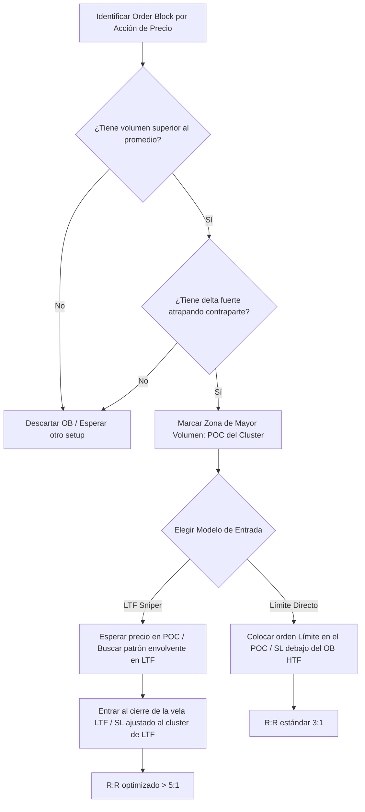

> [!NOTE]
> **Resumen Causal:**
> - **Fusión SMC + Order Flow:** Para evitar el fracaso común de elegir Order Blocks (OB) equivocados, se debe inspeccionar el volumen interno (clusters) de la vela del OB; un bloque válido requiere un volumen significativamente superior al promedio de la sesión.
> - **El Filtro de Volumen y Delta:** Un OB real muestra un volumen alto y un delta pronunciado (atrapando traders contrarios o iniciando el movimiento), mientras que un OB débil presenta volumen bajo y delta neutral, propicio para ser barrido.
> - **Modelos de Entrada Sniper:** Se definen dos opciones: 1) límite en la zona de mayor volumen de la vela (poc del cluster), o 2) esperar un patrón de absorción/envolvente en temporalidades menores (LTF) dentro del cluster de volumen para reducir el Stop Loss.

## Cronológico Breakdown
- **[00:00]** Introducción al problema clásico de los múltiples order blocks y la necesidad de combinarlos con order flow para "visión de rayos X".
- **[02:37]** Definición teórica del [[Order Block (Bullish)|Bullish]] y [[Order Block (Bearish)|Bearish]] Order Block bajo la metodología ICT y qué representa a nivel transaccional (traders atrapados y agresión).
- **[03:57]** Las 6 condiciones básicas de Acción de Precio para validar un OB:
  1. Formación de [[Swing High]] / [[Swing Low]].
  2. Generación en niveles HTF de soporte/resistencia importantes.
  3. Cierre de vela confirmatorio por encima/debajo del 50% del rango de la vela del OB.
  4. [[Break of Structure|Cambio de estructura]] visible al bajar la temporalidad (LTF).
  5. Generación de un impulso con [[Imbalance|imbalances]] (desplazamiento).
  6. Confluencia con la zona del 61.8% de Fibonacci / OTE (Optimal Trade Entry).
- **[06:40]** Ejemplo de fallo de un OB que cumplía las 6 reglas de acción de precio debido a la ausencia de volumen real (volumen decreciente e insignificante al llegar al bloque).
- **[09:31]** Características de un OB de alta probabilidad en Order Flow: volumen superior a la media de la sesión y delta fuerte (ej. delta negativo para un Bullish OB que atrapa vendedores).
- **[13:14]** **Modelo de Entrada 1:** Colocar orden limit en el punto de volumen máximo del perfil interno de la vela del OB con stop por debajo del extremo de la vela del OB.
- **[14:14]** **Modelo de Entrada 2 (LTF):** Identificar la zona de mayor volumen en la vela HTF, bajar a LTF, buscar un patrón envolvente de absorción, y entrar en el cierre con Stop Loss ajustado por debajo del bloque de volumen de LTF.
- **[18:22]** Selección de OBs múltiples: cuando hay dos bloques adyacentes, combinar sus perfiles de volumen para operar en el nodo de mayor volumen concentrado global.

## Mechanical Rules (IF/THEN)
- **IF** identificas un Order Block por acción de precio **AND** el volumen interno de esa vela es menor que el promedio de las velas adyacentes, **THEN** clasificarlo como bloque débil y descartar la entrada límite directa.
- **IF** el OB presenta volumen superior a la media **AND** muestra un delta fuerte que atrapa a la contraparte (ej. delta negativo en un Bullish OB) **AND** hay desplazamiento posterior con delta a favor, **THEN** definir una zona de entrada límite en el POC (Point of Control) del cluster de la vela.
- **IF** buscas optimizar el Ratio Riesgo/Beneficio (R:R) **AND** el precio ingresa al cluster de mayor volumen del OB, **THEN** bajar a LTF, esperar una vela envolvente que cierre con el volumen concentrado en su parte baja (patrón de absorción), y entrar al cierre con Stop Loss por debajo de dicho cluster en lugar de la vela completa.

## Mermaid Flowchart

