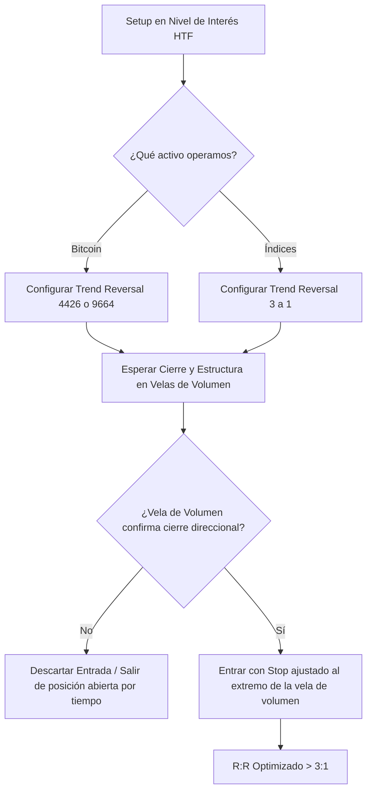

> [!NOTE]
> **Resumen Causal:**
> - **Independencia del Tiempo:** Las velas de volumen (especialmente las Trend Reversal) abren y cierran basadas exclusivamente en el volumen transaccionado, eliminando el ruido temporal y exponiendo el interés institucional genuino en rupturas o reclamos de niveles.
> - **Filtrado de Falsas Señales:** Actúan como un sistema de doble confirmación junto a los gráficos de tiempo. Si un patrón temporal (ej. vela envolvente en 1m) no logra confirmar un cierre de Trend Reversal, el trade se descarta, previniendo pérdidas.
> - **Anticipación y R:R:** En activos lentos o con mucho amago como Bitcoin, la señal en velas Trend Reversal suele anticipar el cambio de estructura de 5 minutos, permitiendo entradas sniper con Stops reducidos y R:R óptimos.

## Cronológico Breakdown
- **[00:00]** Introducción al concepto de velas de volumen y su diferencia clave con los gráficos de tiempo convencionales.
- **[01:03]** Explicación mecánica: las velas de volumen no dependen del reloj; cierran cuando el mercado completa una cantidad exacta de transacciones/volumen, sin importar si toma 10 minutos o 1 minuto.
- **[02:24]** Tres beneficios clave:
  1. Revelan el interés real de volumen en la ruptura o reclamo de un nivel.
  2. Potencian las entradas tradicionales al cruzar tiempo y volumen.
  3. Anticipan entradas tempranas o reconfirman con seguridad setups temporales.
- **[05:00]** Configuración recomendada para velas Trend Reversal en la plataforma ATAS:
  - **Cripto (Bitcoin):** Configuración `4426` para entradas tempranas/scalping rápido, o `9664` para mayor confirmación (equivalente a un sesgo de 5 minutos).
  - **Índices (S&P 500 / Nasdaq):** Configuración `3 a 1` (3-1). Dado el enorme volumen en índices, se requiere un tamaño menor para evitar entrar tarde al movimiento.
- **[06:50]** Caso práctico en Índices (S&P 500): Entrada fallida por tiempo (1m envolvente) que es filtrada positivamente por el gráfico Trend Reversal al cerrar reiteradamente por debajo del nivel de control, evitando un stop out.
- **[09:30]** Caso práctico en Bitcoin: Anticipación de un trade corto de alta probabilidad. Mientras que en 5m (m5) no había cambio de estructura, la vela Trend Reversal `4426` dio entrada limpia con R:R de 3:1 mucho antes de la caída general.

## Mechanical Rules (IF/THEN)
- **IF** se opera en criptomonedas (Bitcoin) **AND** se busca scalping dinámico, **THEN** configurar las velas Trend Reversal en `4426` en ATAS; si se busca confirmación tipo intradiario de 15m, **THEN** configurar en `9664`.
- **IF** se opera en índices (S&P 500 / Nasdaq), **THEN** usar una configuración Trend Reversal pequeña de `3 a 1` para contrarrestar la alta velocidad del flujo transaccional.
- **IF** un gráfico de tiempo (M1 o M5) muestra un patrón de entrada (ej. vela envolvente/engulfing) en un nivel de interés **AND** la vela Trend Reversal no logra romper y cerrar más allá de la consolidación de control local, **THEN** descartar la entrada o cerrar inmediatamente la posición, ya que carece de confirmación de volumen.

## Mermaid Flowchart

