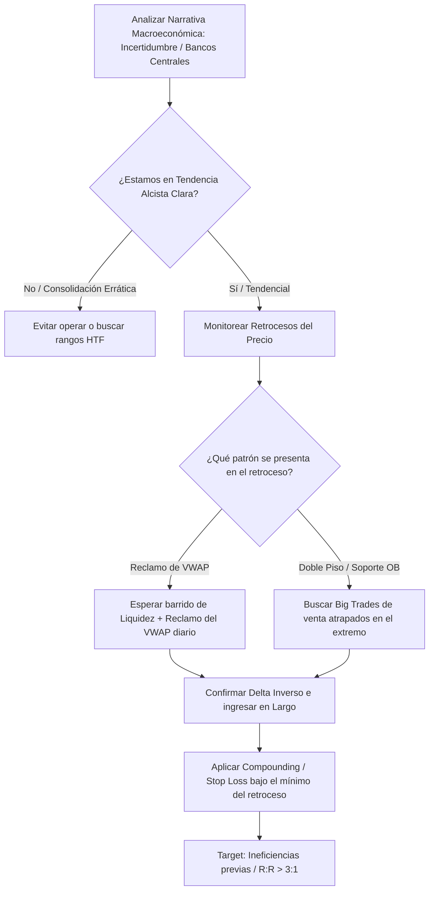

> [!NOTE]
> **Resumen Causal:**
> - **El Oro como Refugio y Narrativa:** El oro es un activo de refugio impulsado por narrativas de riesgo sistemático (crisis geopolíticas, conflictos bancarios, compras masivas de bancos centrales) y no por noticias individuales aisladas de Forex Factory.
> - **Compounding en Tendencia:** En tendencias claras sustentadas por el contexto macro, se busca aplicar *compounding* (agregar margen en retrocesos) al confirmarse tomas de liquidez o Big Trades en zonas de soporte HTF.
> - **Mecánica VWAP y Liquidez:** Para intradía, la entrada reina en el oro ocurre cuando se barre liquidez (incluyendo los clásicos doble techos/pisos que al oro le encanta respetar), se cruza el [[07-guia-completa-volume-profile-espanol|VWAP]] y se reclama con agresión institucional.

## Cronológico Breakdown
- **[00:00]** Explicación de por qué el oro ofrece una gran ventaja estadística frente a divisas o criptomonedas si se opera bajo el contexto correcto de balance e imbalance.
- **[01:24]** Preguntas fundamentales para la preparación diaria: "¿De dónde venimos? ¿Hacia dónde vamos? ¿Dónde está la liquidez?".
- **[02:10]** Definición de *compounding* en swing trading: cómo aprovechar tendencias largas para escalar posiciones en los retrocesos usando confirmaciones de volumen.
- **[04:46]** Caso de estudio geopolítico: la noticia de Trump/Maduro. Reclamación del Value Area Low (VAL) dominical tras atrapar shorts en la zona de soporte el viernes anterior.
- **[06:57]** La ineficiencia como imán: cómo el precio consume de forma acelerada las zonas de caída rápida (ineficiencias previas) una vez que rompe el balance.
- **[08:00]** Estrategia del VWAP: utilización de la desviación y reclamo del VWAP diario como trigger de entrada al detectar traders atrapados contra la tendencia.
- **[09:01]** Fundamentos macroeconómicos del oro: el papel del oro como cobertura ante la pérdida de confianza en las monedas fiduciarias (USD, EUR, GBP) y compras de Bancos Centrales.
- **[11:07]** **Tip del Viernes a Lunes (Data Edge):** Comprar barato los viernes si la fundamental y el análisis técnico de volumen confluyen, para vender caro el lunes o martes.
- **[12:44]** Comparativa de sesiones en oro: transición de operar Londres y Nueva York a la sesión de Asia, buscando un ratio fijo de 3R.
- **[13:16]** Teoría de subasta aplicada: cuando el mercado no está dispuesto a aceptar precios más caros, ocurre un drenamiento de compras visible en el order flow por la disminución drástica del volumen en máximos.

## Mechanical Rules (IF/THEN)
- **IF** el oro muestra una tendencia alcista macro de largo plazo (sustentada por compras de bancos centrales o riesgo geopolítico) **AND** realiza un retroceso a una zona de soporte clave (ej. Daily OB) **AND** se observan Big Trades de venta atrapados en la parte baja, **THEN** ejecutar compras y añadir margen a las posiciones existentes (*compounding*).
- **IF** el precio rompe el VWAP diario y sufre un retroceso **AND** el delta se torna fuertemente negativo (ej. atrapando vendedores) pero el precio reclama y cierra nuevamente por encima del VWAP, **THEN** entrar en largo protegiendo el Stop Loss por debajo del mínimo de la trampa.
- **IF** es día viernes **AND** el oro se encuentra en una zona de descuento técnico barata **AND** la narrativa geopolítica es de alta incertidumbre, **THEN** buscar compras en la sesión americana tardía y holdear la posición hasta la apertura y desarrollo de la sesión del lunes/martes.

## Mermaid Flowchart

