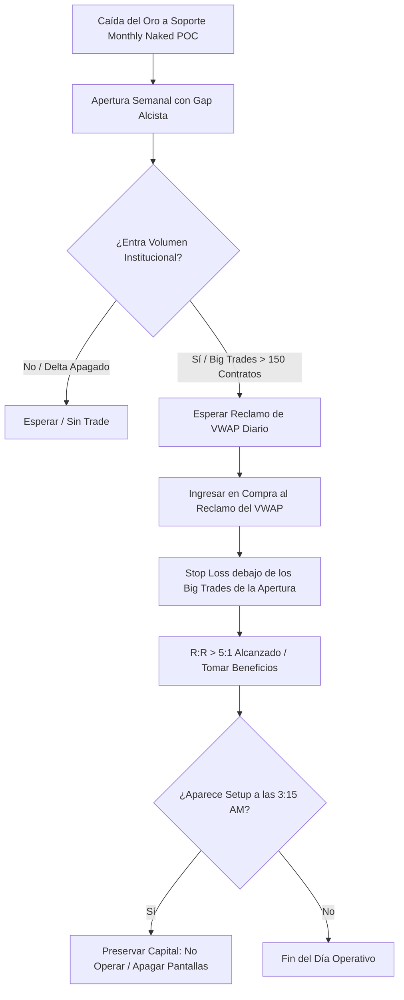

> [!NOTE]
> **Resumen Causal:**
> - **Rechazo en Monthly Naked POC:** Tras una caída masiva de 450-500 puntos en pocos días, el oro reaccionó con precisión quirúrgica en el Naked POC mensual, que representaba la zona de mayor acumulación de volumen previa al rally histórico de 1,000 puntos.
> - **Confirmación de Gap e Institucionales:** La apertura semanal con un gap alcista y la entrada de Big Trades institucionales (>180 contratos a mercado) confirmaron la intención de reversión antes de llenar el gap, invalidando la teoría retail de "llenar el gap antes de subir".
> - **Preservación y Psicología de Balas:** Se prioriza la preservación de capital al declinar un segundo setup válido a las 3:15 AM (sesión de poco volumen), evitando comprometer la estabilidad psicológica de cara a la sesión de Nueva York.

## Cronológico Breakdown
- **[00:00]** Presentación del trade de compra en oro en el Discord privado del programa anual, detallando las ganancias logradas en cuentas personales y de fondeo.
- **[01:34]** Análisis del contexto macro: tras una caída acelerada desde 4,500 hasta 4,070, el retail entra en pánico vendiendo soportes, mientras que las instituciones compran el soporte HTF.
- **[02:30]** Identificación técnica del **Monthly Naked POC**: zona de consolidación histórica clave donde se acumularon millones de órdenes antes de la gran subida del oro.
- **[03:45]** Análisis de order flow en la apertura semanal: detección de Big Trades de compra institucional (bloques de 181, 63 y 40 contratos a mercado) y posterior reclamo del VWAP diario.
- **[04:40]** Incorporación de la fundamental: Trump anuncia el fin/acuerdo en Medio Oriente (Irán) en su red Truth Social, sirviendo de catalizador de liquidez para el movimiento alcista.
- **[07:14]** Desarrollo del trade y ejecución: entrada en compras tras el reclamo del VWAP, usando como invalidación técnica (Stop Loss) el clúster de los Big Trades institucionales de la apertura.
- **[08:50]** Gestión psicológica del trade: análisis de por qué se declinó una segunda compra clara a las 3:15 AM para proteger el balance semanal y no "quemar balas" innecesarias en horarios de baja liquidez.
- **[11:30]** Consejos sobre el crecimiento a largo plazo como trader, la consistencia, el uso del interés compuesto y la especialización exclusiva en un solo activo (oro).

## Mechanical Rules (IF/THEN)
- **IF** el oro experimenta una fuerte caída correctiva **AND** alcanza una zona de soporte HTF como un Naked POC mensual **AND** abre la semana con un gap alcista y agresión en el delta de compras, **THEN** buscar oportunidades en largo, omitiendo la idea retail de esperar el llenado del gap.
- **IF** se detecta la entrada de Big Trades compradores en el soporte HTF **AND** el precio cierra y reclama el VWAP diario por encima de la consolidación inicial, **THEN** ejecutar la compra colocando el Stop Loss por debajo del clúster de volumen institucional.
- **IF** ya se ha tomado profit en un trade principal de alta probabilidad **AND** se presenta un segundo setup fuera del horario operativo principal (ej. 3:15 AM), **THEN** no tomar la operación para conservar el capital y proteger la psicología del operador.

## Mermaid Flowchart

