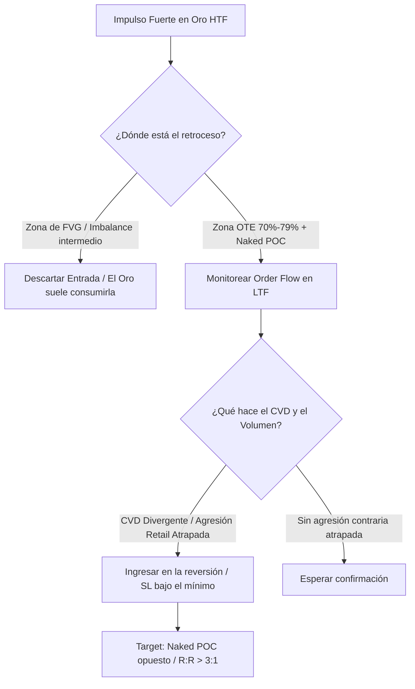

> [!NOTE]
> **Resumen Causal:**
> - **Inutilidad de los FVGs en Oro:** A diferencia del SMC tradicional, en el oro los Fair Value Gaps (FVG) o imbalances no suelen actuar como soporte o resistencia; el oro los consume por completo como imanes, viajando de un extremo de volumen al otro.
> - **Confluencia Naked POC + OTE:** La ventaja estadística del oro radica en buscar retrocesos profundos alineados con la zona OTE (Optimal Trade Entry, 70%-79% de Fibonacci) en confluencia directa con Naked POCs semanales o mensuales detectados en softwares de volumen (ATAS/ExoCharts).
> - **Lectura del CVD en Giros:** En reversiones de alta probabilidad, se observa un CVD extremadamente negativo (acumulación masiva de shorts de retail vendiendo mínimos) en plena zona de Naked POC. Al fallar el quiebre y cambiar de estructura, esos vendedores quedan atrapados, impulsando subidas violentas (>200 puntos).

## Cronológico Breakdown
- **[00:00]** Introducción a tres swing trades ganadores en el oro (100, 200 y 300 puntos de recorrido) aplicando order flow e identificando niveles de volumen HTF.
- **[01:12]** Explicación del primer trade (Long del 1 de mayo): confluencia de un Naked POC de alta temporalidad como imán y soporte.
- **[02:23]** **El Comportamiento del Oro con los FVGs:** Advertencia sobre no operar FVGs como zonas de rebote en el oro, ya que son barridos y consumidos en su totalidad.
- **[02:50]** **Tip Técnico (Uso de OTE):** Explicación de por qué el retroceso OTE (Optimal Trade Entry - 70% a 79% del Fibonacci) funciona excepcionalmente bien en el oro debido a sus retrocesos profundos.
- **[03:49]** Análisis de un trade de continuación de Nueva York: absorción de ventas en delta positivo en el clúster inferior y salida en la zona superior de resistencia (3.7 R:R).
- **[05:24]** Explicación del segundo trade (Short del 6 de mayo): retroceso exacto de Fibonacci OTE de todo el impulso bajista previo, rechazando un Naked POC/clúster de volumen.
- **[06:49]** Explicación del tercer trade (Long): CVD cayendo fuertemente a -3,700 contratos mientras el precio se sostenía en el clúster de volumen, indicando absorción pasiva de compras y shorts retail atrapados.
- **[09:00]** Plan de continuación de tendencia: entrada tras romper la última resistencia clara diaria al no haber obstáculos técnicos en los siguientes 100 puntos (llegando al target en 2,033).
- **[12:11]** Psicología operativa de la élite: la importancia de un winrate realista del 40-50% con R:R de 2:1 fijo en lugar de perseguir ratios mágicos, respaldado por un journal riguroso de backtesting (300+ trades documentados en XAUUSD).

## Mechanical Rules (IF/THEN)
- **IF** el oro se encuentra en una tendencia bajista o alcista en H1/Daily **AND** se proyecta un retroceso, **THEN** esperar a que el precio alcance la zona de OTE (70% - 79% de retroceso de Fibonacci) y confluya con un Naked POC previo, omitiendo entrar de forma anticipada en imbalances intermedios.
- **IF** el precio alcanza un Naked POC clave **AND** el CVD muestra una divergencia extrema acumulando contratos en sentido contrario al rebote (ej. CVD de -3,000 en soporte), **THEN** esperar el cambio de estructura local en LTF para entrar en largo, protegiendo el Stop Loss por debajo del mínimo de absorción.
- **IF** vas a operar de forma consistente a largo plazo, **THEN** especializarse en un único activo (ej. Oro) y llevar a cabo una revisión del journal los domingos para retroalimentar la ventaja estadística propia del plan de trading.

## Mermaid Flowchart

