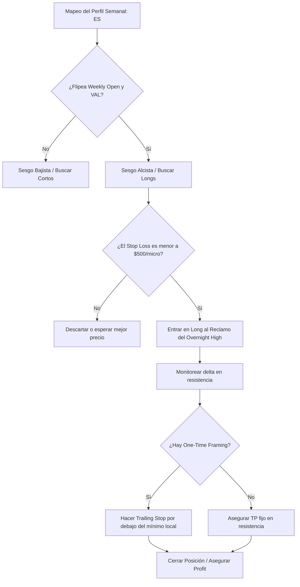

> [!NOTE]
> **Resumen Causal:**
> - **Sesión en Vivo en Índices (ES):** Se opera a favor del sesgo diario (bullish bias) al flipear el Weekly Open y reclamar el Overnight High, buscando la rotación completa del perfil de volumen hacia el Daily Untested POC.
> - **Gestión de Trailing Stop:** Se aplica trailing stop técnico ajustándolo inmediatamente debajo de los mínimos validados del One-Time Framing (OTF) para mitigar el riesgo de reversión en zonas de resistencia de delta.
> - **Regla de Consistencia y Fondeos:** En firmas como Bulenox, se explica el arbitraje matemático de la regla de consistencia del 40% (ningún día debe superar el 40% del profit total acumulado) y la estrategia de diversificar operativas en múltiples cuentas para asegurar retiros.

## Cronológico Breakdown
- **[00:00]** Introducción a la sesión de live trading de los miércoles en índices (S&P 500 / ES) junto a Tobi.
- **[00:30]** Análisis y mapeo del perfil semanal: interacción con el Weekly Open, rebotes en el VAL (Value Area Low) y objetivos en los Naked POCs.
- **[02:15]** Regla de filtro del Stop Loss: descarte de entradas cuyo Stop Loss supere los $500 por contrato micro en el S&P 500 (ES), priorizando recorridos limpios.
- **[03:45]** Sesgo direccional: análisis del delta acumulado y la decisión de operar exclusivamente en compras (long bias) al observar absorciones en el overnight high.
- **[05:25]** Gestión del trade: ejecución del long tras el retest de la zona del overnight high, ajustando el stop loss de forma local por debajo de los mínimos relativos.
- **[08:35]** Gestión dinámica: monitoreo del delta en H1/M30. Trailing stop estricto al observar el volumen secándose en resistencia para asegurar $500 de ganancia.
- **[14:15]** Discusión sobre cuentas de fondeo: el uso de cuentas de scalping de bajo riesgo para mitigar la ansiedad y evitar sobreoperar la cuenta swing principal.
- **[15:40]** **La regla de consistencia (Bulenox):** Explicación de cómo calcular el límite del 40% de ganancias en un solo día para garantizar la aprobación del retiro (ej. si el profit es de $3,600, el día máximo no puede superar los $1,440).
- **[17:50]** Estrategia de cartera de cuentas de fondeo: diversificar el riesgo en tres cuentas alternando días de operativa. Si se quema una cuenta ($200 costo de reset) pero se retiran $1,000 en otra, el sistema sigue siendo rentable (R:R 1:5).

## Mechanical Rules (IF/THEN)
- **IF** el precio abre por encima del VAL semanal **AND** flipea/recupera el Weekly Open **AND** el delta muestra fortaleza alcista, **THEN** buscar únicamente posiciones en largo (long bias) con objetivo en el VAH o Naked POCs superiores.
- **IF** se opera en el S&P 500 (ES) **AND** el Stop Loss técnico de la entrada supera el límite de $500 por contrato micro, **THEN** cancelar la orden límite o esperar un retroceso más profundo para no violar las reglas de gestión de riesgo.
- **IF** el trade entra en profit a favor de la tendencia **AND** la estructura en temporalidades menores empieza a realizar mínimos ascendentes (One-Time Framing), **THEN** realizar un trailing stop por debajo del último mínimo validado de volumen (POC local).
- **IF** se opera con cuentas de fondeo (prop firms) con regla de consistencia del 40%, **THEN** planificar el volumen y los targets para que el beneficio de una sola sesión no exceda el 40% del objetivo total acumulado para el retiro.

## Mermaid Flowchart

