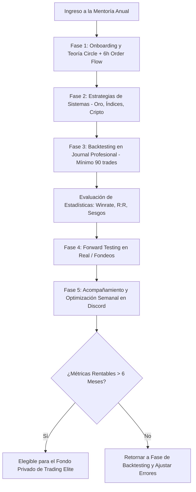

> [!NOTE]
> **Resumen Causal:**
> - **Fundamentos de Mentoría de Élite:** Dimi (fundador) detalla su formación con Daniel de *Chart Champions* y su posterior especialización en *World Class Edge* junto a Patrick Neil (múltiple campeón del Robbins World Cup Championship) y Fabio Valentini.
> - **Modelo del Programa en 5 Fases:** La mentoría anual de Supreme Trading se divide en cinco etapas progresivas: Entrenamiento Técnico, Estrategias de Sistemas, Backtesting Estadístico Riguroso, Operaciones de Campo (Forward Testing) e Implementación de Mejoras.
> - **Visión del Fondo Privado:** El objetivo final del programa no es simplemente la venta de cursos, sino la selección y desarrollo de operadores de élite en habla hispana para formar un fondo de gestión conjunta de capital institucional.

## Cronológico Breakdown
- **[00:00]** Introducción al propósito del video: transparentar la estructura del programa anual y el background técnico de los mentores.
- **[01:00]** Experiencia personal de Dimi: la transición de trader amateur en YouTube/Telegram a profesional tras perder gran parte de sus ahorros debido a la falta de gestión de riesgo.
- **[02:22]** Primer pilar de formación: dos años de especialización en la comunidad *Chart Champions* de Inglaterra junto a Daniel, Igor y Severine.
- **[03:07]** Segundo pilar de formación: especialización en *World Class Edge* de Estados Unidos ($5,000 de inversión), mentoreado por Patrick Neil y el scalper Fabio Valentini.
- **[05:10]** Estructura del programa anual (Organización del camino del punto A al punto B):
  - **Fase 1 (Día 1-30 - Entrenamiento):** Fundamentos en la plataforma Circle (Fibonacci, VWAP, perfiles de volumen, open interest, ineficiencias, patrones, complementos) y +6 horas (22 clases) dedicadas exclusivamente a Order Flow transaccional.
  - **Fase 2 (Día 30-60 - Sistemas):** Módulos y reglas operativas de estrategias específicas en Oro (XAU/USD), futuros de índices (ES/NQ) y criptomonedas.
  - **Fase 3 (Día 60-180 - Backtesting):** Realización de backtesting estadístico propio usando su plantilla de journal profesional (ej. revisión detallada de más de 90 trades).
  - **Fase 4 y 5 (Mes 6-12 - Campo y Mejoras):** Operativa en vivo, forward testing, revisiones semanales/mensuales de métricas y creación de estrategias personalizadas.
- **[12:00]** Dinámica de acompañamiento de la comunidad: canal de Discord de consultas 24/7 y clases de soporte en vivo semanales de hasta 3 horas de duración para la corrección de journals.
- **[13:30]** Casos de éxito y pruebas sociales de alumnos fondeados (Mauro, Roger, Emi, Fran, Luquitas, Fede) con retiros reales auditados.
- **[14:40]** Costo del programa ($1,500 en dos pagos o $1,200 en un solo pago) y justificación de valor frente al costo de las mentorías en inglés de origen.
- **[15:50]** Declaración de misión a largo plazo: estructuración de un fondo privado de trading elite para la gestión de capital a partir de los alumnos egresados.

## Mechanical Rules (IF/THEN)
- **IF** ingresas a la mentoría de Supreme Trading, **THEN** comprometerse a seguir de manera secuencial las fases del sistema sin saltar directamente a la operativa en real antes de completar el backtesting estadístico (Fase 3).
- **IF** realizas el módulo de backtesting, **THEN** registrar de forma obligatoria las métricas de winrate, R:R promedio, R:R máximo, timeframes y categorización de errores operativos en el journal para filtrar sesgos personales.
- **IF** un alumno completa el programa con rentabilidad auditada por más de 6 meses en cuentas reales o fondeadas, **THEN** califica como candidato elegible para formar parte del fondo de inversión élite liderado por Dimi y Tobi.

## Mermaid Flowchart

