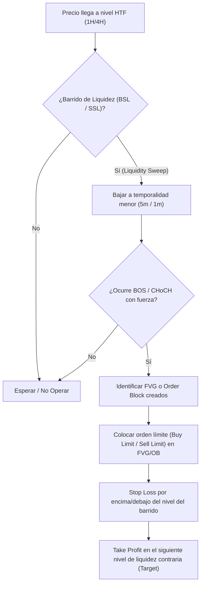

> [!NOTE]
> ### Resumen Causal
> - **El trading como habilidad, no como dinero:** Se debe eliminar el apego mental y emocional al dinero al iniciar en el trading. El trading es un *skillset* comparable a jugar al baloncesto o tocar el piano; la rentabilidad es solo un efecto secundario de perfeccionar la habilidad de predecir la dirección del precio con alta probabilidad.
> - **Estructura de Mercado y Liquidez:** El precio se mueve por la interacción entre la liquidez ([[Buy-Side Liquidity|BSL]] y [[Sell-Side Liquidity|SSL]]) y las ineficiencias del mercado ([[Fair Value Gap|FVG]]). Identificar correctamente la dirección del mercado ([[Market Structure|Market Structure]]) y los barridos de liquidez ([[Liquidity Sweep]]) en temporalidades altas es clave para definir el sesgo.
> - **Gestión de Riesgo y Simulación:** Para construir la habilidad sin el sesgo del miedo, se exige iniciar en una cuenta demo, aplicando una estricta gestión de riesgo (arriesgando un porcentaje fijo por operación, como el 1%) y documentando cada trade en una bitácora para refinar el proceso estadísticamente.

---

## Cronológico Breakdown

### `[00:00]` Introducción a la Guía Completa de Trading 2026
- TJR presenta este video compilado como una guía integral de "A a Z" diseñada para llevar a un principiante absoluto desde cero hasta comprender la operativa real, eliminando el ruido y enfocándose solo en lo necesario para construir consistencia.

### `[13:43]` Día 1: Mentalidad y Psicología de Trading
- **Desapego del dinero:** El mayor error del principiante es enfocarse en "hacer dinero". Si entras al gráfico pensando en dinero, tomarás decisiones impulsivas por FOMO, sobreapalancamiento o miedo a perder.
- **La analogía del Baloncesto/Piano:** Un deportista no entrena pensando en cuántos dólares le dará cada tiro de práctica; se enfoca en perfeccionar la técnica. En el trading, debes enfocarte en volverte excelente en la habilidad de predecir la dirección del precio con alta probabilidad diariamente.
- **Lecciones en las pérdidas:** Las pérdidas en cuenta demo son el mejor maestro. Cada pérdida revela un error a corregir. Los aciertos se analizan en la bitácora para replicar la conducta correcta.

### `[36:02]` Día 2: Lectura de Velas y Configuración de TradingView
- Explicación de la anatomía de una vela japonesa (Apertura, Cierre, Máximo, Mínimo y Mechas o *Wicks*).
- Cómo configurar y utilizar la plataforma TradingView de forma gratuita. Uso de herramientas de dibujo y la importancia de mantener el gráfico limpio, evitando sobrecargarlo de indicadores innecesarios.

### `[45:00]` Día 3: Estructura de Mercado y Direccionalidad
- Definición de tendencias alcistas (estructuras de altos y bajos más altos) y bajistas (bajos y altos más bajos).
- Identificación de quiebres de estructura ([[Break of Structure|BOS]]) y cambios de carácter ([[Change of Character|CHoCH]]) para entender cuándo una tendencia continúa o se revierte.
- Marcación de niveles clave de soporte y resistencia institucionales basados en [[Swing High|Swing Highs]] y [[Swing Low|Swing Lows]] de temporalidades mayores (1H/4H).

### `[1:15:00]` Día 4: Liquidez y Barridos (Liquidity Sweeps)
- El precio se mueve únicamente para buscar liquidez. Se explican la liquidez de compra ([[Buy-Side Liquidity|BSL]]) y la liquidez de venta ([[Sell-Side Liquidity|SSL]]).
- Identificación de barridos de liquidez ([[Liquidity Sweep]]) en máximos y mínimos previos (o [[Equal Highs|EQL]] / [[Equal Lows|EQS]]), que actúan como el combustible necesario para que las instituciones cambien la dirección del precio.

### `[1:45:00]` Día 5: Ineficiencias de Mercado (Fair Value Gaps)
- Qué es un [[Fair Value Gap|Fair Value Gap (FVG)]] o [[Imbalance]]: una ineficiencia creada por un movimiento rápido y agresivo del precio que deja un vacío de liquidez.
- Cómo el mercado tiende a rellenar total o parcialmente estos gaps (rebalanceo de precios) antes de continuar con su movimiento direccional.

### `[2:15:00]` Día 6: Bloques de Órdenes y Modelo de Entrada TJR
- Concepto de [[Order Block (Bullish)|Order Block (OB)]]: la última vela contraria antes de un movimiento fuerte y expansivo.
- **El Modelo de Entrada de Alta Probabilidad**:
  1. Esperar que el precio barra liquidez importante (BSL o SSL) en una temporalidad mayor (HTF).
  2. Esperar un cambio de estructura en temporalidad menor (LTF, como 5m o 1m) con un [[Break of Structure|BOS]] / [[Change of Character|CHoCH]] acompañado de fuerza (desplazamiento).
  3. Entrar al mercado en el retesteo del [[Fair Value Gap|FVG]] o [[Order Block (Bullish)|Order Block]] recién creado.

### `[2:45:00]` Día 7: Gestión de Riesgo y Plan de Trading
- **La regla del 1%:** nunca arriesgar más del 1% del capital total de la cuenta en una sola operación.
- **Relación Riesgo-Beneficio (Risk-to-Reward Ratio):** buscar operaciones con un ratio mínimo de 1:2 o 1:3.
- La importancia del diario de trading (*journaling*) para registrar las emociones y estadísticas de cada operación, asegurando la consistencia a largo plazo.

---

## Mechanical Rules (IF/THEN)

- **IF** el precio realiza un barrido de liquidez ([[Liquidity Sweep]]) en un nivel clave de temporalidad alta (HTF) **AND** muestra un cambio de estructura en temporalidad baja (LTF) con fuerte desplazamiento, **THEN** se coloca una orden de entrada en el retesteo del [[Fair Value Gap|FVG]] o [[Order Block (Bullish)|Order Block]] asociado.
- **IF** se toma una entrada bajo este modelo, **THEN** el Stop Loss se coloca de forma segura justo por encima/debajo del máximo/mínimo del barrido de liquidez, y el Take Profit se sitúa en el siguiente nivel lógico de liquidez contraria o ineficiencia.
- **IF** se está en etapa de aprendizaje y desarrollo de la habilidad, **THEN** se opera exclusivamente en una cuenta demo, arriesgando un máximo del 1% virtual por operación para evitar el sesgo emocional de la pérdida financiera.

---

## Mermaid Flowchart

