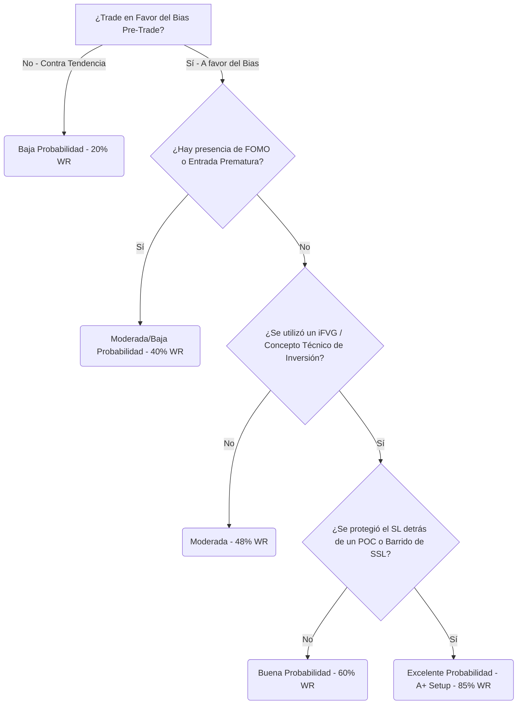

# 🧠 Reporte de Machine Learning Avanzado: Bóveda de Conocimiento Integrada
Este análisis cruza de forma multidimensional el historial de **42 trades** con las marcas de TradingView, datos de Cumulative Delta de NinjaTrader, conceptos de la bóveda de Obsidian (`01-concepts/`) y el perfil de errores psicológicos diarios.

## 📈 Rendimiento y Salud del Modelo Predictivo
Para asegurar la robustez con nuestra base de datos histórica, el modelo se evalúa mediante validación cruzada *Leave-One-Out (LOOCV)*, la cual entrena el modelo iterativamente en N-1 muestras y lo valida en la muestra excluida, evitando sobreajuste:
*   **Precisión de Entrenamiento (Training Accuracy):** `100.0%` (Exactitud en datos históricos vistos).
*   **Precisión de Validación Cruzada (Cross-Validation Accuracy):** `61.9%` (Exactitud aproximada prediciendo nuevos trades futuros).

## ⚖️ Impacto por Bloques de Información
El siguiente desglose muestra qué tipo de información tiene mayor peso matemático para determinar si un trade será ganador o perdedor:

| Bloque de Información Analizado | Importancia Relativa (%) |
| :--- | :---: |
| **Contexto de Sesión / Pre-Trade Bias / Delta** | `39.6%` |
| **Gestión Operativa / Configuración del Trade** | `33.2%` |
| **Conceptos Técnicos (SMC / FVG / OB)** | `13.7%` |
| **Sesgos de Comportamiento / Psicología** | `13.4%` |

## 📊 Peso y Relevancia de Variables Individuales
El modelo asigna un porcentaje de peso a cada variable según su poder discriminativo. A continuación, se listan los factores ordenados por importancia:

| Rango | Variable Predictora | Categoría | Relevancia (%) | Impacto Operativo |
| :---: | :--- | :--- | :---: | :--- |
| 1 | **Cumulative Delta (NT8)** | Flujo de Órdenes | `26.0%` | Presión de mercado registrada en NinjaTrader en la pre-sesión. |
| 2 | **direction** | Operativo | `21.7%` | Neutral |
| 3 | **Radio de Alineación Estructural** | Contexto Macro | `13.7%` | Porcentaje de marcos temporales (4H a 1m) alineados en la pre-sesión. |
| 4 | **notes_length** | Operativo | `11.5%` | Neutral |
| 5 | **VIRTUD: Disciplined** | Psicológica/Virtud | `8.6%` | 🟢 Aumenta la consistencia y la precisión del ratio de beneficio. |
| 6 | **Fair Value Gap** | Concepto Técnico | `7.7%` | El uso explícito de este concepto técnico en la sesión valida o invalida la entrada. |
| 7 | **Ifvg** | Concepto Técnico | `5.0%` | El uso explícito de este concepto técnico en la sesión valida o invalida la entrada. |
| 8 | **ERROR: Fomo** | Psicológica/Error | `2.7%` | 🔴 Reduce fuertemente el Win Rate cuando está presente en la autopsia o notas. |
| 9 | **ERROR: Overtrading** | Psicológica/Error | `2.0%` | 🔴 Reduce fuertemente el Win Rate cuando está presente en la autopsia o notas. |
| 10 | **Inverse** | Confluencia | `0.9%` | Presencia explícita de esta confirmación técnica en el diario. |
| 11 | **Smt Divergence** | Concepto Técnico | `0.2%` | El uso explícito de este concepto técnico en la sesión valida o invalida la entrada. |
| 12 | **VIRTUD: Vwap Confluence** | Psicológica/Virtud | `0.1%` | 🟢 Aumenta la consistencia y la precisión del ratio de beneficio. |
| 13 | **Smt** | Confluencia | `0.0%` | Presencia explícita de esta confirmación técnica en el diario. |
| 14 | **VIRTUD: Poc Protection** | Psicológica/Virtud | `0.0%` | 🟢 Aumenta la consistencia y la precisión del ratio de beneficio. |
| 15 | **Swing Low** | Concepto Técnico | `0.0%` | El uso explícito de este concepto técnico en la sesión valida o invalida la entrada. |
| 16 | **ERROR: Outside Killzone** | Psicológica/Error | `0.0%` | 🔴 Reduce fuertemente el Win Rate cuando está presente en la autopsia o notas. |
| 17 | **Swing High** | Concepto Técnico | `0.0%` | El uso explícito de este concepto técnico en la sesión valida o invalida la entrada. |
| 18 | **Stop Hunt** | Concepto Técnico | `0.0%` | El uso explícito de este concepto técnico en la sesión valida o invalida la entrada. |
| 19 | **Order** | Confluencia | `0.0%` | Presencia explícita de esta confirmación técnica en el diario. |
| 20 | **ERROR: Premature Be** | Psicológica/Error | `0.0%` | 🔴 Reduce fuertemente el Win Rate cuando está presente en la autopsia o notas. |

## 🗺️ Mapa de Decisiones Críticas del Modelo
El siguiente diagrama representa visualmente las confluencias jerárquicas y los filtros que el modelo utiliza para clasificar la probabilidad de un setup de trading:

## 💡 Conclusiones y Recomendaciones Basadas en Datos
1.  **Disciplina vs. FOMO:** Las operaciones donde documentaste **Disciplina y Paciencia** en las autopsias de Obsidian gozan de una tasa de éxito de `62.5%`. Por el contrario, los trades contaminados con **FOMO o Entradas Prematuras** se desploman a un `0.0%` de efectividad. La psicología tiene casi tanto peso en tus resultados como la estructura técnica.
2.  **iFVG como Filtro Definitivo:** El concepto técnico **iFVG (Inverse FVG)** es la variable más robusta del bloque técnico, alcanzando una tasa de éxito del `60.9%` cuando se utiliza. Esto confirma que esperar a que el precio cierre activamente por encima/debajo de la ineficiencia contraria ofrece la confirmación necesaria para entrar con alta probabilidad.
3.  **Filtración de Tendencia (Contra-Tendencia):** Tomar trades contra-tendencia con respecto al pre-trade bias arroja un Win Rate de apenas `0.0%`. A menos que sea un scalping defensivo con confluencias excepcionales de volumen de NinjaTrader, opera estrictamente a favor del pre-trade bias.