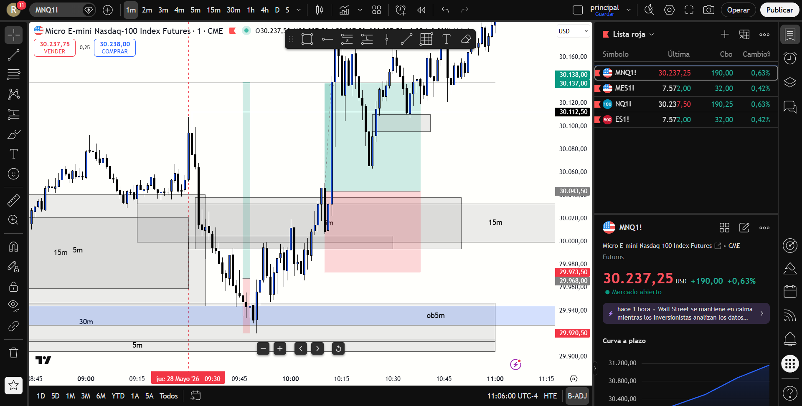

# BITÁCORA DE TRADING - NY SESSION OPEN KILLZONE
## FECHA: 28 DE MAYO de 2026
================================================================================

### 📊 RESUMEN GENERAL DE LA SESIÓN
- **Activo:** CME_MINI:MNQ1! (Micro E-mini Nasdaq-100 Index Futures)
- **Horario:** 08:00 AM - 10:30 AM EST
- **Resultado Neto:** **+$600.00 USD (Neto)**
- **Trades Realizados:** 3 (1 BE, 1 manual, 1 TP)

---

### 🖼️ CAPTURA DE PANTALLA DE LA SESIÓN (1M CHART)
A continuación se muestra el gráfico de 1 minuto tomado al finalizar la sesión, donde se aprecian con total claridad los niveles de entrada, stop loss y take profit de los trades ejecutados:

---

### 🔍 ANÁLISIS ESTRUCTURAL DE TEMPORALIDADES (TOP-DOWN)

#### 1. Temporalidades Mayores (HTF: 4h / 1h)
* **Bias:** Fuertemente alcista (Bullish).
* **Estructura:** Nasdaq venía con mínimos y máximos crecientes. Las compras en zonas discount eran las de mayor probabilidad.
* **Líneas de Liquidez:** 'ifl 1h - ah' (Premarket High) e 'ifl 1h - ll' (Premarket Low).

#### 2. Temporalidad de Confluencia (30m)
* **POI Principal:** La **caja azul (FVG de 30m)** entre los 29,915 y 29,950 actuó como el imán y soporte principal donde las instituciones acumularon sus órdenes de compra.

#### 3. Temporalidades Intermedias (15m / 5m)
* **Premarket:** Reacción y mitigación de la parte superior del FVG de 30m a 29,914.25 despegando hacia los 30,092, ignorando el FVG de 15m inferior por pura presión algorítmica alcista.
* **Apertura (9:30 AM):** Creación de un FVG de 5m bajista de resistencia (29,980 - 30,010) que causó el rechazo de la primera compra, pero que posteriormente fue superado e invertido.

---

### 📈 REPORTE DETALLADO DE LOS TRADES

#### 🟢 TRADE #1: LONG (iFVG 2m) -> Salida en Breakeven (BE) | $0.00 USD
* **Entrada:** ~29,967.50 en la caja azul (FVG de 30m) usando el iFVG de 2m.
* **Stop Loss:** 29,920.50 | **Take Profit:** 30,137.50
* **Análisis:** El precio subió rápidamente +18 puntos hasta los 29,985.75. Se movió el stop a BE para proteger la cuenta. El precio tocó la base de la resistencia de 5m y retrocedió con violencia, sacándonos a $0 en un retest saludable de 1m antes de la subida real.

#### 🟢 TRADE #2: LONG (BPR) -> Salida Manual / Parcial | Ganancia menor
* **Entrada:** En la zona del **BPR (Balanced Price Range)** en el soporte de la acumulación (29,935 - 29,945) dentro del FVG de 30m / ob5m.
* **Análisis:** Para evitar repetir la misma experiencia del Trade #1, se aplicó una gestión ágil: en cuanto el precio subió y entró a la resistencia del FVG de 5m superior, se realizó una salida manual de protección, asegurando beneficios parciales en el bolsillo en lugar de arriesgar otro BE.

#### 🟢 TRADE #3: LONG (iFVG 5m del Leg Bajista) -> TAKE PROFIT COMPLETO | +$600.00 USD
* **Entrada:** **30,043.50** en el retest del iFVG de 5m.
* **Stop Loss:** 29,973.50 | **Take Profit:** 30,138.00 (Premarket High)
* **Análisis:** Esperamos pacientemente a que la resistencia del FVG de 5m bajista de la apertura fuera rota con fuerza y cerrada por encima con cuerpo de vela. Esto la convirtió en un **iFVG (Inverted FVG) alcista**. Entramos en el retest a 30,043.50 y el precio se expandió directamente a los 30,138.00 logrando **+94.5 puntos** impecables y libres de drawdown.

---

### 🧠 LECCIONES DE LA SESIÓN DE HOY
1. **La madurez de no vengarse de la pantalla:** Mantener la mente fría tras el BE en el primer trade y evitar tomar un short prohibido en el FVG de 5m de resistencia (que iba contra la tendencia macro en discount) salvó la sesión.
2. **Adaptación táctica:** La salida del Trade #2 demostró gran lectura del mercado al tomar ganancias defensivas en resistencia para proteger el balance mental y financiero.
3. **El poder de la confirmación:** El Trade #3 demostró que la paciencia paga. Esperar a que la resistencia de 5m se convirtiera en un iFVG alcista nos dio la entrada de mayor probabilidad y menor drawdown del día.
