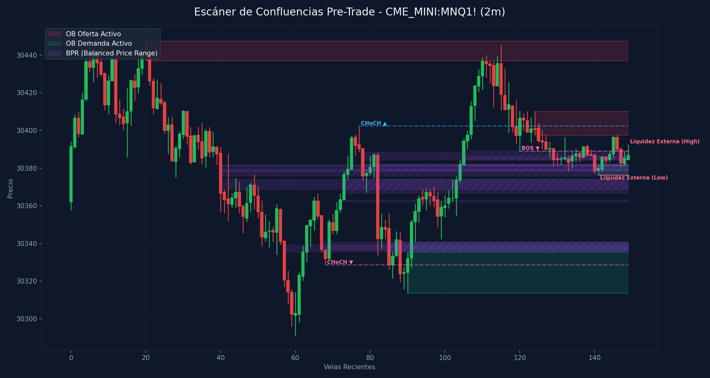

# 🛠️ Reporte Pre-Trade: Mapa de Confluencias (SMC & ICT)
        
Este reporte ha sido generado según los lineamientos de tu **Manual Operativo de Trading**. Analiza las confluencias de temporalidad menor para preparar tu Killzone y delinear tus puntos de interés antes de operar.

---

## 📅 Información de la Sesión
* **Fecha:** `2026-05-30`
* **Activo:** `CME_MINI:MNQ1!`
* **Temporalidad:** `2m` (LTF / Gatillo)
* **Precio Actual:** `30386.75`
* **Vinculación Temporal:** 
  * 🔗 [Ver Autopsia y Bitácora Post-Trade de esta Sesión](2026-05-30_session.md) (Se generará al finalizar tu sesión)

---

## 📊 Mapa de Gráfico de Confluencias
Este gráfico mapea de forma precisa la liquidez externa, los bloques de orden activos, los vacíos de liquidez y los rangos de precio balanceados (BPR):

---

## 🧲 Puntos de Interés (POI) y Liquidez

### 🌐 1. Liquidez Externa (HTF / Session Pivots)
Niveles clave para buscar barridas de liquidez (*sweeps*) en la apertura de sesión o Killzone:
* **Liquidez Externa Superior (Swing High):** `30392.5` (Vela #149) | Ver [[External Liquidity]] y [[Swing High]]
* **Liquidez Externa Inferior (Swing Low):** `30376.25` (Vela #141) | Ver [[External Liquidity]] y [[Swing Low]]

* **Pools de Liquidez Interna Activos (Unswept):**
  * *No se detectan pools de liquidez interna inmitigados en el rango de precios actual. Ver [[Internal Liquidity]]*

### 🟢 2. Bloques de Orden de Demanda (Soportes / Compras)
Zonas institucionales activas de alta concentración de compras limitadas. Ver [[Order Block (Bullish)]].

| Tipo | Rango de Precio | Volumen | Estado |
| :--- | :--- | :--- | :--- |
| **Demand OB** | `30313.5 - 30335.5` | `14415.0` | **Inmitigado (Activo)** 🔥 |
| **Demand OB** | `30376.25 - 30381.5` | `1792.0` | **Inmitigado (Activo)** 🔥 |

### 🔴 3. Bloques de Orden de Oferta (Resistencias / Ventas)
Zonas institucionales activas de alta concentración de ventas limitadas. Ver [[Order Block (Bearish)]].

| Tipo | Rango de Precio | Volumen | Estado |
| :--- | :--- | :--- | :--- |
| **Supply OB** | `30437.0 - 30447.5` | `14372.0` | **Inmitigado (Activo)** ⚡ |
| **Supply OB** | `30397.5 - 30410.25` | `3959.0` | **Inmitigado (Activo)** ⚡ |

---

## 🌀 4. Anatomía de Fair Value Gaps (FVG) e Inversiones
Análisis detallado de imbalances de precios y su **probabilidad de inversión (iFVG)** según la secuencia de sus 3 velas. Ver [[Fair Value Gap]] e [[IFVG]].

| Dirección | Rango de FVG | Perfil de Velas | Probabilidad de Inversión / Comportamiento |
| :--- | :--- | :--- | :--- |
| 🟢 Bullish FVG | `30335.5 - 30341.0` | `G-G-G` (Vela #91) | Fuerte Desplazamiento Alcista (Gran probabilidad de ser Respetado) 🟢 |

---

## 🟣 5. Balanced Price Ranges (BPR) Detectados
Solapamientos de FVG alcistas y bajistas en el mismo nivel de precios. Actúan como soportes/resistencias magnéticos de altísima precisión. Ver [[Balanced Price Range]].
* **BPR Detectado:** Rango `30362.00 - 30363.00` | Solapamiento de FVG Alcista (Vela #72) y Bajista (Vela #82)
* **BPR Detectado:** Rango `30368.50 - 30374.25` | Solapamiento de FVG Alcista (Vela #73) y Bajista (Vela #40)
* **BPR Detectado:** Rango `30366.50 - 30374.25` | Solapamiento de FVG Alcista (Vela #73) y Bajista (Vela #82)
* **BPR Detectado:** Rango `30378.25 - 30379.25` | Solapamiento de FVG Alcista (Vela #74) y Bajista (Vela #40)
* **BPR Detectado:** Rango `30379.00 - 30379.25` | Solapamiento de FVG Alcista (Vela #74) y Bajista (Vela #78)
* **BPR Detectado:** Rango `30335.50 - 30339.25` | Solapamiento de FVG Alcista (Vela #91) y Bajista (Vela #57)
* **BPR Detectado:** Rango `30336.50 - 30341.00` | Solapamiento de FVG Alcista (Vela #91) y Bajista (Vela #67)
* **BPR Detectado:** Rango `30335.50 - 30341.00` | Solapamiento de FVG Alcista (Vela #91) y Bajista (Vela #85)
* **BPR Detectado:** Rango `30375.75 - 30381.75` | Solapamiento de FVG Alcista (Vela #104) y Bajista (Vela #40)
* **BPR Detectado:** Rango `30379.00 - 30381.75` | Solapamiento de FVG Alcista (Vela #104) y Bajista (Vela #78)
* **BPR Detectado:** Rango `30381.50 - 30381.75` | Solapamiento de FVG Alcista (Vela #104) y Bajista (Vela #140)
* **BPR Detectado:** Rango `30384.25 - 30388.50` | Solapamiento de FVG Alcista (Vela #105) y Bajista (Vela #78)
* **BPR Detectado:** Rango `30384.25 - 30386.25` | Solapamiento de FVG Alcista (Vela #105) y Bajista (Vela #140)
* **BPR Detectado:** Rango `30388.75 - 30389.25` | Solapamiento de FVG Alcista (Vela #105) y Bajista (Vela #147)
* **BPR Detectado:** Rango `30381.50 - 30381.75` | Solapamiento de FVG Alcista (Vela #142) y Bajista (Vela #40)
* **BPR Detectado:** Rango `30381.50 - 30382.50` | Solapamiento de FVG Alcista (Vela #142) y Bajista (Vela #78)
* **BPR Detectado:** Rango `30381.50 - 30382.50` | Solapamiento de FVG Alcista (Vela #142) y Bajista (Vela #140)
* **BPR Detectado:** Rango `30388.75 - 30389.25` | Solapamiento de FVG Alcista (Vela #145) y Bajista (Vela #147)

---

## 🔄 6. Estructura de Mercado Reciente (BOS / CHoCH)
Rupturas de estructura registradas en el gráfico. Ver [[Market Structure]], [[Break of Structure]] y [[Change of Character]]:
* **CHoCH (Change of Character) Bajista 🔴** en nivel `30328.5` | Confirmado en la vela #68
* **CHoCH (Change of Character) Alcista 🟢** en nivel `30402.25` | Confirmado en la vela #77
* **BOS (Break of Structure) Bajista 🔴** en nivel `30389.0` | Confirmado en la vela #120

---

## 💡 Protocolo Operativo Pre-Trade (Tu Plan de Sesión)

> [!IMPORTANT]
> **Checklist antes de apretar el gatillo (LTF 1m - 5m):**
> 1. **Fase 1 (Sweep):** Espera a que el precio barra una de las zonas de **Liquidez Externa** (`30392.5` / `30376.25`) o mitigue un POI HTF.
> 2. **Fase 2 (iFVG Trigger):** Busca una reacción post-sweep. El cuerpo de la vela debe cerrar y romper un FVG contrario, prioritariamente con perfil **Easy to Invert (R-G-R o G-R-G)**, convirtiéndolo en un **iFVG**.
> 3. **Gestión de Riesgo:** Si opera en All-Time Highs, gestión estricta con relación de **1:1 R:R**. En días de noticias, no ingresar a operaciones dentro de los **5 minutos anteriores** a la publicación.
