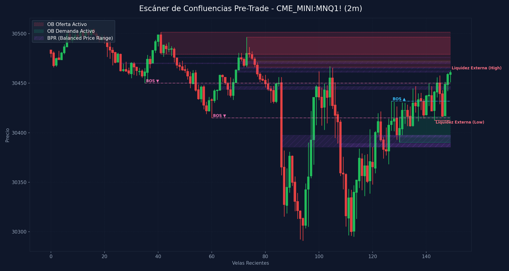

# 🛠️ Reporte Pre-Trade: Mapa de Confluencias (SMC & ICT)
        
Este reporte ha sido generado según los lineamientos de tu **Manual Operativo de Trading**. Analiza las confluencias de temporalidad menor para preparar tu Killzone y delinear tus puntos de interés antes de operar.

---

## 📅 Información de la Sesión
* **Fecha:** `2026-06-01`
* **Activo:** `CME_MINI:MNQ1!`
* **Temporalidad:** `2m` (LTF / Gatillo)
* **Precio Actual:** `30460.75`
* **Vinculación Temporal:** 
  * 🔗 [Ver Autopsia y Bitácora Post-Trade de esta Sesión](2026-06-01_session.md) (Se generará al finalizar tu sesión)

---

## 🛡️ Alerta del Guardia de Riesgo (IA Risk Mentor)

> [!IMPORTANT]
> **Estadísticas de Bitácora:** Sesiones: `3` | PnL Acumulado: `$470.00 USD` | Win Rate: `33.3%`
> 
> **🚨 TUS ERRORES PSICOLÓGICOS MÁS RECURRENTES A EVITAR HOY:**
> * **Ignorar Resistencia:** presente en el `100.0%` de las sesiones previas.
> * **FOMO:** presente en el `33.3%` de las sesiones previas.
>
> **📝 LECCIONES CLAVE A RECORDAR:**
> * 1. La Salida Discrecional como Herramienta de Supervivencia: Aprender a cortar pérdidas de forma proactiva cuando la acción del precio se invalida o se vuelve sucia en tu contra es el sello distintivo de un trader profesional. Salvar capital es ganar a largo plazo.
> * Monitoreo Multimercado (NQ vs. ES): Las divergencias de correlación son leading indicators de alta precisión. Si NQ quiere bajar pero ES se sostiene firmemente en un FVG de demanda, el corto tiene los días contados. Siempre debemos verificar que ambos activos se apoyen mutuamente.
> * El Respeto a las Zonas de Descuento (Discount): Tomar cortos cuando las temporalidades de 1H, 30m y 15m están en descuento profundo conlleva un riesgo elevado de rebotes violentos (trampas institucionales). La próxima vez, priorizaremos esperar a que la corrección finalice en demanda para incorporarnos únicamente a las compras institucionales.

---

## 🎨 Marcaciones Manuales en tu Gráfico (TradingView)
Esta sección extrae automáticamente tus rectángulos (cajas de zonas) y líneas dibujadas a mano en TradingView y comprueba su confluencia con las zonas de liquidez y estructuras de Smart Money Concepts:

  * **Caja Gris con etiqueta '4h'** en rango `30445.50 - 30536.25` | Estado: 🟢 PRECIO DENTRO | Confluencias: **FVG 1H** (30516.5 - 30554.2), **OB 30m** (30469.2 - 30512.5), **FVG 30m** (30531.8 - 30556.0), **OB 15m** (30480.2 - 30512.5), **FVG 15m** (30531.8 - 30565.5), **OB 5m** (30476.8 - 30501.5), **OB 5m** (30473.2 - 30496.5), **FVG 5m** (30531.8 - 30536.8), **OB 4m** (30476.8 - 30501.5), **OB 4m** (30466.2 - 30496.5), **FVG 4m** (30531.8 - 30538.2), **OB 3m** (30476.0 - 30496.5), **FVG 3m** (30474.0 - 30476.0), **OB 2m** (30466.2 - 30496.5), **FVG 2m** (30505.8 - 30506.2), **FVG 2m** (30471.0 - 30473.2)
  * **Caja Gris con etiqueta '1h'** en rango `30518.42 - 30554.25` | Estado: 🟡 Fuera del precio | Confluencias: **FVG 1H** (30516.5 - 30554.2), **FVG 30m** (30531.8 - 30556.0), **FVG 15m** (30531.8 - 30565.5), **FVG 5m** (30539.2 - 30545.5), **FVG 5m** (30531.8 - 30536.8), **FVG 4m** (30541.2 - 30545.5), **FVG 4m** (30531.8 - 30538.2), **FVG 3m** (30541.2 - 30545.5)
  * **Caja Gris con etiqueta '1h'** en rango `30410.50 - 30517.25` | Estado: 🟢 PRECIO DENTRO | Confluencias: **FVG 1H** (30516.5 - 30554.2), **OB 30m** (30269.8 - 30437.5), **OB 30m** (30469.2 - 30512.5), **OB 15m** (30480.2 - 30512.5), **OB 5m** (30476.8 - 30501.5), **OB 5m** (30473.2 - 30496.5), **OB 4m** (30476.8 - 30501.5), **OB 4m** (30466.2 - 30496.5), **OB 3m** (30476.0 - 30496.5), **OB 3m** (30390.2 - 30426.5), **FVG 3m** (30474.0 - 30476.0), **OB 2m** (30466.2 - 30496.5), **OB 2m** (30390.2 - 30416.0), **FVG 2m** (30505.8 - 30506.2), **FVG 2m** (30471.0 - 30473.2), **OB 1m** (30368.2 - 30413.5), **OB 1m** (30406.2 - 30419.2), **FVG 1m** (30434.5 - 30435.8), **FVG 1m** (30442.2 - 30443.5)
  * **Caja Gris con etiqueta '30m'** en rango `30531.75 - 30556.00` | Estado: 🟡 Fuera del precio | Confluencias: **FVG 1H** (30516.5 - 30554.2), **FVG 30m** (30531.8 - 30556.0), **FVG 15m** (30531.8 - 30565.5), **FVG 5m** (30539.2 - 30545.5), **FVG 5m** (30531.8 - 30536.8), **FVG 4m** (30541.2 - 30545.5), **FVG 4m** (30531.8 - 30538.2), **FVG 3m** (30541.2 - 30545.5)
  * **Caja Gris con etiqueta '5m'** en rango `30460.18 - 30473.25` | Estado: 🟢 PRECIO DENTRO | Confluencias: **OB 30m** (30469.2 - 30512.5), **OB 4m** (30466.2 - 30496.5), **OB 2m** (30466.2 - 30496.5), **FVG 2m** (30471.0 - 30473.2)
  * **Caja Gris con etiqueta 'ob1h'** en rango `30554.25 - 30589.75` | Estado: 🟡 Fuera del precio | Confluencias: **FVG 30m** (30531.8 - 30556.0), **OB 15m** (30565.5 - 30592.0), **FVG 15m** (30531.8 - 30565.5)
  * **Caja Gris con etiqueta '5m'** en rango `30380.02 - 30429.50` | Estado: 🟡 Fuera del precio | Confluencias: **OB 30m** (30269.8 - 30437.5), **OB 3m** (30390.2 - 30426.5), **OB 2m** (30390.2 - 30416.0), **OB 1m** (30368.2 - 30413.5), **OB 1m** (30406.2 - 30419.2)
  * **Caja Gris con etiqueta '5m'** en rango `30348.75 - 30371.66` | Estado: 🟡 Fuera del precio | Confluencias: **OB 30m** (30269.8 - 30437.5), **OB 1m** (30368.2 - 30413.5)
  * **Caja Gris con etiqueta '15m'** en rango `30380.75 - 30445.75` | Estado: 🟡 Fuera del precio | Confluencias: **OB 30m** (30269.8 - 30437.5), **OB 3m** (30390.2 - 30426.5), **OB 2m** (30390.2 - 30416.0), **OB 1m** (30368.2 - 30413.5), **OB 1m** (30406.2 - 30419.2), **FVG 1m** (30434.5 - 30435.8), **FVG 1m** (30442.2 - 30443.5)
  * **Caja Gris** en rango `30383.14 - 30410.75` | Estado: 🟡 Fuera del precio | Confluencias: **OB 30m** (30269.8 - 30437.5), **OB 3m** (30390.2 - 30426.5), **OB 2m** (30390.2 - 30416.0), **OB 1m** (30368.2 - 30413.5), **OB 1m** (30406.2 - 30419.2)
  * **Caja Gris con etiqueta '5m'** en rango `30343.06 - 30377.00` | Estado: 🟡 Fuera del precio | Confluencias: **OB 30m** (30269.8 - 30437.5), **OB 1m** (30368.2 - 30413.5)
  * **Caja Gris** en rango `30343.75 - 30362.73` | Estado: 🟡 Fuera del precio | Confluencias: **OB 30m** (30269.8 - 30437.5)
  * **Caja Gris** en rango `30385.50 - 30397.82` | Estado: 🟡 Fuera del precio | Confluencias: **OB 30m** (30269.8 - 30437.5), **OB 3m** (30390.2 - 30426.5), **OB 2m** (30390.2 - 30416.0), **OB 1m** (30368.2 - 30413.5)
  * **Línea Manual con etiqueta 'ifl d'** en nivel `29767.57` | Estado: Fuera de rango | Ubicación: dentro de **OB 4H** (29763.2 - 29964.8), dentro de **OB 1H** (29763.2 - 29825.0)
  * **Línea Manual con etiqueta 'ifl 4h'** en nivel `30216.25` | Estado: Fuera de rango | Ubicación: dentro de **OB 1H** (30216.2 - 30263.5)
  * **Línea Manual con etiqueta 'nwog'** en nivel `29674.70` | Estado: Fuera de rango
  * **Línea Manual con etiqueta 'ifl 1h'** en nivel `29862.50` | Estado: Fuera de rango | Ubicación: dentro de **OB 4H** (29763.2 - 29964.8)
  * **Línea Manual con etiqueta 'ah'** en nivel `30595.00` | Estado: Fuera de rango
  * **Línea Manual con etiqueta 'ifl 30m'** en nivel `30266.50` | Estado: Fuera de rango

---

## ⏳ Análisis Estructural Multi-Temporalidad Completo (9 Timeframes)
Escaneo automático y en segundo plano de estructura de mercado y zonas institucionales activas en todos los marcos de tiempo analizados (de mayor a menor):

| Temporalidad | Sesgo Estructural | Rango (Premium/Discount) | Últimos OBs Activos | Últimos FVGs Activos |
| :--- | :--- | :--- | :--- | :--- |
| **4H** | Bullish 🟢 | Premium (Ventas) 🔴 | 🟢 Demand (29763.2-29964.8) | 🟢 Bullish (29338.8-29433.5) |
| **1H** | Bullish 🟢 | Discount (Compras) 🟢 | 🟢 Demand (29763.2-29825.0), 🟢 Demand (30216.2-30263.5) | 🟢 Bullish (30112.5-30180.5), 🔴 Bearish (30516.5-30554.2) |
| **30m** | Bullish 🟢 | Discount (Compras) 🟢 | 🟢 Demand (30269.8-30437.5), 🔴 Supply (30469.2-30512.5) | 🟢 Bullish (29822.5-29833.5), 🔴 Bearish (30531.8-30556.0) |
| **15m** | Bearish 🔴 | Premium (Ventas) 🔴 | 🔴 Supply (30565.5-30592.0), 🔴 Supply (30480.2-30512.5) | 🟢 Bullish (30192.5-30209.0), 🔴 Bearish (30531.8-30565.5) |
| **5m** | Bearish 🔴 | Premium (Ventas) 🔴 | 🔴 Supply (30476.8-30501.5), 🔴 Supply (30473.2-30496.5) | 🔴 Bearish (30539.2-30545.5), 🔴 Bearish (30531.8-30536.8) |
| **4m** | Bearish 🔴 | Premium (Ventas) 🔴 | 🔴 Supply (30476.8-30501.5), 🔴 Supply (30466.2-30496.5) | 🔴 Bearish (30541.2-30545.5), 🔴 Bearish (30531.8-30538.2) |
| **3m** | Bearish 🔴 | Discount (Compras) 🟢 | 🔴 Supply (30476.0-30496.5), 🟢 Demand (30390.2-30426.5) | 🔴 Bearish (30541.2-30545.5), 🔴 Bearish (30474.0-30476.0) |
| **2m** | Bearish 🔴 | Discount (Compras) 🟢 | 🔴 Supply (30466.2-30496.5), 🟢 Demand (30390.2-30416.0) | 🔴 Bearish (30505.8-30506.2), 🔴 Bearish (30471.0-30473.2) |
| **1m** | Bullish 🟢 | Discount (Compras) 🟢 | 🟢 Demand (30368.2-30413.5), 🟢 Demand (30406.2-30419.2) | 🟢 Bullish (30434.5-30435.8), 🟢 Bullish (30442.2-30443.5) |

---

## 📊 Mapa de Gráfico de Confluencias
Este gráfico mapea de forma precisa la liquidez externa, los bloques de orden activos, los vacíos de liquidez y los rangos de precio balanceados (BPR):

---

## 🔍 Análisis Estructural Top-Down (Multi-Temporalidad)
Análisis de temporalidades HTF de Nasdaq en el fondo sin alterar tu TradingView Desktop:

* **1H HTF Bias:** `Bullish 🟢` | Mapeado según el último BOS estructural en 1 hora.
* **1H Zonas Clave:**
  * OB de 1H Demand: Rango `29763.25 - 29825.00`
  * OB de 1H Demand: Rango `30216.25 - 30263.50`
  * FVG de 1H Bullish: Rango `30112.50 - 30180.50`
  * FVG de 1H Bearish: Rango `30516.50 - 30554.25`

* **15m POIs de Confluencia:**
  * OB de 15m Supply: Rango `30565.50 - 30592.00` | Ver [[order-block-bullish]] o [[order-block-bearish]]
  * OB de 15m Supply: Rango `30480.25 - 30512.50` | Ver [[order-block-bullish]] o [[order-block-bearish]]
  * FVG de 15m Bullish: Rango `30192.50 - 30209.00` | Ver [[fair-value-gap]]
  * FVG de 15m Bearish: Rango `30531.75 - 30565.50` | Ver [[fair-value-gap]]

---

## ⚡ Correlación Inter-Mercado (SMT Divergence)
* **Estado SMT:** `S&P 500 (MES) y Nasdaq (MNQ) alineados de forma regular en el Open (Sin divergencias activas). Ver [[smt-divergence]]`

---

## 🧲 Puntos de Interés (POI) y Liquidez LTF (2m)

### 🌐 1. Liquidez Externa (HTF / Session Pivots)
Niveles clave para buscar barridas de liquidez (*sweeps*) en la apertura de sesión o Killzone:
* **Liquidez Externa Superior (Swing High):** `30463.0` (Vela #149) | Ver [[external-liquidity]] y [[swing-high]]
* **Liquidez Externa Inferior (Swing Low):** `30412.5` (Vela #143) | Ver [[external-liquidity]] y [[swing-low]]

* **Pools de Liquidez Interna Activos (Unswept):**
  * *No se detectan pools de liquidez interna inmitigados en el rango de precios actual. Ver [[internal-liquidity]]*

### 🟢 2. Bloques de Orden de Demanda (Soportes / Compras)
Zonas institucionales activas de alta concentración de compras limitadas. Ver [[order-block-bullish]].

| Tipo | Rango de Precio | Volumen | Estado |
| :--- | :--- | :--- | :--- |
| **Demand OB** | `30390.25 - 30416.0` | `28106.0` | **Inmitigado (Activo)** 🔥 |

### 🔴 3. Bloques de Orden de Oferta (Resistencias / Ventas)
Zonas institucionales activas de alta concentración de ventas limitadas. Ver [[order-block-bearish]].

| Tipo | Rango de Precio | Volumen | Estado |
| :--- | :--- | :--- | :--- |
| **Supply OB** | `30479.25 - 30501.5` | `4881.0` | **Inmitigado (Activo)** ⚡ |
| **Supply OB** | `30466.25 - 30496.5` | `22436.0` | **Inmitigado (Activo)** ⚡ |

---

## 🌀 4. Anatomía de Fair Value Gaps (FVG) e Inversiones
Análisis detallado de imbalances de precios y su **probabilidad de inversión (iFVG)** según la secuencia de sus 3 velas. Ver [[fair-value-gap]] e [[ifvg]].

| Dirección | Rango de FVG | Perfil de Velas | Probabilidad de Inversión / Comportamiento |
| :--- | :--- | :--- | :--- |
| 🔴 Bearish FVG | `30471.0 - 30473.25` | `R-R-R` (Vela #76) | Fuerte Desplazamiento Bajista (Gran probabilidad de ser Respetado) 🔴 |

---

## 🟣 5. Balanced Price Ranges (BPR) Detectados
Solapamientos de FVG alcistas y bajistas en el mismo nivel de precios. Actúan como soportes/resistencias magnéticos de altísima precisión. Ver [[balanced-price-range]].
* **BPR Detectado:** Rango `30448.75 - 30449.00` | Solapamiento de FVG Alcista (Vela #63) y Bajista (Vela #54)
* **BPR Detectado:** Rango `30443.75 - 30446.75` | Solapamiento de FVG Alcista (Vela #63) y Bajista (Vela #86)
* **BPR Detectado:** Rango `30461.00 - 30462.75` | Solapamiento de FVG Alcista (Vela #69) y Bajista (Vela #77)
* **BPR Detectado:** Rango `30469.75 - 30470.50` | Solapamiento de FVG Alcista (Vela #70) y Bajista (Vela #26)
* **BPR Detectado:** Rango `30471.00 - 30472.25` | Solapamiento de FVG Alcista (Vela #70) y Bajista (Vela #76)
* **BPR Detectado:** Rango `30464.25 - 30466.25` | Solapamiento de FVG Alcista (Vela #70) y Bajista (Vela #77)
* **BPR Detectado:** Rango `30475.75 - 30476.00` | Solapamiento de FVG Alcista (Vela #73) y Bajista (Vela #46)
* **BPR Detectado:** Rango `30385.50 - 30397.50` | Solapamiento de FVG Alcista (Vela #121) y Bajista (Vela #86)
* **BPR Detectado:** Rango `30385.50 - 30389.25` | Solapamiento de FVG Alcista (Vela #121) y Bajista (Vela #108)
* **BPR Detectado:** Rango `30395.50 - 30397.50` | Solapamiento de FVG Alcista (Vela #121) y Bajista (Vela #123)

---

## 🔄 6. Estructura de Mercado Reciente (BOS / CHoCH)
Rupturas de estructura registradas en el gráfico. Ver [[market-structure]], [[break-of-structure]] y [[change-of-character]]:
* **BOS (Break of Structure) Bajista 🔴** en nivel `30450.0` | Confirmado en la vela #35
* **BOS (Break of Structure) Bajista 🔴** en nivel `30415.0` | Confirmado en la vela #60
* **BOS (Break of Structure) Alcista 🟢** en nivel `30431.75` | Confirmado en la vela #127

---

## 💡 Protocolo Operativo Pre-Trade (Tu Plan de Sesión)

> [!IMPORTANT]
> **Checklist antes de apretar el gatillo (LTF 1m - 5m):**
> 1. **Fase 1 (Sweep):** Espera a que el precio barra una de las zonas de **Liquidez Externa** (`30463.0` / `30412.5`) o mitigue un POI HTF.
> 2. **Fase 2 (iFVG Trigger):** Busca una reacción post-sweep. El cuerpo de la vela debe cerrar y romper un FVG contrario, prioritariamente con perfil **Easy to Invert (R-G-R o G-R-G)**, convirtiéndolo en un **iFVG**.
> 3. **Gestión de Riesgo:** Si opera en All-Time Highs, gestión estricta con relación de **1:1 R:R**. En días de noticias, no ingresar a operaciones dentro de los **5 minutos anteriores** a la publicación.
