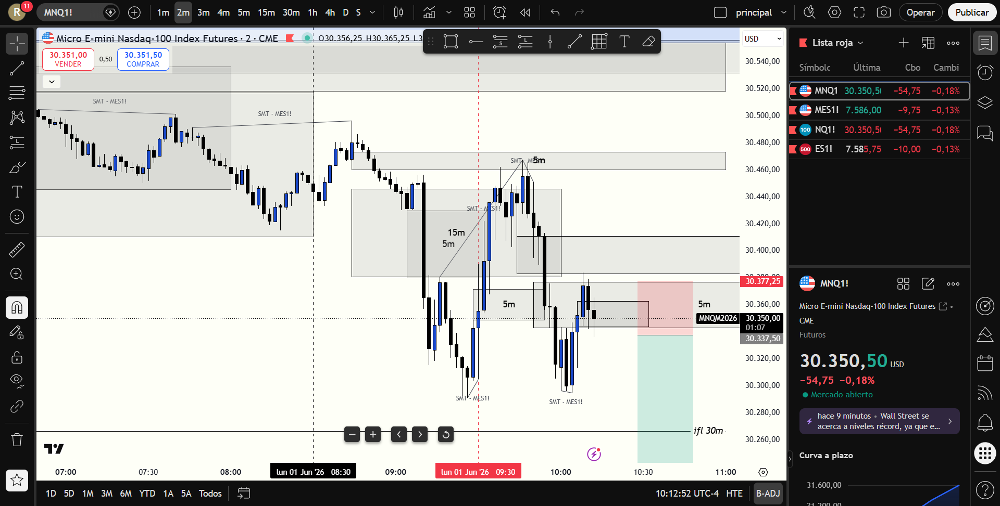

# BITÁCORA DE TRADING - NY SESSION OPEN KILLZONE
## FECHA: 1 DE JUNIO de 2026
================================================================================

### 📊 RESUMEN GENERAL DE LA SESIÓN
- **Activo:** CME_MINI:MNQ1! (Micro E-mini Nasdaq-100 Index Futures)
- **Horario:** 08:00 AM - 10:30 AM EST (Killzone de Apertura)
- **Resultado Neto:** **-$130.00 USD (Pérdida Controlada)**
- **Trades Realizados:** 1 (1 Salida Discrecional en Pérdida Menor)

---

### 🖼️ CAPTURA DE PANTALLA DE LA SESIÓN (2M CHART)
A continuación se muestra el gráfico de 2 minutos tomado durante la sesión, donde se aprecia la resistencia de 15m/5m superior, la caja de 5m de compras inferior y la herramienta de posición corta que marcaba nuestro plan de contención de riesgo:

---

### 🔍 ANÁLISIS ESTRUCTURAL DE TEMPORALIDADES (TOP-DOWN)

#### 1. Temporalidades Mayores (HTF: 4h / 1h)
* **Bias:** Alcista (Bullish) 🟢.
* **Estructura:** Estructura macro alcista. Sin embargo, en el gráfico de 1H el precio había retrocedido a una **zona de descuento profundo (Discount) 🟢**, situándose justo por encima del bloque de demanda de 1H en `30,216.50 - 30,263.25`.

#### 2. Temporalidades Intermedias (30m / 15m)
* **Resistencia de 15m:** Se identificó un **15m Bearish FVG** muy fuerte en `30,384.50 - 30,446.00`.
* **Apertura:** El precio subió con fuerza hasta los `30,445.75` (respetando al tick el límite superior del 15m Bearish FVG) y comenzó a mostrar un fuerte rechazo con mechas de venta.

#### 3. Temporalidad de Ejecución (5m / 2m / 1m)
* **Displacements y Gatillo:** El fuerte rechazo desde el FVG de 15m superior rompió a la baja los soportes inmediatos de 5m y 2m, invirtiendo un FVG alcista de 5m en un **iFVG bajista**.

---

### 📈 REPORTE DETALLADO DE LOS TRADES

#### 🔴 TRADE #1: SHORT (iFVG 5m) -> Salida Discrecional Anticipada | -$130.00 USD
* **Entrada:** Alrededor de las 10:00 AM EST tras confirmarse la inversión de estructura por el fuerte rechazo del 15m/5m Bearish FVG de arriba.
* **Resultado:** **-$130.00 USD** (Corte de pérdida manual controlado).
* **Análisis del Error y Contención de Riesgo:**
  1. **El Conflicto de Correlación (Filtro ES):** Mientras estaba en el trade de venta en Nasdaq, noté que **S&P 500 (ES1!) estaba respetando firmemente un FVG Alcista (Bullish FVG) de soporte**. Esto representaba una divergencia de correlación directa: ES se negaba a bajar, lo cual limitaba severamente la probabilidad de que NQ expandiera a la baja.
  2. **Falta de Displacement Limpio:** El movimiento de caída del trade se volvió sumamente lento, sucio y con velas de rango estrecho, lo que indicaba una pérdida completa de momentum bajista (fricción en descuento).
  3. **Decisión Ejecutiva:** En lugar de esperar pasivamente a que el precio golpeara el Stop Loss completo (que habría significado una pérdida mucho mayor, en torno a los -$320 o -$400 USD), decidí tomar el control de la operación y **ejecutar una salida manual anticipada en -$130 USD**.
  4. **Validación:** La salida fue magistral desde el punto de vista de la contención de riesgo, ya que inmediatamente después de salir, el precio rebotó con extrema violencia desde los `30,296` recuperándose rápidamente hacia los `30,380`. De no haber cortado la pérdida a tiempo, el mercado habría barrido el stop completo.

---

### 🧠 LECCIONES DE LA SESIÓN DE HOY

1. **La Salida Discrecional como Herramienta de Supervivencia:** Aprender a cortar pérdidas de forma proactiva cuando la acción del precio se invalida o se vuelve sucia en tu contra es el sello distintivo de un trader profesional. Salvar capital es ganar a largo plazo.
2. **Monitoreo Multimercado (NQ vs. ES):** Las divergencias de correlación son leading indicators de alta precisión. Si NQ quiere bajar pero ES se sostiene firmemente en un FVG de demanda, el corto tiene los días contados. Siempre debemos verificar que ambos activos se apoyen mutuamente.
3. **El Respeto a las Zonas de Descuento (Discount):** Tomar cortos cuando las temporalidades de 1H, 30m y 15m están en descuento profundo conlleva un riesgo elevado de rebotes violentos (trampas institucionales). La próxima vez, priorizaremos esperar a que la corrección finalice en demanda para incorporarnos únicamente a las compras institucionales.
