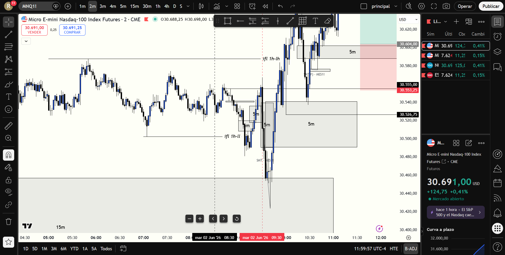

# BITÁCORA DE TRADING - NY SESSION OPEN KILLZONE
## FECHA: 2 DE JUNIO de 2026
================================================================================

### 📊 RESUMEN GENERAL DE LA SESIÓN
- **Activo:** CME_MINI:MNQ1! (Micro E-mini Nasdaq-100 Index Futures)
- **Horario:** 08:00 AM - 11:30 AM EST (Killzone de Apertura)
- **Resultado Neto:** **+$710.00 USD (Ganancia TP Completo)**
- **Trades Realizados:** 1 (1 Ganador, TP Completo)

---

### 🖼️ CAPTURA DE PANTALLA DE LA SESIÓN (2M CHART)
A continuación se muestra el gráfico de la sesión, donde se aprecia la barrida inicial de liquidez externa, el posterior desplazamiento alcista y la entrada quirúrgica en el retesteo del 5m Bullish IFVG:

---

### 🔍 ANÁLISIS ESTRUCTURAL DE TEMPORALIDADES (TOP-DOWN)

#### 1. Temporalidades Mayores (HTF: 4h / 1h)
* **Bias:** Alcista (Bullish) 🟢.
* **Estructura:** Estructura de mercado macro alcista indiscutible. El precio comenzó la sesión en retroceso dentro de la zona de descuento profunda de 1H, lo que invalidaba cualquier posibilidad de cortos y nos obligaba a buscar exclusivamente compras.

#### 2. Temporalidades Intermedias (30m / 15m)
* **Barrida de Liquidez:** El mercado liquidó a los compradores tempranos barriendo el Swing Low previo en `30,481.00` hasta tocar un mínimo en `30,423.75`.
* **Desplazamiento Alcista:** Tras la barrida de liquidez inferior (Stop Run), se dio una fortísima reacción alcista en forma de vela de expansión que anuló por completo la mecha bajista, demostrando fuerte acumulación institucional en descuento.

#### 3. Temporalidad de Ejecución (5m / 2m / 1m)
* **Gatillo (5m IFVG):** La fuerte expansión alcista cruzó a través del FVG bajista de 5m en `30,491.00 - 30,536.00`. Al cerrar con cuerpo de vela por encima de `30,536.00`, este FVG bajista se invirtió y se validó oficialmente como un **5m Bullish IFVG**.

---

### 📈 REPORTE DETALLADO DE LOS TRADES

#### 🟢 TRADE #1: LONG (5m Bullish IFVG) -> TP Completo | +$710.00 USD
* **Entrada (30604.00):** Alrededor de las 10:00 AM EST, esperamos pacientemente a que el precio hiciera su retroceso a la zona de descuento y retesteara el soporte del recién formado 5m Bullish IFVG. Entramos largos en `30,604.00`.
* **Salida (30693.00):** Salida por Take Profit técnico en `30,693.00` (fijado justo en la resistencia del Swing High y la liquidez superior de la sesión), asegurando la ganancia total.
* **Resultado:** **+$710.00 USD** (TP Completo de 89 puntos en NQ).
* **Análisis Técnico del Acierto:**
  1. **Rechazo Absoluto al Corto:** Evitar el impulso de operar el retroceso inicial o de shortear en zona de descuento protegió la cuenta de pérdidas tempranas y mantuvo la mente despejada para el movimiento real.
  2. **Paciencia para el Retroceso (Evitar FOMO):** No compramos de forma apresurada en la parte alta de la vela de expansión. La espera al retesteo estructural del IFVG de 5m permitió ingresar a un precio óptimo, ajustando al máximo el Stop Loss lógico y disparando el ratio R:R.
  3. **Confluencia SMT Alcista:** La fortaleza del S&P 500 (ES), que se rehusó a marcar nuevos mínimos mientras NQ barría el suyo, confirmó la acumulación institucional que desencadenó el movimiento expansivo.

---

### 🧠 LECCIONES DE LA SESIÓN DE HOY

1. **La Disciplina ante el Bias Paga Rentabilidad:** Alinearse estrictamente con el HTF Bias (Bullish) en zona de descuento macro y descartar los cortos contra-tendencia es la base de los trades de alta probabilidad.
2. **La Espera del Retesteo Reduce el Riesgo:** No entrar persiguiendo velas de expansión alcista sino esperar con paciencia el pullback al FVG mitigador es la diferencia entre ser liquidado o lograr una entrada limpia con excelente R:R.
3. **El Plan Vence a la Intuición:** Ignorar el impulso de tomar shorts discrecionales (incluso cuando otros mentores o el ruido de micro-temporalidades sugerían caídas) y aferrarse a las reglas del manual operativo condujo a una sesión sumamente rentable.
