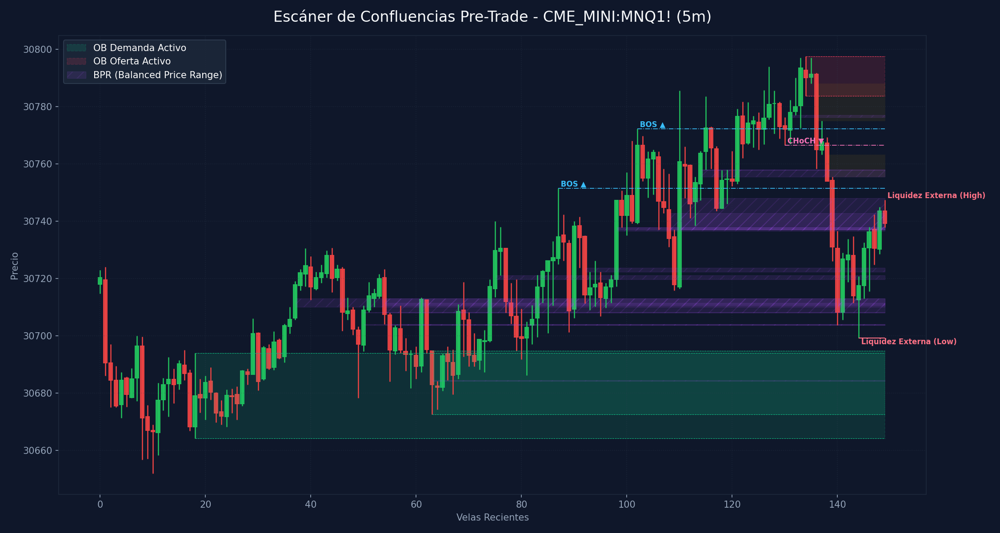

# 🛠️ Reporte Pre-Trade: Mapa de Confluencias (SMC & ICT)
        
Este reporte ha sido generado según los lineamientos de tu **Manual Operativo de Trading**. Analiza las confluencias de temporalidad menor para preparar tu Killzone y delinear tus puntos de interés antes de operar.

---

## 📅 Información de la Sesión
* **Fecha:** `2026-06-03`
* **Activo:** `CME_MINI:MNQ1!`
* **Temporalidad:** `5m` (LTF / Gatillo)
* **Precio Actual:** `30739.25`
* **Vinculación Temporal:** 
  * 🔗 [Ver Autopsia y Bitácora Post-Trade de esta Sesión](2026-06-03_session.md) (Se generará al finalizar tu sesión)

---

## 🛡️ Alerta del Guardia de Riesgo (IA Risk Mentor)

> [!IMPORTANT]
> **Estadísticas de Bitácora:** Sesiones: `4` | PnL Acumulado: `$1180.00 USD` | Win Rate: `50.0%`
> 
> **🚨 TUS ERRORES PSICOLÓGICOS MÁS RECURRENTES A EVITAR HOY:**
> * **Ignorar Resistencia:** presente en el `100.0%` de las sesiones previas.
> * **FOMO:** presente en el `50.0%` de las sesiones previas.
>
> **📝 LECCIONES CLAVE A RECORDAR:**
> * 1. La Disciplina ante el Bias Paga Rentabilidad: Alinearse estrictamente con el HTF Bias (Bullish) en zona de descuento macro y descartar los cortos contra-tendencia es la base de los trades de alta probabilidad.
> * La Espera del Retesteo Reduce el Riesgo: No entrar persiguiendo velas de expansión alcista sino esperar con paciencia el pullback al FVG mitigador es la diferencia entre ser liquidado o lograr una entrada limpia con excelente R:R.
> * El Plan Vence a la Intuición: Ignorar el impulso de tomar shorts discrecionales (incluso cuando otros mentores o el ruido de micro-temporalidades sugerían caídas) y aferrarse a las reglas del manual operativo condujo a una sesión sumamente rentable.

---

## 🧠 Predicción de Machine Learning (SMC Setup Classifier)
El clasificador de Inteligencia Artificial analizó la confluencia de este escenario de pre-sesión con tus datos históricos de trade:

```text
=== PREDICCIÓN DE PROBABILIDAD DE ÉXITO ===

==================================================
SETUP EVALUADO:
 - Instrumento: NQ | Dirección: Long | Sesión: NY AM KZ
 - Confluencias: in kill zone (london / ny am / pm), at htf pd array (ob / fvg / breaker), fair value gap (fvg) on entry tf, order block (ob) alignment, htf market structure bias confirmed
--------------------------------------------------
PROBABILIDAD DE WIN RATE ESTIMADA: 51.3%
⚠️ SETUP MODERADO: Reducir riesgo a la mitad (0.5%) o esperar más confirmaciones.
==================================================
```

---

## 🎨 Marcaciones Manuales en tu Gráfico (TradingView)
Esta sección extrae automáticamente tus rectángulos (cajas de zonas) y líneas dibujadas a mano en TradingView y comprueba su confluencia con las zonas de liquidez y estructuras de Smart Money Concepts:

  * **Caja Gris** en rango `30343.75 - 30362.73` | Estado: 🟡 Fuera del precio | Confluencias: **OB 1H** (30317.8 - 30383.5)
  * **Caja Gris con etiqueta '1m'** en rango `30574.00 - 30576.63` | Estado: 🟡 Fuera del precio | Confluencias: **OB 1H** (30566.2 - 30714.2), **OB 30m** (30566.2 - 30709.5)
  * **Caja Gris con etiqueta '30m'** en rango `30756.34 - 30767.13` | Estado: 🟡 Fuera del precio | Confluencias: **FVG 30m** (30755.5 - 30766.5), **FVG 15m** (30755.5 - 30772.5), **FVG 5m** (30755.5 - 30763.2), **FVG 4m** (30760.8 - 30763.2), **FVG 3m** (30762.8 - 30763.2), **FVG 3m** (30755.5 - 30760.8), **OB 1m** (30767.0 - 30775.0)
  * **Caja Gris con etiqueta '15m'** en rango `30735.43 - 30772.50` | Estado: 🟢 PRECIO DENTRO | Confluencias: **FVG 1H** (30742.2 - 30753.0), **FVG 30m** (30755.5 - 30766.5), **FVG 30m** (30742.2 - 30754.0), **FVG 15m** (30755.5 - 30772.5), **FVG 5m** (30755.5 - 30763.2), **FVG 4m** (30760.8 - 30763.2), **FVG 4m** (30744.0 - 30756.0), **FVG 3m** (30762.8 - 30763.2), **FVG 3m** (30755.5 - 30760.8), **FVG 2m** (30755.5 - 30756.0), **FVG 2m** (30744.0 - 30754.0), **OB 1m** (30767.0 - 30775.0), **FVG 1m** (30747.5 - 30754.0)
  * **Caja Gris con etiqueta '5m'** en rango `30775.07 - 30788.00` | Estado: 🟡 Fuera del precio | Confluencias: **OB 5m** (30783.8 - 30797.5), **FVG 5m** (30775.0 - 30788.0), **OB 4m** (30787.5 - 30797.5), **OB 3m** (30783.8 - 30797.5)
  * **Línea Manual con etiqueta 'ifl d'** en nivel `29767.57` | Estado: Fuera de rango | Ubicación: dentro de **OB 4H** (29763.2 - 29964.8)
  * **Línea Manual con etiqueta 'ifl 4h'** en nivel `30216.25` | Estado: Fuera de rango
  * **Línea Manual con etiqueta 'nwog'** en nivel `29674.70` | Estado: Fuera de rango
  * **Línea Manual con etiqueta 'ifl 1h'** en nivel `29862.50` | Estado: Fuera de rango | Ubicación: dentro de **OB 4H** (29763.2 - 29964.8)
  * **Línea Manual con etiqueta 'ifl 30m'** en nivel `30266.50` | Estado: Fuera de rango
  * **Línea Manual con etiqueta 'eql'** en nivel `30291.00` | Estado: Fuera de rango
  * **Línea Manual con etiqueta 'al'** en nivel `30317.75` | Estado: Fuera de rango | Ubicación: dentro de **OB 1H** (30317.8 - 30383.5)
  * **Línea Manual con etiqueta 'ifl 1h'** en nivel `30423.75` | Estado: Fuera de rango | Ubicación: dentro de **OB 15m** (30423.8 - 30567.5)
  * **Línea Manual con etiqueta 'ifl 1h - al'** en nivel `30566.25` | Estado: Fuera de rango | Ubicación: dentro de **OB 1H** (30566.2 - 30714.2), dentro de **OB 30m** (30566.2 - 30709.5), dentro de **OB 15m** (30423.8 - 30567.5)
  * **Línea Manual con etiqueta 'lh'** en nivel `30797.50` | Estado: Fuera de rango | Ubicación: dentro de **OB 5m** (30783.8 - 30797.5), dentro de **OB 4m** (30787.5 - 30797.5), dentro de **OB 3m** (30783.8 - 30797.5), dentro de **OB 2m** (30789.0 - 30797.5)
  * **Línea Manual con etiqueta 'll'** en nivel `30686.25` | Estado: Fuera de rango | Ubicación: dentro de **OB 1H** (30566.2 - 30714.2), dentro de **OB 30m** (30566.2 - 30709.5), dentro de **OB 15m** (30672.5 - 30713.2), dentro de **OB 5m** (30672.5 - 30694.8), dentro de **OB 4m** (30686.2 - 30702.2), dentro de **OB 3m** (30686.2 - 30705.0)

---

## ⏳ Análisis Estructural Multi-Temporalidad Completo (9 Timeframes)
Escaneo automático y en segundo plano de estructura de mercado y zonas institucionales activas en todos los marcos de tiempo analizados (de mayor a menor):

| Temporalidad | Sesgo Estructural | Rango (Premium/Discount) | Últimos OBs Activos | Últimos FVGs Activos |
| :--- | :--- | :--- | :--- | :--- |
| **4H** | Bullish 🟢 | Premium (Ventas) 🔴 | 🟢 Demand (29763.2-29964.8) | 🟢 Bullish (29338.8-29433.5) |
| **1H** | Bullish 🟢 | Premium (Ventas) 🔴 | 🟢 Demand (30317.8-30383.5), 🟢 Demand (30566.2-30714.2) | 🟢 Bullish (30112.5-30180.5), 🔴 Bearish (30742.2-30753.0) |
| **30m** | Bullish 🟢 | Premium (Ventas) 🔴 | 🟢 Demand (30481.0-30559.2), 🟢 Demand (30566.2-30709.5) | 🔴 Bearish (30755.5-30766.5), 🔴 Bearish (30742.2-30754.0) |
| **15m** | Bullish 🟢 | Premium (Ventas) 🔴 | 🟢 Demand (30423.8-30567.5), 🟢 Demand (30672.5-30713.2) | 🟢 Bullish (30389.0-30393.0), 🔴 Bearish (30755.5-30772.5) |
| **5m** | Bearish 🔴 | Discount (Compras) 🟢 | 🟢 Demand (30672.5-30694.8), 🔴 Supply (30783.8-30797.5) | 🔴 Bearish (30775.0-30788.0), 🔴 Bearish (30755.5-30763.2) |
| **4m** | Bearish 🔴 | Discount (Compras) 🟢 | 🟢 Demand (30686.2-30702.2), 🔴 Supply (30787.5-30797.5) | 🔴 Bearish (30760.8-30763.2), 🔴 Bearish (30744.0-30756.0) |
| **3m** | Bearish 🔴 | Premium (Ventas) 🔴 | 🟢 Demand (30686.2-30705.0), 🔴 Supply (30783.8-30797.5) | 🔴 Bearish (30762.8-30763.2), 🔴 Bearish (30755.5-30760.8) |
| **2m** | Bullish 🟢 | Premium (Ventas) 🔴 | 🔴 Supply (30789.0-30797.5), 🟢 Demand (30699.2-30723.8) | 🔴 Bearish (30755.5-30756.0), 🔴 Bearish (30744.0-30754.0) |
| **1m** | Bullish 🟢 | Premium (Ventas) 🔴 | 🔴 Supply (30767.0-30775.0), 🟢 Demand (30699.2-30713.0) | 🔴 Bearish (30747.5-30754.0), 🟢 Bullish (30731.2-30731.5) |

---

## 📊 Mapa de Gráfico de Confluencias
Este gráfico mapea de forma precisa la liquidez externa, los bloques de orden activos, los vacíos de liquidez y los rangos de precio balanceados (BPR):



---

## 🔍 Análisis Estructural Top-Down (Multi-Temporalidad)
Análisis de temporalidades HTF de Nasdaq en el fondo sin alterar tu TradingView Desktop:

* **1H HTF Bias:** `Bullish 🟢` | Mapeado según el último BOS estructural en 1 hora.
* **1H Zonas Clave:**
  * OB de 1H Demand: Rango `30317.75 - 30383.50`
  * OB de 1H Demand: Rango `30566.25 - 30714.25`
  * FVG de 1H Bullish: Rango `30112.50 - 30180.50`
  * FVG de 1H Bearish: Rango `30742.25 - 30753.00`

* **15m POIs de Confluencia:**
  * OB de 15m Demand: Rango `30423.75 - 30567.50` | Ver [[Order Block (Bullish)]] o [[Order Block (Bearish)]]
  * OB de 15m Demand: Rango `30672.50 - 30713.25` | Ver [[Order Block (Bullish)]] o [[Order Block (Bearish)]]
  * FVG de 15m Bullish: Rango `30389.00 - 30393.00` | Ver [[Fair Value Gap]]
  * FVG de 15m Bearish: Rango `30755.50 - 30772.50` | Ver [[Fair Value Gap]]

---

## ⚡ Correlación Inter-Mercado (SMT Divergence)
* **Estado SMT:** `S&P 500 (MES) y Nasdaq (MNQ) alineados de forma regular en el Open (Sin divergencias activas). Ver [[SMT Divergence]]`

---

## 🧲 Puntos de Interés (POI) y Liquidez LTF (5m)

### 🌐 1. Liquidez Externa (HTF / Session Pivots)
Niveles clave para buscar barridas de liquidez (*sweeps*) en la apertura de sesión o Killzone:
* **Liquidez Externa Superior (Swing High):** `30747.5` (Vela #149) | Ver [[External Liquidity]] y [[Swing High]]
* **Liquidez Externa Inferior (Swing Low):** `30699.25` (Vela #144) | Ver [[External Liquidity]] y [[Swing Low]]

* **Pools de Liquidez Interna Activos (Unswept):**
  * *No se detectan pools de liquidez interna inmitigados en el rango de precios actual. Ver [[Internal Liquidity]]*

### 🟢 2. Bloques de Orden de Demanda (Soportes / Compras)
Zonas institucionales activas de alta concentración de compras limitadas. Ver [[Order Block (Bullish)]].

| Tipo | Rango de Precio | Volumen | Estado |
| :--- | :--- | :--- | :--- |
| **Demand OB** | `30664.25 - 30694.0` | `5387.0` | **Inmitigado (Activo)** 🔥 |
| **Demand OB** | `30672.5 - 30694.75` | `11128.0` | **Inmitigado (Activo)** 🔥 |

### 🔴 3. Bloques de Orden de Oferta (Resistencias / Ventas)
Zonas institucionales activas de alta concentración de ventas limitadas. Ver [[Order Block (Bearish)]].

| Tipo | Rango de Precio | Volumen | Estado |
| :--- | :--- | :--- | :--- |
| **Supply OB** | `30783.75 - 30797.5` | `11890.0` | **Inmitigado (Activo)** ⚡ |

---

## 🌀 4. Anatomía de Fair Value Gaps (FVG) e Inversiones
Análisis detallado de imbalances de precios y su **probabilidad de inversión (iFVG)** según la secuencia de sus 3 velas. Ver [[Fair Value Gap]] e [[IFVG]].

| Dirección | Rango de FVG | Perfil de Velas | Probabilidad de Inversión / Comportamiento |
| :--- | :--- | :--- | :--- |
| 🔴 Bearish FVG | `30775.0 - 30788.0` | `R-G-R` (Vela #136) | Fácil de Invertir (iFVG de Alta Probabilidad) 🟢 |
| 🔴 Bearish FVG | `30755.5 - 30763.25` | `R-G-R` (Vela #138) | Fácil de Invertir (iFVG de Alta Probabilidad) 🟢 |

---

## 🟣 5. Balanced Price Ranges (BPR) Detectados
Solapamientos de FVG alcistas y bajistas en el mismo nivel de precios. Actúan como soportes/resistencias magnéticos de altísima precisión. Ver [[Balanced Price Range]].
* **BPR Detectado:** Rango `30710.00 - 30713.00` | Solapamiento de FVG Alcista (Vela #37) y Bajista (Vela #54)
* **BPR Detectado:** Rango `30708.00 - 30708.25` | Solapamiento de FVG Alcista (Vela #50) y Bajista (Vela #54)
* **BPR Detectado:** Rango `30703.75 - 30704.00` | Solapamiento de FVG Alcista (Vela #50) y Bajista (Vela #55)
* **BPR Detectado:** Rango `30684.25 - 30684.50` | Solapamiento de FVG Alcista (Vela #65) y Bajista (Vela #63)
* **BPR Detectado:** Rango `30708.00 - 30713.00` | Solapamiento de FVG Alcista (Vela #74) y Bajista (Vela #54)
* **BPR Detectado:** Rango `30703.75 - 30704.00` | Solapamiento de FVG Alcista (Vela #74) y Bajista (Vela #55)
* **BPR Detectado:** Rango `30719.75 - 30721.00` | Solapamiento de FVG Alcista (Vela #75) y Bajista (Vela #77)
* **BPR Detectado:** Rango `30710.75 - 30711.50` | Solapamiento de FVG Alcista (Vela #83) y Bajista (Vela #54)
* **BPR Detectado:** Rango `30722.25 - 30723.75` | Solapamiento de FVG Alcista (Vela #98) y Bajista (Vela #92)
* **BPR Detectado:** Rango `30737.00 - 30737.75` | Solapamiento de FVG Alcista (Vela #98) y Bajista (Vela #108)
* **BPR Detectado:** Rango `30736.50 - 30737.75` | Solapamiento de FVG Alcista (Vela #98) y Bajista (Vela #139)
* **BPR Detectado:** Rango `30737.00 - 30742.75` | Solapamiento de FVG Alcista (Vela #110) y Bajista (Vela #108)
* **BPR Detectado:** Rango `30737.00 - 30748.00` | Solapamiento de FVG Alcista (Vela #110) y Bajista (Vela #139)
* **BPR Detectado:** Rango `30757.75 - 30758.00` | Solapamiento de FVG Alcista (Vela #114) y Bajista (Vela #117)
* **BPR Detectado:** Rango `30755.50 - 30758.00` | Solapamiento de FVG Alcista (Vela #114) y Bajista (Vela #138)
* **BPR Detectado:** Rango `30776.25 - 30777.00` | Solapamiento de FVG Alcista (Vela #131) y Bajista (Vela #136)

---

## 🔄 6. Estructura de Mercado Reciente (BOS / CHoCH)
Rupturas de estructura registradas en el gráfico. Ver [[Market Structure]], [[Break of Structure]] y [[Change of Character]]:
* **BOS (Break of Structure) Alcista 🟢** en nivel `30751.5` | Confirmado en la vela #87
* **BOS (Break of Structure) Alcista 🟢** en nivel `30772.25` | Confirmado en la vela #102
* **CHoCH (Change of Character) Bajista 🔴** en nivel `30766.5` | Confirmado en la vela #130

---

## 💡 Protocolo Operativo Pre-Trade (Tu Plan de Sesión)

> [!IMPORTANT]
> **Checklist antes de apretar el gatillo (LTF 1m - 5m):**
> 1. **Fase 1 (Sweep):** Espera a que el precio barra una de las zonas de **Liquidez Externa** (`30747.5` / `30699.25`) o mitigue un POI HTF.
> 2. **Fase 2 (iFVG Trigger):** Busca una reacción post-sweep. El cuerpo de la vela debe cerrar y romper un FVG contrario, prioritariamente con perfil **Easy to Invert (R-G-R o G-R-G)**, convirtiéndolo en un **iFVG**.
> 3. **Gestión de Riesgo:** Si opera en All-Time Highs, gestión estricta con relación de **1:1 R:R**. En días de noticias, no ingresar a operaciones dentro de los **5 minutos anteriores** a la publicación.
