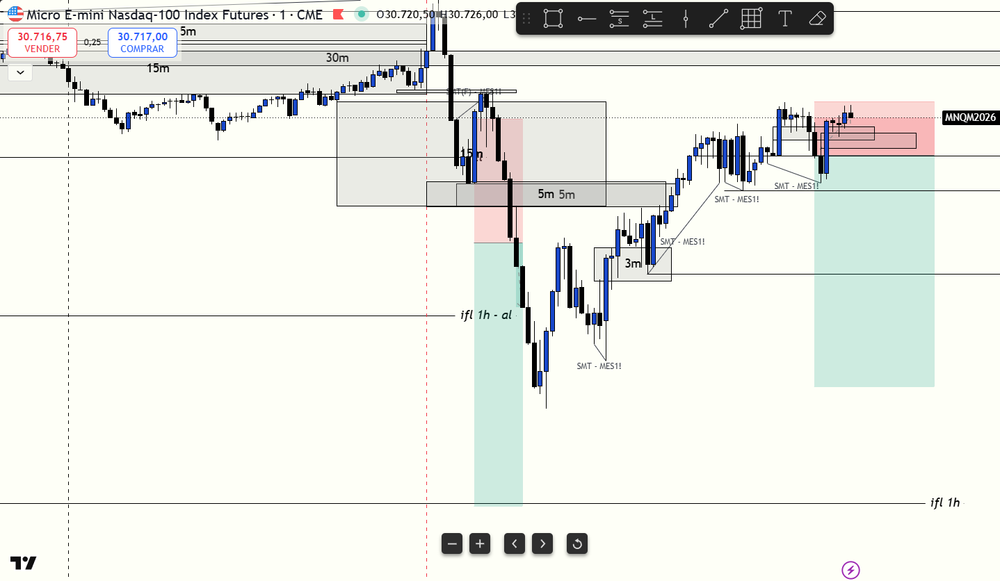

# 📅 BITÁCORA DE TRADING — 03 de Junio de 2026
**Pre-Trade Link:** [[2026-06-03_pre_trade]]

## 📊 RESUMEN GENERAL DE LA SESIÓN
- **Resultado Neto:** `-$734.00 USD`
- **Trades Realizados:** `2`
- **Resultado:** `LOSS`
- **Contexto de Cuenta Fondeada (Eval):** 
  * Balance Actual: `$49,869.00 USD` (a un paso de recuperar el equilibrio inicial de $50k)
  * Objetivo de Beneficio: `$53,000.00 USD`
  * Distancia al Objetivo: `+$3,131.00 USD`
  * Días Hábiles Restantes: `11 días`

---

## 🖼️ CAPTURA DE PANTALLA

---

## 🔍 ANÁLISIS ESTRUCTURAL DE TEMPORALIDADES (TOP-DOWN)
### 1. Temporalidades Mayores (HTF: 4h / 1h)
- **Bias:** Alcista 🟢 (Macro) / Bajista 🔴 (Intradía)
- **Narrativa:** El sesgo macro general es fuertemente alcista. En la apertura de Nueva York, el Nasdaq (`MNQ`) expandió agresivamente barriendo el máximo del día anterior y registrando un nuevo ATH en `30,807.75`. Sin embargo, el S&P 500 (`MES`) mostró una fuerte debilidad relativa macro (divergencia SMT al no romper su máximo previo). Esta asimetría generó una fuerte distribución que provocó una caída masiva de 300 puntos desde el ATH de apertura.

### 2. Temporalidades Intermedias (30m / 15m)
- **Zonas clave (POIs):** El precio rompió a la baja el 15m CISD de `30,686.25`. Tras el impulso bajista inicial, buscamos retrocesos hacia el 15m Bearish FVG y 5m FVG (`30,649.25 - 30,666.50`).

### 3. Temporalidad de Ejecución (5m / 2m / 1m)
- **Gatillo / Desplazamiento:** Se buscaron entradas en corto utilizando la invalidación de FVGs alcistas (iFVGs) tras retrocesos a zonas de descuento de la pierna bajista.

---

## 📈 REPORTE DETALLADO DE LOS TRADES

### 🔴 TRADE #1: Short en NQ
- **Entrada:** `30,624.00` (a las 09:45 NY Time)
- **MAE:** `25.25 puntos (101 ticks)`
- **MFE:** `128.50 puntos (514 ticks)`
- **Resultado:** `BE` (BE+ de protección para un beneficio neto de `+$66.00 USD`).
- **Notas:** Entrada tardía tras confirmación de CHoCH en 1m. El precio corrió a favor rápido. Se protegió en BE+ asegurando ganancias antes de que el mercado hiciera un retroceso agresivo que nos sacó en `30,604.00`.

### 🔴 TRADE #2: Short en NQ
- **Entrada:** `30,687.00` (a las 10:15 aprox. NY Time)
- **MAE:** `41.00 puntos (164 ticks)`
- **MFE:** `26.00 puntos (104 ticks)`
- **Resultado:** `LOSS` (`-$800.00 USD`).
- **Notas:** Corto tomado en el retesteo del 15m Bearish FVG apoyado por alineación de 3m y 1m iFVG. El precio amagó con caer (llegando a `30,661.00`), pero luego experimentó una fuerte presión alcista que barrió el Stop Loss en `30,728.00` a las 10:42 AM. La pérdida fue extremadamente abultada debido a una mala gestión del tamaño de la posición (sobreloteo/sobre-apalancamiento).

---

## 🧠 LECCIONES DE LA SESIÓN
1. **Respeta la gestión de riesgo del clasificador (0.5%):** El clasificador de Machine Learning premarket advirtió claramente: `⚠️ SETUP MODERADO: Reducir riesgo a la mitad (0.5%)`. Perder $800 en un solo trade de 41 puntos de stop indica haber asumido un loteo desproporcionado (1 mini o 10 micros completos) en un entorno de alta volatilidad. La disciplina de gestión de riesgo debe ser inquebrantable.
2. **Shortear el activo fuerte es más peligroso:** Habíamos identificado en el análisis previo que **MES (S&P 500) era el activo más débil y mejor para buscar cortos**, mientras que MNQ tenía fuerza relativa alcista. A pesar de esto, se tomó el corto en MNQ, y fue precisamente el rebote agresivo de NQ el que terminó barriendo el SL. Opera siempre el activo que muestre mayor debilidad al buscar cortos.
3. **Controla la frustración y la revancha:** Tras la entrada perdida en `30,683` (que corrió 100 puntos sin nosotros) y la salida anticipada en BE+ en el primer trade, la impaciencia y la frustración nublaron el plan, llevando a un sobreloteo destructivo en el segundo trade. Acepta los resultados y mantén los tamaños de riesgo constantes.
