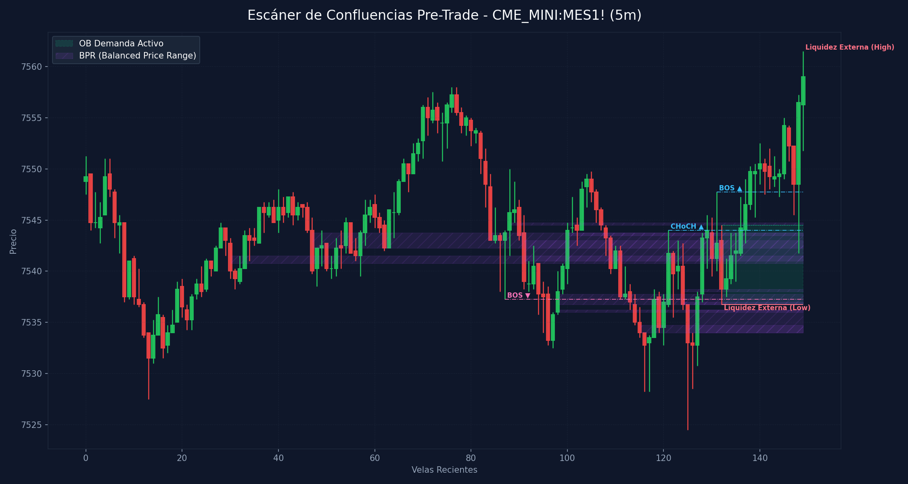

# 🛠️ Reporte Pre-Trade: Mapa de Confluencias (SMC & ICT)
        
Este reporte ha sido generado según los lineamientos de tu **Manual Operativo de Trading**. Analiza las confluencias de temporalidad menor para preparar tu Killzone y delinear tus puntos de interés antes de operar.

---

## 📅 Información de la Sesión
* **Fecha:** `2026-06-04`
* **Activo:** `CME_MINI:MES1!`
* **Temporalidad:** `5m` (LTF / Gatillo)
* **Precio Actual:** `7559.0`
* **Vinculación Temporal:** 
  * 🔗 [Ver Autopsia y Bitácora Post-Trade de esta Sesión](2026-06-04_session.md) (Se generará al finalizar tu sesión)

---

## 🛡️ Alerta del Guardia de Riesgo (IA Risk Mentor)

> [!IMPORTANT]
> **Estadísticas de Bitácora:** Sesiones: `5` | PnL Acumulado: `$446.00 USD` | Win Rate: `40.0%`
> 
> **🚨 TUS ERRORES PSICOLÓGICOS MÁS RECURRENTES A EVITAR HOY:**
> * **Ignorar Resistencia:** presente en el `80.0%` de las sesiones previas.
> * **FOMO:** presente en el `40.0%` de las sesiones previas.
>
> **📝 LECCIONES CLAVE A RECORDAR:**
> * 1. La Disciplina ante el Bias Paga Rentabilidad: Alinearse estrictamente con el HTF Bias (Bullish) en zona de descuento macro y descartar los cortos contra-tendencia es la base de los trades de alta probabilidad.
> * La Espera del Retesteo Reduce el Riesgo: No entrar persiguiendo velas de expansión alcista sino esperar con paciencia el pullback al FVG mitigador es la diferencia entre ser liquidado o lograr una entrada limpia con excelente R:R.
> * El Plan Vence a la Intuición: Ignorar el impulso de tomar shorts discrecionales (incluso cuando otros mentores o el ruido de micro-temporalidades sugerían caídas) y aferrarse a las reglas del manual operativo condujo a una sesión sumamente rentable.

---

## 🧠 Predicción de Machine Learning (SMC Setup Classifier)
El clasificador de Inteligencia Artificial analizó la confluencia de este escenario de pre-sesión con tus datos históricos de trade:

```text
=== PREDICCIÓN DE PROBABILIDAD DE ÉXITO ===

==================================================
SETUP EVALUADO:
 - Instrumento: ES | Dirección: Short | Sesión: NY AM KZ
 - Confluencias: in kill zone (london / ny am / pm), at htf pd array (ob / fvg / breaker), order block (ob) alignment, htf market structure bias confirmed
--------------------------------------------------
PROBABILIDAD DE WIN RATE ESTIMADA: 51.5%
⚠️ SETUP MODERADO: Reducir riesgo a la mitad (0.5%) o esperar más confirmaciones.
==================================================
```

---

## 🎨 Marcaciones Manuales en tu Gráfico (TradingView)
Esta sección extrae automáticamente tus rectángulos (cajas de zonas) y líneas dibujadas a mano en TradingView y comprueba su confluencia con las zonas de liquidez y estructuras de Smart Money Concepts:

  * **Caja Gris con etiqueta '1m'** en rango `7609.73 - 7610.25` | Estado: 🟡 Fuera del precio | Sin confluencia SMC directa
  * **Caja Gris con etiqueta '4m'** en rango `7593.21 - 7593.63` | Estado: 🟡 Fuera del precio | Sin confluencia SMC directa
  * **Caja Gris** en rango `7591.75 - 7593.51` | Estado: 🟡 Fuera del precio | Sin confluencia SMC directa
  * **Caja Gris** en rango `7593.00 - 7595.38` | Estado: 🟡 Fuera del precio | Sin confluencia SMC directa
  * **Caja Gris con etiqueta '4h'** en rango `7551.21 - 7611.25` | Estado: 🟢 PRECIO DENTRO | Sin confluencia SMC directa
  * **Caja Gris con etiqueta '1h'** en rango `7546.13 - 7577.00` | Estado: 🟢 PRECIO DENTRO | Sin confluencia SMC directa
  * **Caja Gris con etiqueta '1h'** en rango `7597.78 - 7603.75` | Estado: 🟡 Fuera del precio | Sin confluencia SMC directa
  * **Caja Gris con etiqueta '1h'** en rango `7549.83 - 7550.75` | Estado: 🟡 Fuera del precio | Sin confluencia SMC directa
  * **Caja Gris con etiqueta '30m'** en rango `7549.95 - 7552.25` | Estado: 🟡 Fuera del precio | Sin confluencia SMC directa
  * **Caja Gris con etiqueta '15m'** en rango `7543.75 - 7545.19` | Estado: 🟡 Fuera del precio | Sin confluencia SMC directa
  * **Caja Gris con etiqueta '2m'** en rango `7550.00 - 7551.82` | Estado: 🟡 Fuera del precio | Sin confluencia SMC directa
  * **Línea Manual con etiqueta 'ath'** en nivel `7632.75` | Estado: Fuera de rango
  * **Línea Manual con etiqueta 'lh'** en nivel `7622.27` | Estado: Fuera de rango
  * **Línea Manual con etiqueta 'ah'** en nivel `7627.00` | Estado: Fuera de rango
  * **Línea Manual con etiqueta 'ifl 1h - lh'** en nivel `7558.00` | Estado: 🎯 PRECIO CERCA
  * **Línea Manual con etiqueta 'll'** en nivel `7524.50` | Estado: Fuera de rango
  * **Línea Manual con etiqueta 'ifl 5m'** en nivel `7536.75` | Estado: 🎯 PRECIO CERCA

---

## ⏳ Análisis Estructural Multi-Temporalidad Completo (9 Timeframes)
Escaneo automático y en segundo plano de estructura de mercado y zonas institucionales activas en todos los marcos de tiempo analizados (de mayor a menor):

| Temporalidad | Sesgo Estructural | Rango (Premium/Discount) | Últimos OBs Activos | Últimos FVGs Activos |
| :--- | :--- | :--- | :--- | :--- |
| **4H** | Bullish 🟢 | Discount (Compras) 🟢 | 🟢 Demand (29763.2-29964.8) | 🔴 Bearish (30694.8-30701.0), 🔴 Bearish (30331.0-30450.0) |
| **1H** | Bearish 🔴 | Discount (Compras) 🟢 | 🔴 Supply (30699.2-30797.5), 🔴 Supply (30489.2-30546.0) | 🔴 Bearish (30349.0-30489.2) |
| **30m** | Bearish 🔴 | Discount (Compras) 🟢 | 🔴 Supply (30625.0-30694.8), 🔴 Supply (30489.2-30546.0) | 🔴 Bearish (30566.8-30625.0), 🔴 Bearish (30402.5-30490.0) |
| **15m** | Bearish 🔴 | Premium (Ventas) 🔴 | 🔴 Supply (30666.8-30739.5), 🔴 Supply (30512.8-30546.0) | 🔴 Bearish (30424.5-30490.0), 🔴 Bearish (30402.5-30405.0) |
| **5m** | Bullish 🟢 | Discount (Compras) 🟢 | 🔴 Supply (30328.5-30349.0), 🟢 Demand (30223.2-30251.2) | 🔴 Bearish (30377.5-30377.8), 🟢 Bullish (30250.5-30256.8) |
| **4m** | Bullish 🟢 | Discount (Compras) 🟢 | 🔴 Supply (30331.0-30349.0), 🟢 Demand (30223.2-30251.2) | 🟢 Bullish (30251.2-30256.8), 🔴 Bearish (30291.8-30312.0) |
| **3m** | Bullish 🟢 | Discount (Compras) 🟢 | 🟢 Demand (30223.2-30251.2), 🔴 Supply (30306.8-30331.0) | 🟢 Bullish (30250.5-30256.8), 🔴 Bearish (30302.5-30312.0) |
| **2m** | Bullish 🟢 | Discount (Compras) 🟢 | 🟢 Demand (30223.2-30251.2), 🔴 Supply (30312.8-30331.0) | 🔴 Bearish (30302.5-30312.0), 🔴 Bearish (30291.8-30297.8) |
| **1m** | Bearish 🔴 | Discount (Compras) 🟢 | 🟢 Demand (30226.0-30244.2), 🔴 Supply (30316.2-30331.0) | 🔴 Bearish (30359.5-30364.2), 🟢 Bullish (30202.8-30203.5) |

---

## 📊 Mapa de Gráfico de Confluencias
Este gráfico mapea de forma precisa la liquidez externa, los bloques de orden activos, los vacíos de liquidez y los rangos de precio balanceados (BPR):



---

## 🔍 Análisis Estructural Top-Down (Multi-Temporalidad)
Análisis de temporalidades HTF de Nasdaq en el fondo sin alterar tu TradingView Desktop:

* **1H HTF Bias:** `Bearish 🔴` | Mapeado según el último BOS estructural en 1 hora.
* **1H Zonas Clave:**
  * OB de 1H Supply: Rango `30699.25 - 30797.50`
  * OB de 1H Supply: Rango `30489.25 - 30546.00`
  * FVG de 1H Bearish: Rango `30349.00 - 30489.25`

* **15m POIs de Confluencia:**
  * OB de 15m Supply: Rango `30666.75 - 30739.50` | Ver [[Order Block (Bullish)]] o [[Order Block (Bearish)]]
  * OB de 15m Supply: Rango `30512.75 - 30546.00` | Ver [[Order Block (Bullish)]] o [[Order Block (Bearish)]]
  * FVG de 15m Bearish: Rango `30424.50 - 30490.00` | Ver [[Fair Value Gap]]
  * FVG de 15m Bearish: Rango `30402.50 - 30405.00` | Ver [[Fair Value Gap]]

---

## ⚡ Correlación Inter-Mercado (SMT Divergence)
* **Estado SMT:** `S&P 500 (MES) y Nasdaq (MNQ) alineados de forma regular en el Open (Sin divergencias activas). Ver [[SMT Divergence]]`

---

## 🧲 Puntos de Interés (POI) y Liquidez LTF (5m)

### 🌐 1. Liquidez Externa (HTF / Session Pivots)
Niveles clave para buscar barridas de liquidez (*sweeps*) en la apertura de sesión o Killzone:
* **Liquidez Externa Superior (Swing High):** `7561.5` (Vela #149) | Ver [[External Liquidity]] y [[Swing High]]
* **Liquidez Externa Inferior (Swing Low):** `7536.75` (Vela #132) | Ver [[External Liquidity]] y [[Swing Low]]

* **Pools de Liquidez Interna Activos (Unswept):**
  * *No se detectan pools de liquidez interna inmitigados en el rango de precios actual. Ver [[Internal Liquidity]]*

### 🟢 2. Bloques de Orden de Demanda (Soportes / Compras)
Zonas institucionales activas de alta concentración de compras limitadas. Ver [[Order Block (Bullish)]].

| Tipo | Rango de Precio | Volumen | Estado |
| :--- | :--- | :--- | :--- |
| **Demand OB** | `7536.75 - 7544.5` | `8685.0` | **Inmitigado (Activo)** 🔥 |

### 🔴 3. Bloques de Orden de Oferta (Resistencias / Ventas)
Zonas institucionales activas de alta concentración de ventas limitadas. Ver [[Order Block (Bearish)]].

| Tipo | Rango de Precio | Volumen | Estado |
| :--- | :--- | :--- | :--- |

---

## 🌀 4. Anatomía de Fair Value Gaps (FVG) e Inversiones
Análisis detallado de imbalances de precios y su **probabilidad de inversión (iFVG)** según la secuencia de sus 3 velas. Ver [[Fair Value Gap]] e [[IFVG]].

| Dirección | Rango de FVG | Perfil de Velas | Probabilidad de Inversión / Comportamiento |
| :--- | :--- | :--- | :--- |

---

## 🟣 5. Balanced Price Ranges (BPR) Detectados
Solapamientos de FVG alcistas y bajistas en el mismo nivel de precios. Actúan como soportes/resistencias magnéticos de altísima precisión. Ver [[Balanced Price Range]].
* **BPR Detectado:** Rango `7544.50 - 7544.75` | Solapamiento de FVG Alcista (Vela #88) y Bajista (Vela #107)
* **BPR Detectado:** Rango `7536.75 - 7537.75` | Solapamiento de FVG Alcista (Vela #98) y Bajista (Vela #124)
* **BPR Detectado:** Rango `7536.00 - 7536.25` | Solapamiento de FVG Alcista (Vela #98) y Bajista (Vela #125)
* **BPR Detectado:** Rango `7540.75 - 7541.50` | Solapamiento de FVG Alcista (Vela #100) y Bajista (Vela #30)
* **BPR Detectado:** Rango `7542.25 - 7543.75` | Solapamiento de FVG Alcista (Vela #100) y Bajista (Vela #47)
* **BPR Detectado:** Rango `7541.00 - 7543.00` | Solapamiento de FVG Alcista (Vela #100) y Bajista (Vela #91)
* **BPR Detectado:** Rango `7543.50 - 7543.75` | Solapamiento de FVG Alcista (Vela #100) y Bajista (Vela #108)
* **BPR Detectado:** Rango `7534.00 - 7534.75` | Solapamiento de FVG Alcista (Vela #127) y Bajista (Vela #115)
* **BPR Detectado:** Rango `7536.75 - 7537.00` | Solapamiento de FVG Alcista (Vela #127) y Bajista (Vela #124)
* **BPR Detectado:** Rango `7534.00 - 7536.25` | Solapamiento de FVG Alcista (Vela #127) y Bajista (Vela #125)
* **BPR Detectado:** Rango `7538.00 - 7538.25` | Solapamiento de FVG Alcista (Vela #128) y Bajista (Vela #124)

---

## 🔄 6. Estructura de Mercado Reciente (BOS / CHoCH)
Rupturas de estructura registradas en el gráfico. Ver [[Market Structure]], [[Break of Structure]] y [[Change of Character]]:
* **BOS (Break of Structure) Bajista 🔴** en nivel `7537.25` | Confirmado en la vela #87
* **CHoCH (Change of Character) Alcista 🟢** en nivel `7544.0` | Confirmado en la vela #121
* **BOS (Break of Structure) Alcista 🟢** en nivel `7547.75` | Confirmado en la vela #131

---

## 💡 Protocolo Operativo Pre-Trade (Tu Plan de Sesión)

> [!IMPORTANT]
> **Checklist antes de apretar el gatillo (LTF 1m - 5m):**
> 1. **Fase 1 (Sweep):** Espera a que el precio barra una de las zonas de **Liquidez Externa** (`7561.5` / `7536.75`) o mitigue un POI HTF.
> 2. **Fase 2 (iFVG Trigger):** Busca una reacción post-sweep. El cuerpo de la vela debe cerrar y romper un FVG contrario, prioritariamente con perfil **Easy to Invert (R-G-R o G-R-G)**, convirtiéndolo en un **iFVG**.
> 3. **Gestión de Riesgo:** Si opera en All-Time Highs, gestión estricta con relación de **1:1 R:R**. En días de noticias, no ingresar a operaciones dentro de los **5 minutos anteriores** a la publicación.
