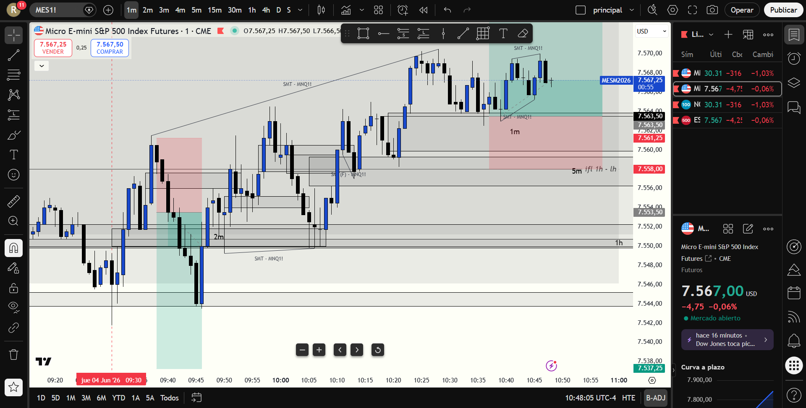

# 📅 BITÁCORA DE TRADING — 04 de Junio de 2026
**Pre-Trade Link:** [[2026-06-04_pre_trade]]

## 📊 RESUMEN GENERAL DE LA SESIÓN
- **Resultado Neto:** `-100.00 USD`
- **Trades Realizados:** `2`
- **Resultado:** `LOSS`

---

## 🖼️ CAPTURA DE PANTALLA

---

## 🔍 ANÁLISIS ESTRUCTURAL DE TEMPORALIDADES (TOP-DOWN)
### 1. Temporalidades Mayores (HTF: 4h / 1h)
- **Bias:** Bajista 🔴 (Estructura de 1H confirmada en Yahoo Finance tras BOS macro bajista).
- **Narrativa:** El precio comenzó la sesión de premarket mitigando en descuento, y luego inició una fuerte subida para buscar el retesteo premium de los FVG bajistas de 1H y 4H. MES rompió e irrespetó localmente su 1H/30m FVG para ir a barrer su máximo, mientras que MNQ mostró debilidad relativa quedándose más rezagada.

### 2. Temporalidades Intermedias (30m / 15m)
- **Zonas clave (POIs):** En MNQ, el **FVG bajista de 5m** (`30284.25 - 30305.00`) y las ineficiencias de 30m/1H superiores actuaron como el objetivo de mitigación premium dominante para el día.

### 3. Temporalidad de Ejecución (5m / 2m / 1m)
- **Gatillo / Desplazamiento:** Se confirmaron dos iFVGs de 1m en MNQ y MES en las zonas de testeo del FVG de 5m: uno prematuro sin SMT que falló (Trade 1), y uno óptimo post-mitigación profunda con SMT bajista que dio un reverso de 80 puntos (Trade 2, missed).

---

## 📈 REPORTE DETALLADO DE LOS TRADES

### ⚪ TRADE #1: Short en MES
- **Entrada:** `7553.00`
- **MAE:** `0.0 ticks`
- **MFE:** `8.0 ticks` (El precio bajó a `7551.00`)
- **Resultado:** `BE (Breakeven)`
- **Notas:** Entrada en 1m iFVG bajista tras una mitigación marginal del FVG de 1H. El precio reaccionó a favor levemente, pero al notar que perdía momentum, se protegió la entrada a BE. El precio subió y me sacó plano antes de continuar la subida general para barrer máximos.

### 🔴 TRADE #2: Short en MNQ
- **Entrada:** `30259.00`
- **MAE:** `36.0 ticks` (9 puntos en contra)
- **MFE:** `156.0 ticks` (El precio cayó inicialmente a `30220.00` antes del retroceso)
- **Resultado:** `LOSS (-100.00 USD)`
- **Notas:** Entrada por 1m iFVG bajista cuando el precio apenas tocó el borde inferior del 5m Bearish FVG (`30284.25`). Fue un error de **FOMO / Entrada Anticipada**, entrando antes de que la mitigación profunda real del FVG ocurriera y sin divergencia SMT activa. El stop loss era demasiado ajustado (`30268.00`) y fue barrido en el retroceso hacia `30294.50` donde el mercado liquidó el FVG de 5m real.

---

## 🧠 LECCIONES DE LA SESIÓN
1. **La Mitigación requiere profundidad (CE):** No entres shorts anticipados solo porque el precio toca el primer tick de un FVG de temporalidad mayor (5m o superior). El dinero institucional suele testear el 50% (Consequent Encroachment) o el open de la zona antes del reverso real. Si entras abajo, el stop loss técnico debe ir por encima del FVG de HTF.
2. **El SMT es el semáforo del reverso:** A las 9:53 AM, el Short en MNQ falló porque MES y NQ hacían máximos más altos en sincronía (sin SMT). A las 9:59 AM, el Short funcionó de forma perfecta porque MES había barrido su máximo (`7564.50` vs `7561.50`) mientras MNQ fallaba en hacerlo (`30305.50` vs `30316.50`), confirmando la Divergencia SMT Bajista.
3. **El Miedo Paraliza tras Pérdidas:** Tras dos salidas BE y un stop de -$100.00, dudé en el trade óptimo de las 9:59 AM en `30231` (iFVG post-SMT) esperando que ES también rompiera, lo cual me dejó fuera de una caída limpia de 80 puntos. La debilidad relativa de MNQ significaba que rompería primero; la confluencia ya estaba dada por el SMT.
