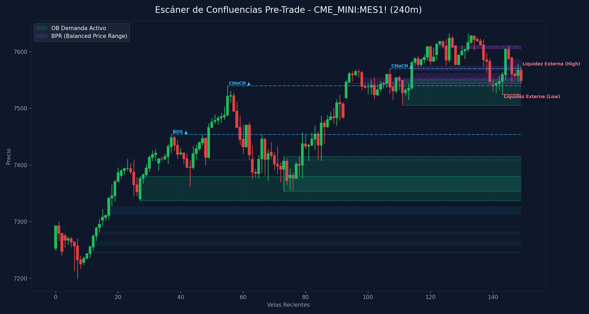

# 🛠️ Reporte Pre-Trade: Mapa de Confluencias (SMC & ICT)
        
Este reporte ha sido generado según los lineamientos de tu **Manual Operativo de Trading**. Analiza las confluencias de temporalidad menor para preparar tu Killzone y delinear tus puntos de interés antes de operar.

---

## 📅 Información de la Sesión
* **Fecha:** `2026-06-05`
* **Activo:** `CME_MINI:MES1!`
* **Temporalidad:** `240m` (LTF / Gatillo)
* **Precio Actual:** `7549.0`
* **Vinculación Temporal:** 
  * 🔗 [Ver Autopsia y Bitácora Post-Trade de esta Sesión](2026-06-05_session.md) (Se generará al finalizar tu sesión)

---

## 🛡️ Alerta del Guardia de Riesgo (IA Risk Mentor)

> [!IMPORTANT]
> **Estadísticas de Bitácora:** Sesiones: `6` | PnL Acumulado: `$346.00 USD` | Win Rate: `33.3%`
> 
> **🚨 TUS ERRORES PSICOLÓGICOS MÁS RECURRENTES A EVITAR HOY:**
> * **Ignorar Resistencia:** presente en el `66.7%` de las sesiones previas.
> * **FOMO:** presente en el `50.0%` de las sesiones previas.
>
> **📝 LECCIONES CLAVE A RECORDAR:**
> * 1. La Disciplina ante el Bias Paga Rentabilidad: Alinearse estrictamente con el HTF Bias (Bullish) en zona de descuento macro y descartar los cortos contra-tendencia es la base de los trades de alta probabilidad.
> * La Espera del Retesteo Reduce el Riesgo: No entrar persiguiendo velas de expansión alcista sino esperar con paciencia el pullback al FVG mitigador es la diferencia entre ser liquidado o lograr una entrada limpia con excelente R:R.
> * El Plan Vence a la Intuición: Ignorar el impulso de tomar shorts discrecionales (incluso cuando otros mentores o el ruido de micro-temporalidades sugerían caídas) y aferrarse a las reglas del manual operativo condujo a una sesión sumamente rentable.

---

## 🧠 Predicción de Machine Learning (SMC Setup Classifier)
El clasificador de Inteligencia Artificial analizó la confluencia de este escenario de pre-sesión con tus datos históricos de trade:

```text
=== PREDICCIÓN DE PROBABILIDAD DE ÉXITO ===

==================================================
SETUP EVALUADO:
 - Instrumento: ES | Dirección: Long | Sesión: NY AM KZ
 - Confluencias: in kill zone (london / ny am / pm), at htf pd array (ob / fvg / breaker), fair value gap (fvg) on entry tf, order block (ob) alignment, htf market structure bias confirmed
--------------------------------------------------
PROBABILIDAD DE WIN RATE ESTIMADA: 64.5%
⚠️ SETUP MODERADO: Reducir riesgo a la mitad (0.5%) o esperar más confirmaciones.
==================================================
```

---

## 🎨 Marcaciones Manuales en tu Gráfico (TradingView)
Esta sección extrae automáticamente tus rectángulos (cajas de zonas) y líneas dibujadas a mano en TradingView y comprueba su confluencia con las zonas de liquidez y estructuras de Smart Money Concepts:

  * **Caja Gris con etiqueta '5m'** en rango `7552.35 - 7558.75` | Estado: 🟡 Fuera del precio | Confluencias: **FVG 1H** (7551.5 - 7559.2), **FVG 30m** (7551.5 - 7557.5), **FVG 5m** (7552.2 - 7558.8), **FVG 4m** (7558.2 - 7558.5), **FVG 4m** (7552.2 - 7557.0), **FVG 3m** (7553.2 - 7559.0), **FVG 2m** (7558.2 - 7559.0), **FVG 2m** (7553.2 - 7557.0), **FVG 1m** (7556.0 - 7557.0), **FVG 1m** (7553.2 - 7555.0)
  * **Línea Manual con etiqueta 'ifl 4h'** en nivel `7579.00` | Estado: Fuera de rango
  * **Línea Manual con etiqueta 'ifl 4h'** en nivel `7611.50` | Estado: Fuera de rango
  * **Línea Manual con etiqueta 'ssl'** en nivel `7505.75` | Estado: Fuera de rango | Ubicación: dentro de **OB 4H** (7505.8 - 7534.2)
  * **Línea Manual con etiqueta 'ssl'** en nivel `7524.50` | Estado: 🎯 PRECIO CERCA | Ubicación: dentro de **OB 4H** (7505.8 - 7534.2), dentro de **OB 1H** (7524.5 - 7545.5), dentro de **OB 30m** (7524.5 - 7545.5), dentro de **OB 15m** (7524.5 - 7542.8)
  * **Línea Manual con etiqueta 'ifl 30m'** en nivel `7591.50` | Estado: Fuera de rango
  * **Línea Manual con etiqueta 'ifl 15m'** en nivel `7568.00` | Estado: 🎯 PRECIO CERCA | Ubicación: dentro de **OB 5m** (7566.5 - 7571.0), dentro de **OB 4m** (7566.5 - 7571.0), dentro de **OB 2m** (7566.5 - 7571.0)

---

## ⏳ Análisis Estructural Multi-Temporalidad Completo (9 Timeframes)
Escaneo automático y en segundo plano de estructura de mercado y zonas institucionales activas en todos los marcos de tiempo analizados (de mayor a menor):

| Temporalidad | Sesgo Estructural | Rango (Premium/Discount) | Últimos OBs Activos | Últimos FVGs Activos |
| :--- | :--- | :--- | :--- | :--- |
| **4H** | Bullish 🟢 | Discount (Compras) 🟢 | 🟢 Demand (7505.8-7534.2) | *Ninguno* |
| **1H** | Bullish 🟢 | Discount (Compras) 🟢 | 🔴 Supply (7621.5-7632.0), 🟢 Demand (7524.5-7545.5) | 🔴 Bearish (7586.8-7587.2), 🔴 Bearish (7551.5-7559.2) |
| **30m** | Bullish 🟢 | Discount (Compras) 🟢 | 🔴 Supply (7621.5-7627.0), 🟢 Demand (7524.5-7545.5) | 🔴 Bearish (7579.8-7580.2), 🔴 Bearish (7551.5-7557.5) |
| **15m** | Bullish 🟢 | Discount (Compras) 🟢 | 🟢 Demand (7524.5-7542.8) | 🔴 Bearish (7581.2-7581.8), 🔴 Bearish (7579.8-7580.2) |
| **5m** | Bearish 🔴 | Premium (Ventas) 🔴 | 🔴 Supply (7572.0-7574.2), 🔴 Supply (7566.5-7571.0) | 🔴 Bearish (7581.2-7582.0), 🔴 Bearish (7552.2-7558.8) |
| **4m** | Bearish 🔴 | Premium (Ventas) 🔴 | 🔴 Supply (7566.5-7571.0) | 🔴 Bearish (7558.2-7558.5), 🔴 Bearish (7552.2-7557.0) |
| **3m** | Bearish 🔴 | Discount (Compras) 🟢 | 🔴 Supply (7569.0-7571.0), 🔴 Supply (7560.5-7563.5) | 🔴 Bearish (7571.2-7572.0), 🔴 Bearish (7553.2-7559.0) |
| **2m** | Bearish 🔴 | Discount (Compras) 🟢 | 🔴 Supply (7566.5-7571.0), 🔴 Supply (7560.5-7563.5) | 🔴 Bearish (7558.2-7559.0), 🔴 Bearish (7553.2-7557.0) |
| **1m** | Bearish 🔴 | Discount (Compras) 🟢 | 🔴 Supply (7561.5-7563.5), 🔴 Supply (7559.5-7562.5) | 🔴 Bearish (7556.0-7557.0), 🔴 Bearish (7553.2-7555.0) |

---

## 📊 Mapa de Gráfico de Confluencias
Este gráfico mapea de forma precisa la liquidez externa, los bloques de orden activos, los vacíos de liquidez y los rangos de precio balanceados (BPR):



---

## 🔍 Análisis Estructural Top-Down (Multi-Temporalidad)
Análisis de temporalidades HTF de Nasdaq en el fondo sin alterar tu TradingView Desktop:

* **1H HTF Bias:** `Bullish 🟢` | Mapeado según el último BOS estructural en 1 hora.
* **1H Zonas Clave:**
  * OB de 1H Supply: Rango `7621.50 - 7632.00`
  * OB de 1H Demand: Rango `7524.50 - 7545.50`
  * FVG de 1H Bearish: Rango `7586.75 - 7587.25`
  * FVG de 1H Bearish: Rango `7551.50 - 7559.25`

* **15m POIs de Confluencia:**
  * OB de 15m Demand: Rango `7524.50 - 7542.75` | Ver [[Order Block (Bullish)]] o [[Order Block (Bearish)]]
  * FVG de 15m Bearish: Rango `7581.25 - 7581.75` | Ver [[Fair Value Gap]]
  * FVG de 15m Bearish: Rango `7579.75 - 7580.25` | Ver [[Fair Value Gap]]

---

## ⚡ Correlación Inter-Mercado (SMT Divergence)
* **Estado SMT:** `S&P 500 (MES) y Nasdaq (MNQ) alineados de forma regular en el Open (Sin divergencias activas). Ver [[SMT Divergence]]`

---

## 🧲 Puntos de Interés (POI) y Liquidez LTF (240m)

### 🌐 1. Liquidez Externa (HTF / Session Pivots)
Niveles clave para buscar barridas de liquidez (*sweeps*) en la apertura de sesión o Killzone:
* **Liquidez Externa Superior (Swing High):** `7574.25` (Vela #149) | Ver [[External Liquidity]] y [[Swing High]]
* **Liquidez Externa Inferior (Swing Low):** `7524.5` (Vela #143) | Ver [[External Liquidity]] y [[Swing Low]]

* **Pools de Liquidez Interna Activos (Unswept):**
  * *No se detectan pools de liquidez interna inmitigados en el rango de precios actual. Ver [[Internal Liquidity]]*

### 🟢 2. Bloques de Orden de Demanda (Soportes / Compras)
Zonas institucionales activas de alta concentración de compras limitadas. Ver [[Order Block (Bullish)]].

| Tipo | Rango de Precio | Volumen | Estado |
| :--- | :--- | :--- | :--- |
| **Demand OB** | `7337.0 - 7380.0` | `289387.0` | **Inmitigado (Activo)** 🔥 |
| **Demand OB** | `7353.75 - 7415.25` | `772410.0` | **Inmitigado (Activo)** 🔥 |
| **Demand OB** | `7505.75 - 7550.75` | `711517.0` | **Inmitigado (Activo)** 🔥 |

### 🔴 3. Bloques de Orden de Oferta (Resistencias / Ventas)
Zonas institucionales activas de alta concentración de ventas limitadas. Ver [[Order Block (Bearish)]].

| Tipo | Rango de Precio | Volumen | Estado |
| :--- | :--- | :--- | :--- |

---

## 🌀 4. Anatomía de Fair Value Gaps (FVG) e Inversiones
Análisis detallado de imbalances de precios y su **probabilidad de inversión (iFVG)** según la secuencia de sus 3 velas. Ver [[Fair Value Gap]] e [[IFVG]].

| Dirección | Rango de FVG | Perfil de Velas | Probabilidad de Inversión / Comportamiento |
| :--- | :--- | :--- | :--- |
| 🟢 Bullish FVG | `7244.25 - 7248.5` | `G-G-G` (Vela #11) | Fuerte Desplazamiento Alcista (Gran probabilidad de ser Respetado) 🟢 |
| 🟢 Bullish FVG | `7257.75 - 7266.5` | `G-G-G` (Vela #12) | Fuerte Desplazamiento Alcista (Gran probabilidad de ser Respetado) 🟢 |
| 🟢 Bullish FVG | `7277.25 - 7282.5` | `G-G-G` (Vela #13) | Fuerte Desplazamiento Alcista (Gran probabilidad de ser Respetado) 🟢 |
| 🟢 Bullish FVG | `7291.5 - 7293.5` | `G-G-G` (Vela #14) | Fuerte Desplazamiento Alcista (Gran probabilidad de ser Respetado) 🟢 |
| 🟢 Bullish FVG | `7312.75 - 7327.25` | `G-G-G` (Vela #17) | Fuerte Desplazamiento Alcista (Gran probabilidad de ser Respetado) 🟢 |

---

## 🟣 5. Balanced Price Ranges (BPR) Detectados
Solapamientos de FVG alcistas y bajistas en el mismo nivel de precios. Actúan como soportes/resistencias magnéticos de altísima precisión. Ver [[Balanced Price Range]].
* **BPR Detectado:** Rango `7408.75 - 7409.50` | Solapamiento de FVG Alcista (Vela #44) y Bajista (Vela #63)
* **BPR Detectado:** Rango `7543.00 - 7545.25` | Solapamiento de FVG Alcista (Vela #93) y Bajista (Vela #98)
* **BPR Detectado:** Rango `7544.00 - 7554.00` | Solapamiento de FVG Alcista (Vela #114) y Bajista (Vela #98)
* **BPR Detectado:** Rango `7551.25 - 7562.50` | Solapamiento de FVG Alcista (Vela #114) y Bajista (Vela #139)
* **BPR Detectado:** Rango `7566.50 - 7575.25` | Solapamiento de FVG Alcista (Vela #114) y Bajista (Vela #146)
* **BPR Detectado:** Rango `7607.00 - 7610.75` | Solapamiento de FVG Alcista (Vela #122) y Bajista (Vela #137)
* **BPR Detectado:** Rango `7605.50 - 7606.50` | Solapamiento de FVG Alcista (Vela #132) y Bajista (Vela #128)
* **BPR Detectado:** Rango `7605.50 - 7611.25` | Solapamiento de FVG Alcista (Vela #132) y Bajista (Vela #137)
* **BPR Detectado:** Rango `7566.50 - 7587.25` | Solapamiento de FVG Alcista (Vela #144) y Bajista (Vela #146)

---

## 🔄 6. Estructura de Mercado Reciente (BOS / CHoCH)
Rupturas de estructura registradas en el gráfico. Ver [[Market Structure]], [[Break of Structure]] y [[Change of Character]]:
* **BOS (Break of Structure) Alcista 🟢** en nivel `7454.0` | Confirmado en la vela #37
* **CHoCH (Change of Character) Alcista 🟢** en nivel `7540.0` | Confirmado en la vela #55
* **CHoCH (Change of Character) Alcista 🟢** en nivel `7570.5` | Confirmado en la vela #107

---

## 💡 Protocolo Operativo Pre-Trade (Tu Plan de Sesión)

> [!IMPORTANT]
> **Checklist antes de apretar el gatillo (LTF 1m - 5m):**
> 1. **Fase 1 (Sweep):** Espera a que el precio barra una de las zonas de **Liquidez Externa** (`7574.25` / `7524.5`) o mitigue un POI HTF.
> 2. **Fase 2 (iFVG Trigger):** Busca una reacción post-sweep. El cuerpo de la vela debe cerrar y romper un FVG contrario, prioritariamente con perfil **Easy to Invert (R-G-R o G-R-G)**, convirtiéndolo en un **iFVG**.
> 3. **Gestión de Riesgo:** Si opera en All-Time Highs, gestión estricta con relación de **1:1 R:R**. En días de noticias, no ingresar a operaciones dentro de los **5 minutos anteriores** a la publicación.
