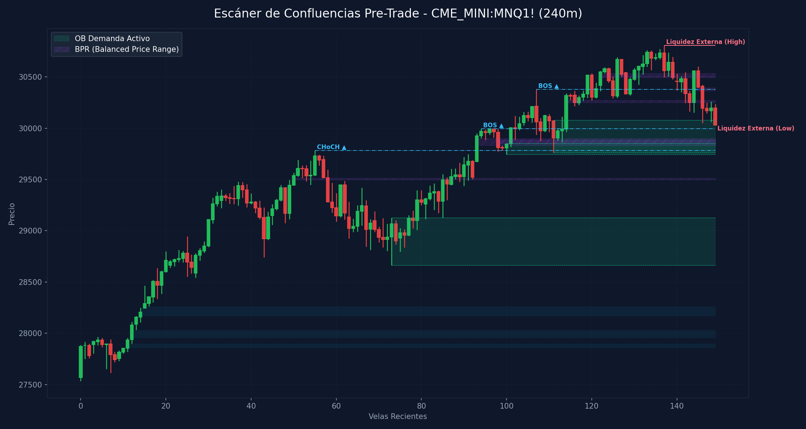

# 🛠️ Reporte Pre-Trade: Mapa de Confluencias (SMC & ICT)
        
Este reporte ha sido generado según los lineamientos de tu **Manual Operativo de Trading**. Analiza las confluencias de temporalidad menor para preparar tu Killzone y delinear tus puntos de interés antes de operar.

---

## 📅 Información de la Sesión
* **Fecha:** `2026-06-05`
* **Activo:** `CME_MINI:MNQ1!`
* **Temporalidad:** `240m` (LTF / Gatillo)
* **Precio Actual:** `30031.0`
* **Vinculación Temporal:** 
  * 🔗 [Ver Autopsia y Bitácora Post-Trade de esta Sesión](2026-06-05_session.md) (Se generará al finalizar tu sesión)

---

## 🛡️ Alerta del Guardia de Riesgo (IA Risk Mentor)

> [!IMPORTANT]
> **Estadísticas de Bitácora:** Sesiones: `6` | PnL Acumulado: `$346.00 USD` | Win Rate: `33.3%`
> 
> **🚨 TUS ERRORES PSICOLÓGICOS MÁS RECURRENTES A EVITAR HOY:**
> * **Ignorar Resistencia:** presente en el `66.7%` de las sesiones previas.
> * **FOMO:** presente en el `50.0%` de las sesiones previas.
>
> **📝 LECCIONES CLAVE A RECORDAR:**
> * 1. La Disciplina ante el Bias Paga Rentabilidad: Alinearse estrictamente con el HTF Bias (Bullish) en zona de descuento macro y descartar los cortos contra-tendencia es la base de los trades de alta probabilidad.
> * La Espera del Retesteo Reduce el Riesgo: No entrar persiguiendo velas de expansión alcista sino esperar con paciencia el pullback al FVG mitigador es la diferencia entre ser liquidado o lograr una entrada limpia con excelente R:R.
> * El Plan Vence a la Intuición: Ignorar el impulso de tomar shorts discrecionales (incluso cuando otros mentores o el ruido de micro-temporalidades sugerían caídas) y aferrarse a las reglas del manual operativo condujo a una sesión sumamente rentable.

---

## 🧠 Predicción de Machine Learning (SMC Setup Classifier)
El clasificador de Inteligencia Artificial analizó la confluencia de este escenario de pre-sesión con tus datos históricos de trade:

```text
=== PREDICCIÓN DE PROBABILIDAD DE ÉXITO ===

==================================================
SETUP EVALUADO:
 - Instrumento: NQ | Dirección: Short | Sesión: NY AM KZ
 - Confluencias: in kill zone (london / ny am / pm), at htf pd array (ob / fvg / breaker), fair value gap (fvg) on entry tf, order block (ob) alignment, htf market structure bias confirmed
--------------------------------------------------
PROBABILIDAD DE WIN RATE ESTIMADA: 58.0%
⚠️ SETUP MODERADO: Reducir riesgo a la mitad (0.5%) o esperar más confirmaciones.
==================================================
```

---

## 🎨 Marcaciones Manuales en tu Gráfico (TradingView)
Esta sección extrae automáticamente tus rectángulos (cajas de zonas) y líneas dibujadas a mano en TradingView y comprueba su confluencia con las zonas de liquidez y estructuras de Smart Money Concepts:

  * **Caja Gris con etiqueta '5m'** en rango `30078.15 - 30116.25` | Estado: 🟡 Fuera del precio | Confluencias: **FVG 1H** (30072.0 - 30135.0), **FVG 30m** (30072.0 - 30102.2), **FVG 5m** (30078.2 - 30116.2), **FVG 4m** (30109.5 - 30116.2), **FVG 4m** (30078.2 - 30100.5), **FVG 3m** (30088.0 - 30107.2), **FVG 3m** (30078.2 - 30082.0), **FVG 2m** (30109.5 - 30116.5), **FVG 2m** (30088.0 - 30100.5), **FVG 1m** (30098.0 - 30100.5), **FVG 1m** (30088.0 - 30095.2)
  * **Línea Manual con etiqueta 'ifl 4h'** en nivel `30260.00` | Estado: Fuera de rango | Ubicación: dentro de **OB 30m** (30151.0 - 30260.0), dentro de **OB 15m** (30151.0 - 30260.0)
  * **Línea Manual con etiqueta 'ssl'** en nivel `29763.25` | Estado: Fuera de rango | Ubicación: dentro de **OB 4H** (29763.2 - 29964.8)
  * **Línea Manual con etiqueta 'ifl 15m'** en nivel `30168.50` | Estado: Fuera de rango | Ubicación: dentro de **FVG 1H** (30168.5 - 30191.0), dentro de **OB 30m** (30151.0 - 30260.0), dentro de **OB 15m** (30151.0 - 30260.0)
  * **Línea Manual con etiqueta 'ssl'** en nivel `29860.50` | Estado: Fuera de rango | Ubicación: dentro de **OB 4H** (29763.2 - 29964.8)
  * **Línea Manual con etiqueta 'ifl 15m'** en nivel `30423.00` | Estado: Fuera de rango
  * **Línea Manual con etiqueta 'ssl'** en nivel `29920.25` | Estado: Fuera de rango | Ubicación: dentro de **OB 4H** (29763.2 - 29964.8)

---

## ⏳ Análisis Estructural Multi-Temporalidad Completo (9 Timeframes)
Escaneo automático y en segundo plano de estructura de mercado y zonas institucionales activas en todos los marcos de tiempo analizados (de mayor a menor):

| Temporalidad | Sesgo Estructural | Rango (Premium/Discount) | Últimos OBs Activos | Últimos FVGs Activos |
| :--- | :--- | :--- | :--- | :--- |
| **4H** | Bullish 🟢 | Discount (Compras) 🟢 | 🟢 Demand (29763.2-29964.8) | 🔴 Bearish (30694.8-30701.0), 🔴 Bearish (30264.5-30393.5) |
| **1H** | Bearish 🔴 | Discount (Compras) 🟢 | 🔴 Supply (30699.2-30797.5), 🔴 Supply (30481.0-30603.2) | 🔴 Bearish (30168.5-30191.0), 🔴 Bearish (30072.0-30135.0) |
| **30m** | Bearish 🔴 | Discount (Compras) 🟢 | 🔴 Supply (30481.0-30603.2), 🔴 Supply (30151.0-30260.0) | 🔴 Bearish (30264.5-30289.0), 🔴 Bearish (30072.0-30102.2) |
| **15m** | Bearish 🔴 | Discount (Compras) 🟢 | 🔴 Supply (30546.2-30603.2), 🔴 Supply (30151.0-30260.0) | 🔴 Bearish (30264.5-30277.5), 🔴 Bearish (30197.2-30212.5) |
| **5m** | Bearish 🔴 | Premium (Ventas) 🔴 | 🔴 Supply (30219.8-30236.5), 🔴 Supply (30177.5-30194.8) | 🔴 Bearish (30197.2-30200.5), 🔴 Bearish (30078.2-30116.2) |
| **4m** | Bearish 🔴 | Premium (Ventas) 🔴 | 🔴 Supply (30219.8-30236.5), 🔴 Supply (30170.0-30194.8) | 🔴 Bearish (30109.5-30116.2), 🔴 Bearish (30078.2-30100.5) |
| **3m** | Bearish 🔴 | Discount (Compras) 🟢 | 🔴 Supply (30225.2-30236.5), 🔴 Supply (30177.5-30194.8) | 🔴 Bearish (30088.0-30107.2), 🔴 Bearish (30078.2-30082.0) |
| **2m** | Bearish 🔴 | Discount (Compras) 🟢 | 🔴 Supply (30177.5-30194.8), 🔴 Supply (30131.2-30157.0) | 🔴 Bearish (30109.5-30116.5), 🔴 Bearish (30088.0-30100.5) |
| **1m** | Bearish 🔴 | Premium (Ventas) 🔴 | 🔴 Supply (30138.5-30157.0), 🔴 Supply (30121.2-30135.8) | 🔴 Bearish (30098.0-30100.5), 🔴 Bearish (30088.0-30095.2) |

---

## 📊 Mapa de Gráfico de Confluencias
Este gráfico mapea de forma precisa la liquidez externa, los bloques de orden activos, los vacíos de liquidez y los rangos de precio balanceados (BPR):



---

## 🔍 Análisis Estructural Top-Down (Multi-Temporalidad)
Análisis de temporalidades HTF de Nasdaq en el fondo sin alterar tu TradingView Desktop:

* **1H HTF Bias:** `Bearish 🔴` | Mapeado según el último BOS estructural en 1 hora.
* **1H Zonas Clave:**
  * OB de 1H Supply: Rango `30699.25 - 30797.50`
  * OB de 1H Supply: Rango `30481.00 - 30603.25`
  * FVG de 1H Bearish: Rango `30168.50 - 30191.00`
  * FVG de 1H Bearish: Rango `30072.00 - 30135.00`

* **15m POIs de Confluencia:**
  * OB de 15m Supply: Rango `30546.25 - 30603.25` | Ver [[Order Block (Bullish)]] o [[Order Block (Bearish)]]
  * OB de 15m Supply: Rango `30151.00 - 30260.00` | Ver [[Order Block (Bullish)]] o [[Order Block (Bearish)]]
  * FVG de 15m Bearish: Rango `30264.50 - 30277.50` | Ver [[Fair Value Gap]]
  * FVG de 15m Bearish: Rango `30197.25 - 30212.50` | Ver [[Fair Value Gap]]

---

## ⚡ Correlación Inter-Mercado (SMT Divergence)
* **Estado SMT:** `S&P 500 (MES) y Nasdaq (MNQ) alineados de forma regular en el Open (Sin divergencias activas). Ver [[SMT Divergence]]`

---

## 🧲 Puntos de Interés (POI) y Liquidez LTF (240m)

### 🌐 1. Liquidez Externa (HTF / Session Pivots)
Niveles clave para buscar barridas de liquidez (*sweeps*) en la apertura de sesión o Killzone:
* **Liquidez Externa Superior (Swing High):** `30807.75` (Vela #137) | Ver [[External Liquidity]] y [[Swing High]]
* **Liquidez Externa Inferior (Swing Low):** `30025.25` (Vela #149) | Ver [[External Liquidity]] y [[Swing Low]]

* **Pools de Liquidez Interna Activos (Unswept):**
  * *No se detectan pools de liquidez interna inmitigados en el rango de precios actual. Ver [[Internal Liquidity]]*

### 🟢 2. Bloques de Orden de Demanda (Soportes / Compras)
Zonas institucionales activas de alta concentración de compras limitadas. Ver [[Order Block (Bullish)]].

| Tipo | Rango de Precio | Volumen | Estado |
| :--- | :--- | :--- | :--- |
| **Demand OB** | `28663.0 - 29126.25` | `1268861.0` | **Inmitigado (Activo)** 🔥 |
| **Demand OB** | `29743.0 - 29851.0` | `646151.0` | **Inmitigado (Activo)** 🔥 |
| **Demand OB** | `29763.25 - 30080.0` | `663730.0` | **Inmitigado (Activo)** 🔥 |

### 🔴 3. Bloques de Orden de Oferta (Resistencias / Ventas)
Zonas institucionales activas de alta concentración de ventas limitadas. Ver [[Order Block (Bearish)]].

| Tipo | Rango de Precio | Volumen | Estado |
| :--- | :--- | :--- | :--- |

---

## 🌀 4. Anatomía de Fair Value Gaps (FVG) e Inversiones
Análisis detallado de imbalances de precios y su **probabilidad de inversión (iFVG)** según la secuencia de sus 3 velas. Ver [[Fair Value Gap]] e [[IFVG]].

| Dirección | Rango de FVG | Perfil de Velas | Probabilidad de Inversión / Comportamiento |
| :--- | :--- | :--- | :--- |
| 🟢 Bullish FVG | `27859.25 - 27899.75` | `G-G-G` (Vela #11) | Fuerte Desplazamiento Alcista (Gran probabilidad de ser Respetado) 🟢 |
| 🟢 Bullish FVG | `27956.25 - 28032.25` | `G-G-G` (Vela #12) | Fuerte Desplazamiento Alcista (Gran probabilidad de ser Respetado) 🟢 |
| 🟢 Bullish FVG | `28167.75 - 28245.25` | `G-G-G` (Vela #14) | Fuerte Desplazamiento Alcista (Gran probabilidad de ser Respetado) 🟢 |
| 🟢 Bullish FVG | `28247.0 - 28262.5` | `G-G-G` (Vela #15) | Fuerte Desplazamiento Alcista (Gran probabilidad de ser Respetado) 🟢 |

---

## 🟣 5. Balanced Price Ranges (BPR) Detectados
Solapamientos de FVG alcistas y bajistas en el mismo nivel de precios. Actúan como soportes/resistencias magnéticos de altísima precisión. Ver [[Balanced Price Range]].
* **BPR Detectado:** Rango `29496.25 - 29513.25` | Solapamiento de FVG Alcista (Vela #50) y Bajista (Vela #58)
* **BPR Detectado:** Rango `29831.00 - 29902.75` | Solapamiento de FVG Alcista (Vela #93) y Bajista (Vela #98)
* **BPR Detectado:** Rango `29851.00 - 29885.50` | Solapamiento de FVG Alcista (Vela #101) y Bajista (Vela #98)
* **BPR Detectado:** Rango `30249.00 - 30274.50` | Solapamiento de FVG Alcista (Vela #114) y Bajista (Vela #146)
* **BPR Detectado:** Rango `30505.00 - 30536.25` | Solapamiento de FVG Alcista (Vela #122) y Bajista (Vela #124)
* **BPR Detectado:** Rango `30493.50 - 30505.00` | Solapamiento de FVG Alcista (Vela #122) y Bajista (Vela #128)
* **BPR Detectado:** Rango `30364.50 - 30397.00` | Solapamiento de FVG Alcista (Vela #144) y Bajista (Vela #146)

---

## 🔄 6. Estructura de Mercado Reciente (BOS / CHoCH)
Rupturas de estructura registradas en el gráfico. Ver [[Market Structure]], [[Break of Structure]] y [[Change of Character]]:
* **CHoCH (Change of Character) Alcista 🟢** en nivel `29783.75` | Confirmado en la vela #55
* **BOS (Break of Structure) Alcista 🟢** en nivel `29995.0` | Confirmado en la vela #94
* **BOS (Break of Structure) Alcista 🟢** en nivel `30380.0` | Confirmado en la vela #107

---

## 💡 Protocolo Operativo Pre-Trade (Tu Plan de Sesión)

> [!IMPORTANT]
> **Checklist antes de apretar el gatillo (LTF 1m - 5m):**
> 1. **Fase 1 (Sweep):** Espera a que el precio barra una de las zonas de **Liquidez Externa** (`30807.75` / `30025.25`) o mitigue un POI HTF.
> 2. **Fase 2 (iFVG Trigger):** Busca una reacción post-sweep. El cuerpo de la vela debe cerrar y romper un FVG contrario, prioritariamente con perfil **Easy to Invert (R-G-R o G-R-G)**, convirtiéndolo en un **iFVG**.
> 3. **Gestión de Riesgo:** Si opera en All-Time Highs, gestión estricta con relación de **1:1 R:R**. En días de noticias, no ingresar a operaciones dentro de los **5 minutos anteriores** a la publicación.
