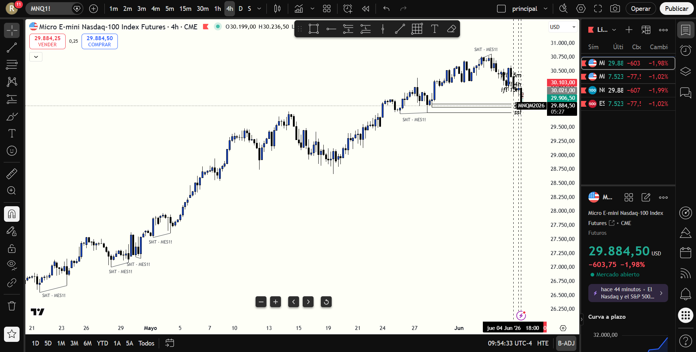

# 📅 BITÁCORA DE TRADING — 05 de Junio de 2026
**Pre-Trade Link:** [[2026-06-05_pre_trade_MNQ]]

## 📊 RESUMEN GENERAL DE LA SESIÓN
- **Resultado Neto:** `+650.00 USD`
- **Trades Realizados:** `1`
- **Resultado:** `WIN`

---

## 🖼️ CAPTURA DE PANTALLA

---

## 🔍 ANÁLISIS ESTRUCTURAL DE TEMPORALIDADES (TOP-DOWN)
### 1. Temporalidades Mayores (HTF: 4h / 1h)
- **Bias:** Bearish 🔴 (En MNQ la estructura de 1H, 30m y 15m se mantuvo bajista, mostrando debilidad relativa notable frente a MES).
- **Narrativa:** Tras la publicación de las Nóminas No Agrícolas (NFP) a las 08:30 AM, el precio se expandió con fuerza hacia el norte, mitigando profundamente el **FVG de 5m (Caja Gris)** dibujado por el usuario, antes de reanudar el flujo de órdenes bajista institucional del HTF.

### 2. Temporalidades Intermedias (30m / 15m)
- **Zonas clave (POIs):** La zona gris de 5m en MNQ (`30078.15 - 30116.25`) actuó como resistencia Premium clave.

### 3. Temporalidad de Ejecución (5m / 2m / 1m)
- **Gatillo / Desplazamiento:** Al mitigar la Caja Gris de 5m, el precio cayó rápidamente e invirtió un FVG alcista de 2m, transformándolo en un **2m iFVG** bajista. El retesteo de este iFVG en `30021.00` fue el gatillo perfecto para la entrada en corto.

---

## 📈 REPORTE DETALLADO DE LOS TRADES

### 🟢 TRADE #1: Short en MNQ
- **Entrada:** `30021.00`
- **Exit:** `29906.00`
- **SL:** `30053.80` (Riesgo: 32.8 puntos / 131.2 ticks)
- **MAE:** `104.0 ticks` (26 puntos de excursión adversa hasta `30047.00`)
- **MFE:** `460.0 ticks` (115 puntos de recorrido a favor hasta TP)
- **Resultado:** `WIN (+650.00 USD)`
- **Relación R:R:** **3.51:1**
- **Notas:** Entrada tras confirmación de la inversión del iFVG de 2m post-NFP. El trade experimentó un drawdown menor que se mantuvo plenamente protegido por el SL técnico de 32.8 puntos por encima del FVG de 1m. La salida en `29906.00` fue quirúrgica, colocada justo al inicio del BPR de 4H (`29831.00 - 29902.75`) y el bloque de demanda de 4H.

---

## 🧠 LECCIONES DE LA SESIÓN
1. **La paciencia en la noticia paga:** Esperar la mecha inicial de las 08:30 AM y respetar la regla del filtro de 5 minutos de [configuracion.md](file:///C:/Users/rsama/Documents/proyecto-geminicli/trading-journal/configuracion.md) salvaguardó la cuenta del spread inicial. La entrada post-noticia fue limpia y con bajísima fricción.
2. **Confluencia de temporalidades:** A diferencia de la sesión anterior, la mitigación del FVG de 5m fue profunda y se esperó la confirmación de la estructura del gatillo en 2m. No se persiguió la caída, se entró en el retroceso al iFVG.
3. **Imanes de Liquidez (BPR):** Salir en `29906.00` demostró la efectividad del Balanced Price Range de 4H como el DOL estructural principal de la sesión. No se forzó un ratio innecesario por debajo de la demanda de 4H, asegurando un Win excelente de 3.51 R:R.
