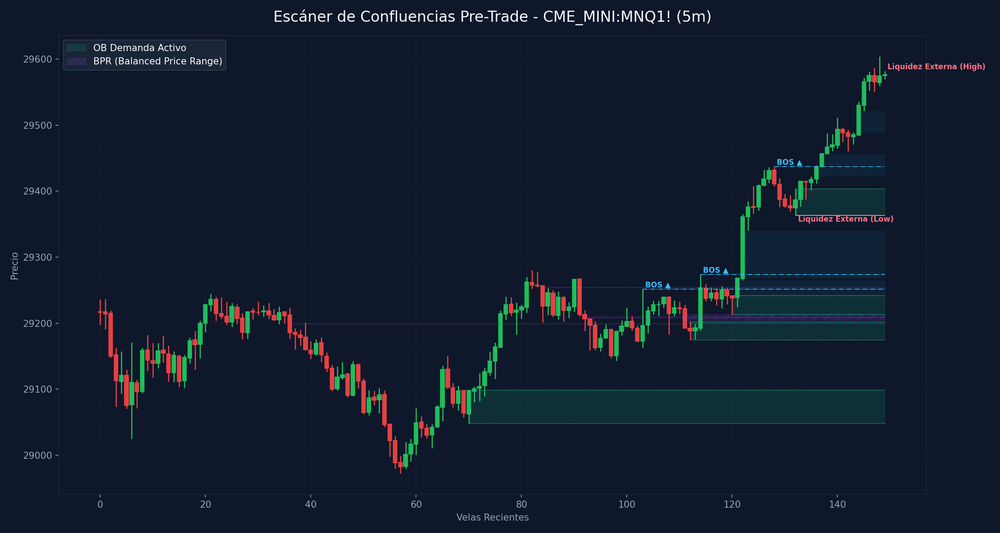

# 🛠️ Reporte Pre-Trade: Mapa de Confluencias (SMC & ICT)
        
Este reporte ha sido generado según los lineamientos de tu **Manual Operativo de Trading**. Analiza las confluencias de temporalidad menor para preparar tu Killzone y delinear tus puntos de interés antes de operar.

---

## 📅 Información de la Sesión
* **Fecha:** `2026-06-08`
* **Activo:** `CME_MINI:MNQ1!`
* **Temporalidad:** `5m` (LTF / Gatillo)
* **Precio Actual:** `29576.5`
* **Vinculación Temporal:** 
  * 🔗 [Ver Autopsia y Bitácora Post-Trade de esta Sesión](2026-06-08_session.md) (Se generará al finalizar tu sesión)

---

## 🛡️ Alerta del Guardia de Riesgo (IA Risk Mentor)

> [!IMPORTANT]
> **Estadísticas de Bitácora:** Sesiones: `7` | PnL Acumulado: `$996.00 USD` | Win Rate: `42.9%`
> 
> **🚨 TUS ERRORES PSICOLÓGICOS MÁS RECURRENTES A EVITAR HOY:**
> * **Ignorar Resistencia:** presente en el `71.4%` de las sesiones previas.
> * **FOMO:** presente en el `42.9%` de las sesiones previas.
>
> **📝 LECCIONES CLAVE A RECORDAR:**
> * 1. La Disciplina ante el Bias Paga Rentabilidad: Alinearse estrictamente con el HTF Bias (Bullish) en zona de descuento macro y descartar los cortos contra-tendencia es la base de los trades de alta probabilidad.
> * La Espera del Retesteo Reduce el Riesgo: No entrar persiguiendo velas de expansión alcista sino esperar con paciencia el pullback al FVG mitigador es la diferencia entre ser liquidado o lograr una entrada limpia con excelente R:R.
> * El Plan Vence a la Intuición: Ignorar el impulso de tomar shorts discrecionales (incluso cuando otros mentores o el ruido de micro-temporalidades sugerían caídas) y aferrarse a las reglas del manual operativo condujo a una sesión sumamente rentable.

---

## 🧠 Predicción de Machine Learning (SMC Setup Classifier)
El clasificador de Inteligencia Artificial analizó la confluencia de este escenario de pre-sesión con tus datos históricos de trade:

```text
=== PREDICCIÓN DE PROBABILIDAD DE ÉXITO ===

==================================================
SETUP EVALUADO:
 - Instrumento: NQ | Dirección: Long | Sesión: NY AM KZ
 - Confluencias: in kill zone (london / ny am / pm), at htf pd array (ob / fvg / breaker), fair value gap (fvg) on entry tf, order block (ob) alignment, htf market structure bias confirmed
--------------------------------------------------
PROBABILIDAD DE WIN RATE ESTIMADA: 71.4%
🚀 SETUP ALTA PROBABILIDAD (A+): Recomendado operar con riesgo estándar (1.0%).
==================================================
```

---

## 🎨 Marcaciones Manuales en tu Gráfico (TradingView)
Esta sección extrae automáticamente tus rectángulos (cajas de zonas) y líneas dibujadas a mano en TradingView y comprueba su confluencia con las zonas de liquidez y estructuras de Smart Money Concepts:

  * **Caja Gris con etiqueta 'd'** en rango `30422.73 - 30477.75` | Estado: 🟡 Fuera del precio | Sin confluencia SMC directa
  * **Caja Gris con etiqueta '1h'** en rango `29940.92 - 30191.00` | Estado: 🟡 Fuera del precio | Confluencias: **FVG 4H** (29660.2 - 30118.5), **OB 1H** (30151.0 - 30260.0), **OB 30m** (30151.0 - 30260.0)
  * **Caja Gris con etiqueta '1h'** en rango `29273.75 - 29360.37` | Estado: 🟡 Fuera del precio | Confluencias: **FVG 4H** (29280.5 - 29363.0), **FVG 1H** (29273.8 - 29363.0)
  * **Caja Gris con etiqueta '30m'** en rango `29437.50 - 29455.81` | Estado: 🟡 Fuera del precio | Confluencias: **FVG 1H** (29437.5 - 29483.8), **FVG 30m** (29437.5 - 29456.0)
  * **Caja Gris con etiqueta '15m'** en rango `29416.50 - 29449.04` | Estado: 🟡 Fuera del precio | Confluencias: **FVG 1H** (29437.5 - 29483.8), **FVG 30m** (29437.5 - 29456.0)
  * **Caja Gris con etiqueta '15m'** en rango `29256.00 - 29339.38` | Estado: 🟡 Fuera del precio | Confluencias: **FVG 4H** (29280.5 - 29363.0), **FVG 1H** (29273.8 - 29363.0)
  * **Línea Manual con etiqueta 'ssl'** en nivel `28663.00` | Estado: Fuera de rango
  * **Línea Manual con etiqueta 'bsl'** en nivel `30807.75` | Estado: Fuera de rango | Ubicación: dentro de **OB 4H** (30495.5 - 30807.8)
  * **Línea Manual con etiqueta 'ifl 4h'** en nivel `30260.00` | Estado: Fuera de rango | Ubicación: dentro de **OB 1H** (30151.0 - 30260.0), dentro de **OB 30m** (30151.0 - 30260.0)
  * **Línea Manual con etiqueta 'ifl 1h'** en nivel `30603.25` | Estado: Fuera de rango | Ubicación: dentro de **OB 4H** (30495.5 - 30807.8)
  * **Línea Manual con etiqueta 'ifl 1h - ll'** en nivel `29143.00` | Estado: Fuera de rango | Ubicación: dentro de **OB 30m** (29143.0 - 29223.5), dentro de **OB 15m** (29143.0 - 29198.2)
  * **Línea Manual con etiqueta 'ssl'** en nivel `28778.50` | Estado: Fuera de rango
  * **Línea Manual con etiqueta 'al'** en nivel `28972.50` | Estado: Fuera de rango | Ubicación: dentro de **OB 1H** (28972.5 - 29142.2), dentro de **OB 15m** (28972.5 - 29024.5)
  * **Línea Manual con etiqueta 'ifl 15m'** en nivel `29363.00` | Estado: Fuera de rango | Ubicación: dentro de **FVG 4H** (29280.5 - 29363.0), dentro de **FVG 1H** (29273.8 - 29363.0), dentro de **OB 5m** (29363.0 - 29403.5), dentro de **OB 4m** (29363.0 - 29403.5), dentro de **OB 3m** (29363.0 - 29403.5), dentro de **OB 2m** (29363.0 - 29403.5), dentro de **OB 1m** (29363.0 - 29403.5)
  * **Línea Manual con etiqueta 'ifl 5m'** en nivel `29551.00` | Estado: Fuera de rango | Ubicación: dentro de **FVG 15m** (29496.0 - 29568.2), dentro de **FVG 5m** (29535.8 - 29552.5), dentro de **FVG 4m** (29544.8 - 29556.8), dentro de **FVG 3m** (29535.8 - 29552.5), dentro de **FVG 2m** (29544.8 - 29552.5)

---

## ⏳ Análisis Estructural Multi-Temporalidad Completo (9 Timeframes)
Escaneo automático y en segundo plano de estructura de mercado y zonas institucionales activas en todos los marcos de tiempo analizados (de mayor a menor):

| Temporalidad | Sesgo Estructural | Rango (Premium/Discount) | Últimos OBs Activos | Últimos FVGs Activos |
| :--- | :--- | :--- | :--- | :--- |
| **4H** | Neutral | Premium (Ventas) 🔴 | 🔴 Supply (30495.5-30807.8) | 🔴 Bearish (29660.2-30118.5), 🟢 Bullish (29280.5-29363.0) |
| **1H** | Bullish 🟢 | Premium (Ventas) 🔴 | 🔴 Supply (30151.0-30260.0), 🟢 Demand (28972.5-29142.2) | 🟢 Bullish (29273.8-29363.0), 🟢 Bullish (29437.5-29483.8) |
| **30m** | Bearish 🔴 | Discount (Compras) 🟢 | 🔴 Supply (30151.0-30260.0), 🟢 Demand (29143.0-29223.5) | 🟢 Bullish (29437.5-29456.0), 🟢 Bullish (29458.0-29483.8) |
| **15m** | Bullish 🟢 | Premium (Ventas) 🔴 | 🟢 Demand (28972.5-29024.5), 🟢 Demand (29143.0-29198.2) | 🟢 Bullish (29458.0-29460.0), 🟢 Bullish (29496.0-29568.2) |
| **5m** | Bullish 🟢 | Premium (Ventas) 🔴 | 🟢 Demand (29213.5-29242.2), 🟢 Demand (29363.0-29403.5) | 🟢 Bullish (29489.2-29521.2), 🟢 Bullish (29535.8-29552.5) |
| **4m** | Bullish 🟢 | Premium (Ventas) 🔴 | 🟢 Demand (29213.5-29242.2), 🟢 Demand (29363.0-29403.5) | 🟢 Bullish (29489.2-29521.2), 🟢 Bullish (29544.8-29556.8) |
| **3m** | Bullish 🟢 | Premium (Ventas) 🔴 | 🟢 Demand (29363.0-29403.5), 🟢 Demand (29460.0-29475.2) | 🟢 Bullish (29489.2-29513.2), 🟢 Bullish (29535.8-29552.5) |
| **2m** | Bullish 🟢 | Premium (Ventas) 🔴 | 🟢 Demand (29363.0-29403.5), 🟢 Demand (29460.0-29475.2) | 🟢 Bullish (29535.2-29535.8), 🟢 Bullish (29544.8-29552.5) |
| **1m** | Bullish 🟢 | Premium (Ventas) 🔴 | 🟢 Demand (29363.0-29403.5), 🟢 Demand (29460.0-29474.5) | 🟢 Bullish (29489.2-29504.0), 🟢 Bullish (29565.5-29567.0) |

---

## 📊 Mapa de Gráfico de Confluencias
Este gráfico mapea de forma precisa la liquidez externa, los bloques de orden activos, los vacíos de liquidez y los rangos de precio balanceados (BPR):



---

## 🔍 Análisis Estructural Top-Down (Multi-Temporalidad)
Análisis de temporalidades HTF de Nasdaq en el fondo sin alterar tu TradingView Desktop:

* **1H HTF Bias:** `Bullish 🟢` | Mapeado según el último BOS estructural en 1 hora.
* **1H Zonas Clave:**
  * OB de 1H Supply: Rango `30151.00 - 30260.00`
  * OB de 1H Demand: Rango `28972.50 - 29142.25`
  * FVG de 1H Bullish: Rango `29273.75 - 29363.00`
  * FVG de 1H Bullish: Rango `29437.50 - 29483.75`

* **15m POIs de Confluencia:**
  * OB de 15m Demand: Rango `28972.50 - 29024.50` | Ver [[Order Block (Bullish)]] o [[Order Block (Bearish)]]
  * OB de 15m Demand: Rango `29143.00 - 29198.25` | Ver [[Order Block (Bullish)]] o [[Order Block (Bearish)]]
  * FVG de 15m Bullish: Rango `29458.00 - 29460.00` | Ver [[Fair Value Gap]]
  * FVG de 15m Bullish: Rango `29496.00 - 29568.25` | Ver [[Fair Value Gap]]

---

## ⚡ Correlación Inter-Mercado (SMT Divergence)
* **Estado SMT:** `S&P 500 (MES) y Nasdaq (MNQ) alineados de forma regular en el Open (Sin divergencias activas). Ver [[SMT Divergence]]`

---

## 🧲 Puntos de Interés (POI) y Liquidez LTF (5m)

### 🌐 1. Liquidez Externa (HTF / Session Pivots)
Niveles clave para buscar barridas de liquidez (*sweeps*) en la apertura de sesión o Killzone:
* **Liquidez Externa Superior (Swing High):** `29581.75` (Vela #149) | Ver [[External Liquidity]] y [[Swing High]]
* **Liquidez Externa Inferior (Swing Low):** `29363.0` (Vela #132) | Ver [[External Liquidity]] y [[Swing Low]]

* **Pools de Liquidez Interna Activos (Unswept):**
  * *No se detectan pools de liquidez interna inmitigados en el rango de precios actual. Ver [[Internal Liquidity]]*

### 🟢 2. Bloques de Orden de Demanda (Soportes / Compras)
Zonas institucionales activas de alta concentración de compras limitadas. Ver [[Order Block (Bullish)]].

| Tipo | Rango de Precio | Volumen | Estado |
| :--- | :--- | :--- | :--- |
| **Demand OB** | `29048.5 - 29098.5` | `16829.0` | **Inmitigado (Activo)** 🔥 |
| **Demand OB** | `29174.75 - 29201.75` | `11981.0` | **Inmitigado (Activo)** 🔥 |
| **Demand OB** | `29213.5 - 29242.25` | `22351.0` | **Inmitigado (Activo)** 🔥 |
| **Demand OB** | `29363.0 - 29403.5` | `15954.0` | **Inmitigado (Activo)** 🔥 |

### 🔴 3. Bloques de Orden de Oferta (Resistencias / Ventas)
Zonas institucionales activas de alta concentración de ventas limitadas. Ver [[Order Block (Bearish)]].

| Tipo | Rango de Precio | Volumen | Estado |
| :--- | :--- | :--- | :--- |

---

## 🌀 4. Anatomía de Fair Value Gaps (FVG) e Inversiones
Análisis detallado de imbalances de precios y su **probabilidad de inversión (iFVG)** según la secuencia de sus 3 velas. Ver [[Fair Value Gap]] e [[IFVG]].

| Dirección | Rango de FVG | Perfil de Velas | Probabilidad de Inversión / Comportamiento |
| :--- | :--- | :--- | :--- |
| 🟢 Bullish FVG | `29242.25 - 29265.0` | `R-R-G` (Vela #121) | Moderado (Extra Confirmación) 🟡 |
| 🟢 Bullish FVG | `29268.5 - 29340.25` | `R-G-G` (Vela #122) | Moderado (Extra Confirmación) 🟡 |
| 🟢 Bullish FVG | `29422.75 - 29436.5` | `R-G-G` (Vela #136) | Moderado (Extra Confirmación) 🟡 |
| 🟢 Bullish FVG | `29439.5 - 29456.0` | `G-G-G` (Vela #137) | Fuerte Desplazamiento Alcista (Gran probabilidad de ser Respetado) 🟢 |
| 🟢 Bullish FVG | `29489.25 - 29521.25` | `R-G-G` (Vela #144) | Moderado (Extra Confirmación) 🟡 |

---

## 🟣 5. Balanced Price Ranges (BPR) Detectados
Solapamientos de FVG alcistas y bajistas en el mismo nivel de precios. Actúan como soportes/resistencias magnéticos de altísima precisión. Ver [[Balanced Price Range]].
* **BPR Detectado:** Rango `29199.25 - 29200.00` | Solapamiento de FVG Alcista (Vela #114) y Bajista (Vela #36)
* **BPR Detectado:** Rango `29207.50 - 29210.50` | Solapamiento de FVG Alcista (Vela #114) y Bajista (Vela #92)
* **BPR Detectado:** Rango `29201.75 - 29214.00` | Solapamiento de FVG Alcista (Vela #114) y Bajista (Vela #111)
* **BPR Detectado:** Rango `29253.75 - 29254.75` | Solapamiento de FVG Alcista (Vela #121) y Bajista (Vela #84)

---

## 🔄 6. Estructura de Mercado Reciente (BOS / CHoCH)
Rupturas de estructura registradas en el gráfico. Ver [[Market Structure]], [[Break of Structure]] y [[Change of Character]]:
* **BOS (Break of Structure) Alcista 🟢** en nivel `29251.75` | Confirmado en la vela #103
* **BOS (Break of Structure) Alcista 🟢** en nivel `29273.75` | Confirmado en la vela #114
* **BOS (Break of Structure) Alcista 🟢** en nivel `29437.5` | Confirmado en la vela #128

---

## 💡 Protocolo Operativo Pre-Trade (Tu Plan de Sesión)

> [!IMPORTANT]
> **Checklist antes de apretar el gatillo (LTF 1m - 5m):**
> 1. **Fase 1 (Sweep):** Espera a que el precio barra una de las zonas de **Liquidez Externa** (`29581.75` / `29363.0`) o mitigue un POI HTF.
> 2. **Fase 2 (iFVG Trigger):** Busca una reacción post-sweep. El cuerpo de la vela debe cerrar y romper un FVG contrario, prioritariamente con perfil **Easy to Invert (R-G-R o G-R-G)**, convirtiéndolo en un **iFVG**.
> 3. **Gestión de Riesgo:** Si opera en All-Time Highs, gestión estricta con relación de **1:1 R:R**. En días de noticias, no ingresar a operaciones dentro de los **5 minutos anteriores** a la publicación.
