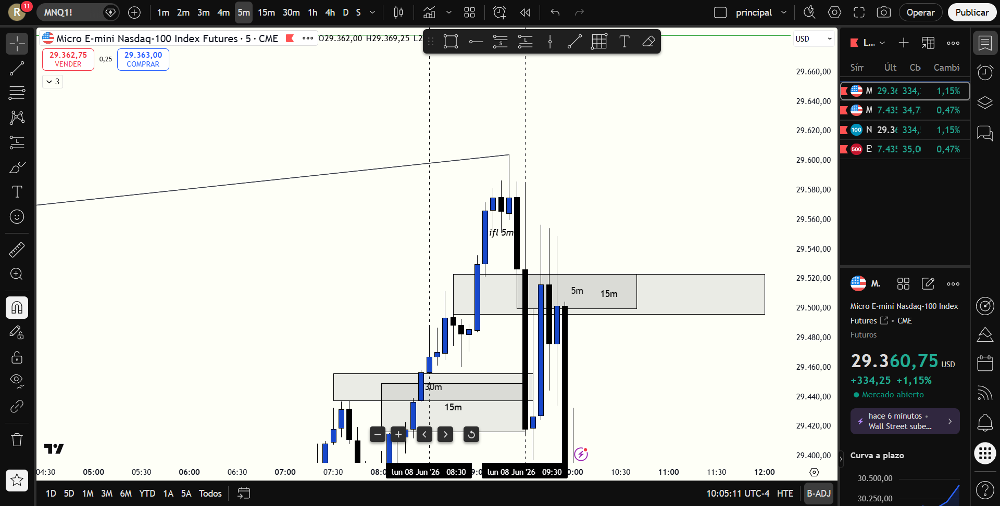

# 📅 BITÁCORA DE TRADING — 08 de Junio de 2026
**Pre-Trade Link:** [[2026-06-08_pre_trade_MNQ]]

## 📊 RESUMEN GENERAL DE LA SESIÓN
- **Resultado Neto:** `+$800.00 USD`
- **Trades Realizados:** `1`
- **Resultado:** `WIN`
- **Contexto de Cuenta Fondeada (Eval):** 
  * Balance Actual: `$51,219.00 USD` (al 08/06/2026)
  * Objetivo de Beneficio: `$53,000.00 USD`
  * Distancia al Objetivo: `+$1,781.00 USD`
  * Días Hábiles Restantes: `8 días`

---

## 🖼️ CAPTURA DE PANTALLA

---

## 🔍 ANÁLISIS ESTRUCTURAL DE TEMPORALIDADES (TOP-DOWN)
### 1. Temporalidades Mayores (HTF: 4h / 1h)
- **Bias MES:** Bearish 🔴 | Estructura de 4H y 1H bajista. El precio cotizaba en descuento y rebotó hacia premium barriendo y mitigando ineficiencias de corto plazo.
- **Bias MNQ:** Bullish 🟢 (1H) / Neutral (4H) | Nasdaq mostró una notable fuerza relativa en comparación con el S&P 500.
- **Narrativa:** MES, al ser el índice más débil del día, ofreció el escenario ideal para buscar ventas (shorts) una vez que el precio alcanzó la zona premium. NQ era el activo fuerte y debía evitarse para buscar cortos.

### 2. Temporalidades Intermedias (30m / 15m)
- **Zonas clave (POIs):** MES mitigó el OB de oferta en 30m / 1H en premium y empezó a rechazar. MNQ ingresó a su FVG alcista de 30m (`29,458.00 - 29,483.80`) e invalidó su FVG alcista de 15m (`29,496.00 - 29,568.25`), confirmando la presión bajista del mercado.

### 3. Temporalidad de Ejecución (1m)
- **Gatillo / Desplazamiento:** En MES, tras el rechazo del OB en Premium, la estructura local de 1m se invalidó a la baja al romper el soporte en `7,450.00`.

---

## 📈 REPORTE DETALLADO DE LOS TRADES

### 🟢 TRADE #1: Short en MES
- **Entrada:** `7,450.00` (10:03 AM NYC Time / 09:03 AM Ecuador Time)
- **Exit:** `7,430.00`
- **SL:** `7,461.50` (Riesgo: 11.5 puntos / 46 ticks)
- **MAE:** `27.0 ticks` (Excursión adversa máxima de 6.75 puntos hasta `7,456.75` en la vela de 09:55 AM)
- **MFE:** `80.0 ticks` (Excursión favorable de 20 puntos hasta `7,430.00`)
- **Resultado:** `WIN (+$800.00 USD)`
- **Relación R:R:** **1.74:1**
- **Notas:** Entrada tras la invalidación de la estructura de 1m de soporte en `7,450.00`. La entrada se gatilló al romperse el flujo alcista. La salida fue quirúrgica en `7,430.00` justo en la confluencia de soporte del FVG alcista de 1m/2m.

---

## 🧠 LECCIONES DE LA SESIÓN
1. **Alineación con la debilidad (MES para shorts):** A pesar de que el gráfico analizado premarket fue MNQ, identificamos que **MES era el activo débil (Bearish 1H/4H)** y NQ era el fuerte. Buscar cortos exclusivamente en MES fue clave para evitar ser atrapados en rebotes de Nasdaq, cumpliendo con la regla de alineación del manual.
2. **Gatillo en Involución de Flujo (iFVG / MSS):** Esperar a que la estructura de 1m de soporte fallara y se invalidara en `7,450.00` dio una entrada de altísima precisión, limitando la exposición temporal y la excursión adversa.
3. **Toma de Beneficios Técnica:** No codiciar más allá del soporte local; salir en `7,430.00` justo en el FVG alcista de 1m/2m aseguró un trade exitoso y protegió las ganancias del rebote técnico posterior.
4. **Gestión de Riesgo y Psicológica:** Al operar con 8 contratos de MES y un stop loss técnico de 11.5 puntos, el riesgo total se mantuvo en `$380.00 USD` (**0.75%** de la cuenta), respetando plenamente la regla del 1%. No hubo FOMO ni sobreloteo, y el PnL neto de la sesión (`+$800.00 USD`) acerca la cuenta EVAL a solo `$1,781.00 USD` del objetivo.
