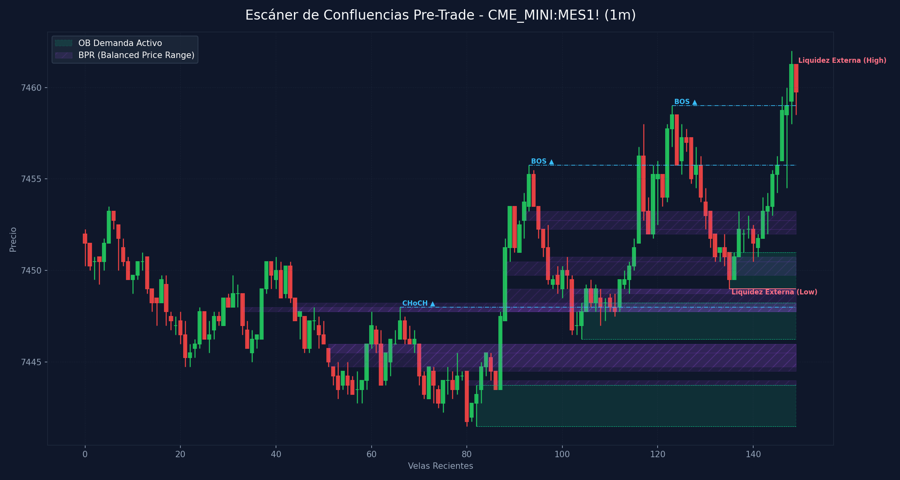

# 🛠️ Reporte Pre-Trade: Mapa de Confluencias (SMC & ICT)
        
Este reporte ha sido generado según los lineamientos de tu **Manual Operativo de Trading**. Analiza las confluencias de temporalidad menor para preparar tu Killzone y delinear tus puntos de interés antes de operar.

---

## 📅 Información de la Sesión
* **Fecha:** `2026-06-09`
* **Activo:** `CME_MINI:MES1!`
* **Temporalidad:** `1m` (LTF / Gatillo)
* **Precio Actual:** `7459.75`
* **Vinculación Temporal:** 
  * 🔗 [Ver Autopsia y Bitácora Post-Trade de esta Sesión](2026-06-09_session.md) (Se generará al finalizar tu sesión)

---

## 🛡️ Alerta del Guardia de Riesgo (IA Risk Mentor)

> [!IMPORTANT]
> **Estadísticas de Bitácora:** Sesiones: `8` | PnL Acumulado: `$1796.00 USD` | Win Rate: `50.0%`
> 
> **🚨 TUS ERRORES PSICOLÓGICOS MÁS RECURRENTES A EVITAR HOY:**
> * **Ignorar Resistencia:** presente en el `62.5%` de las sesiones previas.
> * **FOMO:** presente en el `50.0%` de las sesiones previas.
>
> **📝 LECCIONES CLAVE A RECORDAR:**
> * 1. La Disciplina ante el Bias Paga Rentabilidad: Alinearse estrictamente con el HTF Bias (Bullish) en zona de descuento macro y descartar los cortos contra-tendencia es la base de los trades de alta probabilidad.
> * La Espera del Retesteo Reduce el Riesgo: No entrar persiguiendo velas de expansión alcista sino esperar con paciencia el pullback al FVG mitigador es la diferencia entre ser liquidado o lograr una entrada limpia con excelente R:R.
> * El Plan Vence a la Intuición: Ignorar el impulso de tomar shorts discrecionales (incluso cuando otros mentores o el ruido de micro-temporalidades sugerían caídas) y aferrarse a las reglas del manual operativo condujo a una sesión sumamente rentable.

---

## 🧠 Predicción de Machine Learning (SMC Setup Classifier)
El clasificador de Inteligencia Artificial analizó la confluencia de este escenario de pre-sesión con tus datos históricos de trade:

```text
=== PREDICCIÓN DE PROBABILIDAD DE ÉXITO ===

==================================================
SETUP EVALUADO:
 - Instrumento: ES | Dirección: Short | Sesión: NY AM KZ
 - Confluencias: in kill zone (london / ny am / pm), at htf pd array (ob / fvg / breaker), order block (ob) alignment, htf market structure bias confirmed
--------------------------------------------------
PROBABILIDAD DE WIN RATE ESTIMADA: 61.1%
⚠️ SETUP MODERADO: Reducir riesgo a la mitad (0.5%) o esperar más confirmaciones.
==================================================
```

---

## 🎨 Marcaciones Manuales en tu Gráfico (TradingView)
Esta sección extrae automáticamente tus rectángulos (cajas de zonas) y líneas dibujadas a mano en TradingView y comprueba su confluencia con las zonas de liquidez y estructuras de Smart Money Concepts:

  * **Caja Gris con etiqueta 'D'** en rango `7477.79 - 7524.50` | Estado: 🟡 Fuera del precio | Confluencias: **FVG 4H** (7490.5 - 7554.2), **FVG 1H** (7477.8 - 7486.2)
  * **Caja Gris con etiqueta '1h'** en rango `7412.00 - 7427.17` | Estado: 🟡 Fuera del precio | Confluencias: **FVG 1H** (7412.0 - 7415.5), **FVG 5m** (7426.0 - 7427.8)
  * **Caja Gris con etiqueta '1h'** en rango `7478.07 - 7505.75` | Estado: 🟡 Fuera del precio | Confluencias: **FVG 4H** (7490.5 - 7554.2), **FVG 1H** (7477.8 - 7486.2)
  * **Caja Gris con etiqueta '1h'** en rango `7533.71 - 7559.25` | Estado: 🟡 Fuera del precio | Confluencias: **FVG 4H** (7490.5 - 7554.2)
  * **Caja Gris con etiqueta '15m'** en rango `7445.50 - 7446.35` | Estado: 🟡 Fuera del precio | Confluencias: **FVG 15m** (7445.5 - 7446.2), **OB 3m** (7446.2 - 7449.8), **OB 2m** (7446.2 - 7448.2), **OB 1m** (7446.2 - 7448.2)
  * **Caja Gris con etiqueta '5m'** en rango `7449.25 - 7451.90` | Estado: 🟡 Fuera del precio | Confluencias: **OB 3m** (7446.2 - 7449.8)
  * **Línea Manual con etiqueta 'ifl 4h'** en nivel `7476.75` | Estado: 🎯 PRECIO CERCA
  * **Línea Manual con etiqueta 'ifl 4h'** en nivel `7579.00` | Estado: Fuera de rango | Ubicación: dentro de **OB 1H** (7559.8 - 7579.0), dentro de **OB 30m** (7559.8 - 7579.0)
  * **Línea Manual con etiqueta 'ifl 4h'** en nivel `7611.50` | Estado: Fuera de rango | Ubicación: dentro de **OB 4H** (7587.0 - 7632.8), dentro de **OB 4H** (7579.5 - 7611.5)
  * **Línea Manual con etiqueta 'al'** en nivel `7390.00` | Estado: Fuera de rango | Ubicación: dentro de **OB 30m** (7384.0 - 7409.5)
  * **Línea Manual con etiqueta 'll'** en nivel `7428.00` | Estado: Fuera de rango | Ubicación: dentro de **OB 15m** (7428.0 - 7445.2), dentro de **OB 5m** (7428.0 - 7437.0), dentro de **OB 4m** (7428.0 - 7437.0)
  * **Línea Manual con etiqueta 'ifl 30m'** en nivel `7434.25` | Estado: Fuera de rango | Ubicación: dentro de **OB 15m** (7428.0 - 7445.2), dentro de **OB 5m** (7428.0 - 7437.0), dentro de **OB 4m** (7428.0 - 7437.0)
  * **Línea Manual con etiqueta 'ifl 30m'** en nivel `7384.00` | Estado: Fuera de rango | Ubicación: dentro de **OB 30m** (7384.0 - 7409.5)
  * **Línea Manual con etiqueta 'ssl'** en nivel `7355.50` | Estado: Fuera de rango
  * **Línea Manual con etiqueta 'ifl 15m'** en nivel `7466.00` | Estado: 🎯 PRECIO CERCA
  * **Línea Manual con etiqueta 'ifl 15m'** en nivel `7415.50` | Estado: Fuera de rango | Ubicación: dentro de **FVG 1H** (7412.0 - 7415.5)
  * **Línea Manual con etiqueta 'ifl 5m'** en nivel `7446.25` | Estado: 🎯 PRECIO CERCA | Ubicación: dentro de **FVG 15m** (7445.5 - 7446.2), dentro de **OB 3m** (7446.2 - 7449.8), dentro de **OB 2m** (7446.2 - 7448.2), dentro de **OB 1m** (7446.2 - 7448.2)

---

## ⏳ Análisis Estructural Multi-Temporalidad Completo (9 Timeframes)
Escaneo automático y en segundo plano de estructura de mercado y zonas institucionales activas en todos los marcos de tiempo analizados (de mayor a menor):

| Temporalidad | Sesgo Estructural | Rango (Premium/Discount) | Últimos OBs Activos | Últimos FVGs Activos |
| :--- | :--- | :--- | :--- | :--- |
| **4H** | Bearish 🔴 | Discount (Compras) 🟢 | 🔴 Supply (7587.0-7632.8), 🔴 Supply (7579.5-7611.5) | 🔴 Bearish (7490.5-7554.2) |
| **1H** | Bearish 🔴 | Premium (Ventas) 🔴 | 🔴 Supply (7621.5-7632.0), 🔴 Supply (7559.8-7579.0) | 🔴 Bearish (7477.8-7486.2), 🟢 Bullish (7412.0-7415.5) |
| **30m** | Bullish 🟢 | Premium (Ventas) 🔴 | 🔴 Supply (7559.8-7579.0), 🟢 Demand (7384.0-7409.5) | 🟢 Bullish (7401.2-7412.0), 🟢 Bullish (7448.0-7449.0) |
| **15m** | Bullish 🟢 | Discount (Compras) 🟢 | 🟢 Demand (7428.0-7445.2), 🟢 Demand (7441.5-7445.5) | 🟢 Bullish (7402.2-7412.0), 🟢 Bullish (7445.5-7446.2) |
| **5m** | Bullish 🟢 | Premium (Ventas) 🔴 | 🟢 Demand (7428.0-7437.0), 🟢 Demand (7441.5-7445.5) | 🟢 Bullish (7426.0-7427.8) |
| **4m** | Bullish 🟢 | Premium (Ventas) 🔴 | 🟢 Demand (7428.0-7437.0), 🟢 Demand (7441.5-7445.5) | *Ninguno* |
| **3m** | Bullish 🟢 | Discount (Compras) 🟢 | 🟢 Demand (7441.5-7445.0), 🟢 Demand (7446.2-7449.8) | *Ninguno* |
| **2m** | Bullish 🟢 | Discount (Compras) 🟢 | 🟢 Demand (7441.5-7443.8), 🟢 Demand (7446.2-7448.2) | *Ninguno* |
| **1m** | Bullish 🟢 | Discount (Compras) 🟢 | 🟢 Demand (7441.5-7443.8), 🟢 Demand (7446.2-7448.2) | 🟢 Bullish (7432.8-7434.0) |

---

## 📊 Mapa de Gráfico de Confluencias
Este gráfico mapea de forma precisa la liquidez externa, los bloques de orden activos, los vacíos de liquidez y los rangos de precio balanceados (BPR):



---

## 🔍 Análisis Estructural Top-Down (Multi-Temporalidad)
Análisis de temporalidades HTF de Nasdaq en el fondo sin alterar tu TradingView Desktop:

* **1H HTF Bias:** `Bearish 🔴` | Mapeado según el último BOS estructural en 1 hora.
* **1H Zonas Clave:**
  * OB de 1H Supply: Rango `7621.50 - 7632.00`
  * OB de 1H Supply: Rango `7559.75 - 7579.00`
  * FVG de 1H Bearish: Rango `7477.75 - 7486.25`
  * FVG de 1H Bullish: Rango `7412.00 - 7415.50`

* **15m POIs de Confluencia:**
  * OB de 15m Demand: Rango `7428.00 - 7445.25` | Ver [[Order Block (Bullish)]] o [[Order Block (Bearish)]]
  * OB de 15m Demand: Rango `7441.50 - 7445.50` | Ver [[Order Block (Bullish)]] o [[Order Block (Bearish)]]
  * FVG de 15m Bullish: Rango `7402.25 - 7412.00` | Ver [[Fair Value Gap]]
  * FVG de 15m Bullish: Rango `7445.50 - 7446.25` | Ver [[Fair Value Gap]]

---

## ⚡ Correlación Inter-Mercado (SMT Divergence)
* **Estado SMT:** `S&P 500 (MES) y Nasdaq (MNQ) alineados de forma regular en el Open (Sin divergencias activas). Ver [[SMT Divergence]]`

---

## 🧲 Puntos de Interés (POI) y Liquidez LTF (1m)

### 🌐 1. Liquidez Externa (HTF / Session Pivots)
Niveles clave para buscar barridas de liquidez (*sweeps*) en la apertura de sesión o Killzone:
* **Liquidez Externa Superior (Swing High):** `7461.25` (Vela #149) | Ver [[External Liquidity]] y [[Swing High]]
* **Liquidez Externa Inferior (Swing Low):** `7449.0` (Vela #135) | Ver [[External Liquidity]] y [[Swing Low]]

* **Pools de Liquidez Interna Activos (Unswept):**
  * *No se detectan pools de liquidez interna inmitigados en el rango de precios actual. Ver [[Internal Liquidity]]*

### 🟢 2. Bloques de Orden de Demanda (Soportes / Compras)
Zonas institucionales activas de alta concentración de compras limitadas. Ver [[Order Block (Bullish)]].

| Tipo | Rango de Precio | Volumen | Estado |
| :--- | :--- | :--- | :--- |
| **Demand OB** | `7441.5 - 7443.75` | `1983.0` | **Inmitigado (Activo)** 🔥 |
| **Demand OB** | `7446.25 - 7448.25` | `4582.0` | **Inmitigado (Activo)** 🔥 |
| **Demand OB** | `7449.0 - 7451.0` | `15486.0` | **Inmitigado (Activo)** 🔥 |

### 🔴 3. Bloques de Orden de Oferta (Resistencias / Ventas)
Zonas institucionales activas de alta concentración de ventas limitadas. Ver [[Order Block (Bearish)]].

| Tipo | Rango de Precio | Volumen | Estado |
| :--- | :--- | :--- | :--- |

---

## 🌀 4. Anatomía de Fair Value Gaps (FVG) e Inversiones
Análisis detallado de imbalances de precios y su **probabilidad de inversión (iFVG)** según la secuencia de sus 3 velas. Ver [[Fair Value Gap]] e [[IFVG]].

| Dirección | Rango de FVG | Perfil de Velas | Probabilidad de Inversión / Comportamiento |
| :--- | :--- | :--- | :--- |

---

## 🟣 5. Balanced Price Ranges (BPR) Detectados
Solapamientos de FVG alcistas y bajistas en el mismo nivel de precios. Actúan como soportes/resistencias magnéticos de altísima precisión. Ver [[Balanced Price Range]].
* **BPR Detectado:** Rango `7445.50 - 7446.00` | Solapamiento de FVG Alcista (Vela #64) y Bajista (Vela #51)
* **BPR Detectado:** Rango `7443.75 - 7444.00` | Solapamiento de FVG Alcista (Vela #83) y Bajista (Vela #80)
* **BPR Detectado:** Rango `7444.75 - 7446.00` | Solapamiento de FVG Alcista (Vela #87) y Bajista (Vela #51)
* **BPR Detectado:** Rango `7444.50 - 7445.50` | Solapamiento de FVG Alcista (Vela #87) y Bajista (Vela #70)
* **BPR Detectado:** Rango `7447.75 - 7448.00` | Solapamiento de FVG Alcista (Vela #88) y Bajista (Vela #33)
* **BPR Detectado:** Rango `7447.75 - 7448.25` | Solapamiento de FVG Alcista (Vela #88) y Bajista (Vela #44)
* **BPR Detectado:** Rango `7449.75 - 7450.50` | Solapamiento de FVG Alcista (Vela #88) y Bajista (Vela #97)
* **BPR Detectado:** Rango `7447.75 - 7449.00` | Solapamiento de FVG Alcista (Vela #88) y Bajista (Vela #102)
* **BPR Detectado:** Rango `7452.75 - 7453.25` | Solapamiento de FVG Alcista (Vela #92) y Bajista (Vela #95)
* **BPR Detectado:** Rango `7448.75 - 7449.00` | Solapamiento de FVG Alcista (Vela #112) y Bajista (Vela #102)
* **BPR Detectado:** Rango `7450.50 - 7450.75` | Solapamiento de FVG Alcista (Vela #115) y Bajista (Vela #97)
* **BPR Detectado:** Rango `7452.25 - 7452.75` | Solapamiento de FVG Alcista (Vela #116) y Bajista (Vela #95)
* **BPR Detectado:** Rango `7452.00 - 7452.25` | Solapamiento de FVG Alcista (Vela #116) y Bajista (Vela #131)

---

## 🔄 6. Estructura de Mercado Reciente (BOS / CHoCH)
Rupturas de estructura registradas en el gráfico. Ver [[Market Structure]], [[Break of Structure]] y [[Change of Character]]:
* **CHoCH (Change of Character) Alcista 🟢** en nivel `7448.0` | Confirmado en la vela #66
* **BOS (Break of Structure) Alcista 🟢** en nivel `7455.75` | Confirmado en la vela #93
* **BOS (Break of Structure) Alcista 🟢** en nivel `7459.0` | Confirmado en la vela #123

---

## 💡 Protocolo Operativo Pre-Trade (Tu Plan de Sesión)

> [!IMPORTANT]
> **Checklist antes de apretar el gatillo (LTF 1m - 5m):**
> 1. **Fase 1 (Sweep):** Espera a que el precio barra una de las zonas de **Liquidez Externa** (`7461.25` / `7449.0`) o mitigue un POI HTF.
> 2. **Fase 2 (iFVG Trigger):** Busca una reacción post-sweep. El cuerpo de la vela debe cerrar y romper un FVG contrario, prioritariamente con perfil **Easy to Invert (R-G-R o G-R-G)**, convirtiéndolo en un **iFVG**.
> 3. **Gestión de Riesgo:** Si opera en All-Time Highs, gestión estricta con relación de **1:1 R:R**. En días de noticias, no ingresar a operaciones dentro de los **5 minutos anteriores** a la publicación.
