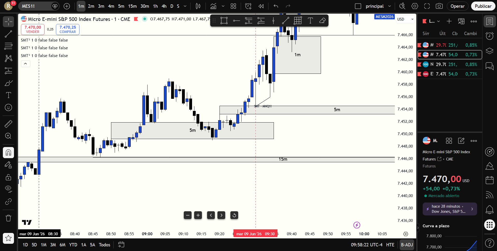

# 📅 BITÁCORA DE TRADING — 09 de Junio de 2026
**Pre-Trade Link:** [[2026-06-09_pre_trade_MES]]

## 📊 RESUMEN GENERAL DE LA SESIÓN
- **Resultado Neto:** `+$628.00 USD`
- **Trades Realizados:** `1`
- **Resultado:** `WIN`
- **Contexto de Cuenta Fondeada (Eval):**
  * Balance Actual: `$51,847.00 USD` (al 09/06/2026)
  * Objetivo de Beneficio: `$53,000.00 USD`
  * Distancia al Objetivo: `+$1,153.00 USD`
  * Días Hábiles Restantes: `7 días`

---

## 🖼️ CAPTURA DE PANTALLA

---

## 🔍 ANÁLISIS ESTRUCTURAL DE TEMPORALIDADES (TOP-DOWN)
### 1. Temporalidades Mayores (HTF: 4h / 1h)
- **Bias MES:** Bearish 🔴 | La estructura de 4H y 1H en ES se mantiene bajista, mitigando la zona inferior de su Daily FVG.
- **Bias MNQ:** Bullish 🟢 / Neutral | Nasdaq muestra una fuerza relativa notable frente a ES, cotizando en la base de su 4H Bearish FVG.
- **Narrativa:** Nasdaq era el activo fuerte y ES el débil. Se aprovechó el bias de fuerza local en NQ para buscar compras (Long) en la apertura tras confirmarse divergencia inter-mercado.

### 2. Temporalidades Intermedias (30m / 15m)
- **Zonas clave (POIs):** MES barrió el mínimo del premercado a `7449.00` mientras que MNQ sostuvo un mínimo más alto en `29,668.00` (SMT Alcista).

### 3. Temporalidad de Ejecución (2m / 1m)
- **Gatillo / Desplazamiento:** Reacción violenta tras el SMT en la apertura. NQ se expandió con fuerza hacia el norte rompiendo la estructura de 2m y confirmando un **2m iFVG en `29,718.00`**.

---

## 📈 REPORTE DETALLADO DE LOS TRADES

### 🟢 TRADE #1: Long en MNQ (Nasdaq Micros)
- **Entrada:** `29,703.00` (9:42 AM NYC Time / 08:42 AM Ecuador Time)
- **Exit:** `29,836.00`
- **SL:** `29,633.00` (Riesgo: 70 puntos / 280 ticks)
- **MAE:** `140 ticks` (Excursión adversa de 35 puntos hasta `29,668.00`)
- **MFE:** `532 ticks` (Excursión favorable de 133 puntos hasta TP)
- **Resultado:** `WIN (+$628.00 USD)`
- **Relación R:R:** **1.9:1**
- **Notas:** Entrada tardía pero muy bien fundamentada tras observar el flujo de órdenes institucional en el retesteo del iFVG de 2m. Se esperó la confirmación de divergencia SMT alcista contra MES en la apertura. El target se colocó de forma quirúrgica en `29,836.00` en la zona premium de ineficiencias de temporalidades mayores.

---

## 🧠 LECCIONES DE LA SESIÓN
1. **Divergencia SMT como Confirmador de Fuerza:** Esperar a que MES barriera su mínimo mientras NQ sostenía un mínimo más alto previno un stop en compras. El SMT fue el disparador definitivo del reverso alcista de la apertura.
2. **Entrada en iFVG con Flujo de Órdenes:** Aunque se perdió el primer toque exacto del 2m iFVG, esperar a ver cómo interactuaba el orderflow y entrar en el retroceso mitigador de `29,703` demostró madurez. No hubo FOMO desordenado, sino entrada confirmada.
3. **Selección del Activo Fuerte:** Al operar Longs, irse por NQ (fuerza relativa alcista) en lugar de ES (debilidad) garantizó un recorrido mucho más veloz y limpio hacia el Take Profit.
