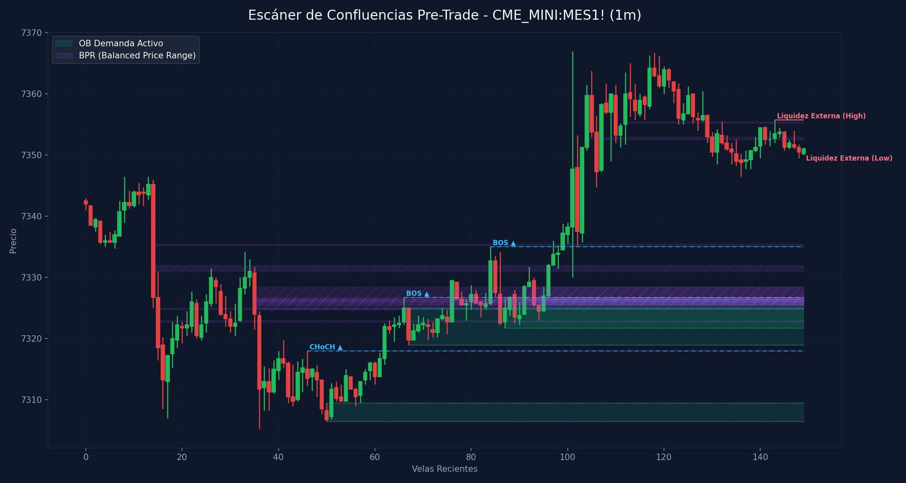

# 🛠️ Reporte Pre-Trade: Mapa de Confluencias (SMC & ICT)
        
Este reporte ha sido generado según los lineamientos de tu **Manual Operativo de Trading**. Analiza las confluencias de temporalidad menor para preparar tu Killzone y delinear tus puntos de interés antes de operar.

---

## 📅 Información de la Sesión
* **Fecha:** `2026-06-10`
* **Activo:** `CME_MINI:MES1!`
* **Temporalidad:** `1m` (LTF / Gatillo)
* **Precio Actual:** `7351.0`
* **Vinculación Temporal:** 
  * 🔗 [Ver Autopsia y Bitácora Post-Trade de esta Sesión](2026-06-10_session.md) (Se generará al finalizar tu sesión)

---

## 🛡️ Alerta del Guardia de Riesgo (IA Risk Mentor)

> [!IMPORTANT]
> **Estadísticas de Bitácora:** Sesiones: `9` | PnL Acumulado: `$2424.00 USD` | Win Rate: `55.6%`
> 
> **🚨 TUS ERRORES PSICOLÓGICOS MÁS RECURRENTES A EVITAR HOY:**
> * **FOMO:** presente en el `55.6%` de las sesiones previas.
> * **Ignorar Resistencia:** presente en el `55.6%` de las sesiones previas.
>
> **📝 LECCIONES CLAVE A RECORDAR:**
> * 1. La Disciplina ante el Bias Paga Rentabilidad: Alinearse estrictamente con el HTF Bias (Bullish) en zona de descuento macro y descartar los cortos contra-tendencia es la base de los trades de alta probabilidad.
> * La Espera del Retesteo Reduce el Riesgo: No entrar persiguiendo velas de expansión alcista sino esperar con paciencia el pullback al FVG mitigador es la diferencia entre ser liquidado o lograr una entrada limpia con excelente R:R.
> * El Plan Vence a la Intuición: Ignorar el impulso de tomar shorts discrecionales (incluso cuando otros mentores o el ruido de micro-temporalidades sugerían caídas) y aferrarse a las reglas del manual operativo condujo a una sesión sumamente rentable.

---

## 🧠 Predicción de Machine Learning (SMC Setup Classifier)
El clasificador de Inteligencia Artificial analizó la confluencia de este escenario de pre-sesión con tus datos históricos de trade:

```text
=== PREDICCIÓN DE PROBABILIDAD DE ÉXITO ===

==================================================
SETUP EVALUADO:
 - Instrumento: ES | Dirección: Short | Sesión: NY AM KZ
 - Confluencias: in kill zone (london / ny am / pm), at htf pd array (ob / fvg / breaker), fair value gap (fvg) on entry tf, order block (ob) alignment, htf market structure bias confirmed
--------------------------------------------------
PROBABILIDAD DE WIN RATE ESTIMADA: 62.8%
⚠️ SETUP MODERADO: Reducir riesgo a la mitad (0.5%) o esperar más confirmaciones.
==================================================
```

---

## 🎨 Marcaciones Manuales en tu Gráfico (TradingView)
Esta sección extrae automáticamente tus rectángulos (cajas de zonas) y líneas dibujadas a mano en TradingView y comprueba su confluencia con las zonas de liquidez y estructuras de Smart Money Concepts:

  * **Caja Gris con etiqueta '4h'** en rango `7399.09 - 7434.25` | Estado: 🟡 Fuera del precio | Confluencias: **OB 4H** (7429.0 - 7476.8), **FVG 1H** (7405.5 - 7449.0), **FVG 15m** (7410.5 - 7415.5)
  * **Caja Gris con etiqueta '1h'** en rango `7533.32 - 7559.25` | Estado: 🟡 Fuera del precio | Confluencias: **FVG 1H** (7533.5 - 7545.8)
  * **Caja Gris con etiqueta '1h'** en rango `7342.73 - 7362.00` | Estado: 🟢 PRECIO DENTRO | Confluencias: **FVG 30m** (7339.0 - 7346.5), **FVG 5m** (7339.0 - 7344.8), **FVG 3m** (7339.0 - 7344.8)
  * **Caja Gris con etiqueta '30m'** en rango `7326.75 - 7330.03` | Estado: 🟡 Fuera del precio | Confluencias: **FVG 30m** (7326.8 - 7330.0), **OB 15m** (7305.2 - 7334.2), **OB 3m** (7305.2 - 7331.8), **OB 2m** (7321.8 - 7327.0)
  * **Caja Gris con etiqueta '15m'** en rango `7339.00 - 7349.79` | Estado: 🟡 Fuera del precio | Confluencias: **FVG 30m** (7339.0 - 7346.5), **FVG 5m** (7339.0 - 7344.8), **FVG 3m** (7339.0 - 7344.8)
  * **Caja Gris con etiqueta '5m'** en rango `7331.75 - 7344.93` | Estado: 🟡 Fuera del precio | Confluencias: **FVG 30m** (7339.0 - 7346.5), **OB 15m** (7305.2 - 7334.2), **FVG 5m** (7339.0 - 7344.8), **FVG 3m** (7339.0 - 7344.8)
  * **Línea Manual con etiqueta 'ifl d'** en nivel `7491.51` | Estado: Fuera de rango
  * **Línea Manual con etiqueta 'ifl 4h'** en nivel `7579.00` | Estado: Fuera de rango | Ubicación: dentro de **OB 1H** (7559.8 - 7579.0)
  * **Línea Manual con etiqueta 'ifl 4h'** en nivel `7611.50` | Estado: Fuera de rango | Ubicación: dentro de **OB 4H** (7579.5 - 7611.5)
  * **Línea Manual con etiqueta 'ssl'** en nivel `7247.00` | Estado: Fuera de rango
  * **Línea Manual con etiqueta 'ssl'** en nivel `7199.25` | Estado: Fuera de rango
  * **Línea Manual con etiqueta 'ah'** en nivel `7388.75` | Estado: Fuera de rango
  * **Línea Manual con etiqueta 'lh'** en nivel `7370.75` | Estado: 🎯 PRECIO CERCA | Ubicación: dentro de **OB 30m** (7366.8 - 7375.8), dentro de **OB 15m** (7366.8 - 7375.8), dentro de **OB 5m** (7366.8 - 7375.8), dentro de **OB 4m** (7368.2 - 7375.8), dentro de **OB 3m** (7364.5 - 7370.8)
  * **Línea Manual con etiqueta 'ifl 30m ll'** en nivel `7305.25` | Estado: Fuera de rango | Ubicación: dentro de **OB 15m** (7305.2 - 7334.2), dentro de **OB 5m** (7305.2 - 7324.5), dentro de **OB 3m** (7305.2 - 7331.8)
  * **Línea Manual con etiqueta 'ifl 30m'** en nivel `7375.75` | Estado: 🎯 PRECIO CERCA | Ubicación: dentro de **OB 30m** (7366.8 - 7375.8), dentro de **OB 15m** (7366.8 - 7375.8), dentro de **OB 5m** (7366.8 - 7375.8), dentro de **OB 4m** (7368.2 - 7375.8)
  * **Línea Manual con etiqueta 'dh'** en nivel `7367.00` | Estado: 🎯 PRECIO CERCA | Ubicación: dentro de **OB 30m** (7366.8 - 7375.8), dentro de **OB 15m** (7366.8 - 7375.8), dentro de **OB 5m** (7366.8 - 7375.8), dentro de **OB 3m** (7364.5 - 7370.8), dentro de **OB 2m** (7366.8 - 7368.2)

---

## ⏳ Análisis Estructural Multi-Temporalidad Completo (9 Timeframes)
Escaneo automático y en segundo plano de estructura de mercado y zonas institucionales activas en todos los marcos de tiempo analizados (de mayor a menor):

| Temporalidad | Sesgo Estructural | Rango (Premium/Discount) | Últimos OBs Activos | Últimos FVGs Activos |
| :--- | :--- | :--- | :--- | :--- |
| **4H** | Bearish 🔴 | Premium (Ventas) 🔴 | 🔴 Supply (7579.5-7611.5), 🔴 Supply (7429.0-7476.8) | *Ninguno* |
| **1H** | Bearish 🔴 | Discount (Compras) 🟢 | 🔴 Supply (7559.8-7579.0), 🔴 Supply (7449.0-7491.0) | 🔴 Bearish (7533.5-7545.8), 🔴 Bearish (7405.5-7449.0) |
| **30m** | Bearish 🔴 | Discount (Compras) 🟢 | 🔴 Supply (7454.5-7491.0), 🔴 Supply (7366.8-7375.8) | 🟢 Bullish (7326.8-7330.0), 🟢 Bullish (7339.0-7346.5) |
| **15m** | Bullish 🟢 | Premium (Ventas) 🔴 | 🔴 Supply (7366.8-7375.8), 🟢 Demand (7305.2-7334.2) | 🔴 Bearish (7410.5-7415.5), 🟢 Bullish (7288.2-7300.5) |
| **5m** | Bullish 🟢 | Discount (Compras) 🟢 | 🔴 Supply (7366.8-7375.8), 🟢 Demand (7305.2-7324.5) | 🟢 Bullish (7316.2-7319.0), 🟢 Bullish (7339.0-7344.8) |
| **4m** | Bullish 🟢 | Discount (Compras) 🟢 | 🔴 Supply (7368.2-7375.8) | *Ninguno* |
| **3m** | Bullish 🟢 | Discount (Compras) 🟢 | 🔴 Supply (7364.5-7370.8), 🟢 Demand (7305.2-7331.8) | 🟢 Bullish (7317.8-7319.0), 🟢 Bullish (7339.0-7344.8) |
| **2m** | Bullish 🟢 | Discount (Compras) 🟢 | 🔴 Supply (7366.8-7368.2), 🟢 Demand (7321.8-7327.0) | *Ninguno* |
| **1m** | Bullish 🟢 | Discount (Compras) 🟢 | 🟢 Demand (7319.0-7325.0), 🟢 Demand (7321.8-7326.5) | 🔴 Bearish (7371.2-7372.2), 🟢 Bullish (7325.5-7326.8) |

---

## 📊 Mapa de Gráfico de Confluencias
Este gráfico mapea de forma precisa la liquidez externa, los bloques de orden activos, los vacíos de liquidez y los rangos de precio balanceados (BPR):



---

## 🔍 Análisis Estructural Top-Down (Multi-Temporalidad)
Análisis de temporalidades HTF de Nasdaq en el fondo sin alterar tu TradingView Desktop:

* **1H HTF Bias:** `Bearish 🔴` | Mapeado según el último BOS estructural en 1 hora.
* **1H Zonas Clave:**
  * OB de 1H Supply: Rango `7559.75 - 7579.00`
  * OB de 1H Supply: Rango `7449.00 - 7491.00`
  * FVG de 1H Bearish: Rango `7533.50 - 7545.75`
  * FVG de 1H Bearish: Rango `7405.50 - 7449.00`

* **15m POIs de Confluencia:**
  * OB de 15m Supply: Rango `7366.75 - 7375.75` | Ver [[Order Block (Bullish)]] o [[Order Block (Bearish)]]
  * OB de 15m Demand: Rango `7305.25 - 7334.25` | Ver [[Order Block (Bullish)]] o [[Order Block (Bearish)]]
  * FVG de 15m Bearish: Rango `7410.50 - 7415.50` | Ver [[Fair Value Gap]]
  * FVG de 15m Bullish: Rango `7288.25 - 7300.50` | Ver [[Fair Value Gap]]

---

## ⚡ Correlación Inter-Mercado (SMT Divergence)
* **Estado SMT:** `S&P 500 (MES) y Nasdaq (MNQ) alineados de forma regular en el Open (Sin divergencias activas). Ver [[SMT Divergence]]`

---

## 🧲 Puntos de Interés (POI) y Liquidez LTF (1m)

### 🌐 1. Liquidez Externa (HTF / Session Pivots)
Niveles clave para buscar barridas de liquidez (*sweeps*) en la apertura de sesión o Killzone:
* **Liquidez Externa Superior (Swing High):** `7355.75` (Vela #143) | Ver [[External Liquidity]] y [[Swing High]]
* **Liquidez Externa Inferior (Swing Low):** `7350.0` (Vela #149) | Ver [[External Liquidity]] y [[Swing Low]]

* **Pools de Liquidez Interna Activos (Unswept):**
  * *No se detectan pools de liquidez interna inmitigados en el rango de precios actual. Ver [[Internal Liquidity]]*

### 🟢 2. Bloques de Orden de Demanda (Soportes / Compras)
Zonas institucionales activas de alta concentración de compras limitadas. Ver [[Order Block (Bullish)]].

| Tipo | Rango de Precio | Volumen | Estado |
| :--- | :--- | :--- | :--- |
| **Demand OB** | `7306.5 - 7309.5` | `2369.0` | **Inmitigado (Activo)** 🔥 |
| **Demand OB** | `7319.0 - 7325.0` | `2604.0` | **Inmitigado (Activo)** 🔥 |
| **Demand OB** | `7321.75 - 7326.5` | `3231.0` | **Inmitigado (Activo)** 🔥 |

### 🔴 3. Bloques de Orden de Oferta (Resistencias / Ventas)
Zonas institucionales activas de alta concentración de ventas limitadas. Ver [[Order Block (Bearish)]].

| Tipo | Rango de Precio | Volumen | Estado |
| :--- | :--- | :--- | :--- |

---

## 🌀 4. Anatomía de Fair Value Gaps (FVG) e Inversiones
Análisis detallado de imbalances de precios y su **probabilidad de inversión (iFVG)** según la secuencia de sus 3 velas. Ver [[Fair Value Gap]] e [[IFVG]].

| Dirección | Rango de FVG | Perfil de Velas | Probabilidad de Inversión / Comportamiento |
| :--- | :--- | :--- | :--- |
| 🟢 Bullish FVG | `7325.5 - 7326.75` | `R-R-G` (Vela #95) | Moderado (Extra Confirmación) 🟡 |

---

## 🟣 5. Balanced Price Ranges (BPR) Detectados
Solapamientos de FVG alcistas y bajistas en el mismo nivel de precios. Actúan como soportes/resistencias magnéticos de altísima precisión. Ver [[Balanced Price Range]].
* **BPR Detectado:** Rango `7322.75 - 7323.00` | Solapamiento de FVG Alcista (Vela #73) y Bajista (Vela #15)
* **BPR Detectado:** Rango `7324.75 - 7325.00` | Solapamiento de FVG Alcista (Vela #76) y Bajista (Vela #15)
* **BPR Detectado:** Rango `7324.75 - 7326.50` | Solapamiento de FVG Alcista (Vela #76) y Bajista (Vela #35)
* **BPR Detectado:** Rango `7325.50 - 7326.50` | Solapamiento de FVG Alcista (Vela #76) y Bajista (Vela #93)
* **BPR Detectado:** Rango `7326.00 - 7328.50` | Solapamiento de FVG Alcista (Vela #91) y Bajista (Vela #35)
* **BPR Detectado:** Rango `7326.50 - 7326.75` | Solapamiento de FVG Alcista (Vela #91) y Bajista (Vela #86)
* **BPR Detectado:** Rango `7326.00 - 7328.50` | Solapamiento de FVG Alcista (Vela #91) y Bajista (Vela #93)
* **BPR Detectado:** Rango `7325.50 - 7326.75` | Solapamiento de FVG Alcista (Vela #95) y Bajista (Vela #35)
* **BPR Detectado:** Rango `7326.50 - 7326.75` | Solapamiento de FVG Alcista (Vela #95) y Bajista (Vela #86)
* **BPR Detectado:** Rango `7325.50 - 7326.75` | Solapamiento de FVG Alcista (Vela #95) y Bajista (Vela #93)
* **BPR Detectado:** Rango `7331.00 - 7332.00` | Solapamiento de FVG Alcista (Vela #96) y Bajista (Vela #14)
* **BPR Detectado:** Rango `7335.25 - 7335.50` | Solapamiento de FVG Alcista (Vela #99) y Bajista (Vela #14)
* **BPR Detectado:** Rango `7352.50 - 7353.00` | Solapamiento de FVG Alcista (Vela #104) y Bajista (Vela #145)
* **BPR Detectado:** Rango `7355.25 - 7355.50` | Solapamiento de FVG Alcista (Vela #112) y Bajista (Vela #129)

---

## 🔄 6. Estructura de Mercado Reciente (BOS / CHoCH)
Rupturas de estructura registradas en el gráfico. Ver [[Market Structure]], [[Break of Structure]] y [[Change of Character]]:
* **CHoCH (Change of Character) Alcista 🟢** en nivel `7318.0` | Confirmado en la vela #46
* **BOS (Break of Structure) Alcista 🟢** en nivel `7326.75` | Confirmado en la vela #66
* **BOS (Break of Structure) Alcista 🟢** en nivel `7335.0` | Confirmado en la vela #84

---

## 💡 Protocolo Operativo Pre-Trade (Tu Plan de Sesión)

> [!IMPORTANT]
> **Checklist antes de apretar el gatillo (LTF 1m - 5m):**
> 1. **Fase 1 (Sweep):** Espera a que el precio barra una de las zonas de **Liquidez Externa** (`7355.75` / `7350.0`) o mitigue un POI HTF.
> 2. **Fase 2 (iFVG Trigger):** Busca una reacción post-sweep. El cuerpo de la vela debe cerrar y romper un FVG contrario, prioritariamente con perfil **Easy to Invert (R-G-R o G-R-G)**, convirtiéndolo en un **iFVG**.
> 3. **Gestión de Riesgo:** Si opera en All-Time Highs, gestión estricta con relación de **1:1 R:R**. En días de noticias, no ingresar a operaciones dentro de los **5 minutos anteriores** a la publicación.
