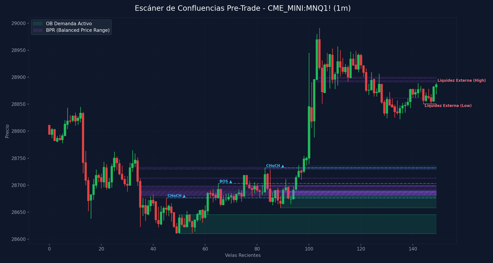

# 🛠️ Reporte Pre-Trade: Mapa de Confluencias (SMC & ICT)
        
Este reporte ha sido generado según los lineamientos de tu **Manual Operativo de Trading**. Analiza las confluencias de temporalidad menor para preparar tu Killzone y delinear tus puntos de interés antes de operar.

---

## 📅 Información de la Sesión
* **Fecha:** `2026-06-10`
* **Activo:** `CME_MINI:MNQ1!`
* **Temporalidad:** `1m` (LTF / Gatillo)
* **Precio Actual:** `28886.25`
* **Vinculación Temporal:** 
  * 🔗 [Ver Autopsia y Bitácora Post-Trade de esta Sesión](2026-06-10_session.md) (Se generará al finalizar tu sesión)

---

## 🛡️ Alerta del Guardia de Riesgo (IA Risk Mentor)

> [!IMPORTANT]
> **Estadísticas de Bitácora:** Sesiones: `9` | PnL Acumulado: `$2424.00 USD` | Win Rate: `55.6%`
> 
> **🚨 TUS ERRORES PSICOLÓGICOS MÁS RECURRENTES A EVITAR HOY:**
> * **FOMO:** presente en el `55.6%` de las sesiones previas.
> * **Ignorar Resistencia:** presente en el `55.6%` de las sesiones previas.
>
> **📝 LECCIONES CLAVE A RECORDAR:**
> * 1. La Disciplina ante el Bias Paga Rentabilidad: Alinearse estrictamente con el HTF Bias (Bullish) en zona de descuento macro y descartar los cortos contra-tendencia es la base de los trades de alta probabilidad.
> * La Espera del Retesteo Reduce el Riesgo: No entrar persiguiendo velas de expansión alcista sino esperar con paciencia el pullback al FVG mitigador es la diferencia entre ser liquidado o lograr una entrada limpia con excelente R:R.
> * El Plan Vence a la Intuición: Ignorar el impulso de tomar shorts discrecionales (incluso cuando otros mentores o el ruido de micro-temporalidades sugerían caídas) y aferrarse a las reglas del manual operativo condujo a una sesión sumamente rentable.

---

## 🧠 Predicción de Machine Learning (SMC Setup Classifier)
El clasificador de Inteligencia Artificial analizó la confluencia de este escenario de pre-sesión con tus datos históricos de trade:

```text
=== PREDICCIÓN DE PROBABILIDAD DE ÉXITO ===

==================================================
SETUP EVALUADO:
 - Instrumento: NQ | Dirección: Short | Sesión: NY AM KZ
 - Confluencias: in kill zone (london / ny am / pm), at htf pd array (ob / fvg / breaker), fair value gap (fvg) on entry tf, order block (ob) alignment, htf market structure bias confirmed
--------------------------------------------------
PROBABILIDAD DE WIN RATE ESTIMADA: 60.1%
⚠️ SETUP MODERADO: Reducir riesgo a la mitad (0.5%) o esperar más confirmaciones.
==================================================
```

---

## 🎨 Marcaciones Manuales en tu Gráfico (TradingView)
Esta sección extrae automáticamente tus rectángulos (cajas de zonas) y líneas dibujadas a mano en TradingView y comprueba su confluencia con las zonas de liquidez y estructuras de Smart Money Concepts:

  * **Caja Gris con etiqueta '4h'** en rango `29204.17 - 29615.25` | Estado: 🟡 Fuera del precio | Confluencias: **OB 4H** (29331.2 - 29743.0), **FVG 1H** (29302.0 - 29633.2)
  * **Caja Gris con etiqueta '1h'** en rango `28820.67 - 28926.50` | Estado: 🟢 PRECIO DENTRO | Confluencias: **FVG 30m** (28754.2 - 28822.0)
  * **Caja Gris con etiqueta '1h'** en rango `29946.01 - 30199.00` | Estado: 🟡 Fuera del precio | Confluencias: **OB 1H** (30151.0 - 30260.0), **FVG 1H** (29942.0 - 30042.2)
  * **Caja Gris con etiqueta '30m'** en rango `28703.00 - 28741.03` | Estado: 🟡 Fuera del precio | Confluencias: **FVG 30m** (28703.0 - 28738.5), **FVG 15m** (28732.0 - 28738.5), **FVG 5m** (28711.2 - 28738.5), **FVG 4m** (28711.2 - 28722.8), **FVG 4m** (28737.2 - 28788.5), **FVG 3m** (28737.2 - 28738.5), **FVG 2m** (28737.2 - 28738.5), **FVG 1m** (28729.2 - 28737.0)
  * **Caja Gris con etiqueta '15m'** en rango `28818.25 - 28926.50` | Estado: 🟢 PRECIO DENTRO | Confluencias: **FVG 30m** (28754.2 - 28822.0)
  * **Línea Manual con etiqueta 'ifl d'** en nivel `29857.69` | Estado: Fuera de rango
  * **Línea Manual con etiqueta 'ifl 4h'** en nivel `30260.00` | Estado: Fuera de rango | Ubicación: dentro de **OB 1H** (30151.0 - 30260.0)
  * **Línea Manual con etiqueta 'ssl'** en nivel `28227.25` | Estado: Fuera de rango
  * **Línea Manual con etiqueta 'ah'** en nivel `29169.00` | Estado: Fuera de rango
  * **Línea Manual con etiqueta 'lh'** en nivel `29001.25` | Estado: Fuera de rango | Ubicación: dentro de **OB 30m** (28958.0 - 29013.5), dentro de **OB 15m** (28958.0 - 29013.5), dentro de **OB 5m** (28958.0 - 29013.5), dentro de **OB 4m** (28967.0 - 29013.5), dentro de **OB 3m** (28967.0 - 29013.5), dentro de **OB 2m** (28975.2 - 29001.2)
  * **Línea Manual con etiqueta 'ifl 30m ll'** en nivel `28610.25` | Estado: Fuera de rango | Ubicación: dentro de **OB 15m** (28610.2 - 28683.2), dentro de **OB 5m** (28610.2 - 28652.2), dentro de **OB 4m** (28610.2 - 28652.2), dentro de **OB 3m** (28610.2 - 28645.5), dentro de **OB 1m** (28610.2 - 28645.5)
  * **Línea Manual con etiqueta 'dh'** en nivel `28991.50` | Estado: Fuera de rango | Ubicación: dentro de **OB 30m** (28958.0 - 29013.5), dentro de **OB 15m** (28958.0 - 29013.5), dentro de **OB 5m** (28958.0 - 29013.5), dentro de **OB 4m** (28967.0 - 29013.5), dentro de **OB 3m** (28967.0 - 29013.5), dentro de **OB 2m** (28975.2 - 29001.2)
  * **Línea Manual con etiqueta 'ifl 15m'** en nivel `28822.00` | Estado: Fuera de rango | Ubicación: dentro de **FVG 30m** (28754.2 - 28822.0)

---

## ⏳ Análisis Estructural Multi-Temporalidad Completo (9 Timeframes)
Escaneo automático y en segundo plano de estructura de mercado y zonas institucionales activas en todos los marcos de tiempo analizados (de mayor a menor):

| Temporalidad | Sesgo Estructural | Rango (Premium/Discount) | Últimos OBs Activos | Últimos FVGs Activos |
| :--- | :--- | :--- | :--- | :--- |
| **4H** | Bearish 🔴 | Premium (Ventas) 🔴 | 🔴 Supply (30495.5-30807.8), 🔴 Supply (29331.2-29743.0) | 🔴 Bearish (30694.8-30701.0), 🔴 Bearish (30264.5-30393.5) |
| **1H** | Bearish 🔴 | Discount (Compras) 🟢 | 🔴 Supply (30151.0-30260.0), 🔴 Supply (29633.2-29847.0) | 🔴 Bearish (29942.0-30042.2), 🔴 Bearish (29302.0-29633.2) |
| **30m** | Bearish 🔴 | Discount (Compras) 🟢 | 🔴 Supply (29633.2-29847.0), 🔴 Supply (28958.0-29013.5) | 🟢 Bullish (28703.0-28738.5), 🟢 Bullish (28754.2-28822.0) |
| **15m** | Bullish 🟢 | Premium (Ventas) 🔴 | 🔴 Supply (28958.0-29013.5), 🟢 Demand (28610.2-28683.2) | 🟢 Bullish (28488.0-28605.8), 🟢 Bullish (28732.0-28738.5) |
| **5m** | Bullish 🟢 | Discount (Compras) 🟢 | 🔴 Supply (28958.0-29013.5), 🟢 Demand (28610.2-28652.2) | 🟢 Bullish (28711.2-28738.5) |
| **4m** | Bullish 🟢 | Discount (Compras) 🟢 | 🔴 Supply (28967.0-29013.5), 🟢 Demand (28610.2-28652.2) | 🟢 Bullish (28711.2-28722.8), 🟢 Bullish (28737.2-28788.5) |
| **3m** | Bullish 🟢 | Discount (Compras) 🟢 | 🔴 Supply (28967.0-29013.5), 🟢 Demand (28610.2-28645.5) | 🟢 Bullish (28737.2-28738.5) |
| **2m** | Bullish 🟢 | Discount (Compras) 🟢 | 🔴 Supply (28975.2-29001.2), 🟢 Demand (28658.0-28695.5) | 🟢 Bullish (28737.2-28738.5), 🟢 Bullish (28754.2-28788.5) |
| **1m** | Bullish 🟢 | Discount (Compras) 🟢 | 🟢 Demand (28610.2-28645.5), 🟢 Demand (28658.0-28679.0) | 🟢 Bullish (28680.8-28691.0), 🟢 Bullish (28729.2-28737.0) |

---

## 📊 Mapa de Gráfico de Confluencias
Este gráfico mapea de forma precisa la liquidez externa, los bloques de orden activos, los vacíos de liquidez y los rangos de precio balanceados (BPR):



---

## 🔍 Análisis Estructural Top-Down (Multi-Temporalidad)
Análisis de temporalidades HTF de Nasdaq en el fondo sin alterar tu TradingView Desktop:

* **1H HTF Bias:** `Bearish 🔴` | Mapeado según el último BOS estructural en 1 hora.
* **1H Zonas Clave:**
  * OB de 1H Supply: Rango `30151.00 - 30260.00`
  * OB de 1H Supply: Rango `29633.25 - 29847.00`
  * FVG de 1H Bearish: Rango `29942.00 - 30042.25`
  * FVG de 1H Bearish: Rango `29302.00 - 29633.25`

* **15m POIs de Confluencia:**
  * OB de 15m Supply: Rango `28958.00 - 29013.50` | Ver [[Order Block (Bullish)]] o [[Order Block (Bearish)]]
  * OB de 15m Demand: Rango `28610.25 - 28683.25` | Ver [[Order Block (Bullish)]] o [[Order Block (Bearish)]]
  * FVG de 15m Bullish: Rango `28488.00 - 28605.75` | Ver [[Fair Value Gap]]
  * FVG de 15m Bullish: Rango `28732.00 - 28738.50` | Ver [[Fair Value Gap]]

---

## ⚡ Correlación Inter-Mercado (SMT Divergence)
* **Estado SMT:** `S&P 500 (MES) y Nasdaq (MNQ) alineados de forma regular en el Open (Sin divergencias activas). Ver [[SMT Divergence]]`

---

## 🧲 Puntos de Interés (POI) y Liquidez LTF (1m)

### 🌐 1. Liquidez Externa (HTF / Session Pivots)
Niveles clave para buscar barridas de liquidez (*sweeps*) en la apertura de sesión o Killzone:
* **Liquidez Externa Superior (Swing High):** `28890.0` (Vela #149) | Ver [[External Liquidity]] y [[Swing High]]
* **Liquidez Externa Inferior (Swing Low):** `28850.5` (Vela #144) | Ver [[External Liquidity]] y [[Swing Low]]

* **Pools de Liquidez Interna Activos (Unswept):**
  * Pool Alcista (Highs) 🟢 en nivel `28889.50` en la vela #142 | Ver [[Liquidity Sweep]]

### 🟢 2. Bloques de Orden de Demanda (Soportes / Compras)
Zonas institucionales activas de alta concentración de compras limitadas. Ver [[Order Block (Bullish)]].

| Tipo | Rango de Precio | Volumen | Estado |
| :--- | :--- | :--- | :--- |
| **Demand OB** | `28610.25 - 28645.5` | `4509.0` | **Inmitigado (Activo)** 🔥 |
| **Demand OB** | `28658.0 - 28679.0` | `3565.0` | **Inmitigado (Activo)** 🔥 |

### 🔴 3. Bloques de Orden de Oferta (Resistencias / Ventas)
Zonas institucionales activas de alta concentración de ventas limitadas. Ver [[Order Block (Bearish)]].

| Tipo | Rango de Precio | Volumen | Estado |
| :--- | :--- | :--- | :--- |

---

## 🌀 4. Anatomía de Fair Value Gaps (FVG) e Inversiones
Análisis detallado de imbalances de precios y su **probabilidad de inversión (iFVG)** según la secuencia de sus 3 velas. Ver [[Fair Value Gap]] e [[IFVG]].

| Dirección | Rango de FVG | Perfil de Velas | Probabilidad de Inversión / Comportamiento |
| :--- | :--- | :--- | :--- |
| 🟢 Bullish FVG | `28680.75 - 28691.0` | `R-G-G` (Vela #94) | Moderado (Extra Confirmación) 🟡 |
| 🟢 Bullish FVG | `28729.25 - 28737.0` | `G-R-G` (Vela #98) | Fácil de Invertir (iFVG de Alta Probabilidad) 🔴 |

---

## 🟣 5. Balanced Price Ranges (BPR) Detectados
Solapamientos de FVG alcistas y bajistas en el mismo nivel de precios. Actúan como soportes/resistencias magnéticos de altísima precisión. Ver [[Balanced Price Range]].
* **BPR Detectado:** Rango `28676.50 - 28677.25` | Solapamiento de FVG Alcista (Vela #61) y Bajista (Vela #35)
* **BPR Detectado:** Rango `28691.00 - 28698.75` | Solapamiento de FVG Alcista (Vela #75) y Bajista (Vela #35)
* **BPR Detectado:** Rango `28697.75 - 28700.25` | Solapamiento de FVG Alcista (Vela #75) y Bajista (Vela #77)
* **BPR Detectado:** Rango `28679.00 - 28689.00` | Solapamiento de FVG Alcista (Vela #90) y Bajista (Vela #35)
* **BPR Detectado:** Rango `28686.50 - 28689.00` | Solapamiento de FVG Alcista (Vela #90) y Bajista (Vela #85)
* **BPR Detectado:** Rango `28680.75 - 28689.00` | Solapamiento de FVG Alcista (Vela #90) y Bajista (Vela #92)
* **BPR Detectado:** Rango `28680.75 - 28691.00` | Solapamiento de FVG Alcista (Vela #94) y Bajista (Vela #35)
* **BPR Detectado:** Rango `28686.50 - 28690.00` | Solapamiento de FVG Alcista (Vela #94) y Bajista (Vela #85)
* **BPR Detectado:** Rango `28680.75 - 28689.00` | Solapamiento de FVG Alcista (Vela #94) y Bajista (Vela #92)
* **BPR Detectado:** Rango `28712.00 - 28714.00` | Solapamiento de FVG Alcista (Vela #95) y Bajista (Vela #34)
* **BPR Detectado:** Rango `28697.75 - 28698.75` | Solapamiento de FVG Alcista (Vela #95) y Bajista (Vela #35)
* **BPR Detectado:** Rango `28697.75 - 28700.25` | Solapamiento de FVG Alcista (Vela #95) y Bajista (Vela #77)
* **BPR Detectado:** Rango `28729.25 - 28733.50` | Solapamiento de FVG Alcista (Vela #98) y Bajista (Vela #34)
* **BPR Detectado:** Rango `28890.75 - 28894.50` | Solapamiento de FVG Alcista (Vela #102) y Bajista (Vela #122)
* **BPR Detectado:** Rango `28897.25 - 28900.50` | Solapamiento de FVG Alcista (Vela #103) y Bajista (Vela #122)
* **BPR Detectado:** Rango `28861.25 - 28861.75` | Solapamiento de FVG Alcista (Vela #139) y Bajista (Vela #128)

---

## 🔄 6. Estructura de Mercado Reciente (BOS / CHoCH)
Rupturas de estructura registradas en el gráfico. Ver [[Market Structure]], [[Break of Structure]] y [[Change of Character]]:
* **CHoCH (Change of Character) Alcista 🟢** en nivel `28676.25` | Confirmado en la vela #45
* **BOS (Break of Structure) Alcista 🟢** en nivel `28703.0` | Confirmado en la vela #65
* **CHoCH (Change of Character) Alcista 🟢** en nivel `28732.0` | Confirmado en la vela #83

---

## 💡 Protocolo Operativo Pre-Trade (Tu Plan de Sesión)

> [!IMPORTANT]
> **Checklist antes de apretar el gatillo (LTF 1m - 5m):**
> 1. **Fase 1 (Sweep):** Espera a que el precio barra una de las zonas de **Liquidez Externa** (`28890.0` / `28850.5`) o mitigue un POI HTF.
> 2. **Fase 2 (iFVG Trigger):** Busca una reacción post-sweep. El cuerpo de la vela debe cerrar y romper un FVG contrario, prioritariamente con perfil **Easy to Invert (R-G-R o G-R-G)**, convirtiéndolo en un **iFVG**.
> 3. **Gestión de Riesgo:** Si opera en All-Time Highs, gestión estricta con relación de **1:1 R:R**. En días de noticias, no ingresar a operaciones dentro de los **5 minutos anteriores** a la publicación.
