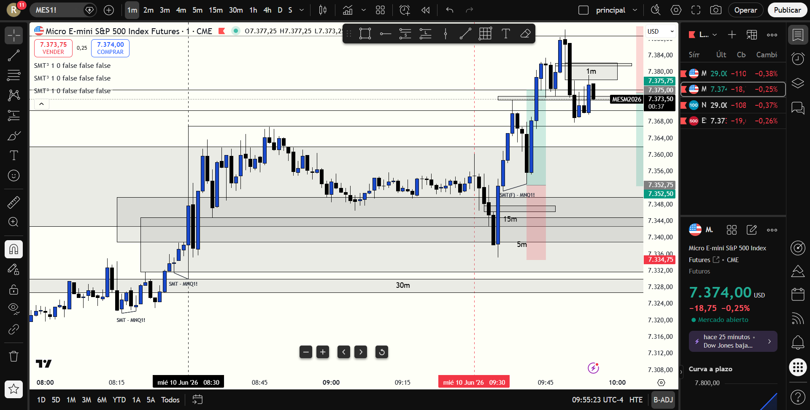

# 📅 BITÁCORA DE TRADING — 10 de Junio de 2026
**Pre-Trade Link:** [[2026-06-10_pre_trade_MES]]

## 📊 RESUMEN GENERAL DE LA SESIÓN
- **Resultado Neto:** `+$401.00 USD`
- **Trades Realizados:** `1`
- **Resultado:** `WIN`
- **Contexto de Cuenta Fondeada (Eval):**
  * Balance Actual: `$52,248.00 USD` (al 10/06/2026)
  * Objetivo de Beneficio: `$53,000.00 USD`
  * Distancia al Objetivo: `+$752.00 USD`
  * Días Hábiles Restantes: `6 días`

---

## 🖼️ CAPTURA DE PANTALLA

---

## 🔍 ANÁLISIS ESTRUCTURAL DE TEMPORALIDADES (TOP-DOWN)
### 1. Temporalidades Mayores (HTF: 4h / 1h)
- **Bias:** Bearish 🔴 | El sesgo macro estructural en 1H era bajista. Sin embargo, en la apertura del mercado se barrió la liquidez externa inferior antes de iniciar una fuerte expansión en contra de la tendencia dominante.
- **Narrativa:** El bias macro era bajista, pero la acción del precio local en la apertura demostró una clara acumulación tras limpiar mínimos, convirtiendo la sesión en una operativa alcista de retroceso.

### 2. Temporalidades Intermedias (30m / 15m)
- **Zonas clave (POIs):** Barrida de la liquidez externa inferior en `7351.25` durante los primeros minutos del open.

### 3. Temporalidad de Ejecución (5m / 2m / 1m)
- **Gatillo / Desplazamiento:** Fuerte reacción alcista inmediata post-barrida. El precio cerró con decisión por encima del FVG bajista inicial de 1m, convirtiéndolo en un **iFVG alcista** y confirmando la intención de los compradores.

---

## 📈 REPORTE DETALLADO DE LOS TRADES

### 🟢 TRADE #1: Long en MES (Micro E-mini S&P 500)
- **Entrada:** `7352.00` (8:31 AM local / 9:31 AM NY Time)
- **Exit:** `7370.00`
- **SL:** `7351.25` (Riesgo: 0.75 puntos / 3 ticks)
- **MAE:** `0.0 ticks` (Excursión adversa de 0.00 ticks tras la entrada)
- **MFE:** `123.0 ticks` (Excursión favorable de 30.75 puntos)
- **Resultado:** `WIN (+$401.00 USD)`
- **Relación R:R:** **24.0:1** (R:R extremadamente alto gracias al stop ajustado al mínimo de apertura)
- **Notas:** Entrada perfecta y de alta precisión en el retesteo mitigador del iFVG de 1m tras la doble barrida de apertura. La salida en `7370.00` fue ejecutada de forma disciplinada, asegurando +18 puntos de ganancia.

---

## 🧠 LECCIONES DE LA SESIÓN
1. **Esperar la Barrida del Open:** Tener paciencia y esperar que la volatilidad inicial barriera la liquidez del premarket antes de posicionarse previno entradas falsas. El iFVG post-barrida ofreció un gatillo de alta precisión.
2. **Ignorar el Sesgo Macro en Scalping de Apertura:** Aunque el bias general de 1H era bajista, la acción del precio a nivel local de 1m con la barrida de mínimos y el cierre alcista nos dio vía libre para operar compras en la apertura con excelente R:R.
3. **Cierre de Ganancias en TP Estructural:** Respetar el TP planeado en el nivel clave y salir con ganancias evitó la codicia y protegió el capital acumulado hacia el objetivo de fondeo.
