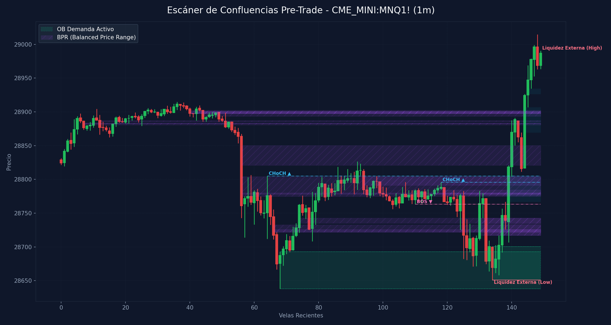

# 🛠️ Reporte Pre-Trade: Mapa de Confluencias (SMC & ICT)
        
Este reporte ha sido generado según los lineamientos de tu **Manual Operativo de Trading**. Analiza las confluencias de temporalidad menor para preparar tu Killzone y delinear tus puntos de interés antes de operar.

---

## 📅 Información de la Sesión
* **Fecha:** `2026-06-11`
* **Activo:** `CME_MINI:MNQ1!`
* **Temporalidad:** `1m` (LTF / Gatillo)
* **Precio Actual:** `28987.25`
* **Vinculación Temporal:** 
  * 🔗 [Ver Autopsia y Bitácora Post-Trade de esta Sesión](2026-06-11_session.md) (Se generará al finalizar tu sesión)

---

## 🛡️ Alerta del Guardia de Riesgo (IA Risk Mentor)

> [!IMPORTANT]
> **Estadísticas de Bitácora:** Sesiones: `11` | PnL Acumulado: `$3283.00 USD` | Win Rate: `63.6%`
> 
> **🚨 TUS ERRORES PSICOLÓGICOS MÁS RECURRENTES A EVITAR HOY:**
> * **FOMO:** presente en el `45.5%` de las sesiones previas.
> * **Ignorar Resistencia:** presente en el `45.5%` de las sesiones previas.
>
> **📝 LECCIONES CLAVE A RECORDAR:**
> * 1. La Disciplina ante el Bias Paga Rentabilidad: Alinearse estrictamente con el HTF Bias (Bullish) en zona de descuento macro y descartar los cortos contra-tendencia es la base de los trades de alta probabilidad.
> * La Espera del Retesteo Reduce el Riesgo: No entrar persiguiendo velas de expansión alcista sino esperar con paciencia el pullback al FVG mitigador es la diferencia entre ser liquidado o lograr una entrada limpia con excelente R:R.
> * El Plan Vence a la Intuición: Ignorar el impulso de tomar shorts discrecionales (incluso cuando otros mentores o el ruido de micro-temporalidades sugerían caídas) y aferrarse a las reglas del manual operativo condujo a una sesión sumamente rentable.

---

## 🧠 Predicción de Machine Learning (SMC Setup Classifier)
El clasificador de Inteligencia Artificial analizó la confluencia de este escenario de pre-sesión con tus datos históricos de trade:

```text
=== PREDICCIÓN DE PROBABILIDAD DE ÉXITO ===

==================================================
SETUP EVALUADO:
 - Instrumento: NQ | Dirección: Short | Sesión: NY AM KZ
 - Confluencias: in kill zone (london / ny am / pm), at htf pd array (ob / fvg / breaker), fair value gap (fvg) on entry tf, order block (ob) alignment, htf market structure bias confirmed
--------------------------------------------------
PROBABILIDAD DE WIN RATE ESTIMADA: 72.0%
🚀 SETUP ALTA PROBABILIDAD (A+): Recomendado operar con riesgo estándar (1.0%).
==================================================
```

---

## 🎨 Marcaciones Manuales en tu Gráfico (TradingView)
Esta sección extrae automáticamente tus rectángulos (cajas de zonas) y líneas dibujadas a mano en TradingView y comprueba su confluencia con las zonas de liquidez y estructuras de Smart Money Concepts:

  * **Caja Gris con etiqueta '30m'** en rango `28827.38 - 28848.25` | Estado: 🟡 Fuera del precio | Confluencias: **FVG 30m** (28826.8 - 28848.2)
  * **Caja Gris con etiqueta '1h'** en rango `28797.00 - 28839.25` | Estado: 🟡 Fuera del precio | Confluencias: **FVG 30m** (28826.8 - 28848.2)
  * **Caja Gris con etiqueta '15m'** en rango `28805.00 - 28885.50` | Estado: 🟡 Fuera del precio | Confluencias: **OB 1H** (28855.5 - 29251.0), **OB 30m** (28855.5 - 29251.0), **FVG 30m** (28826.8 - 28848.2), **OB 15m** (28875.8 - 28916.8), **FVG 5m** (28878.5 - 28885.5), **FVG 4m** (28878.5 - 28885.8), **FVG 3m** (28885.2 - 28890.5), **FVG 3m** (28876.2 - 28876.5), **FVG 2m** (28867.5 - 28870.5)
  * **Caja Gris con etiqueta '2m'** en rango `28703.01 - 28709.75` | Estado: 🟡 Fuera del precio | Confluencias: **FVG 2m** (28702.8 - 28706.5)
  * **Línea Manual con etiqueta 'ifl d'** en nivel `29852.55` | Estado: Fuera de rango
  * **Línea Manual con etiqueta 'ifl 4h'** en nivel `29251.00` | Estado: Fuera de rango | Ubicación: dentro de **OB 1H** (28855.5 - 29251.0), dentro de **OB 30m** (28855.5 - 29251.0)
  * **Línea Manual con etiqueta 'ifl 4h'** en nivel `30260.00` | Estado: Fuera de rango
  * **Línea Manual con etiqueta 'ifl 1h -dl'** en nivel `28639.87` | Estado: Fuera de rango | Ubicación: dentro de **OB 30m** (28533.0 - 28648.5), dentro de **OB 1m** (28638.2 - 28693.0)
  * **Línea Manual con etiqueta 'ifl 1h'** en nivel `28688.25` | Estado: Fuera de rango | Ubicación: dentro de **OB 1m** (28638.2 - 28693.0)
  * **Línea Manual con etiqueta 'ifl 1h'** en nivel `28533.00` | Estado: Fuera de rango | Ubicación: dentro de **OB 30m** (28533.0 - 28648.5), dentro de **OB 15m** (28533.0 - 28603.2)
  * **Línea Manual con etiqueta 'lh'** en nivel `28935.00` | Estado: Fuera de rango | Ubicación: dentro de **OB 1H** (28855.5 - 29251.0), dentro de **OB 30m** (28855.5 - 29251.0)
  * **Línea Manual con etiqueta 'al'** en nivel `28264.25` | Estado: Fuera de rango

---

## ⏳ Análisis Estructural Multi-Temporalidad Completo (9 Timeframes)
Escaneo automático y en segundo plano de estructura de mercado y zonas institucionales activas en todos los marcos de tiempo analizados (de mayor a menor):

| Temporalidad | Sesgo Estructural | Rango (Premium/Discount) | Últimos OBs Activos | Últimos FVGs Activos |
| :--- | :--- | :--- | :--- | :--- |
| **4H** | Bearish 🔴 | Discount (Compras) 🟢 | 🔴 Supply (29331.2-29743.0) | 🔴 Bearish (30694.8-30701.0), 🔴 Bearish (30264.5-30393.5) |
| **1H** | Bearish 🔴 | Discount (Compras) 🟢 | 🔴 Supply (29633.2-29847.0), 🔴 Supply (28855.5-29251.0) | 🔴 Bearish (29942.0-30042.2), 🔴 Bearish (29302.0-29633.2) |
| **30m** | Bullish 🟢 | Discount (Compras) 🟢 | 🔴 Supply (28855.5-29251.0), 🟢 Demand (28533.0-28648.5) | 🔴 Bearish (29302.0-29360.2), 🔴 Bearish (28826.8-28848.2) |
| **15m** | Bearish 🔴 | Discount (Compras) 🟢 | 🟢 Demand (28533.0-28603.2), 🔴 Supply (28875.8-28916.8) | 🔴 Bearish (28987.0-29081.2), 🟢 Bullish (28416.2-28425.8) |
| **5m** | Bearish 🔴 | Discount (Compras) 🟢 | 🟢 Demand (28581.2-28618.8), 🔴 Supply (28897.5-28914.8) | 🟢 Bullish (28530.0-28532.8), 🔴 Bearish (28878.5-28885.5) |
| **4m** | Bearish 🔴 | Discount (Compras) 🟢 | 🔴 Supply (28897.5-28914.8) | 🔴 Bearish (28878.5-28885.8) |
| **3m** | Bearish 🔴 | Discount (Compras) 🟢 | 🔴 Supply (28897.5-28914.8) | 🔴 Bearish (28885.2-28890.5), 🔴 Bearish (28876.2-28876.5) |
| **2m** | Bearish 🔴 | Discount (Compras) 🟢 | 🔴 Supply (28908.5-28922.2), 🔴 Supply (28902.0-28914.8) | 🔴 Bearish (28867.5-28870.5), 🟢 Bullish (28702.8-28706.5) |
| **1m** | Bearish 🔴 | Discount (Compras) 🟢 | 🔴 Supply (28902.8-28914.8), 🟢 Demand (28638.2-28693.0) | *Ninguno* |

---

## 📊 Mapa de Gráfico de Confluencias
Este gráfico mapea de forma precisa la liquidez externa, los bloques de orden activos, los vacíos de liquidez y los rangos de precio balanceados (BPR):



---

## 🔍 Análisis Estructural Top-Down (Multi-Temporalidad)
Análisis de temporalidades HTF de Nasdaq en el fondo sin alterar tu TradingView Desktop:

* **1H HTF Bias:** `Bearish 🔴` | Mapeado según el último BOS estructural en 1 hora.
* **1H Zonas Clave:**
  * OB de 1H Supply: Rango `29633.25 - 29847.00`
  * OB de 1H Supply: Rango `28855.50 - 29251.00`
  * FVG de 1H Bearish: Rango `29942.00 - 30042.25`
  * FVG de 1H Bearish: Rango `29302.00 - 29633.25`

* **15m POIs de Confluencia:**
  * OB de 15m Demand: Rango `28533.00 - 28603.25` | Ver [[Order Block (Bullish)]] o [[Order Block (Bearish)]]
  * OB de 15m Supply: Rango `28875.75 - 28916.75` | Ver [[Order Block (Bullish)]] o [[Order Block (Bearish)]]
  * FVG de 15m Bearish: Rango `28987.00 - 29081.25` | Ver [[Fair Value Gap]]
  * FVG de 15m Bullish: Rango `28416.25 - 28425.75` | Ver [[Fair Value Gap]]

---

## ⚡ Correlación Inter-Mercado (SMT Divergence)
* **Estado SMT:** `S&P 500 (MES) y Nasdaq (MNQ) alineados de forma regular en el Open (Sin divergencias activas). Ver [[SMT Divergence]]`

---

## 🧲 Puntos de Interés (POI) y Liquidez LTF (1m)

### 🌐 1. Liquidez Externa (HTF / Session Pivots)
Niveles clave para buscar barridas de liquidez (*sweeps*) en la apertura de sesión o Killzone:
* **Liquidez Externa Superior (Swing High):** `28990.75` (Vela #149) | Ver [[External Liquidity]] y [[Swing High]]
* **Liquidez Externa Inferior (Swing Low):** `28651.0` (Vela #134) | Ver [[External Liquidity]] y [[Swing Low]]

* **Pools de Liquidez Interna Activos (Unswept):**
  * *No se detectan pools de liquidez interna inmitigados en el rango de precios actual. Ver [[Internal Liquidity]]*

### 🟢 2. Bloques de Orden de Demanda (Soportes / Compras)
Zonas institucionales activas de alta concentración de compras limitadas. Ver [[Order Block (Bullish)]].

| Tipo | Rango de Precio | Volumen | Estado |
| :--- | :--- | :--- | :--- |
| **Demand OB** | `28638.25 - 28693.0` | `7137.0` | **Inmitigado (Activo)** 🔥 |
| **Demand OB** | `28651.0 - 28700.75` | `51620.0` | **Inmitigado (Activo)** 🔥 |

### 🔴 3. Bloques de Orden de Oferta (Resistencias / Ventas)
Zonas institucionales activas de alta concentración de ventas limitadas. Ver [[Order Block (Bearish)]].

| Tipo | Rango de Precio | Volumen | Estado |
| :--- | :--- | :--- | :--- |

---

## 🌀 4. Anatomía de Fair Value Gaps (FVG) e Inversiones
Análisis detallado de imbalances de precios y su **probabilidad de inversión (iFVG)** según la secuencia de sus 3 velas. Ver [[Fair Value Gap]] e [[IFVG]].

| Dirección | Rango de FVG | Perfil de Velas | Probabilidad de Inversión / Comportamiento |
| :--- | :--- | :--- | :--- |
| 🟢 Bullish FVG | `28766.75 - 28804.25` | `G-R-G` (Vela #139) | Fácil de Invertir (iFVG de Alta Probabilidad) 🔴 |
| 🟢 Bullish FVG | `28869.5 - 28907.0` | `R-R-G` (Vela #144) | Moderado (Extra Confirmación) 🟡 |
| 🟢 Bullish FVG | `28926.5 - 28934.5` | `R-G-G` (Vela #145) | Moderado (Extra Confirmación) 🟡 |

---

## 🟣 5. Balanced Price Ranges (BPR) Detectados
Solapamientos de FVG alcistas y bajistas en el mismo nivel de precios. Actúan como soportes/resistencias magnéticos de altísima precisión. Ver [[Balanced Price Range]].
* **BPR Detectado:** Rango `28882.75 - 28883.50` | Solapamiento de FVG Alcista (Vela #17) y Bajista (Vela #7)
* **BPR Detectado:** Rango `28897.75 - 28900.75` | Solapamiento de FVG Alcista (Vela #42) y Bajista (Vela #40)
* **BPR Detectado:** Rango `28897.75 - 28900.75` | Solapamiento de FVG Alcista (Vela #42) y Bajista (Vela #44)
* **BPR Detectado:** Rango `28735.00 - 28742.75` | Solapamiento de FVG Alcista (Vela #74) y Bajista (Vela #132)
* **BPR Detectado:** Rango `28778.25 - 28780.25` | Solapamiento de FVG Alcista (Vela #116) y Bajista (Vela #56)
* **BPR Detectado:** Rango `28778.25 - 28780.25` | Solapamiento de FVG Alcista (Vela #116) y Bajista (Vela #119)
* **BPR Detectado:** Rango `28721.75 - 28732.75` | Solapamiento de FVG Alcista (Vela #130) y Bajista (Vela #66)
* **BPR Detectado:** Rango `28717.25 - 28742.75` | Solapamiento de FVG Alcista (Vela #130) y Bajista (Vela #132)
* **BPR Detectado:** Rango `28721.75 - 28726.00` | Solapamiento de FVG Alcista (Vela #137) y Bajista (Vela #66)
* **BPR Detectado:** Rango `28717.25 - 28726.00` | Solapamiento de FVG Alcista (Vela #137) y Bajista (Vela #132)
* **BPR Detectado:** Rango `28774.75 - 28804.25` | Solapamiento de FVG Alcista (Vela #139) y Bajista (Vela #56)
* **BPR Detectado:** Rango `28791.25 - 28804.25` | Solapamiento de FVG Alcista (Vela #139) y Bajista (Vela #94)
* **BPR Detectado:** Rango `28776.25 - 28784.50` | Solapamiento de FVG Alcista (Vela #139) y Bajista (Vela #119)
* **BPR Detectado:** Rango `28821.00 - 28850.25` | Solapamiento de FVG Alcista (Vela #140) y Bajista (Vela #56)
* **BPR Detectado:** Rango `28880.75 - 28883.50` | Solapamiento de FVG Alcista (Vela #144) y Bajista (Vela #7)
* **BPR Detectado:** Rango `28885.75 - 28887.25` | Solapamiento de FVG Alcista (Vela #144) y Bajista (Vela #12)
* **BPR Detectado:** Rango `28897.75 - 28902.50` | Solapamiento de FVG Alcista (Vela #144) y Bajista (Vela #40)
* **BPR Detectado:** Rango `28893.50 - 28900.75` | Solapamiento de FVG Alcista (Vela #144) y Bajista (Vela #44)

---

## 🔄 6. Estructura de Mercado Reciente (BOS / CHoCH)
Rupturas de estructura registradas en el gráfico. Ver [[Market Structure]], [[Break of Structure]] y [[Change of Character]]:
* **CHoCH (Change of Character) Alcista 🟢** en nivel `28805.0` | Confirmado en la vela #64
* **BOS (Break of Structure) Bajista 🔴** en nivel `28763.25` | Confirmado en la vela #110
* **CHoCH (Change of Character) Alcista 🟢** en nivel `28795.75` | Confirmado en la vela #118

---

## 💡 Protocolo Operativo Pre-Trade (Tu Plan de Sesión)

> [!IMPORTANT]
> **Checklist antes de apretar el gatillo (LTF 1m - 5m):**
> 1. **Fase 1 (Sweep):** Espera a que el precio barra una de las zonas de **Liquidez Externa** (`28990.75` / `28651.0`) o mitigue un POI HTF.
> 2. **Fase 2 (iFVG Trigger):** Busca una reacción post-sweep. El cuerpo de la vela debe cerrar y romper un FVG contrario, prioritariamente con perfil **Easy to Invert (R-G-R o G-R-G)**, convirtiéndolo en un **iFVG**.
> 3. **Gestión de Riesgo:** Si opera en All-Time Highs, gestión estricta con relación de **1:1 R:R**. En días de noticias, no ingresar a operaciones dentro de los **5 minutos anteriores** a la publicación.
