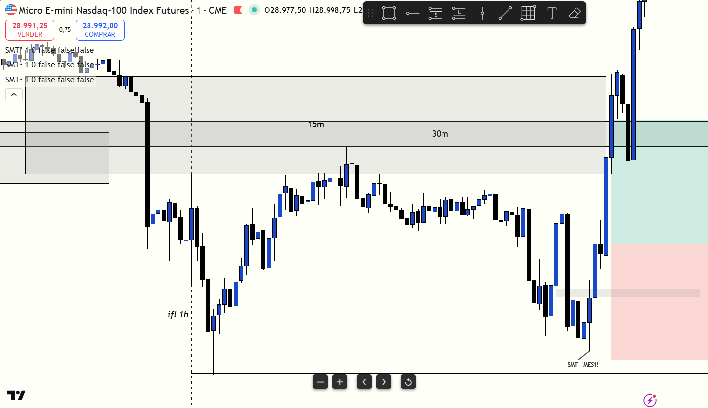

# 📅 BITÁCORA DE TRADING — 11 de Junio de 2026
**Pre-Trade Link:** [[2026-06-11_pre_trade_MNQ]]

## 📊 RESUMEN GENERAL DE LA SESIÓN
- **Resultado Neto:** `+$458.00 USD`
- **Trades Realizados:** `1`
- **Resultado:** `WIN`
- **Contexto de Cuenta Fondeada (Eval):**
  * Balance Actual: `$52,706.00 USD` (al 11/06/2026)
  * Objetivo de Beneficio: `$53,000.00 USD`
  * Distancia al Objetivo: `-$294.00 USD` (para alcanzar $53,000)
  * Días Hábiles Restantes: `5 días`

---

## 🖼️ CAPTURA DE PANTALLA

---

## 🔍 ANÁLISIS ESTRUCTURAL DE TEMPORALIDADES (TOP-DOWN)
### 1. Temporalidades Mayores (HTF: 4h / 1h)
- **Bias:** Bearish 🔴 | El sesgo macro en 1H era bajista, pero el precio cotizaba en una zona de descuento profundo (Discount), propiciando un rebote alcista.
- **Narrativa:** A pesar del bias bajista macro, la llegada al nivel de soporte institucional de la temporalidad diaria y de 1 hora (`ifl 1h-dl`) frenó la caída y dio la base para un rebote largo de alta precisión.

### 2. Temporalidades Intermedias (30m / 15m)
- **Zonas clave (POIs):** Reacción alcista limpia inmediatamente tras testear el nivel clave `ifl 1h-dl` en la zona de `28635.79`.

### 3. Temporalidad de Ejecución (5m / 2m / 1m)
- **Gatillo / Desplazamiento:** Se generó una reversión en la microestructura con un desplazamiento alcista fuerte que invalidó un FVG bajista en la temporalidad de 2 minutos, creando un **iFVG alcista (2m)**. Se ingresó al mercado en el retesteo del iFVG en `28747.00`.

---

## 📈 REPORTE DETALLADO DE LOS TRADES

### 🟢 TRADE #1: Long en NQ (Micro E-mini Nasdaq-100)
- **Entrada:** `28747.00` (8:44 AM local / 9:44 AM NY Time)
- **Exit:** `28849.00`
- **SL:** `28651.00` (Riesgo: 96 points)
- **MAE:** `0.0 ticks` (Entrada de precisión absoluta)
- **MFE:** `458.0 ticks` (102 puntos a favor, alcanzando y superando el TP)
- **Resultado:** `WIN (+$458.00 USD)`
- **Relación R:R:** **1.06:1**
- **Notas:** Entrada en la formación del iFVG de 2m tras testear el nivel clave `ifl 1h-dl`. La ejecución fue disciplinada y la salida se realizó de forma automática al alcanzar el objetivo estipulado en `28849.00`.

---

## 🧠 LECCIONES DE LA SESIÓN
1. **Confiar en los Niveles Institucionales:** El nivel de soporte de temporalidad mayor (`ifl 1h-dl`) sirvió como un excelente suelo, demostrando que incluso con un bias macro bajista, las compras en zonas de descuento extremo son de alta probabilidad si el gatillo es claro.
2. **Uso del iFVG de 2m:** Esperar a que el precio rompa la estructura bajista en la temporalidad menor y configure el iFVG evitó entrar a ciegas en la caída libre.
3. **Respetar la Gestión:** Salir en el TP programado consolida las ganancias y mantiene la disciplina rumbo al objetivo final de la cuenta de evaluación.
