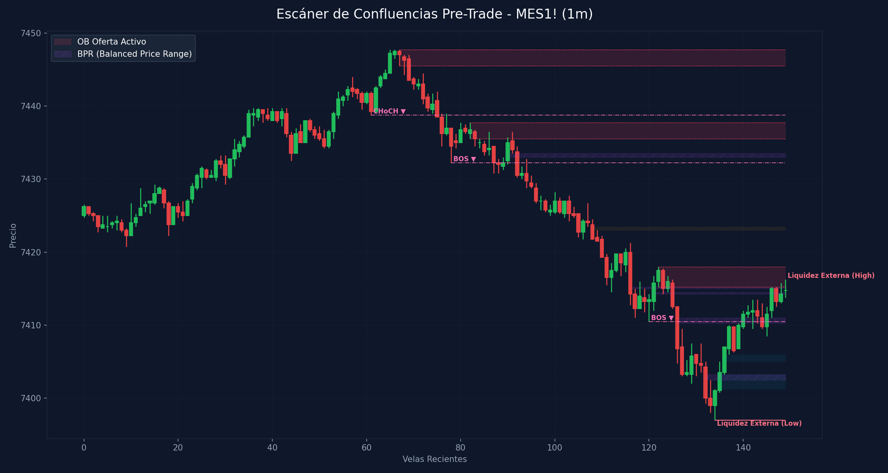

# 🛠️ Reporte Pre-Trade: Mapa de Confluencias (SMC & ICT)
        
Este reporte ha sido generado según los lineamientos de tu **Manual Operativo de Trading**. Analiza las confluencias de temporalidad menor para preparar tu Killzone y delinear tus puntos de interés antes de operar.

---

## 📅 Información de la Sesión
* **Fecha:** `2026-06-12`
* **Activo:** `MES1!`
* **Temporalidad:** `1m` (LTF / Gatillo)
* **Precio Actual:** `7414.75`
* **Vinculación Temporal:** 
  * 🔗 [Ver Autopsia y Bitácora Post-Trade de esta Sesión](2026-06-12_session.md) (Se generará al finalizar tu sesión)

---

## 🛡️ Alerta del Guardia de Riesgo (IA Risk Mentor)

> [!IMPORTANT]
> **Estadísticas de Bitácora:** Sesiones: `11` | PnL Acumulado: `$3283.00 USD` | Win Rate: `63.6%`
> 
> **🚨 TUS ERRORES PSICOLÓGICOS MÁS RECURRENTES A EVITAR HOY:**
> * **FOMO:** presente en el `45.5%` de las sesiones previas.
> * **Ignorar Resistencia:** presente en el `45.5%` de las sesiones previas.
>
> **📝 LECCIONES CLAVE A RECORDAR:**
> * 1. La Disciplina ante el Bias Paga Rentabilidad: Alinearse estrictamente con el HTF Bias (Bullish) en zona de descuento macro y descartar los cortos contra-tendencia es la base de los trades de alta probabilidad.
> * La Espera del Retesteo Reduce el Riesgo: No entrar persiguiendo velas de expansión alcista sino esperar con paciencia el pullback al FVG mitigador es la diferencia entre ser liquidado o lograr una entrada limpia con excelente R:R.
> * El Plan Vence a la Intuición: Ignorar el impulso de tomar shorts discrecionales (incluso cuando otros mentores o el ruido de micro-temporalidades sugerían caídas) y aferrarse a las reglas del manual operativo condujo a una sesión sumamente rentable.

---

## 🧠 Predicción de Machine Learning (SMC Setup Classifier)
El clasificador de Inteligencia Artificial analizó la confluencia de este escenario de pre-sesión con tus datos históricos de trade:

```text
=== PREDICCIÓN DE PROBABILIDAD DE ÉXITO ===

==================================================
SETUP EVALUADO:
 - Instrumento: ES | Dirección: Long | Sesión: NY AM KZ
 - Confluencias: in kill zone (london / ny am / pm), at htf pd array (ob / fvg / breaker), fair value gap (fvg) on entry tf, order block (ob) alignment, htf market structure bias confirmed
--------------------------------------------------
PROBABILIDAD DE WIN RATE ESTIMADA: 76.4%
🚀 SETUP ALTA PROBABILIDAD (A+): Recomendado operar con riesgo estándar (1.0%).
==================================================
```

---

## 🎨 Marcaciones Manuales en tu Gráfico (TradingView)
Esta sección extrae automáticamente tus rectángulos (cajas de zonas) y líneas dibujadas a mano en TradingView y comprueba su confluencia con las zonas de liquidez y estructuras de Smart Money Concepts:

  * *No se detectaron marcaciones manuales activas en el gráfico (cajas grises o líneas de tendencia).* Asegúrate de marcar tus zonas en TradingView para integrarlas en el escáner.

---

## ⏳ Análisis Estructural Multi-Temporalidad Completo (9 Timeframes)
Escaneo automático y en segundo plano de estructura de mercado y zonas institucionales activas en todos los marcos de tiempo analizados (de mayor a menor):

| Temporalidad | Sesgo Estructural | Rango (Premium/Discount) | Últimos OBs Activos | Últimos FVGs Activos |
| :--- | :--- | :--- | :--- | :--- |
| **4H** | Bullish 🟢 | Premium (Ventas) 🔴 | 🔴 Supply (7429.0-7476.8), 🟢 Demand (7232.5-7279.2) | *Ninguno* |
| **1H** | Bullish 🟢 | Premium (Ventas) 🔴 | 🟢 Demand (7263.0-7314.2), 🟢 Demand (7374.8-7408.5) | 🟢 Bullish (7322.5-7345.2), 🔴 Bearish (7416.2-7422.2) |
| **30m** | Bullish 🟢 | Discount (Compras) 🟢 | 🟢 Demand (7263.0-7307.0), 🟢 Demand (7374.8-7389.8) | 🔴 Bearish (7427.8-7432.5), 🔴 Bearish (7416.2-7425.0) |
| **15m** | Bearish 🔴 | Discount (Compras) 🟢 | 🟢 Demand (7374.8-7383.0), 🔴 Supply (7438.8-7447.8) | 🔴 Bearish (7427.8-7432.2), 🔴 Bearish (7418.0-7425.0) |
| **5m** | Bearish 🔴 | Discount (Compras) 🟢 | 🟢 Demand (7374.8-7380.0), 🔴 Supply (7442.2-7447.8) | 🔴 Bearish (7421.2-7421.8), 🟢 Bullish (7407.0-7408.5) |
| **4m** | Bearish 🔴 | Discount (Compras) 🟢 | 🟢 Demand (7374.8-7380.0), 🔴 Supply (7443.8-7447.8) | 🔴 Bearish (7429.5-7430.8), 🔴 Bearish (7428.2-7428.8) |
| **3m** | Bearish 🔴 | Premium (Ventas) 🔴 | 🟢 Demand (7374.8-7380.0), 🔴 Supply (7444.2-7447.8) | 🔴 Bearish (7428.2-7428.8), 🟢 Bullish (7405.0-7406.2) |
| **2m** | Bearish 🔴 | Premium (Ventas) 🔴 | 🟢 Demand (7374.8-7380.0), 🔴 Supply (7445.5-7447.8) | 🔴 Bearish (7429.5-7430.0), 🟢 Bullish (7405.0-7406.2) |
| **1m** | Bearish 🔴 | Premium (Ventas) 🔴 | 🔴 Supply (7435.5-7437.8), 🔴 Supply (7415.2-7418.0) | 🟢 Bullish (7401.2-7403.2), 🟢 Bullish (7405.0-7406.0) |

---

## 📊 Mapa de Gráfico de Confluencias
Este gráfico mapea de forma precisa la liquidez externa, los bloques de orden activos, los vacíos de liquidez y los rangos de precio balanceados (BPR):



---

## 🔍 Análisis Estructural Top-Down (Multi-Temporalidad)
Análisis de temporalidades HTF de Nasdaq en el fondo sin alterar tu TradingView Desktop:

* **1H HTF Bias:** `Bullish 🟢` | Mapeado según el último BOS estructural en 1 hora.
* **1H Zonas Clave:**
  * OB de 1H Demand: Rango `7263.00 - 7314.25`
  * OB de 1H Demand: Rango `7374.75 - 7408.50`
  * FVG de 1H Bullish: Rango `7322.50 - 7345.25`
  * FVG de 1H Bearish: Rango `7416.25 - 7422.25`

* **15m POIs de Confluencia:**
  * OB de 15m Demand: Rango `7374.75 - 7383.00` | Ver [[Order Block (Bullish)]] o [[Order Block (Bearish)]]
  * OB de 15m Supply: Rango `7438.75 - 7447.75` | Ver [[Order Block (Bullish)]] o [[Order Block (Bearish)]]
  * FVG de 15m Bearish: Rango `7427.75 - 7432.25` | Ver [[Fair Value Gap]]
  * FVG de 15m Bearish: Rango `7418.00 - 7425.00` | Ver [[Fair Value Gap]]

---

## ⚡ Correlación Inter-Mercado (SMT Divergence)
* **Estado SMT:** `S&P 500 (MES) y Nasdaq (MNQ) alineados de forma regular en el Open (Sin divergencias activas). Ver [[SMT Divergence]]`

---

## 🧲 Puntos de Interés (POI) y Liquidez LTF (1m)

### 🌐 1. Liquidez Externa (HTF / Session Pivots)
Niveles clave para buscar barridas de liquidez (*sweeps*) en la apertura de sesión o Killzone:
* **Liquidez Externa Superior (Swing High):** `7416.25` (Vela #149) | Ver [[External Liquidity]] y [[Swing High]]
* **Liquidez Externa Inferior (Swing Low):** `7397.0` (Vela #134) | Ver [[External Liquidity]] y [[Swing Low]]

* **Pools de Liquidez Interna Activos (Unswept):**
  * *No se detectan pools de liquidez interna inmitigados en el rango de precios actual. Ver [[Internal Liquidity]]*

### 🟢 2. Bloques de Orden de Demanda (Soportes / Compras)
Zonas institucionales activas de alta concentración de compras limitadas. Ver [[Order Block (Bullish)]].

| Tipo | Rango de Precio | Volumen | Estado |
| :--- | :--- | :--- | :--- |

### 🔴 3. Bloques de Orden de Oferta (Resistencias / Ventas)
Zonas institucionales activas de alta concentración de ventas limitadas. Ver [[Order Block (Bearish)]].

| Tipo | Rango de Precio | Volumen | Estado |
| :--- | :--- | :--- | :--- |
| **Supply OB** | `7445.5 - 7447.75` | `1179.0` | **Inmitigado (Activo)** ⚡ |
| **Supply OB** | `7435.5 - 7437.75` | `1498.0` | **Inmitigado (Activo)** ⚡ |
| **Supply OB** | `7415.25 - 7418.0` | `2994.0` | **Inmitigado (Activo)** ⚡ |

---

## 🌀 4. Anatomía de Fair Value Gaps (FVG) e Inversiones
Análisis detallado de imbalances de precios y su **probabilidad de inversión (iFVG)** según la secuencia de sus 3 velas. Ver [[Fair Value Gap]] e [[IFVG]].

| Dirección | Rango de FVG | Perfil de Velas | Probabilidad de Inversión / Comportamiento |
| :--- | :--- | :--- | :--- |
| 🔴 Bearish FVG | `7423.0 - 7423.5` | `G-R-R` (Vela #108) | Moderado (Extra Confirmación) 🟡 |
| 🟢 Bullish FVG | `7401.25 - 7403.25` | `R-G-G` (Vela #135) | Moderado (Extra Confirmación) 🟡 |
| 🟢 Bullish FVG | `7405.0 - 7406.0` | `G-G-G` (Vela #136) | Fuerte Desplazamiento Alcista (Gran probabilidad de ser Respetado) 🟢 |

---

## 🟣 5. Balanced Price Ranges (BPR) Detectados
Solapamientos de FVG alcistas y bajistas en el mismo nivel de precios. Actúan como soportes/resistencias magnéticos de altísima precisión. Ver [[Balanced Price Range]].
* **BPR Detectado:** Rango `7433.00 - 7433.50` | Solapamiento de FVG Alcista (Vela #90) y Bajista (Vela #92)
* **BPR Detectado:** Rango `7415.00 - 7415.25` | Solapamiento de FVG Alcista (Vela #121) y Bajista (Vela #116)
* **BPR Detectado:** Rango `7414.25 - 7414.50` | Solapamiento de FVG Alcista (Vela #121) y Bajista (Vela #125)
* **BPR Detectado:** Rango `7402.50 - 7403.25` | Solapamiento de FVG Alcista (Vela #135) y Bajista (Vela #132)
* **BPR Detectado:** Rango `7410.25 - 7411.00` | Solapamiento de FVG Alcista (Vela #140) y Bajista (Vela #126)

---

## 🔄 6. Estructura de Mercado Reciente (BOS / CHoCH)
Rupturas de estructura registradas en el gráfico. Ver [[Market Structure]], [[Break of Structure]] y [[Change of Character]]:
* **CHoCH (Change of Character) Bajista 🔴** en nivel `7438.75` | Confirmado en la vela #61
* **BOS (Break of Structure) Bajista 🔴** en nivel `7432.25` | Confirmado en la vela #78
* **BOS (Break of Structure) Bajista 🔴** en nivel `7410.5` | Confirmado en la vela #120

---

## 💡 Protocolo Operativo Pre-Trade (Tu Plan de Sesión)

> [!IMPORTANT]
> **Checklist antes de apretar el gatillo (LTF 1m - 5m):**
> 1. **Fase 1 (Sweep):** Espera a que el precio barra una de las zonas de **Liquidez Externa** (`7416.25` / `7397.0`) o mitigue un POI HTF.
> 2. **Fase 2 (iFVG Trigger):** Busca una reacción post-sweep. El cuerpo de la vela debe cerrar y romper un FVG contrario, prioritariamente con perfil **Easy to Invert (R-G-R o G-R-G)**, convirtiéndolo en un **iFVG**.
> 3. **Gestión de Riesgo:** Si opera en All-Time Highs, gestión estricta con relación de **1:1 R:R**. En días de noticias, no ingresar a operaciones dentro de los **5 minutos anteriores** a la publicación.
