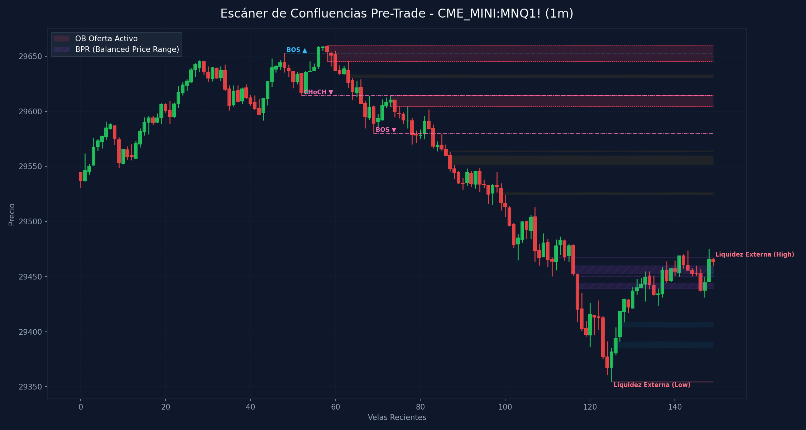

# 🛠️ Reporte Pre-Trade: Mapa de Confluencias (SMC & ICT)
        
Este reporte ha sido generado según los lineamientos de tu **Manual Operativo de Trading**. Analiza las confluencias de temporalidad menor para preparar tu Killzone y delinear tus puntos de interés antes de operar.

---

## 📅 Información de la Sesión
* **Fecha:** `2026-06-12`
* **Activo:** `CME_MINI:MNQ1!`
* **Temporalidad:** `1m` (LTF / Gatillo)
* **Precio Actual:** `29463.5`
* **Vinculación Temporal:** 
  * 🔗 [Ver Autopsia y Bitácora Post-Trade de esta Sesión](2026-06-12_session.md) (Se generará al finalizar tu sesión)

---

## 🛡️ Alerta del Guardia de Riesgo (IA Risk Mentor)

> [!IMPORTANT]
> **Estadísticas de Bitácora:** Sesiones: `11` | PnL Acumulado: `$3283.00 USD` | Win Rate: `63.6%`
> 
> **🚨 TUS ERRORES PSICOLÓGICOS MÁS RECURRENTES A EVITAR HOY:**
> * **FOMO:** presente en el `45.5%` de las sesiones previas.
> * **Ignorar Resistencia:** presente en el `45.5%` de las sesiones previas.
>
> **📝 LECCIONES CLAVE A RECORDAR:**
> * 1. La Disciplina ante el Bias Paga Rentabilidad: Alinearse estrictamente con el HTF Bias (Bullish) en zona de descuento macro y descartar los cortos contra-tendencia es la base de los trades de alta probabilidad.
> * La Espera del Retesteo Reduce el Riesgo: No entrar persiguiendo velas de expansión alcista sino esperar con paciencia el pullback al FVG mitigador es la diferencia entre ser liquidado o lograr una entrada limpia con excelente R:R.
> * El Plan Vence a la Intuición: Ignorar el impulso de tomar shorts discrecionales (incluso cuando otros mentores o el ruido de micro-temporalidades sugerían caídas) y aferrarse a las reglas del manual operativo condujo a una sesión sumamente rentable.

---

## 🧠 Predicción de Machine Learning (SMC Setup Classifier)
El clasificador de Inteligencia Artificial analizó la confluencia de este escenario de pre-sesión con tus datos históricos de trade:

```text
=== PREDICCIÓN DE PROBABILIDAD DE ÉXITO ===

==================================================
SETUP EVALUADO:
 - Instrumento: NQ | Dirección: Long | Sesión: NY AM KZ
 - Confluencias: in kill zone (london / ny am / pm), at htf pd array (ob / fvg / breaker), fair value gap (fvg) on entry tf, order block (ob) alignment, htf market structure bias confirmed
--------------------------------------------------
PROBABILIDAD DE WIN RATE ESTIMADA: 80.4%
🚀 SETUP ALTA PROBABILIDAD (A+): Recomendado operar con riesgo estándar (1.0%).
==================================================
```

---

## 🎨 Marcaciones Manuales en tu Gráfico (TradingView)
Esta sección extrae automáticamente tus rectángulos (cajas de zonas) y líneas dibujadas a mano en TradingView y comprueba su confluencia con las zonas de liquidez y estructuras de Smart Money Concepts:

  * **Caja Gris con etiqueta '30m'** en rango `29548.65 - 29591.75` | Estado: 🟡 Fuera del precio | Confluencias: **OB 4H** (29331.2 - 29743.0), **FVG 1H** (29464.0 - 29549.0), **FVG 30m** (29549.0 - 29591.8), **FVG 15m** (29549.0 - 29580.0), **FVG 4m** (29563.5 - 29571.2), **FVG 4m** (29549.0 - 29559.8), **FVG 3m** (29563.5 - 29566.5)
  * **Caja Gris con etiqueta '30m'** en rango `29572.25 - 29593.40` | Estado: 🟡 Fuera del precio | Confluencias: **OB 4H** (29331.2 - 29743.0), **FVG 30m** (29549.0 - 29591.8), **FVG 15m** (29549.0 - 29580.0)
  * **Caja Gris con etiqueta '15m'** en rango `29460.00 - 29614.25` | Estado: 🟢 PRECIO DENTRO | Confluencias: **OB 4H** (29331.2 - 29743.0), **FVG 1H** (29464.0 - 29549.0), **FVG 30m** (29549.0 - 29591.8), **FVG 30m** (29464.0 - 29529.0), **FVG 15m** (29549.0 - 29580.0), **FVG 15m** (29489.2 - 29529.0), **FVG 5m** (29513.0 - 29515.0), **FVG 4m** (29563.5 - 29571.2), **FVG 4m** (29549.0 - 29559.8), **FVG 3m** (29563.5 - 29566.5), **FVG 2m** (29514.0 - 29515.0), **OB 1m** (29604.5 - 29614.5)
  * **Caja Gris con etiqueta '5m'** en rango `29435.88 - 29450.25` | Estado: 🟡 Fuera del precio | Confluencias: **OB 4H** (29331.2 - 29743.0), **FVG 1m** (29439.2 - 29444.5)
  * **Caja Gris con etiqueta '5m'** en rango `29418.75 - 29423.71` | Estado: 🟡 Fuera del precio | Confluencias: **OB 4H** (29331.2 - 29743.0), **FVG 5m** (29418.8 - 29423.5)
  * **Línea Manual con etiqueta 'ifl d'** en nivel `29854.75` | Estado: Fuera de rango
  * **Línea Manual con etiqueta 'ifl 4h-ll'** en nivel `29261.00` | Estado: Fuera de rango | Ubicación: dentro de **OB 15m** (29261.0 - 29322.8), dentro de **OB 5m** (29261.0 - 29291.0), dentro de **OB 4m** (29261.0 - 29291.0)
  * **Línea Manual con etiqueta 'ifl 4h'** en nivel `30260.00` | Estado: Fuera de rango
  * **Línea Manual con etiqueta 'ifl 1h'** en nivel `28533.00` | Estado: Fuera de rango | Ubicación: dentro de **OB 4H** (28264.2 - 28537.8), dentro de **OB 30m** (28533.0 - 28648.5)
  * **Línea Manual con etiqueta 'lh'** en nivel `29668.00` | Estado: Fuera de rango | Ubicación: dentro de **OB 4H** (29331.2 - 29743.0), dentro de **OB 1H** (29633.2 - 29847.0)
  * **Línea Manual con etiqueta 'ifl 15m'** en nivel `29068.75` | Estado: Fuera de rango | Ubicación: dentro de **FVG 1H** (28975.5 - 29068.8)
  * **Línea Manual con etiqueta 'ssl'** en nivel `28678.50` | Estado: Fuera de rango | Ubicación: dentro de **OB 30m** (28577.5 - 28861.5)
  * **Línea Manual con etiqueta 'ifl 5m'** en nivel `29614.50` | Estado: Fuera de rango | Ubicación: dentro de **OB 4H** (29331.2 - 29743.0), dentro de **OB 15m** (29614.2 - 29659.8), dentro de **OB 1m** (29604.5 - 29614.5)

---

## ⏳ Análisis Estructural Multi-Temporalidad Completo (9 Timeframes)
Escaneo automático y en segundo plano de estructura de mercado y zonas institucionales activas en todos los marcos de tiempo analizados (de mayor a menor):

| Temporalidad | Sesgo Estructural | Rango (Premium/Discount) | Últimos OBs Activos | Últimos FVGs Activos |
| :--- | :--- | :--- | :--- | :--- |
| **4H** | Bullish 🟢 | Premium (Ventas) 🔴 | 🔴 Supply (29331.2-29743.0), 🟢 Demand (28264.2-28537.8) | 🔴 Bearish (30694.8-30701.0), 🔴 Bearish (30264.5-30393.5) |
| **1H** | Bullish 🟢 | Premium (Ventas) 🔴 | 🔴 Supply (29633.2-29847.0), 🟢 Demand (28264.2-28447.2) | 🟢 Bullish (28975.5-29068.8), 🔴 Bearish (29464.0-29549.0) |
| **30m** | Bullish 🟢 | Discount (Compras) 🟢 | 🟢 Demand (28533.0-28648.5), 🟢 Demand (28577.5-28861.5) | 🔴 Bearish (29549.0-29591.8), 🔴 Bearish (29464.0-29529.0) |
| **15m** | Bearish 🔴 | Discount (Compras) 🟢 | 🟢 Demand (29261.0-29322.8), 🔴 Supply (29614.2-29659.8) | 🔴 Bearish (29549.0-29580.0), 🔴 Bearish (29489.2-29529.0) |
| **5m** | Bearish 🔴 | Discount (Compras) 🟢 | 🟢 Demand (29261.0-29291.0), 🔴 Supply (29633.2-29659.8) | 🔴 Bearish (29513.0-29515.0), 🟢 Bullish (29418.8-29423.5) |
| **4m** | Bearish 🔴 | Discount (Compras) 🟢 | 🟢 Demand (29261.0-29291.0), 🔴 Supply (29637.0-29659.8) | 🔴 Bearish (29563.5-29571.2), 🔴 Bearish (29549.0-29559.8) |
| **3m** | Bearish 🔴 | Premium (Ventas) 🔴 | 🔴 Supply (29620.8-29661.0), 🔴 Supply (29641.0-29659.8) | 🔴 Bearish (29563.5-29566.5), 🟢 Bullish (29414.5-29417.2) |
| **2m** | Bearish 🔴 | Premium (Ventas) 🔴 | 🔴 Supply (29628.8-29661.0), 🔴 Supply (29645.5-29659.8) | 🔴 Bearish (29514.0-29515.0), 🟢 Bullish (29404.0-29417.2) |
| **1m** | Bearish 🔴 | Premium (Ventas) 🔴 | 🔴 Supply (29645.5-29659.8), 🔴 Supply (29604.5-29614.5) | 🟢 Bullish (29404.0-29408.8), 🟢 Bullish (29439.2-29444.5) |

---

## 📊 Mapa de Gráfico de Confluencias
Este gráfico mapea de forma precisa la liquidez externa, los bloques de orden activos, los vacíos de liquidez y los rangos de precio balanceados (BPR):



---

## 🔍 Análisis Estructural Top-Down (Multi-Temporalidad)
Análisis de temporalidades HTF de Nasdaq en el fondo sin alterar tu TradingView Desktop:

* **1H HTF Bias:** `Bullish 🟢` | Mapeado según el último BOS estructural en 1 hora.
* **1H Zonas Clave:**
  * OB de 1H Supply: Rango `29633.25 - 29847.00`
  * OB de 1H Demand: Rango `28264.25 - 28447.25`
  * FVG de 1H Bullish: Rango `28975.50 - 29068.75`
  * FVG de 1H Bearish: Rango `29464.00 - 29549.00`

* **15m POIs de Confluencia:**
  * OB de 15m Demand: Rango `29261.00 - 29322.75` | Ver [[Order Block (Bullish)]] o [[Order Block (Bearish)]]
  * OB de 15m Supply: Rango `29614.25 - 29659.75` | Ver [[Order Block (Bullish)]] o [[Order Block (Bearish)]]
  * FVG de 15m Bearish: Rango `29549.00 - 29580.00` | Ver [[Fair Value Gap]]
  * FVG de 15m Bearish: Rango `29489.25 - 29529.00` | Ver [[Fair Value Gap]]

---

## ⚡ Correlación Inter-Mercado (SMT Divergence)
* **Estado SMT:** `S&P 500 (MES) y Nasdaq (MNQ) alineados de forma regular en el Open (Sin divergencias activas). Ver [[SMT Divergence]]`

---

## 🧲 Puntos de Interés (POI) y Liquidez LTF (1m)

### 🌐 1. Liquidez Externa (HTF / Session Pivots)
Niveles clave para buscar barridas de liquidez (*sweeps*) en la apertura de sesión o Killzone:
* **Liquidez Externa Superior (Swing High):** `29466.75` (Vela #149) | Ver [[External Liquidity]] y [[Swing High]]
* **Liquidez Externa Inferior (Swing Low):** `29354.5` (Vela #125) | Ver [[External Liquidity]] y [[Swing Low]]

* **Pools de Liquidez Interna Activos (Unswept):**
  * *No se detectan pools de liquidez interna inmitigados en el rango de precios actual. Ver [[Internal Liquidity]]*

### 🟢 2. Bloques de Orden de Demanda (Soportes / Compras)
Zonas institucionales activas de alta concentración de compras limitadas. Ver [[Order Block (Bullish)]].

| Tipo | Rango de Precio | Volumen | Estado |
| :--- | :--- | :--- | :--- |

### 🔴 3. Bloques de Orden de Oferta (Resistencias / Ventas)
Zonas institucionales activas de alta concentración de ventas limitadas. Ver [[Order Block (Bearish)]].

| Tipo | Rango de Precio | Volumen | Estado |
| :--- | :--- | :--- | :--- |
| **Supply OB** | `29645.5 - 29659.75` | `2887.0` | **Inmitigado (Activo)** ⚡ |
| **Supply OB** | `29604.5 - 29614.5` | `3144.0` | **Inmitigado (Activo)** ⚡ |

---

## 🌀 4. Anatomía de Fair Value Gaps (FVG) e Inversiones
Análisis detallado de imbalances de precios y su **probabilidad de inversión (iFVG)** según la secuencia de sus 3 velas. Ver [[Fair Value Gap]] e [[IFVG]].

| Dirección | Rango de FVG | Perfil de Velas | Probabilidad de Inversión / Comportamiento |
| :--- | :--- | :--- | :--- |
| 🔴 Bearish FVG | `29630.5 - 29633.25` | `R-G-R` (Vela #63) | Fácil de Invertir (iFVG de Alta Probabilidad) 🟢 |
| 🔴 Bearish FVG | `29563.5 - 29564.5` | `G-R-R` (Vela #86) | Moderado (Extra Confirmación) 🟡 |
| 🔴 Bearish FVG | `29551.5 - 29559.75` | `R-R-R` (Vela #87) | Fuerte Desplazamiento Bajista (Gran probabilidad de ser Respetado) 🔴 |
| 🔴 Bearish FVG | `29524.25 - 29526.5` | `G-R-R` (Vela #99) | Moderado (Extra Confirmación) 🟡 |
| 🟢 Bullish FVG | `29385.75 - 29391.0` | `R-G-G` (Vela #126) | Moderado (Extra Confirmación) 🟡 |
| 🟢 Bullish FVG | `29404.0 - 29408.75` | `G-G-G` (Vela #127) | Fuerte Desplazamiento Alcista (Gran probabilidad de ser Respetado) 🟢 |
| 🟢 Bullish FVG | `29449.75 - 29460.0` | `R-G-G` (Vela #148) | Moderado (Extra Confirmación) 🟡 |

---

## 🟣 5. Balanced Price Ranges (BPR) Detectados
Solapamientos de FVG alcistas y bajistas en el mismo nivel de precios. Actúan como soportes/resistencias magnéticos de altísima precisión. Ver [[Balanced Price Range]].
* **BPR Detectado:** Rango `29467.50 - 29467.75` | Solapamiento de FVG Alcista (Vela #112) y Bajista (Vela #110)
* **BPR Detectado:** Rango `29439.25 - 29444.50` | Solapamiento de FVG Alcista (Vela #137) y Bajista (Vela #117)
* **BPR Detectado:** Rango `29452.50 - 29460.00` | Solapamiento de FVG Alcista (Vela #148) y Bajista (Vela #116)
* **BPR Detectado:** Rango `29449.75 - 29451.00` | Solapamiento de FVG Alcista (Vela #148) y Bajista (Vela #117)
* **BPR Detectado:** Rango `29449.75 - 29450.50` | Solapamiento de FVG Alcista (Vela #148) y Bajista (Vela #146)

---

## 🔄 6. Estructura de Mercado Reciente (BOS / CHoCH)
Rupturas de estructura registradas en el gráfico. Ver [[Market Structure]], [[Break of Structure]] y [[Change of Character]]:
* **BOS (Break of Structure) Alcista 🟢** en nivel `29652.75` | Confirmado en la vela #48
* **CHoCH (Change of Character) Bajista 🔴** en nivel `29614.25` | Confirmado en la vela #52
* **BOS (Break of Structure) Bajista 🔴** en nivel `29580.0` | Confirmado en la vela #69

---

## 💡 Protocolo Operativo Pre-Trade (Tu Plan de Sesión)

> [!IMPORTANT]
> **Checklist antes de apretar el gatillo (LTF 1m - 5m):**
> 1. **Fase 1 (Sweep):** Espera a que el precio barra una de las zonas de **Liquidez Externa** (`29466.75` / `29354.5`) o mitigue un POI HTF.
> 2. **Fase 2 (iFVG Trigger):** Busca una reacción post-sweep. El cuerpo de la vela debe cerrar y romper un FVG contrario, prioritariamente con perfil **Easy to Invert (R-G-R o G-R-G)**, convirtiéndolo en un **iFVG**.
> 3. **Gestión de Riesgo:** Si opera en All-Time Highs, gestión estricta con relación de **1:1 R:R**. En días de noticias, no ingresar a operaciones dentro de los **5 minutos anteriores** a la publicación.
