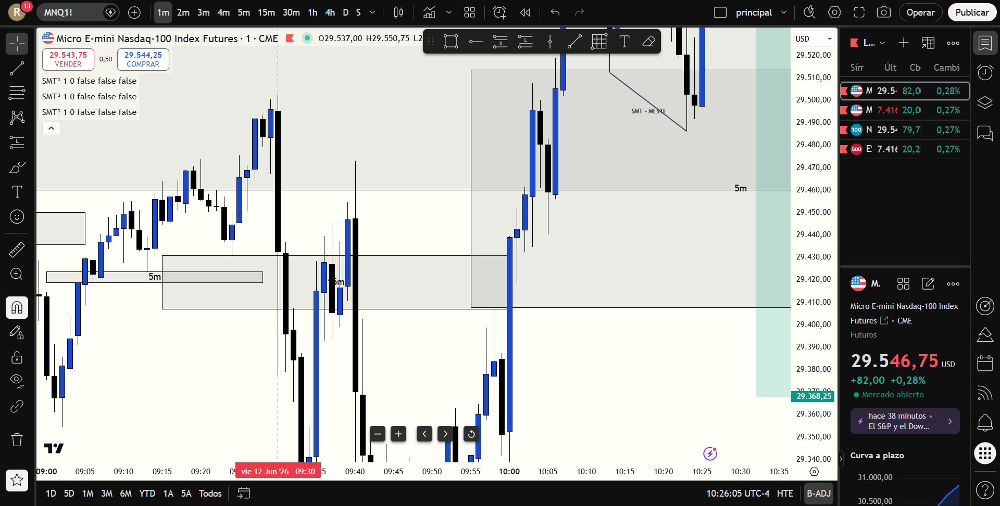

# 📅 BITÁCORA DE TRADING — 12 de Junio de 2026
**Pre-Trade Links:** [[2026-06-12_pre_trade_MNQ]] y [[2026-06-12_pre_trade_MES]]

## 📊 RESUMEN GENERAL DE LA SESIÓN
- **Resultado Neto:** `$0.00 USD`
- **Trades Realizados:** `0`
- **Resultado:** `NO TRADE (Preservación de Capital)`
- **Contexto de Cuenta Fondeada (Eval):**
  * Balance Actual: `$52,706.00 USD` (al 12/06/2026)
  * Objetivo de Beneficio: `$53,000.00 USD`
  * Distancia al Objetivo: `-$294.00 USD` (para alcanzar $53,000)
  * Días Hábiles Restantes: `5 días`

---

## 🖼️ CAPTURA DE PANTALLA

---

## 🔍 ANÁLISIS ESTRUCTURAL DE TEMPORALIDADES (TOP-DOWN)
### 1. Temporalidades Mayores (HTF: 4h / 1h)
- **Bias:** Bullish 🟢 | Sesgo macro alcista confirmado en el premarket. El mercado reaccionó con fuerza en compras inmediatamente tras mitigar la zona de soporte diario.
- **Narrativa:** El mercado abrió con un movimiento bajista muy agresivo (un "dump" de apertura de NY de casi 250 puntos en NQ). Esta caída sirvió como barrida de la liquidez externa de mínimos.

### 2. Temporalidades Intermedias (30m / 15m)
- **Zonas clave (POIs):** 
  * En **MNQ**, el precio barrió el Swing Low de `29354.5` y mitigó la zona de demanda del OB de 15m (`29261.00 - 29322.75`), deteniéndose justo en la línea de soporte manual de 4H `ifl 4h-ll` (`29261.00`) con un mínimo en `29256`.
  * En **MES**, se barrió el Swing Low de `7397.0` mitigando el OB de demanda de 15m, alcanzando un mínimo de `7366.50`.

### 3. Temporalidad de Ejecución (5m / 2m / 1m)
- **Gatillo / Desplazamiento:**
  * Tras barrer la liquidez y mitigar las zonas HTF, el precio inició una recuperación en V extremadamente rápida y violenta (+300 puntos en NQ sin dar pullbacks profundos).
  * No se presentó una entrada de alta probabilidad dentro del manual operativo debido a la velocidad del movimiento inicial. Entrar tarde (FOMO) habría implicado un riesgo excesivo y un R:R deficiente.
  * Posteriormente, al alcanzar la resistencia de la caja gris de 30m (`29548 - 29591`), se configuró una **Divergencia SMT Bajista** en los picos de las 10:10 AM y 10:17 AM (MES haciendo Higher High y MNQ haciendo Lower High). Aunque esto validaba un corto de retroceso (counter-trend), la sesión se cerró sin tomar posiciones para priorizar la preservación de capital.

---

## 📈 REPORTE DETALLADO DE LOS TRADES
*No se ejecutaron operaciones durante esta sesión.*

---

## 🧠 LECCIONES DE LA SESIÓN
1. **No Operar es Operar (Preservación de Capital):** Ante movimientos extremadamente rápidos y expansivos que no ofrecen retrocesos ordenados a zonas de descuento, la mejor decisión es mantenerse al margen. No tomar trades emocionales por FOMO es un triunfo de la disciplina.
2. **Precisión de las Marcaciones Manuales:** El precio respetó milimétricamente la línea `ifl 4h-ll` en `29261.00` (mínimo de la sesión en `29256.00`). Esto valida la calidad del análisis pre-trade y la importancia de confiar en los niveles trazados.
3. **Lectura Correcta del SMT:** Se identificó exitosamente la divergencia SMT bajista en los máximos locales en zona de resistencia, lo cual sirve como excelente práctica analítica para futuras sesiones de scalping en contra-tendencia.
