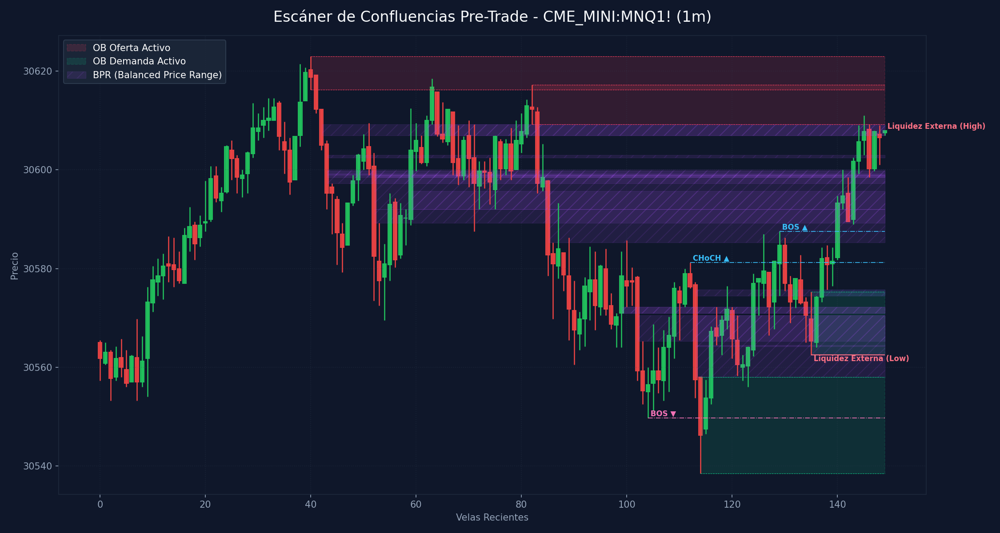

# 🛠️ Reporte Pre-Trade: Mapa de Confluencias (SMC & ICT)
        
Este reporte ha sido generado según los lineamientos de tu **Manual Operativo de Trading**. Analiza las confluencias de temporalidad menor para preparar tu Killzone y delinear tus puntos de interés antes de operar.

---

## 📅 Información de la Sesión
* **Fecha:** `2026-06-15`
* **Activo:** `CME_MINI:MNQ1!`
* **Temporalidad:** `1m` (LTF / Gatillo)
* **Precio Actual:** `30608.0`
* **Vinculación Temporal:** 
  * 🔗 [Ver Autopsia y Bitácora Post-Trade de esta Sesión](2026-06-15_session.md) (Se generará al finalizar tu sesión)

---

## 🛡️ Alerta del Guardia de Riesgo (IA Risk Mentor)

> [!IMPORTANT]
> **Estadísticas de Bitácora:** Sesiones: `12` | PnL Acumulado: `$3283.00 USD` | Win Rate: `58.3%`
> 
> **🚨 TUS ERRORES PSICOLÓGICOS MÁS RECURRENTES A EVITAR HOY:**
> * **FOMO:** presente en el `50.0%` de las sesiones previas.
> * **Ignorar Resistencia:** presente en el `50.0%` de las sesiones previas.
>
> **📝 LECCIONES CLAVE A RECORDAR:**
> * 1. La Disciplina ante el Bias Paga Rentabilidad: Alinearse estrictamente con el HTF Bias (Bullish) en zona de descuento macro y descartar los cortos contra-tendencia es la base de los trades de alta probabilidad.
> * La Espera del Retesteo Reduce el Riesgo: No entrar persiguiendo velas de expansión alcista sino esperar con paciencia el pullback al FVG mitigador es la diferencia entre ser liquidado o lograr una entrada limpia con excelente R:R.
> * El Plan Vence a la Intuición: Ignorar el impulso de tomar shorts discrecionales (incluso cuando otros mentores o el ruido de micro-temporalidades sugerían caídas) y aferrarse a las reglas del manual operativo condujo a una sesión sumamente rentable.

---

## 🧠 Predicción de Machine Learning (SMC Setup Classifier)
El clasificador de Inteligencia Artificial analizó la confluencia de este escenario de pre-sesión con tus datos históricos de trade:

```text
=== PREDICCIÓN DE PROBABILIDAD DE ÉXITO ===

==================================================
SETUP EVALUADO:
 - Instrumento: NQ | Dirección: Long | Sesión: NY AM KZ
 - Confluencias: in kill zone (london / ny am / pm), at htf pd array (ob / fvg / breaker), fair value gap (fvg) on entry tf, order block (ob) alignment, htf market structure bias confirmed
--------------------------------------------------
PROBABILIDAD DE WIN RATE ESTIMADA: 80.4%
🚀 SETUP ALTA PROBABILIDAD (A+): Recomendado operar con riesgo estándar (1.0%).
==================================================
```

---

## 🎨 Marcaciones Manuales en tu Gráfico (TradingView)
Esta sección extrae automáticamente tus rectángulos (cajas de zonas) y líneas dibujadas a mano en TradingView y comprueba su confluencia con las zonas de liquidez y estructuras de Smart Money Concepts:

  * **Caja Gris con etiqueta '4h'** en rango `30486.75 - 30508.76` | Estado: 🟡 Fuera del precio | Confluencias: **OB 4H** (30495.5 - 30807.8), **FVG 4H** (30219.0 - 30509.5)
  * **Caja Gris con etiqueta '1h'** en rango `30368.75 - 30421.69` | Estado: 🟡 Fuera del precio | Confluencias: **FVG 4H** (30219.0 - 30509.5)
  * **Caja Gris con etiqueta '5m'** en rango `30586.38 - 30595.25` | Estado: 🟡 Fuera del precio | Confluencias: **OB 4H** (30495.5 - 30807.8), **FVG 3m** (30593.2 - 30595.2)
  * **Línea Manual con etiqueta 'ifl 1h'** en nivel `30896.00` | Estado: Fuera de rango
  * **Línea Manual con etiqueta 'nwog'** en nivel `29969.75` | Estado: Fuera de rango
  * **Línea Manual con etiqueta 'nwog'** en nivel `30100.00` | Estado: Fuera de rango | Ubicación: dentro de **FVG 4H** (30095.0 - 30172.0), dentro de **FVG 1H** (30072.0 - 30125.2)
  * **Línea Manual con etiqueta 'ifl 1h'** en nivel `30552.75` | Estado: Fuera de rango | Ubicación: dentro de **OB 4H** (30495.5 - 30807.8), dentro de **OB 1m** (30538.5 - 30558.0)
  * **Línea Manual con etiqueta 'al'** en nivel `30282.00` | Estado: Fuera de rango | Ubicación: dentro de **FVG 4H** (30219.0 - 30509.5)
  * **Línea Manual con etiqueta 'll'** en nivel `30509.50` | Estado: Fuera de rango | Ubicación: dentro de **OB 4H** (30495.5 - 30807.8), dentro de **FVG 4H** (30219.0 - 30509.5)
  * **Línea Manual con etiqueta 'lh'** en nivel `30628.50` | Estado: 🎯 PRECIO CERCA | Ubicación: dentro de **OB 4H** (30495.5 - 30807.8)
  * **Línea Manual con etiqueta 'ifl 30m'** en nivel `30502.75` | Estado: Fuera de rango | Ubicación: dentro de **OB 4H** (30495.5 - 30807.8), dentro de **FVG 4H** (30219.0 - 30509.5)

---

## ⏳ Análisis Estructural Multi-Temporalidad Completo (9 Timeframes)
Escaneo automático y en segundo plano de estructura de mercado y zonas institucionales activas en todos los marcos de tiempo analizados (de mayor a menor):

| Temporalidad | Sesgo Estructural | Rango (Premium/Discount) | Últimos OBs Activos | Últimos FVGs Activos |
| :--- | :--- | :--- | :--- | :--- |
| **4H** | Bullish 🟢 | Premium (Ventas) 🔴 | 🔴 Supply (30495.5-30807.8), 🟢 Demand (28264.2-28537.8) | 🟢 Bullish (30095.0-30172.0), 🟢 Bullish (30219.0-30509.5) |
| **1H** | Bullish 🟢 | Discount (Compras) 🟢 | 🟢 Demand (28264.2-28447.2), 🟢 Demand (29231.2-29502.5) | 🟢 Bullish (28975.5-29068.8), 🟢 Bullish (30072.0-30125.2) |
| **30m** | Bullish 🟢 | Discount (Compras) 🟢 | 🟢 Demand (29231.2-29502.5), 🟢 Demand (29408.0-29748.2) | *Ninguno* |
| **15m** | Bullish 🟢 | Discount (Compras) 🟢 | 🟢 Demand (29408.0-29623.2), 🟢 Demand (29990.0-30048.8) | *Ninguno* |
| **5m** | Bullish 🟢 | Premium (Ventas) 🔴 | 🟢 Demand (30220.2-30252.2), 🟢 Demand (30529.5-30548.0) | 🟢 Bullish (30183.5-30195.0), 🟢 Bullish (30199.5-30202.2) |
| **4m** | Bearish 🔴 | Premium (Ventas) 🔴 | 🟢 Demand (30529.5-30546.2), 🔴 Supply (30600.8-30618.5) | *Ninguno* |
| **3m** | Bearish 🔴 | Premium (Ventas) 🔴 | 🟢 Demand (30529.5-30542.8), 🔴 Supply (30605.5-30618.5) | 🟢 Bullish (30527.2-30529.2), 🔴 Bearish (30593.2-30595.2) |
| **2m** | Bearish 🔴 | Premium (Ventas) 🔴 | 🟢 Demand (30529.5-30542.8), 🔴 Supply (30606.5-30617.2) | 🔴 Bearish (30598.0-30606.5), 🟢 Bullish (30575.2-30576.5) |
| **1m** | Bullish 🟢 | Discount (Compras) 🟢 | 🔴 Supply (30609.2-30617.2), 🟢 Demand (30538.5-30558.0) | 🔴 Bearish (30605.2-30609.2), 🟢 Bullish (30574.5-30575.8) |

---

## 📊 Mapa de Gráfico de Confluencias
Este gráfico mapea de forma precisa la liquidez externa, los bloques de orden activos, los vacíos de liquidez y los rangos de precio balanceados (BPR):



---

## 🔍 Análisis Estructural Top-Down (Multi-Temporalidad)
Análisis de temporalidades HTF de Nasdaq en el fondo sin alterar tu TradingView Desktop:

* **1H HTF Bias:** `Bullish 🟢` | Mapeado según el último BOS estructural en 1 hora.
* **1H Zonas Clave:**
  * OB de 1H Demand: Rango `28264.25 - 28447.25`
  * OB de 1H Demand: Rango `29231.25 - 29502.50`
  * FVG de 1H Bullish: Rango `28975.50 - 29068.75`
  * FVG de 1H Bullish: Rango `30072.00 - 30125.25`

* **15m POIs de Confluencia:**
  * OB de 15m Demand: Rango `29408.00 - 29623.25` | Ver [[Order Block (Bullish)]] o [[Order Block (Bearish)]]
  * OB de 15m Demand: Rango `29990.00 - 30048.75` | Ver [[Order Block (Bullish)]] o [[Order Block (Bearish)]]

---

## ⚡ Correlación Inter-Mercado (SMT Divergence)
* **Estado SMT:** `S&P 500 (MES) y Nasdaq (MNQ) alineados de forma regular en el Open (Sin divergencias activas). Ver [[SMT Divergence]]`

---

## 🧲 Puntos de Interés (POI) y Liquidez LTF (1m)

### 🌐 1. Liquidez Externa (HTF / Session Pivots)
Niveles clave para buscar barridas de liquidez (*sweeps*) en la apertura de sesión o Killzone:
* **Liquidez Externa Superior (Swing High):** `30608.0` (Vela #149) | Ver [[External Liquidity]] y [[Swing High]]
* **Liquidez Externa Inferior (Swing Low):** `30562.5` (Vela #135) | Ver [[External Liquidity]] y [[Swing Low]]

* **Pools de Liquidez Interna Activos (Unswept):**
  * *No se detectan pools de liquidez interna inmitigados en el rango de precios actual. Ver [[Internal Liquidity]]*

### 🟢 2. Bloques de Orden de Demanda (Soportes / Compras)
Zonas institucionales activas de alta concentración de compras limitadas. Ver [[Order Block (Bullish)]].

| Tipo | Rango de Precio | Volumen | Estado |
| :--- | :--- | :--- | :--- |
| **Demand OB** | `30538.5 - 30558.0` | `3051.0` | **Inmitigado (Activo)** 🔥 |
| **Demand OB** | `30562.5 - 30575.25` | `2856.0` | **Inmitigado (Activo)** 🔥 |

### 🔴 3. Bloques de Orden de Oferta (Resistencias / Ventas)
Zonas institucionales activas de alta concentración de ventas limitadas. Ver [[Order Block (Bearish)]].

| Tipo | Rango de Precio | Volumen | Estado |
| :--- | :--- | :--- | :--- |
| **Supply OB** | `30616.25 - 30623.0` | `2194.0` | **Inmitigado (Activo)** ⚡ |
| **Supply OB** | `30609.25 - 30617.25` | `2906.0` | **Inmitigado (Activo)** ⚡ |

---

## 🌀 4. Anatomía de Fair Value Gaps (FVG) e Inversiones
Análisis detallado de imbalances de precios y su **probabilidad de inversión (iFVG)** según la secuencia de sus 3 velas. Ver [[Fair Value Gap]] e [[IFVG]].

| Dirección | Rango de FVG | Perfil de Velas | Probabilidad de Inversión / Comportamiento |
| :--- | :--- | :--- | :--- |
| 🟢 Bullish FVG | `30574.5 - 30575.75` | `R-G-G` (Vela #137) | Moderado (Extra Confirmación) 🟡 |

---

## 🟣 5. Balanced Price Ranges (BPR) Detectados
Solapamientos de FVG alcistas y bajistas en el mismo nivel de precios. Actúan como soportes/resistencias magnéticos de altísima precisión. Ver [[Balanced Price Range]].
* **BPR Detectado:** Rango `30599.00 - 30600.00` | Solapamiento de FVG Alcista (Vela #49) y Bajista (Vela #43)
* **BPR Detectado:** Rango `30597.25 - 30599.75` | Solapamiento de FVG Alcista (Vela #59) y Bajista (Vela #43)
* **BPR Detectado:** Rango `30592.00 - 30599.00` | Solapamiento de FVG Alcista (Vela #59) y Bajista (Vela #52)
* **BPR Detectado:** Rango `30592.00 - 30595.75` | Solapamiento de FVG Alcista (Vela #59) y Bajista (Vela #85)
* **BPR Detectado:** Rango `30607.00 - 30609.25` | Solapamiento de FVG Alcista (Vela #62) y Bajista (Vela #42)
* **BPR Detectado:** Rango `30607.00 - 30609.25` | Solapamiento de FVG Alcista (Vela #62) y Bajista (Vela #83)
* **BPR Detectado:** Rango `30571.00 - 30572.25` | Solapamiento de FVG Alcista (Vela #99) y Bajista (Vela #102)
* **BPR Detectado:** Rango `30571.00 - 30572.25` | Solapamiento de FVG Alcista (Vela #99) y Bajista (Vela #113)
* **BPR Detectado:** Rango `30558.00 - 30564.50` | Solapamiento de FVG Alcista (Vela #116) y Bajista (Vela #113)
* **BPR Detectado:** Rango `30565.25 - 30570.50` | Solapamiento de FVG Alcista (Vela #124) y Bajista (Vela #102)
* **BPR Detectado:** Rango `30564.25 - 30570.50` | Solapamiento de FVG Alcista (Vela #124) y Bajista (Vela #113)
* **BPR Detectado:** Rango `30574.50 - 30575.75` | Solapamiento de FVG Alcista (Vela #137) y Bajista (Vela #113)
* **BPR Detectado:** Rango `30589.25 - 30592.00` | Solapamiento de FVG Alcista (Vela #140) y Bajista (Vela #52)
* **BPR Detectado:** Rango `30585.25 - 30592.00` | Solapamiento de FVG Alcista (Vela #140) y Bajista (Vela #85)
* **BPR Detectado:** Rango `30598.50 - 30599.25` | Solapamiento de FVG Alcista (Vela #143) y Bajista (Vela #43)
* **BPR Detectado:** Rango `30598.50 - 30599.00` | Solapamiento de FVG Alcista (Vela #143) y Bajista (Vela #52)
* **BPR Detectado:** Rango `30602.50 - 30603.00` | Solapamiento de FVG Alcista (Vela #144) y Bajista (Vela #43)

---

## 🔄 6. Estructura de Mercado Reciente (BOS / CHoCH)
Rupturas de estructura registradas en el gráfico. Ver [[Market Structure]], [[Break of Structure]] y [[Change of Character]]:
* **BOS (Break of Structure) Bajista 🔴** en nivel `30549.75` | Confirmado en la vela #104
* **CHoCH (Change of Character) Alcista 🟢** en nivel `30581.25` | Confirmado en la vela #112
* **BOS (Break of Structure) Alcista 🟢** en nivel `30587.5` | Confirmado en la vela #129

---

## 💡 Protocolo Operativo Pre-Trade (Tu Plan de Sesión)

> [!IMPORTANT]
> **Checklist antes de apretar el gatillo (LTF 1m - 5m):**
> 1. **Fase 1 (Sweep):** Espera a que el precio barra una de las zonas de **Liquidez Externa** (`30608.0` / `30562.5`) o mitigue un POI HTF.
> 2. **Fase 2 (iFVG Trigger):** Busca una reacción post-sweep. El cuerpo de la vela debe cerrar y romper un FVG contrario, prioritariamente con perfil **Easy to Invert (R-G-R o G-R-G)**, convirtiéndolo en un **iFVG**.
> 3. **Gestión de Riesgo:** Si opera en All-Time Highs, gestión estricta con relación de **1:1 R:R**. En días de noticias, no ingresar a operaciones dentro de los **5 minutos anteriores** a la publicación.
