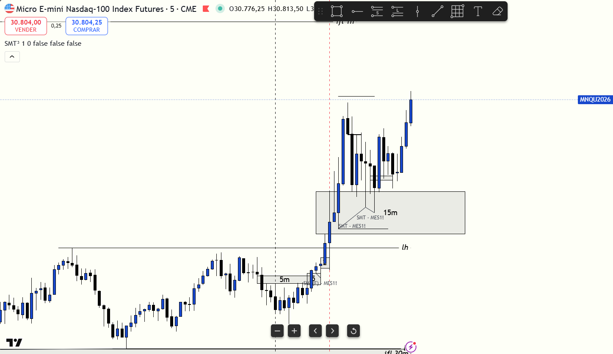

# 📅 BITÁCORA DE TRADING — 15 de Junio de 2026
**Pre-Trade Links:** [[2026-06-15_pre_trade_MNQ]]

## 📊 RESUMEN GENERAL DE LA SESIÓN
- **Resultado Neto:** `$0.00 USD`
- **Trades Realizados:** `0`
- **Resultado:** `NO TRADE (Preservación de Capital)`
- **Contexto de Cuenta Fondeada (Eval):**
  * Balance Actual: `$52,706.00 USD` (al 15/06/2026)
  * Objetivo de Beneficio: `$53,000.00 USD`
  * Distancia al Objetivo: `-$294.00 USD` (para alcanzar $53,000)
  * Días Hábiles Restantes: `4 días`

---

## 🖼️ CAPTURA DE PANTALLA

---

## 🔍 ANÁLISIS ESTRUCTURAL DE TEMPORALIDADES (TOP-DOWN)
### 1. Temporalidades Mayores (HTF: 4h / 1h)
- **Bias:** Bullish 🟢 | Sesgo macro alcista muy fuerte determinado desde el premarket, con el precio cotizando por encima del rango de descuento de 1H.
- **Narrativa:** El mercado mantuvo un flujo de órdenes predominantemente comprador, dirigiéndose de forma sostenida a buscar la liquidez superior de la sesión.

### 2. Temporalidades Intermedias (30m / 15m)
- **Zonas clave (POIs):** El precio continuó su expansión por encima de las zonas de demanda locales, buscando probar la resistencia de la línea manual `lh` en `30628.50`.

### 3. Temporalidad de Ejecución (5m / 2m / 1m)
- **Comportamiento:** 
  * Se observó una aproximación lenta y con fricción hacia el máximo de Londres. Aunque se sondeó la posibilidad de tomar un corto en contra-tendencia tras la toma del London High, la falta de una divergencia SMT clara entre MES y MNQ, combinada con un desplazamiento bajista débil que no logró romper e invertir con contundencia un FVG (Phase 2), invalidó la oportunidad.
  * Respetando el plan conductual, se decidió no forzar compras (largos) en la zona premium debido al peligro de chocar contra los **Supply OBs de 2m** (`30609.25 - 30617.25`), evitando así compras tardías por FOMO.

---

## 📈 REPORTE DETALLADO DE LOS TRADES
*No se ejecutaron operaciones durante esta sesión.*

---

## 🧠 LECCIONES DE LA SESIÓN
1. **Preservación y Paciencia frente al FOMO:** No forzar operaciones en zonas premium de alta fricción o en contra-tendencia sin confirmación exacta. Evitar el FOMO en el London High protege el balance y mantiene intacto el capital.
2. **Cumplimiento del Manual de Confluencia:** El clasificador de ML indicaba alta probabilidad para largos (80.4%), pero exigía esperar un pullback. Dado que el precio no retornó de forma limpia a la zona de demanda de 1m en `30562.5 - 30575.25`, la regla dictaba abstenerse. Seguir esta regla es un éxito operativo.
3. **Control del Guardián Emocional:** Cumplir el plan frío y pausado al no tomar posiciones discrecionales demuestra el desarrollo de una psicología de trading profesional.
