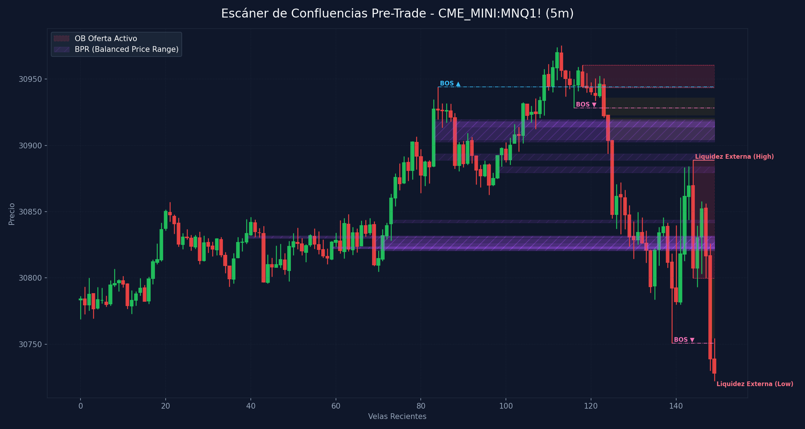

# 🛠️ Reporte Pre-Trade: Mapa de Confluencias (SMC & ICT)
        
Este reporte ha sido generado según los lineamientos de tu **Manual Operativo de Trading**. Analiza las confluencias de temporalidad menor para preparar tu Killzone y delinear tus puntos de interés antes de operar.

---

## 📅 Información de la Sesión
* **Fecha:** `2026-06-16`
* **Activo:** `CME_MINI:MNQ1!`
* **Temporalidad:** `5m` (LTF / Gatillo)
* **Precio Actual:** `30728.0`
* **Vinculación Temporal:** 
  * 🔗 [Ver Autopsia y Bitácora Post-Trade de esta Sesión](2026-06-16_session.md) (Se generará al finalizar tu sesión)

---

## 🛡️ Alerta del Guardia de Riesgo (IA Risk Mentor)

> [!IMPORTANT]
> **Estadísticas de Bitácora:** Sesiones: `13` | PnL Acumulado: `$3283.00 USD` | Win Rate: `53.8%`
> 
> **🚨 TUS ERRORES PSICOLÓGICOS MÁS RECURRENTES A EVITAR HOY:**
> * **FOMO:** presente en el `53.8%` de las sesiones previas.
> * **Ignorar Resistencia:** presente en el `53.8%` de las sesiones previas.
>
> **📝 LECCIONES CLAVE A RECORDAR:**
> * 1. La Disciplina ante el Bias Paga Rentabilidad: Alinearse estrictamente con el HTF Bias (Bullish) en zona de descuento macro y descartar los cortos contra-tendencia es la base de los trades de alta probabilidad.
> * La Espera del Retesteo Reduce el Riesgo: No entrar persiguiendo velas de expansión alcista sino esperar con paciencia el pullback al FVG mitigador es la diferencia entre ser liquidado o lograr una entrada limpia con excelente R:R.
> * El Plan Vence a la Intuición: Ignorar el impulso de tomar shorts discrecionales (incluso cuando otros mentores o el ruido de micro-temporalidades sugerían caídas) y aferrarse a las reglas del manual operativo condujo a una sesión sumamente rentable.

---

## 🧠 Predicción de Machine Learning (SMC Setup Classifier)
El clasificador de Inteligencia Artificial analizó la confluencia de este escenario de pre-sesión con tus datos históricos de trade:

```text
=== PREDICCIÓN DE PROBABILIDAD DE ÉXITO ===

==================================================
SETUP EVALUADO:
 - Instrumento: NQ | Dirección: Long | Sesión: NY AM KZ
 - Confluencias: in kill zone (london / ny am / pm), at htf pd array (ob / fvg / breaker), fair value gap (fvg) on entry tf, order block (ob) alignment, smt divergence present, htf market structure bias confirmed
--------------------------------------------------
PROBABILIDAD DE WIN RATE ESTIMADA: 80.4%
🚀 SETUP ALTA PROBABILIDAD (A+): Recomendado operar con riesgo estándar (1.0%).
==================================================
```

---

## 🎨 Marcaciones Manuales en tu Gráfico (TradingView)
Esta sección extrae automáticamente tus rectángulos (cajas de zonas) y líneas dibujadas a mano en TradingView y comprueba su confluencia con las zonas de liquidez y estructuras de Smart Money Concepts:

  * **Caja Gris con etiqueta '1h'** en rango `30368.75 - 30421.69` | Estado: 🟡 Fuera del precio | Confluencias: **FVG 4H** (30219.0 - 30509.5)
  * **Caja Gris con etiqueta '5m'** en rango `30584.75 - 30598.38` | Estado: 🟡 Fuera del precio | Confluencias: **FVG 30m** (30587.0 - 30601.8), **OB 15m** (30538.5 - 30587.0), **FVG 15m** (30587.0 - 30593.0)
  * **Caja Gris con etiqueta '2m'** en rango `30604.25 - 30616.88` | Estado: 🟡 Fuera del precio | Sin confluencia SMC directa
  * **Caja Gris** en rango `30708.67 - 30713.75` | Estado: 🟡 Fuera del precio | Sin confluencia SMC directa
  * **Caja Gris con etiqueta '30m'** en rango `30873.53 - 30928.25` | Estado: 🟡 Fuera del precio | Confluencias: **FVG 1H** (30889.0 - 30922.5), **FVG 15m** (30923.0 - 30938.2), **FVG 5m** (30923.0 - 30936.0), **FVG 5m** (30904.2 - 30921.0), **FVG 4m** (30922.5 - 30934.8), **FVG 4m** (30904.2 - 30915.8), **FVG 3m** (30923.0 - 30934.8), **FVG 3m** (30910.8 - 30921.0), **FVG 2m** (30910.8 - 30915.8), **FVG 2m** (30904.2 - 30907.5), **FVG 1m** (30914.0 - 30915.8), **FVG 1m** (30904.5 - 30907.5)
  * **Caja Gris con etiqueta '15m'** en rango `30873.60 - 30938.25` | Estado: 🟡 Fuera del precio | Confluencias: **FVG 1H** (30889.0 - 30922.5), **OB 15m** (30937.0 - 30975.5), **FVG 15m** (30923.0 - 30938.2), **FVG 5m** (30923.0 - 30936.0), **FVG 5m** (30904.2 - 30921.0), **FVG 4m** (30922.5 - 30934.8), **FVG 4m** (30904.2 - 30915.8), **FVG 3m** (30923.0 - 30934.8), **FVG 3m** (30910.8 - 30921.0), **FVG 2m** (30910.8 - 30915.8), **FVG 2m** (30904.2 - 30907.5), **FVG 1m** (30914.0 - 30915.8), **FVG 1m** (30904.5 - 30907.5)
  * **Caja Gris con etiqueta '5m'** en rango `30822.25 - 30831.50` | Estado: 🟡 Fuera del precio | Confluencias: **OB 3m** (30750.8 - 30834.0), **OB 2m** (30750.8 - 30834.0)
  * **Caja Gris con etiqueta '5m'** en rango `30820.15 - 30831.50` | Estado: 🟡 Fuera del precio | Confluencias: **OB 3m** (30750.8 - 30834.0), **OB 2m** (30750.8 - 30834.0)
  * **Caja Gris con etiqueta '5m'** en rango `30839.50 - 30843.75` | Estado: 🟡 Fuera del precio | Sin confluencia SMC directa
  * **Caja Gris** en rango `30821.75 - 30829.88` | Estado: 🟡 Fuera del precio | Confluencias: **OB 3m** (30750.8 - 30834.0), **OB 2m** (30750.8 - 30834.0)
  * **Caja Gris** en rango `30791.91 - 30805.25` | Estado: 🟡 Fuera del precio | Confluencias: **OB 3m** (30750.8 - 30834.0), **OB 2m** (30750.8 - 30834.0), **OB 1m** (30750.8 - 30797.0)
  * **Caja Gris** en rango `30754.86 - 30768.50` | Estado: 🟡 Fuera del precio | Confluencias: **OB 3m** (30750.8 - 30834.0), **OB 2m** (30750.8 - 30834.0), **OB 1m** (30750.8 - 30797.0)
  * **Línea Manual con etiqueta 'nwog'** en nivel `29969.75` | Estado: Fuera de rango
  * **Línea Manual con etiqueta 'nwog'** en nivel `30100.00` | Estado: Fuera de rango | Ubicación: dentro de **FVG 4H** (30095.0 - 30172.0)
  * **Línea Manual con etiqueta 'al'** en nivel `30282.00` | Estado: Fuera de rango | Ubicación: dentro de **FVG 4H** (30219.0 - 30509.5)
  * **Línea Manual con etiqueta 'll'** en nivel `30509.50` | Estado: Fuera de rango | Ubicación: dentro de **FVG 4H** (30219.0 - 30509.5)
  * **Línea Manual con etiqueta 'ifl 30m'** en nivel `30502.75` | Estado: Fuera de rango | Ubicación: dentro de **FVG 4H** (30219.0 - 30509.5)
  * **Línea Manual con etiqueta 'ifl 4h-al'** en nivel `30755.25` | Estado: Fuera de rango | Ubicación: dentro de **OB 3m** (30750.8 - 30834.0), dentro de **OB 2m** (30750.8 - 30834.0), dentro de **OB 1m** (30750.8 - 30797.0)
  * **Línea Manual con etiqueta 'lh'** en nivel `30975.50` | Estado: Fuera de rango | Ubicación: dentro de **OB 15m** (30937.0 - 30975.5)
  * **Línea Manual con etiqueta 'ifl 5m'** en nivel `30872.25` | Estado: Fuera de rango

---

## ⏳ Análisis Estructural Multi-Temporalidad Completo (9 Timeframes)
Escaneo automático y en segundo plano de estructura de mercado y zonas institucionales activas en todos los marcos de tiempo analizados (de mayor a menor):

| Temporalidad | Sesgo Estructural | Rango (Premium/Discount) | Últimos OBs Activos | Últimos FVGs Activos |
| :--- | :--- | :--- | :--- | :--- |
| **4H** | Bullish 🟢 | Premium (Ventas) 🔴 | 🟢 Demand (28264.2-28537.8) | 🟢 Bullish (30095.0-30172.0), 🟢 Bullish (30219.0-30509.5) |
| **1H** | Bullish 🟢 | Premium (Ventas) 🔴 | 🟢 Demand (28264.2-28447.2), 🟢 Demand (29231.2-29502.5) | 🟢 Bullish (30617.2-30670.2), 🔴 Bearish (30889.0-30922.5) |
| **30m** | Bullish 🟢 | Discount (Compras) 🟢 | 🟢 Demand (29231.2-29502.5), 🟢 Demand (29408.0-29748.2) | 🟢 Bullish (30587.0-30601.8), 🟢 Bullish (30645.0-30670.2) |
| **15m** | Bearish 🔴 | Discount (Compras) 🟢 | 🟢 Demand (30538.5-30587.0), 🔴 Supply (30937.0-30975.5) | 🟢 Bullish (30587.0-30593.0), 🔴 Bearish (30923.0-30938.2) |
| **5m** | Bearish 🔴 | Premium (Ventas) 🔴 | 🔴 Supply (30943.8-30960.8) | 🔴 Bearish (30923.0-30936.0), 🔴 Bearish (30904.2-30921.0) |
| **4m** | Bearish 🔴 | Premium (Ventas) 🔴 | 🔴 Supply (30950.2-30960.8) | 🔴 Bearish (30922.5-30934.8), 🔴 Bearish (30904.2-30915.8) |
| **3m** | Bullish 🟢 | Discount (Compras) 🟢 | 🔴 Supply (30950.2-30960.8), 🟢 Demand (30750.8-30834.0) | 🔴 Bearish (30923.0-30934.8), 🔴 Bearish (30910.8-30921.0) |
| **2m** | Bullish 🟢 | Discount (Compras) 🟢 | 🔴 Supply (30943.2-30952.5), 🟢 Demand (30750.8-30834.0) | 🔴 Bearish (30910.8-30915.8), 🔴 Bearish (30904.2-30907.5) |
| **1m** | Bullish 🟢 | Premium (Ventas) 🔴 | 🔴 Supply (30946.0-30952.5), 🟢 Demand (30750.8-30797.0) | 🔴 Bearish (30914.0-30915.8), 🔴 Bearish (30904.5-30907.5) |

---

## 📊 Mapa de Gráfico de Confluencias
Este gráfico mapea de forma precisa la liquidez externa, los bloques de orden activos, los vacíos de liquidez y los rangos de precio balanceados (BPR):



---

## 🔍 Análisis Estructural Top-Down (Multi-Temporalidad)
Análisis de temporalidades HTF de Nasdaq en el fondo sin alterar tu TradingView Desktop:

* **1H HTF Bias:** `Bullish 🟢` | Mapeado según el último BOS estructural en 1 hora.
* **1H Zonas Clave:**
  * OB de 1H Demand: Rango `28264.25 - 28447.25`
  * OB de 1H Demand: Rango `29231.25 - 29502.50`
  * FVG de 1H Bullish: Rango `30617.25 - 30670.25`
  * FVG de 1H Bearish: Rango `30889.00 - 30922.50`

* **15m POIs de Confluencia:**
  * OB de 15m Demand: Rango `30538.50 - 30587.00` | Ver [[Order Block (Bullish)]] o [[Order Block (Bearish)]]
  * OB de 15m Supply: Rango `30937.00 - 30975.50` | Ver [[Order Block (Bullish)]] o [[Order Block (Bearish)]]
  * FVG de 15m Bullish: Rango `30587.00 - 30593.00` | Ver [[Fair Value Gap]]
  * FVG de 15m Bearish: Rango `30923.00 - 30938.25` | Ver [[Fair Value Gap]]

---

## ⚡ Correlación Inter-Mercado (SMT Divergence)
* **Estado SMT:** `SMT ALCISTA DETECTADO 🟢 (Nasdaq sostiene mínimos más altos mientras S&P barre a mínimos más bajos. ¡Acumulación institucional!)`

---

## 🧲 Puntos de Interés (POI) y Liquidez LTF (5m)

### 🌐 1. Liquidez Externa (HTF / Session Pivots)
Niveles clave para buscar barridas de liquidez (*sweeps*) en la apertura de sesión o Killzone:
* **Liquidez Externa Superior (Swing High):** `30889.0` (Vela #144) | Ver [[External Liquidity]] y [[Swing High]]
* **Liquidez Externa Inferior (Swing Low):** `30722.25` (Vela #149) | Ver [[External Liquidity]] y [[Swing Low]]

* **Pools de Liquidez Interna Activos (Unswept):**
  * *No se detectan pools de liquidez interna inmitigados en el rango de precios actual. Ver [[Internal Liquidity]]*

### 🟢 2. Bloques de Orden de Demanda (Soportes / Compras)
Zonas institucionales activas de alta concentración de compras limitadas. Ver [[Order Block (Bullish)]].

| Tipo | Rango de Precio | Volumen | Estado |
| :--- | :--- | :--- | :--- |

### 🔴 3. Bloques de Orden de Oferta (Resistencias / Ventas)
Zonas institucionales activas de alta concentración de ventas limitadas. Ver [[Order Block (Bearish)]].

| Tipo | Rango de Precio | Volumen | Estado |
| :--- | :--- | :--- | :--- |
| **Supply OB** | `30943.75 - 30960.75` | `9197.0` | **Inmitigado (Activo)** ⚡ |
| **Supply OB** | `30799.75 - 30889.0` | `124085.0` | **Inmitigado (Activo)** ⚡ |

---

## 🌀 4. Anatomía de Fair Value Gaps (FVG) e Inversiones
Análisis detallado de imbalances de precios y su **probabilidad de inversión (iFVG)** según la secuencia de sus 3 velas. Ver [[Fair Value Gap]] e [[IFVG]].

| Dirección | Rango de FVG | Perfil de Velas | Probabilidad de Inversión / Comportamiento |
| :--- | :--- | :--- | :--- |
| 🔴 Bearish FVG | `30923.0 - 30936.0` | `R-G-R` (Vela #123) | Fácil de Invertir (iFVG de Alta Probabilidad) 🟢 |
| 🔴 Bearish FVG | `30904.25 - 30921.0` | `G-R-R` (Vela #124) | Moderado (Extra Confirmación) 🟡 |
| 🔴 Bearish FVG | `30754.5 - 30799.75` | `G-R-R` (Vela #148) | Moderado (Extra Confirmación) 🟡 |

---

## 🟣 5. Balanced Price Ranges (BPR) Detectados
Solapamientos de FVG alcistas y bajistas en el mismo nivel de precios. Actúan como soportes/resistencias magnéticos de altísima precisión. Ver [[Balanced Price Range]].
* **BPR Detectado:** Rango `30830.00 - 30832.00` | Solapamiento de FVG Alcista (Vela #39) y Bajista (Vela #69)
* **BPR Detectado:** Rango `30830.00 - 30831.50` | Solapamiento de FVG Alcista (Vela #39) y Bajista (Vela #138)
* **BPR Detectado:** Rango `30822.25 - 30823.50` | Solapamiento de FVG Alcista (Vela #59) y Bajista (Vela #69)
* **BPR Detectado:** Rango `30822.25 - 30823.50` | Solapamiento de FVG Alcista (Vela #59) y Bajista (Vela #133)
* **BPR Detectado:** Rango `30822.25 - 30823.50` | Solapamiento de FVG Alcista (Vela #59) y Bajista (Vela #138)
* **BPR Detectado:** Rango `30820.50 - 30829.25` | Solapamiento de FVG Alcista (Vela #71) y Bajista (Vela #69)
* **BPR Detectado:** Rango `30821.50 - 30826.00` | Solapamiento de FVG Alcista (Vela #71) y Bajista (Vela #133)
* **BPR Detectado:** Rango `30820.50 - 30829.25` | Solapamiento de FVG Alcista (Vela #71) y Bajista (Vela #138)
* **BPR Detectado:** Rango `30841.75 - 30843.75` | Solapamiento de FVG Alcista (Vela #73) y Bajista (Vela #144)
* **BPR Detectado:** Rango `30902.75 - 30918.00` | Solapamiento de FVG Alcista (Vela #83) y Bajista (Vela #88)
* **BPR Detectado:** Rango `30904.25 - 30919.75` | Solapamiento de FVG Alcista (Vela #83) y Bajista (Vela #124)
* **BPR Detectado:** Rango `30888.75 - 30893.75` | Solapamiento de FVG Alcista (Vela #83) y Bajista (Vela #125)
* **BPR Detectado:** Rango `30879.50 - 30884.00` | Solapamiento de FVG Alcista (Vela #98) y Bajista (Vela #125)
* **BPR Detectado:** Rango `30914.00 - 30918.00` | Solapamiento de FVG Alcista (Vela #104) y Bajista (Vela #88)
* **BPR Detectado:** Rango `30914.00 - 30919.50` | Solapamiento de FVG Alcista (Vela #104) y Bajista (Vela #124)
* **BPR Detectado:** Rango `30822.25 - 30831.50` | Solapamiento de FVG Alcista (Vela #136) y Bajista (Vela #69)
* **BPR Detectado:** Rango `30822.25 - 30826.00` | Solapamiento de FVG Alcista (Vela #136) y Bajista (Vela #133)
* **BPR Detectado:** Rango `30822.25 - 30831.50` | Solapamiento de FVG Alcista (Vela #136) y Bajista (Vela #138)

---

## 🔄 6. Estructura de Mercado Reciente (BOS / CHoCH)
Rupturas de estructura registradas en el gráfico. Ver [[Market Structure]], [[Break of Structure]] y [[Change of Character]]:
* **BOS (Break of Structure) Alcista 🟢** en nivel `30944.25` | Confirmado en la vela #84
* **BOS (Break of Structure) Bajista 🔴** en nivel `30928.25` | Confirmado en la vela #116
* **BOS (Break of Structure) Bajista 🔴** en nivel `30750.75` | Confirmado en la vela #139

---

## 💡 Protocolo Operativo Pre-Trade (Tu Plan de Sesión)

> [!IMPORTANT]
> **Checklist antes de apretar el gatillo (LTF 1m - 5m):**
> 1. **Fase 1 (Sweep):** Espera a que el precio barra una de las zonas de **Liquidez Externa** (`30889.0` / `30722.25`) o mitigue un POI HTF.
> 2. **Fase 2 (iFVG Trigger):** Busca una reacción post-sweep. El cuerpo de la vela debe cerrar y romper un FVG contrario, prioritariamente con perfil **Easy to Invert (R-G-R o G-R-G)**, convirtiéndolo en un **iFVG**.
> 3. **Gestión de Riesgo:** Si opera en All-Time Highs, gestión estricta con relación de **1:1 R:R**. En días de noticias, no ingresar a operaciones dentro de los **5 minutos anteriores** a la publicación.
