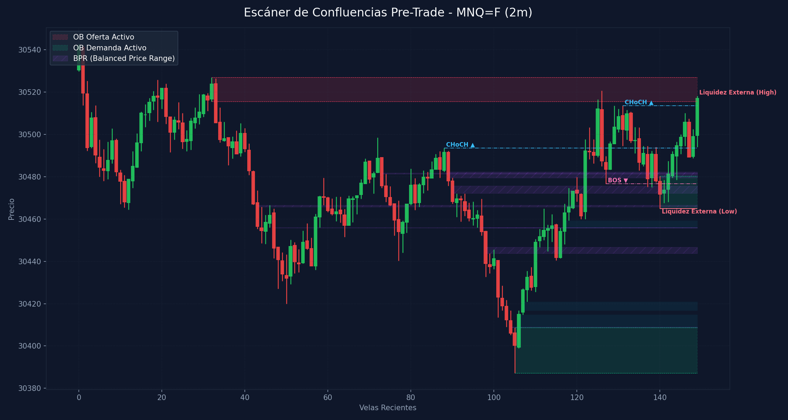

# 🛠️ Reporte Pre-Trade: Mapa de Confluencias (SMC & ICT)
        
Este reporte ha sido generado según los lineamientos de tu **Manual Operativo de Trading**. Analiza las confluencias de temporalidad menor para preparar tu Killzone y delinear tus puntos de interés antes de operar.

---

## 📅 Información de la Sesión
* **Fecha:** `2026-06-17`
* **Activo:** `MNQ=F`
* **Temporalidad:** `2m` (LTF / Gatillo)
* **Precio Actual:** `30517.0`
* **Vinculación Temporal:** 
  * 🔗 [Ver Autopsia y Bitácora Post-Trade de esta Sesión](2026-06-17_session.md) (Se generará al finalizar tu sesión)

---

## 🛡️ Alerta del Guardia de Riesgo (IA Risk Mentor)

> [!IMPORTANT]
> **Estadísticas de Bitácora:** Sesiones: `13` | PnL Acumulado: `$3283.00 USD` | Win Rate: `53.8%`
> 
> **🚨 TUS ERRORES PSICOLÓGICOS MÁS RECURRENTES A EVITAR HOY:**
> * **FOMO:** presente en el `53.8%` de las sesiones previas.
> * **Ignorar Resistencia:** presente en el `53.8%` de las sesiones previas.
>
> **📝 LECCIONES CLAVE A RECORDAR:**
> * 1. La Disciplina ante el Bias Paga Rentabilidad: Alinearse estrictamente con el HTF Bias (Bullish) en zona de descuento macro y descartar los cortos contra-tendencia es la base de los trades de alta probabilidad.
> * La Espera del Retesteo Reduce el Riesgo: No entrar persiguiendo velas de expansión alcista sino esperar con paciencia el pullback al FVG mitigador es la diferencia entre ser liquidado o lograr una entrada limpia con excelente R:R.
> * El Plan Vence a la Intuición: Ignorar el impulso de tomar shorts discrecionales (incluso cuando otros mentores o el ruido de micro-temporalidades sugerían caídas) y aferrarse a las reglas del manual operativo condujo a una sesión sumamente rentable.

---

## 🧠 Predicción de Machine Learning (SMC Setup Classifier)
El clasificador de Inteligencia Artificial analizó la confluencia de este escenario de pre-sesión con tus datos históricos de trade:

```text
=== PREDICCIÓN DE PROBABILIDAD DE ÉXITO ===

==================================================
SETUP EVALUADO:
 - Instrumento: NQ | Dirección: Short | Sesión: NY AM KZ
 - Confluencias: in kill zone (london / ny am / pm), at htf pd array (ob / fvg / breaker), fair value gap (fvg) on entry tf, order block (ob) alignment, htf market structure bias confirmed
--------------------------------------------------
PROBABILIDAD DE WIN RATE ESTIMADA: 72.0%
🚀 SETUP ALTA PROBABILIDAD (A+): Recomendado operar con riesgo estándar (1.0%).
==================================================
```

---

## 🎨 Marcaciones Manuales en tu Gráfico (TradingView)
Esta sección extrae automáticamente tus rectángulos (cajas de zonas) y líneas dibujadas a mano en TradingView y comprueba su confluencia con las zonas de liquidez y estructuras de Smart Money Concepts:

  * *No se detectaron marcaciones manuales activas en el gráfico (cajas grises o líneas de tendencia).* Asegúrate de marcar tus zonas en TradingView para integrarlas en el escáner.

---

## ⏳ Análisis Estructural Multi-Temporalidad Completo (9 Timeframes)
Escaneo automático y en segundo plano de estructura de mercado y zonas institucionales activas en todos los marcos de tiempo analizados (de mayor a menor):

| Temporalidad | Sesgo Estructural | Rango (Premium/Discount) | Últimos OBs Activos | Últimos FVGs Activos |
| :--- | :--- | :--- | :--- | :--- |
| **4H** | Bullish 🟢 | Discount (Compras) 🟢 | 🟢 Demand (28264.2-28537.8) | 🟢 Bullish (29753.5-29990.0), 🟢 Bullish (30095.0-30172.0) |
| **1H** | Bearish 🔴 | Discount (Compras) 🟢 | 🟢 Demand (29231.2-29502.5), 🔴 Supply (30922.5-30975.5) | 🔴 Bearish (30664.5-30750.8), 🔴 Bearish (30527.0-30538.5) |
| **30m** | Bearish 🔴 | Discount (Compras) 🟢 | 🟢 Demand (29408.0-29748.2), 🔴 Supply (30922.5-30975.5) | 🔴 Bearish (30715.0-30750.8), 🔴 Bearish (30664.5-30672.0) |
| **15m** | Bullish 🟢 | Premium (Ventas) 🔴 | 🔴 Supply (30937.0-30975.5), 🟢 Demand (30308.0-30349.0) | 🔴 Bearish (30715.0-30793.0), 🟢 Bullish (30349.0-30356.2) |
| **5m** | Bullish 🟢 | Premium (Ventas) 🔴 | 🔴 Supply (30555.5-30584.2), 🔴 Supply (30496.8-30527.0) | 🔴 Bearish (30550.5-30555.5), 🟢 Bullish (30416.8-30425.5) |
| **4m** | Bullish 🟢 | Premium (Ventas) 🔴 | 🔴 Supply (30540.0-30584.2), 🔴 Supply (30511.0-30527.0) | 🟢 Bullish (30416.8-30425.5) |
| **3m** | Bullish 🟢 | Premium (Ventas) 🔴 | 🔴 Supply (30512.5-30527.0), 🟢 Demand (30387.2-30416.8) | 🔴 Bearish (30556.2-30567.8), 🟢 Bullish (30416.8-30422.0) |
| **2m** | Bullish 🟢 | Premium (Ventas) 🔴 | 🟢 Demand (30387.2-30408.8), 🟢 Demand (30465.0-30480.2) | 🟢 Bullish (30416.8-30421.0), 🟢 Bullish (30455.8-30459.2) |
| **1m** | Bearish 🔴 | Premium (Ventas) 🔴 | 🟢 Demand (30440.5-30454.2), 🟢 Demand (30488.8-30500.2) | 🟢 Bullish (30435.5-30439.0), 🟢 Bullish (30455.0-30459.2) |

---

## 📊 Mapa de Gráfico de Confluencias
Este gráfico mapea de forma precisa la liquidez externa, los bloques de orden activos, los vacíos de liquidez y los rangos de precio balanceados (BPR):



---

## 🔍 Análisis Estructural Top-Down (Multi-Temporalidad)
Análisis de temporalidades HTF de Nasdaq en el fondo sin alterar tu TradingView Desktop:

* **1H HTF Bias:** `Bearish 🔴` | Mapeado según el último BOS estructural en 1 hora.
* **1H Zonas Clave:**
  * OB de 1H Demand: Rango `29231.25 - 29502.50`
  * OB de 1H Supply: Rango `30922.50 - 30975.50`
  * FVG de 1H Bearish: Rango `30664.50 - 30750.75`
  * FVG de 1H Bearish: Rango `30527.00 - 30538.50`

* **15m POIs de Confluencia:**
  * OB de 15m Supply: Rango `30937.00 - 30975.50` | Ver [[Order Block (Bullish)]] o [[Order Block (Bearish)]]
  * OB de 15m Demand: Rango `30308.00 - 30349.00` | Ver [[Order Block (Bullish)]] o [[Order Block (Bearish)]]
  * FVG de 15m Bearish: Rango `30715.00 - 30793.00` | Ver [[Fair Value Gap]]
  * FVG de 15m Bullish: Rango `30349.00 - 30356.25` | Ver [[Fair Value Gap]]

---

## ⚡ Correlación Inter-Mercado (SMT Divergence)
* **Estado SMT:** `S&P 500 (MES) y Nasdaq (MNQ) alineados de forma regular en el Open (Sin divergencias activas). Ver [[SMT Divergence]]`

---

## 🧲 Puntos de Interés (POI) y Liquidez LTF (2m)

### 🌐 1. Liquidez Externa (HTF / Session Pivots)
Niveles clave para buscar barridas de liquidez (*sweeps*) en la apertura de sesión o Killzone:
* **Liquidez Externa Superior (Swing High):** `30518.25` (Vela #149) | Ver [[External Liquidity]] y [[Swing High]]
* **Liquidez Externa Inferior (Swing Low):** `30465.0` (Vela #140) | Ver [[External Liquidity]] y [[Swing Low]]

* **Pools de Liquidez Interna Activos (Unswept):**
  * *No se detectan pools de liquidez interna inmitigados en el rango de precios actual. Ver [[Internal Liquidity]]*

### 🟢 2. Bloques de Orden de Demanda (Soportes / Compras)
Zonas institucionales activas de alta concentración de compras limitadas. Ver [[Order Block (Bullish)]].

| Tipo | Rango de Precio | Volumen | Estado |
| :--- | :--- | :--- | :--- |
| **Demand OB** | `30387.25 - 30408.75` | `9140.0` | **Inmitigado (Activo)** 🔥 |
| **Demand OB** | `30465.0 - 30480.25` | `5639.0` | **Inmitigado (Activo)** 🔥 |

### 🔴 3. Bloques de Orden de Oferta (Resistencias / Ventas)
Zonas institucionales activas de alta concentración de ventas limitadas. Ver [[Order Block (Bearish)]].

| Tipo | Rango de Precio | Volumen | Estado |
| :--- | :--- | :--- | :--- |
| **Supply OB** | `30515.5 - 30527.0` | `3783.0` | **Inmitigado (Activo)** ⚡ |

---

## 🌀 4. Anatomía de Fair Value Gaps (FVG) e Inversiones
Análisis detallado de imbalances de precios y su **probabilidad de inversión (iFVG)** según la secuencia de sus 3 velas. Ver [[Fair Value Gap]] e [[IFVG]].

| Dirección | Rango de FVG | Perfil de Velas | Probabilidad de Inversión / Comportamiento |
| :--- | :--- | :--- | :--- |
| 🟢 Bullish FVG | `30408.75 - 30414.75` | `R-R-G` (Vela #106) | Moderado (Extra Confirmación) 🟡 |
| 🟢 Bullish FVG | `30416.75 - 30421.0` | `R-G-G` (Vela #107) | Moderado (Extra Confirmación) 🟡 |
| 🟢 Bullish FVG | `30455.75 - 30459.25` | `R-G-G` (Vela #117) | Moderado (Extra Confirmación) 🟡 |

---

## 🟣 5. Balanced Price Ranges (BPR) Detectados
Solapamientos de FVG alcistas y bajistas en el mismo nivel de precios. Actúan como soportes/resistencias magnéticos de altísima precisión. Ver [[Balanced Price Range]].
* **BPR Detectado:** Rango `30465.75 - 30466.50` | Solapamiento de FVG Alcista (Vela #79) y Bajista (Vela #43)
* **BPR Detectado:** Rango `30408.75 - 30409.00` | Solapamiento de FVG Alcista (Vela #106) y Bajista (Vela #104)
* **BPR Detectado:** Rango `30443.75 - 30446.75` | Solapamiento de FVG Alcista (Vela #110) y Bajista (Vela #98)
* **BPR Detectado:** Rango `30455.75 - 30456.00` | Solapamiento de FVG Alcista (Vela #117) y Bajista (Vela #47)
* **BPR Detectado:** Rango `30455.75 - 30456.00` | Solapamiento de FVG Alcista (Vela #117) y Bajista (Vela #97)
* **BPR Detectado:** Rango `30481.25 - 30481.75` | Solapamiento de FVG Alcista (Vela #122) y Bajista (Vela #73)
* **BPR Detectado:** Rango `30479.50 - 30482.25` | Solapamiento de FVG Alcista (Vela #122) y Bajista (Vela #89)
* **BPR Detectado:** Rango `30472.25 - 30475.75` | Solapamiento de FVG Alcista (Vela #122) y Bajista (Vela #90)

---

## 🔄 6. Estructura de Mercado Reciente (BOS / CHoCH)
Rupturas de estructura registradas en el gráfico. Ver [[Market Structure]], [[Break of Structure]] y [[Change of Character]]:
* **CHoCH (Change of Character) Alcista 🟢** en nivel `30493.5` | Confirmado en la vela #88
* **BOS (Break of Structure) Bajista 🔴** en nivel `30476.75` | Confirmado en la vela #127
* **CHoCH (Change of Character) Alcista 🟢** en nivel `30513.5` | Confirmado en la vela #131

---

## 💡 Protocolo Operativo Pre-Trade (Tu Plan de Sesión)

> [!IMPORTANT]
> **Checklist antes de apretar el gatillo (LTF 1m - 5m):**
> 1. **Fase 1 (Sweep):** Espera a que el precio barra una de las zonas de **Liquidez Externa** (`30518.25` / `30465.0`) o mitigue un POI HTF.
> 2. **Fase 2 (iFVG Trigger):** Busca una reacción post-sweep. El cuerpo de la vela debe cerrar y romper un FVG contrario, prioritariamente con perfil **Easy to Invert (R-G-R o G-R-G)**, convirtiéndolo en un **iFVG**.
> 3. **Gestión de Riesgo:** Si opera en All-Time Highs, gestión estricta con relación de **1:1 R:R**. En días de noticias, no ingresar a operaciones dentro de los **5 minutos anteriores** a la publicación.
