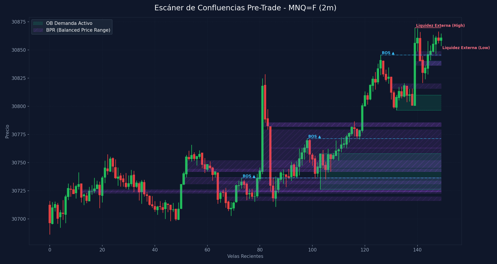

# 🛠️ Reporte Pre-Trade: Mapa de Confluencias (SMC & ICT)
        
Este reporte ha sido generado según los lineamientos de tu **Manual Operativo de Trading**. Analiza las confluencias de temporalidad menor para preparar tu Killzone y delinear tus puntos de interés antes de operar.

---

## 📅 Información de la Sesión
* **Fecha:** `2026-06-22`
* **Activo:** `MNQ=F`
* **Temporalidad:** `2m` (LTF / Gatillo)
* **Precio Actual:** `30860.75`
* **Vinculación Temporal:** 
  * 🔗 [Ver Autopsia y Bitácora Post-Trade de esta Sesión](2026-06-22_session.md) (Se generará al finalizar tu sesión)

---

## 🛡️ Alerta del Guardia de Riesgo (IA Risk Mentor)

> [!IMPORTANT]
> **Estadísticas de Bitácora:** Sesiones: `13` | PnL Acumulado: `$3283.00 USD` | Win Rate: `53.8%`
> 
> **🚨 TUS ERRORES PSICOLÓGICOS MÁS RECURRENTES A EVITAR HOY:**
> * **FOMO:** presente en el `53.8%` de las sesiones previas.
> * **Ignorar Resistencia:** presente en el `53.8%` de las sesiones previas.
>
> **📝 LECCIONES CLAVE A RECORDAR:**
> * 1. La Disciplina ante el Bias Paga Rentabilidad: Alinearse estrictamente con el HTF Bias (Bullish) en zona de descuento macro y descartar los cortos contra-tendencia es la base de los trades de alta probabilidad.
> * La Espera del Retesteo Reduce el Riesgo: No entrar persiguiendo velas de expansión alcista sino esperar con paciencia el pullback al FVG mitigador es la diferencia entre ser liquidado o lograr una entrada limpia con excelente R:R.
> * El Plan Vence a la Intuición: Ignorar el impulso de tomar shorts discrecionales (incluso cuando otros mentores o el ruido de micro-temporalidades sugerían caídas) y aferrarse a las reglas del manual operativo condujo a una sesión sumamente rentable.

---

## 🧠 Predicción de Machine Learning (SMC Setup Classifier)
El clasificador de Inteligencia Artificial analizó la confluencia de este escenario de pre-sesión con tus datos históricos de trade:

```text
=== PREDICCIÓN DE PROBABILIDAD DE ÉXITO ===

==================================================
SETUP EVALUADO:
 - Instrumento: NQ | Dirección: Long | Sesión: NY AM KZ
 - Confluencias: in kill zone (london / ny am / pm), at htf pd array (ob / fvg / breaker), fair value gap (fvg) on entry tf, order block (ob) alignment, htf market structure bias confirmed
--------------------------------------------------
PROBABILIDAD DE WIN RATE ESTIMADA: 80.4%
🚀 SETUP ALTA PROBABILIDAD (A+): Recomendado operar con riesgo estándar (1.0%).
==================================================
```

---

## 🎨 Marcaciones Manuales en tu Gráfico (TradingView)
Esta sección extrae automáticamente tus rectángulos (cajas de zonas) y líneas dibujadas a mano en TradingView y comprueba su confluencia con las zonas de liquidez y estructuras de Smart Money Concepts:

  * *No se detectaron marcaciones manuales activas en el gráfico (cajas grises o líneas de tendencia).* Asegúrate de marcar tus zonas en TradingView para integrarlas en el escáner.

---

## ⏳ Análisis Estructural Multi-Temporalidad Completo (9 Timeframes)
Escaneo automático y en segundo plano de estructura de mercado y zonas institucionales activas en todos los marcos de tiempo analizados (de mayor a menor):

| Temporalidad | Sesgo Estructural | Rango (Premium/Discount) | Últimos OBs Activos | Últimos FVGs Activos |
| :--- | :--- | :--- | :--- | :--- |
| **4H** | Neutral | Premium (Ventas) 🔴 | 🟢 Demand (28227.2-29145.8), 🟢 Demand (30336.8-30651.0) | 🟢 Bullish (30662.0-30686.2) |
| **1H** | Bullish 🟢 | Premium (Ventas) 🔴 | 🟢 Demand (30284.0-30380.8), 🟢 Demand (30336.8-30651.0) | 🟢 Bullish (30159.5-30225.0), 🟢 Bullish (30591.8-30637.5) |
| **30m** | Bullish 🟢 | Discount (Compras) 🟢 | 🟢 Demand (30524.0-30591.8), 🟢 Demand (30686.2-30765.5) | 🟢 Bullish (30591.8-30627.8), 🟢 Bullish (30771.2-30796.5) |
| **15m** | Bullish 🟢 | Discount (Compras) 🟢 | 🟢 Demand (30524.0-30565.0), 🟢 Demand (30722.0-30750.8) | 🟢 Bullish (30762.2-30770.5), 🟢 Bullish (30820.5-30846.5) |
| **5m** | Bullish 🟢 | Premium (Ventas) 🔴 | 🟢 Demand (30726.2-30758.0), 🟢 Demand (30796.5-30817.0) | 🟢 Bullish (30762.2-30762.8), 🟢 Bullish (30815.8-30820.8) |
| **4m** | Bullish 🟢 | Discount (Compras) 🟢 | 🟢 Demand (30726.2-30761.2), 🟢 Demand (30796.5-30814.0) | 🟢 Bullish (30758.5-30759.2), 🟢 Bullish (30815.8-30820.8) |
| **3m** | Bullish 🟢 | Discount (Compras) 🟢 | 🟢 Demand (30726.2-30758.0), 🟢 Demand (30796.5-30812.8) | 🟢 Bullish (30658.8-30660.5), 🟢 Bullish (30785.2-30791.0) |
| **2m** | Bullish 🟢 | Discount (Compras) 🟢 | 🟢 Demand (30726.2-30758.0), 🟢 Demand (30796.5-30810.0) | 🟢 Bullish (30836.2-30840.8) |
| **1m** | Bullish 🟢 | Premium (Ventas) 🔴 | 🟢 Demand (30770.5-30777.8), 🟢 Demand (30800.5-30814.5) | 🟢 Bullish (30779.5-30791.0), 🟢 Bullish (30838.8-30840.8) |

---

## 📊 Mapa de Gráfico de Confluencias
Este gráfico mapea de forma precisa la liquidez externa, los bloques de orden activos, los vacíos de liquidez y los rangos de precio balanceados (BPR):



---

## 🔍 Análisis Estructural Top-Down (Multi-Temporalidad)
Análisis de temporalidades HTF de Nasdaq en el fondo sin alterar tu TradingView Desktop:

* **1H HTF Bias:** `Bullish 🟢` | Mapeado según el último BOS estructural en 1 hora.
* **1H Zonas Clave:**
  * OB de 1H Demand: Rango `30284.00 - 30380.75`
  * OB de 1H Demand: Rango `30336.75 - 30651.00`
  * FVG de 1H Bullish: Rango `30159.50 - 30225.00`
  * FVG de 1H Bullish: Rango `30591.75 - 30637.50`

* **15m POIs de Confluencia:**
  * OB de 15m Demand: Rango `30524.00 - 30565.00` | Ver [[Order Block (Bullish)]] o [[Order Block (Bearish)]]
  * OB de 15m Demand: Rango `30722.00 - 30750.75` | Ver [[Order Block (Bullish)]] o [[Order Block (Bearish)]]
  * FVG de 15m Bullish: Rango `30762.25 - 30770.50` | Ver [[Fair Value Gap]]
  * FVG de 15m Bullish: Rango `30820.50 - 30846.50` | Ver [[Fair Value Gap]]

---

## ⚡ Correlación Inter-Mercado (SMT Divergence)
* **Estado SMT:** `S&P 500 (MES) y Nasdaq (MNQ) alineados de forma regular en el Open (Sin divergencias activas). Ver [[SMT Divergence]]`

---

## 🧲 Puntos de Interés (POI) y Liquidez LTF (2m)

### 🌐 1. Liquidez Externa (HTF / Session Pivots)
Niveles clave para buscar barridas de liquidez (*sweeps*) en la apertura de sesión o Killzone:
* **Liquidez Externa Superior (Swing High):** `30869.75` (Vela #139) | Ver [[External Liquidity]] y [[Swing High]]
* **Liquidez Externa Inferior (Swing Low):** `30853.5` (Vela #149) | Ver [[External Liquidity]] y [[Swing Low]]

* **Pools de Liquidez Interna Activos (Unswept):**
  * *No se detectan pools de liquidez interna inmitigados en el rango de precios actual. Ver [[Internal Liquidity]]*

### 🟢 2. Bloques de Orden de Demanda (Soportes / Compras)
Zonas institucionales activas de alta concentración de compras limitadas. Ver [[Order Block (Bullish)]].

| Tipo | Rango de Precio | Volumen | Estado |
| :--- | :--- | :--- | :--- |
| **Demand OB** | `30726.25 - 30758.0` | `3223.0` | **Inmitigado (Activo)** 🔥 |
| **Demand OB** | `30796.5 - 30810.0` | `15205.0` | **Inmitigado (Activo)** 🔥 |

### 🔴 3. Bloques de Orden de Oferta (Resistencias / Ventas)
Zonas institucionales activas de alta concentración de ventas limitadas. Ver [[Order Block (Bearish)]].

| Tipo | Rango de Precio | Volumen | Estado |
| :--- | :--- | :--- | :--- |

---

## 🌀 4. Anatomía de Fair Value Gaps (FVG) e Inversiones
Análisis detallado de imbalances de precios y su **probabilidad de inversión (iFVG)** según la secuencia de sus 3 velas. Ver [[Fair Value Gap]] e [[IFVG]].

| Dirección | Rango de FVG | Perfil de Velas | Probabilidad de Inversión / Comportamiento |
| :--- | :--- | :--- | :--- |
| 🟢 Bullish FVG | `30836.25 - 30840.75` | `R-G-G` (Vela #144) | Moderado (Extra Confirmación) 🟡 |

---

## 🟣 5. Balanced Price Ranges (BPR) Detectados
Solapamientos de FVG alcistas y bajistas en el mismo nivel de precios. Actúan como soportes/resistencias magnéticos de altísima precisión. Ver [[Balanced Price Range]].
* **BPR Detectado:** Rango `30731.00 - 30736.75` | Solapamiento de FVG Alcista (Vela #51) y Bajista (Vela #64)
* **BPR Detectado:** Rango `30736.75 - 30737.00` | Solapamiento de FVG Alcista (Vela #51) y Bajista (Vela #84)
* **BPR Detectado:** Rango `30742.00 - 30744.25` | Solapamiento de FVG Alcista (Vela #52) y Bajista (Vela #62)
* **BPR Detectado:** Rango `30742.00 - 30752.00` | Solapamiento de FVG Alcista (Vela #52) y Bajista (Vela #84)
* **BPR Detectado:** Rango `30722.75 - 30725.00` | Solapamiento de FVG Alcista (Vela #71) y Bajista (Vela #12)
* **BPR Detectado:** Rango `30724.50 - 30725.00` | Solapamiento de FVG Alcista (Vela #71) y Bajista (Vela #64)
* **BPR Detectado:** Rango `30716.25 - 30719.75` | Solapamiento de FVG Alcista (Vela #71) y Bajista (Vela #67)
* **BPR Detectado:** Rango `30723.75 - 30726.25` | Solapamiento de FVG Alcista (Vela #79) y Bajista (Vela #12)
* **BPR Detectado:** Rango `30724.50 - 30733.75` | Solapamiento de FVG Alcista (Vela #79) y Bajista (Vela #64)
* **BPR Detectado:** Rango `30726.75 - 30727.00` | Solapamiento de FVG Alcista (Vela #79) y Bajista (Vela #75)
* **BPR Detectado:** Rango `30782.00 - 30785.50` | Solapamiento de FVG Alcista (Vela #81) y Bajista (Vela #83)
* **BPR Detectado:** Rango `30745.75 - 30779.25` | Solapamiento de FVG Alcista (Vela #81) y Bajista (Vela #84)
* **BPR Detectado:** Rango `30762.75 - 30763.25` | Solapamiento de FVG Alcista (Vela #111) y Bajista (Vela #84)
* **BPR Detectado:** Rango `30782.00 - 30785.50` | Solapamiento de FVG Alcista (Vela #119) y Bajista (Vela #83)
* **BPR Detectado:** Rango `30815.75 - 30820.00` | Solapamiento de FVG Alcista (Vela #139) y Bajista (Vela #130)
* **BPR Detectado:** Rango `30844.75 - 30848.75` | Solapamiento de FVG Alcista (Vela #139) y Bajista (Vela #141)
* **BPR Detectado:** Rango `30836.25 - 30840.00` | Solapamiento de FVG Alcista (Vela #139) y Bajista (Vela #142)
* **BPR Detectado:** Rango `30836.25 - 30840.00` | Solapamiento de FVG Alcista (Vela #144) y Bajista (Vela #142)

---

## 🔄 6. Estructura de Mercado Reciente (BOS / CHoCH)
Rupturas de estructura registradas en el gráfico. Ver [[Market Structure]], [[Break of Structure]] y [[Change of Character]]:
* **BOS (Break of Structure) Alcista 🟢** en nivel `30736.25` | Confirmado en la vela #73
* **BOS (Break of Structure) Alcista 🟢** en nivel `30771.25` | Confirmado en la vela #98
* **BOS (Break of Structure) Alcista 🟢** en nivel `30845.5` | Confirmado en la vela #126

---

## 💡 Protocolo Operativo Pre-Trade (Tu Plan de Sesión)

> [!IMPORTANT]
> **Checklist antes de apretar el gatillo (LTF 1m - 5m):**
> 1. **Fase 1 (Sweep):** Espera a que el precio barra una de las zonas de **Liquidez Externa** (`30869.75` / `30853.5`) o mitigue un POI HTF.
> 2. **Fase 2 (iFVG Trigger):** Busca una reacción post-sweep. El cuerpo de la vela debe cerrar y romper un FVG contrario, prioritariamente con perfil **Easy to Invert (R-G-R o G-R-G)**, convirtiéndolo en un **iFVG**.
> 3. **Gestión de Riesgo:** Si opera en All-Time Highs, gestión estricta con relación de **1:1 R:R**. En días de noticias, no ingresar a operaciones dentro de los **5 minutos anteriores** a la publicación.
