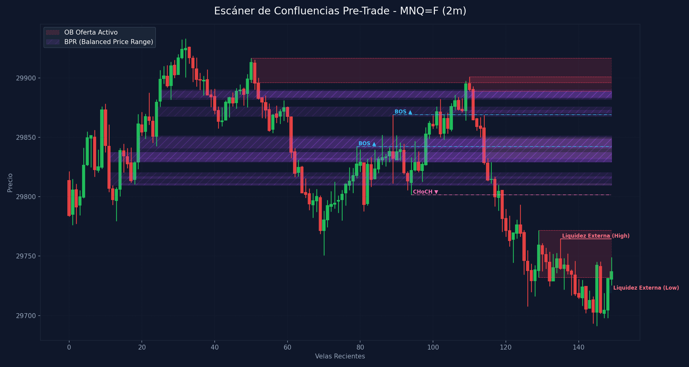

# 🛠️ Reporte Pre-Trade: Mapa de Confluencias (SMC & ICT)
        
Este reporte ha sido generado según los lineamientos de tu **Manual Operativo de Trading**. Analiza las confluencias de temporalidad menor para preparar tu Killzone y delinear tus puntos de interés antes de operar.

---

## 📅 Información de la Sesión
* **Fecha:** `2026-06-23`
* **Activo:** `MNQ=F`
* **Temporalidad:** `2m` (LTF / Gatillo)
* **Precio Actual:** `29737.0`
* **Vinculación Temporal:** 
  * 🔗 [Ver Autopsia y Bitácora Post-Trade de esta Sesión](2026-06-23_session.md) (Se generará al finalizar tu sesión)

---

## 🛡️ Alerta del Guardia de Riesgo (IA Risk Mentor)

> [!IMPORTANT]
> **Estadísticas de Bitácora:** Sesiones: `13` | PnL Acumulado: `$3283.00 USD` | Win Rate: `53.8%`
> 
> **🚨 TUS ERRORES PSICOLÓGICOS MÁS RECURRENTES A EVITAR HOY:**
> * **FOMO:** presente en el `53.8%` de las sesiones previas.
> * **Ignorar Resistencia:** presente en el `53.8%` de las sesiones previas.
>
> **📝 LECCIONES CLAVE A RECORDAR:**
> * 1. La Disciplina ante el Bias Paga Rentabilidad: Alinearse estrictamente con el HTF Bias (Bullish) en zona de descuento macro y descartar los cortos contra-tendencia es la base de los trades de alta probabilidad.
> * La Espera del Retesteo Reduce el Riesgo: No entrar persiguiendo velas de expansión alcista sino esperar con paciencia el pullback al FVG mitigador es la diferencia entre ser liquidado o lograr una entrada limpia con excelente R:R.
> * El Plan Vence a la Intuición: Ignorar el impulso de tomar shorts discrecionales (incluso cuando otros mentores o el ruido de micro-temporalidades sugerían caídas) y aferrarse a las reglas del manual operativo condujo a una sesión sumamente rentable.

---

## 🧠 Predicción de Machine Learning (SMC Setup Classifier)
El clasificador de Inteligencia Artificial analizó la confluencia de este escenario de pre-sesión con tus datos históricos de trade:

```text
=== PREDICCIÓN DE PROBABILIDAD DE ÉXITO ===

==================================================
SETUP EVALUADO:
 - Instrumento: NQ | Dirección: Short | Sesión: NY AM KZ
 - Confluencias: in kill zone (london / ny am / pm), at htf pd array (ob / fvg / breaker), fair value gap (fvg) on entry tf, order block (ob) alignment, smt divergence present, htf market structure bias confirmed
--------------------------------------------------
PROBABILIDAD DE WIN RATE ESTIMADA: 72.0%
🚀 SETUP ALTA PROBABILIDAD (A+): Recomendado operar con riesgo estándar (1.0%).
==================================================
```

---

## 🎨 Marcaciones Manuales en tu Gráfico (TradingView)
Esta sección extrae automáticamente tus rectángulos (cajas de zonas) y líneas dibujadas a mano en TradingView y comprueba su confluencia con las zonas de liquidez y estructuras de Smart Money Concepts:

  * *No se detectaron marcaciones manuales activas en el gráfico (cajas grises o líneas de tendencia).* Asegúrate de marcar tus zonas en TradingView para integrarlas en el escáner.

---

## ⏳ Análisis Estructural Multi-Temporalidad Completo (9 Timeframes)
Escaneo automático y en segundo plano de estructura de mercado y zonas institucionales activas en todos los marcos de tiempo analizados (de mayor a menor):

| Temporalidad | Sesgo Estructural | Rango (Premium/Discount) | Últimos OBs Activos | Últimos FVGs Activos |
| :--- | :--- | :--- | :--- | :--- |
| **4H** | Bearish 🔴 | Discount (Compras) 🟢 | 🟢 Demand (28264.2-28537.8), 🔴 Supply (30539.2-30967.8) | 🔴 Bearish (30370.2-30538.8), 🔴 Bearish (29933.2-30301.0) |
| **1H** | Bearish 🔴 | Discount (Compras) 🟢 | 🔴 Supply (30922.5-30975.5), 🔴 Supply (30566.8-30699.8) | 🔴 Bearish (30054.2-30092.0), 🔴 Bearish (29746.0-29787.8) |
| **30m** | Bearish 🔴 | Discount (Compras) 🟢 | 🔴 Supply (30634.0-30699.8) | 🔴 Bearish (30054.5-30092.0), 🔴 Bearish (29793.2-29801.5) |
| **15m** | Bearish 🔴 | Discount (Compras) 🟢 | 🔴 Supply (30586.5-30635.0), 🔴 Supply (29813.2-29901.0) | 🔴 Bearish (29826.8-29848.0), 🔴 Bearish (29793.2-29813.2) |
| **5m** | Bearish 🔴 | Premium (Ventas) 🔴 | 🔴 Supply (30031.5-30054.2), 🔴 Supply (29864.2-29901.0) | 🔴 Bearish (29826.8-29850.0), 🔴 Bearish (29805.8-29813.2) |
| **4m** | Bearish 🔴 | Premium (Ventas) 🔴 | 🔴 Supply (29864.2-29901.0), 🔴 Supply (29732.0-29771.8) | 🔴 Bearish (29817.0-29827.0), 🔴 Bearish (29805.8-29811.0) |
| **3m** | Bearish 🔴 | Premium (Ventas) 🔴 | 🔴 Supply (29864.2-29901.0), 🔴 Supply (29716.5-29771.8) | 🔴 Bearish (29826.8-29827.0), 🔴 Bearish (29810.0-29813.2) |
| **2m** | Bearish 🔴 | Discount (Compras) 🟢 | 🔴 Supply (29888.8-29901.0), 🔴 Supply (29732.0-29771.8) | 🔴 Bearish (29810.0-29811.0), 🟢 Bullish (29719.0-29725.5) |
| **1m** | Bearish 🔴 | Premium (Ventas) 🔴 | 🔴 Supply (29772.0-29793.2), 🔴 Supply (29746.2-29764.5) | 🔴 Bearish (29832.5-29841.8), 🟢 Bullish (29718.5-29725.5) |

---

## 📊 Mapa de Gráfico de Confluencias
Este gráfico mapea de forma precisa la liquidez externa, los bloques de orden activos, los vacíos de liquidez y los rangos de precio balanceados (BPR):



---

## 🔍 Análisis Estructural Top-Down (Multi-Temporalidad)
Análisis de temporalidades HTF de Nasdaq en el fondo sin alterar tu TradingView Desktop:

* **1H HTF Bias:** `Bearish 🔴` | Mapeado según el último BOS estructural en 1 hora.
* **1H Zonas Clave:**
  * OB de 1H Supply: Rango `30922.50 - 30975.50`
  * OB de 1H Supply: Rango `30566.75 - 30699.75`
  * FVG de 1H Bearish: Rango `30054.25 - 30092.00`
  * FVG de 1H Bearish: Rango `29746.00 - 29787.75`

* **15m POIs de Confluencia:**
  * OB de 15m Supply: Rango `30586.50 - 30635.00` | Ver [[Order Block (Bullish)]] o [[Order Block (Bearish)]]
  * OB de 15m Supply: Rango `29813.25 - 29901.00` | Ver [[Order Block (Bullish)]] o [[Order Block (Bearish)]]
  * FVG de 15m Bearish: Rango `29826.75 - 29848.00` | Ver [[Fair Value Gap]]
  * FVG de 15m Bearish: Rango `29793.25 - 29813.25` | Ver [[Fair Value Gap]]

---

## ⚡ Correlación Inter-Mercado (SMT Divergence)
* **Estado SMT:** `SMT BAJISTA DETECTADO 🔴 (Nasdaq hace máximos más bajos mientras S&P expande a máximos más altos. ¡Distribución institucional!)`

---

## 🧲 Puntos de Interés (POI) y Liquidez LTF (2m)

### 🌐 1. Liquidez Externa (HTF / Session Pivots)
Niveles clave para buscar barridas de liquidez (*sweeps*) en la apertura de sesión o Killzone:
* **Liquidez Externa Superior (Swing High):** `29764.5` (Vela #135) | Ver [[External Liquidity]] y [[Swing High]]
* **Liquidez Externa Inferior (Swing Low):** `29725.5` (Vela #149) | Ver [[External Liquidity]] y [[Swing Low]]

* **Pools de Liquidez Interna Activos (Unswept):**
  * *No se detectan pools de liquidez interna inmitigados en el rango de precios actual. Ver [[Internal Liquidity]]*

### 🟢 2. Bloques de Orden de Demanda (Soportes / Compras)
Zonas institucionales activas de alta concentración de compras limitadas. Ver [[Order Block (Bullish)]].

| Tipo | Rango de Precio | Volumen | Estado |
| :--- | :--- | :--- | :--- |

### 🔴 3. Bloques de Orden de Oferta (Resistencias / Ventas)
Zonas institucionales activas de alta concentración de ventas limitadas. Ver [[Order Block (Bearish)]].

| Tipo | Rango de Precio | Volumen | Estado |
| :--- | :--- | :--- | :--- |
| **Supply OB** | `29896.0 - 29916.75` | `4688.0` | **Inmitigado (Activo)** ⚡ |
| **Supply OB** | `29888.75 - 29901.0` | `8082.0` | **Inmitigado (Activo)** ⚡ |
| **Supply OB** | `29732.0 - 29771.75` | `10796.0` | **Inmitigado (Activo)** ⚡ |

---

## 🌀 4. Anatomía de Fair Value Gaps (FVG) e Inversiones
Análisis detallado de imbalances de precios y su **probabilidad de inversión (iFVG)** según la secuencia de sus 3 velas. Ver [[Fair Value Gap]] e [[IFVG]].

| Dirección | Rango de FVG | Perfil de Velas | Probabilidad de Inversión / Comportamiento |
| :--- | :--- | :--- | :--- |
| 🔴 Bearish FVG | `29832.5 - 29850.0` | `R-R-R` (Vela #114) | Fuerte Desplazamiento Bajista (Gran probabilidad de ser Respetado) 🔴 |
| 🔴 Bearish FVG | `29810.0 - 29811.0` | `R-G-R` (Vela #117) | Fácil de Invertir (iFVG de Alta Probabilidad) 🟢 |
| 🟢 Bullish FVG | `29719.0 - 29725.5` | `R-G-G` (Vela #148) | Moderado (Extra Confirmación) 🟡 |

---

## 🟣 5. Balanced Price Ranges (BPR) Detectados
Solapamientos de FVG alcistas y bajistas en el mismo nivel de precios. Actúan como soportes/resistencias magnéticos de altísima precisión. Ver [[Balanced Price Range]].
* **BPR Detectado:** Rango `29809.50 - 29820.25` | Solapamiento de FVG Alcista (Vela #14) y Bajista (Vela #11)
* **BPR Detectado:** Rango `29815.50 - 29817.00` | Solapamiento de FVG Alcista (Vela #14) y Bajista (Vela #64)
* **BPR Detectado:** Rango `29810.00 - 29811.00` | Solapamiento de FVG Alcista (Vela #14) y Bajista (Vela #117)
* **BPR Detectado:** Rango `29830.00 - 29837.25` | Solapamiento de FVG Alcista (Vela #19) y Bajista (Vela #11)
* **BPR Detectado:** Rango `29841.00 - 29851.25` | Solapamiento de FVG Alcista (Vela #19) y Bajista (Vela #61)
* **BPR Detectado:** Rango `29831.25 - 29832.50` | Solapamiento de FVG Alcista (Vela #19) y Bajista (Vela #62)
* **BPR Detectado:** Rango `29830.00 - 29830.50` | Solapamiento de FVG Alcista (Vela #19) y Bajista (Vela #92)
* **BPR Detectado:** Rango `29832.50 - 29850.00` | Solapamiento de FVG Alcista (Vela #19) y Bajista (Vela #114)
* **BPR Detectado:** Rango `29867.75 - 29875.75` | Solapamiento de FVG Alcista (Vela #24) y Bajista (Vela #111)
* **BPR Detectado:** Rango `29883.75 - 29890.25` | Solapamiento de FVG Alcista (Vela #25) y Bajista (Vela #52)
* **BPR Detectado:** Rango `29882.00 - 29888.75` | Solapamiento de FVG Alcista (Vela #25) y Bajista (Vela #111)
* **BPR Detectado:** Rango `29829.25 - 29837.25` | Solapamiento de FVG Alcista (Vela #98) y Bajista (Vela #11)
* **BPR Detectado:** Rango `29841.00 - 29848.75` | Solapamiento de FVG Alcista (Vela #98) y Bajista (Vela #61)
* **BPR Detectado:** Rango `29831.25 - 29832.50` | Solapamiento de FVG Alcista (Vela #98) y Bajista (Vela #62)
* **BPR Detectado:** Rango `29829.25 - 29830.50` | Solapamiento de FVG Alcista (Vela #98) y Bajista (Vela #92)
* **BPR Detectado:** Rango `29832.50 - 29848.75` | Solapamiento de FVG Alcista (Vela #98) y Bajista (Vela #114)
* **BPR Detectado:** Rango `29870.75 - 29873.00` | Solapamiento de FVG Alcista (Vela #105) y Bajista (Vela #111)
* **BPR Detectado:** Rango `29883.75 - 29888.75` | Solapamiento de FVG Alcista (Vela #109) y Bajista (Vela #52)
* **BPR Detectado:** Rango `29883.00 - 29888.75` | Solapamiento de FVG Alcista (Vela #109) y Bajista (Vela #111)

---

## 🔄 6. Estructura de Mercado Reciente (BOS / CHoCH)
Rupturas de estructura registradas en el gráfico. Ver [[Market Structure]], [[Break of Structure]] y [[Change of Character]]:
* **BOS (Break of Structure) Alcista 🟢** en nivel `29842.25` | Confirmado en la vela #79
* **BOS (Break of Structure) Alcista 🟢** en nivel `29869.0` | Confirmado en la vela #89
* **CHoCH (Change of Character) Bajista 🔴** en nivel `29801.5` | Confirmado en la vela #94

---

## 💡 Protocolo Operativo Pre-Trade (Tu Plan de Sesión)

> [!IMPORTANT]
> **Checklist antes de apretar el gatillo (LTF 1m - 5m):**
> 1. **Fase 1 (Sweep):** Espera a que el precio barra una de las zonas de **Liquidez Externa** (`29764.5` / `29725.5`) o mitigue un POI HTF.
> 2. **Fase 2 (iFVG Trigger):** Busca una reacción post-sweep. El cuerpo de la vela debe cerrar y romper un FVG contrario, prioritariamente con perfil **Easy to Invert (R-G-R o G-R-G)**, convirtiéndolo en un **iFVG**.
> 3. **Gestión de Riesgo:** Si opera en All-Time Highs, gestión estricta con relación de **1:1 R:R**. En días de noticias, no ingresar a operaciones dentro de los **5 minutos anteriores** a la publicación.
