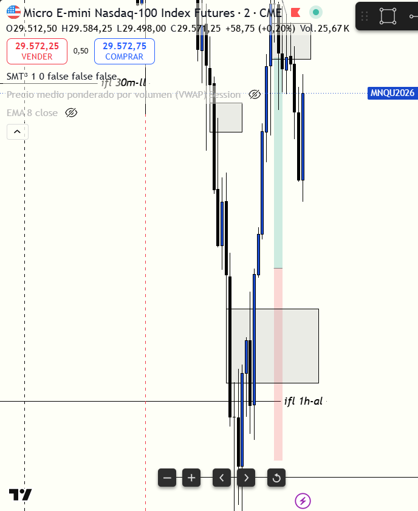

# 📅 BITÁCORA DE TRADING — 29 de Junio de 2026
**Pre-Trade Link:** [[2026-06-29_pre_trade]]

## 📊 RESUMEN GENERAL DE LA SESIÓN
- **Resultado Neto:** `+105.50 USD`
- **Trades Realizados:** `2`
- **Resultado:** `WIN` (WIN)

---

## 🖼️ CAPTURA DE PANTALLA

---

## 🔍 ANÁLISIS ESTRUCTURAL DE TEMPORALIDADES (TOP-DOWN)
### 1. Temporalidades Mayores (HTF: 4h / 1h)
- **Bias:** Alcista 🟢 / Rango 🟡
- **Narrativa:** El mercado reaccionó con mucha fuerza alcista al inicio de la sesión en Nueva York tras mitigar el Demand OB de 1H y 15m. Aunque tuvimos un retroceso temporal tras el SMT en máximos, el momentum comprador predominó y barrió la liquidez superior acumulada (London High), buscando equilibrar ineficiencias de temporalidades mayores.

### 2. Temporalidades Intermedias (30m / 15m)
- **Zonas clave (POIs):** 
  - Mitigación del **Demand OB 1H/30m** en la zona `29,182.00 - 29,464.50`.
  - Barrida del **London High (lh)** en `29,770.00` tras mitigar el **OB 4H** de S&P 500 (`7,436.50 - 7,496.50`).

### 3. Temporalidad de Ejecución (5m / 2m / 1m)
- **Gatillo / Desplazamiento:** 
  - Trade #1: iFVG de 3m bajista formado en descuento (Error).
  - Trade #2: iFVG de 2m alcista tras barrida de mínimos de la sesión (SSL) en Discount HTF y fuera de la segunda desviación estándar del VWAP.

---

## 📈 REPORTE DETALLADO DE LOS TRADES
### 🔴 TRADE #1: Short en NQ (MNQ)
- **Entrada:** `29,693.75`
- **MAE:** `298.0 ticks` (`74.5 puntos`)
- **MFE:** `235.0 ticks` (`58.75 puntos`)
- **Resultado:** Loss (`-72.00 puntos`, `-$144.00 USD` netos)
- **Confluencias:** iFVG de 3m, SMT bajista en London High (MES barrió y MNQ no), VWAP Premium.
- **Autopsia:** La entrada con orden límite en el retest del iFVG fue disciplinada en microestructura, pero violó el filtro de contexto: vender en Descuento HTF contra un fuerte flujo de compras institucional de 1H y con la liquidez superior de NQ (`lh` en `29,770.00`) sin barrer actuando como imán. El stop fue tocado en `29,765.75`.

### 🟢 TRADE #2: Long en NQ (MNQ)
- **Entrada:** `29,455.50`
- **MAE:** `474.0 ticks` (`118.5 puntos`)
- **MFE:** `568.0 ticks` (`142.0 puntos`)
- **Resultado:** Win (`+124.75 puntos`, `+$249.50 USD` netos)
- **Confluencias:** HTF Discount, mitigación de OB 1H/30m, barrida de SSL, salida del 2º desviación estándar de VWAP, iFVG 2m y Stop protegido por el POC del barrido.
- **Autopsia:** Operación de alta probabilidad (A+). Esperamos pacientemente a que el precio cayera al descuento macro e hiciera la barrida del mínimo de la sesión (`29,274.00`). Tras el desplazamiento alcista y la formación del 2m iFVG, se ejecutó la compra. Salida impecable en `29,580.25` aprovechando la expansión hacia el FVG superior.

---

## 🧠 LECCIONES DE LA SESIÓN
1. **La Estructura HTF manda sobre la microestructura:** No busques cortos (ni con SMT o VWAP Premium local) si el gráfico de 15m/1H está en Descuento macro. Las órdenes de compra institucionales absorberán cualquier resistencia en micro.
2. **Espera la barrida de liquidez completa:** Si hay divergencia SMT pero el activo a operar (NQ) tiene su máximo o mínimo local obvio intacto a pocos puntos de distancia, no te anticipes. El mercado usará ese nivel como imán antes de girar.
3. **Protección detrás del POC/Barrido:** Colocar el Stop Loss detrás del POC de la barra que barrió liquidez y que no pudo ser superado da una tasa de éxito mucho mayor.
