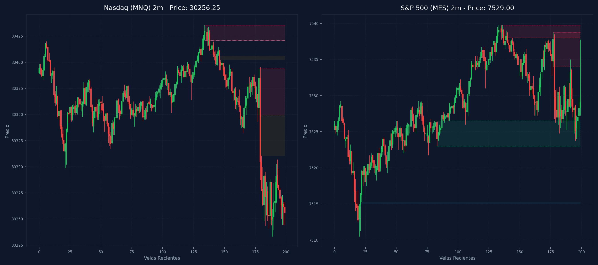

# 🛠️ Reporte Pre-Trade Avanzado: Mapa Dual de Confluencias (MNQ & MES)

Este reporte evalúa la estructura de mercado y dibuja la confluencia entre tus marcas de TradingView recopiladas vía CDP a lo largo de las 9 temporalidades analizadas en Nasdaq (`MNQ`) y S&P 500 (`MES`).

---

## 📅 Información de la Sesión
* **Fecha:** `2026-07-01`
* **Mercados Analizados:** Nasdaq (MNQ) y S&P 500 (MES)
* **Precios de Referencia:** MNQ: `30256.25` | MES: `7529.00`
* **Vinculación Temporal:** 
  * 🔗 [Ver Autopsia y Bitácora Post-Trade de esta Sesión](2026-07-01_session.md) (Se generará al finalizar tu sesión)

---

## ⚖️ Análisis de Bias y Fuerza Relativa
* **Bias Local Dominante:** `Bullish local (S&P 500 liderando)`
* **Mercado Más Alcista (Fuerte):** `S&P 500 (MES) 🟢`
* **Mercado Más Bajista (Débil):** `Nasdaq (MNQ) 🔴`
* **Puntuación de Fuerza ESTRUCTURAL:** NQ Score: `-0.5` | ES Score: `3.5`

---

## 🌊 Confluencias de Order Flow (NinjaTrader 8)
### 📊 Gráfico Activo: `MNQ 09-26` (1 Min Volumetric)
  * **Order Flow Trade Detector**: `null`
  * **Order Flow Cumulative Delta**: `-1326` ➔ **Presión Vendedora a Mercado (Bajista) 🔴**
  * **Oscilador de volumen**: `0`
### 📊 Gráfico Activo: `MES 09-26` (1 Min Volumetric)
  * **Order Flow Trade Detector**: `null`
  * **Order Flow Cumulative Delta**: `1852` ➔ **Presión Compradora a Mercado (Alcista) 🟢**
  * **Oscilador de volumen**: `0`

---

## 📈 Tabla Comparativa de Estructura (Multi-Temporalidad)

| Temporalidad | Sesgo MNQ | Rango MNQ | Sesgo MES | Rango MES |
| :--- | :--- | :--- | :--- | :--- |
| **4H** | Bullish 🟢 | Discount (Compras) 🟢 | Bullish 🟢 | Discount (Compras) 🟢 |
| **1H** | Bullish 🟢 | Discount (Compras) 🟢 | Bullish 🟢 | Premium (Ventas) 🔴 |
| **30m** | Bearish 🔴 | Discount (Compras) 🟢 | Bullish 🟢 | Premium (Ventas) 🔴 |
| **15m** | Bearish 🔴 | Discount (Compras) 🟢 | Bullish 🟢 | Discount (Compras) 🟢 |
| **5m** | Bearish 🔴 | Premium (Ventas) 🔴 | Bearish 🔴 | Discount (Compras) 🟢 |
| **4m** | Bearish 🔴 | Premium (Ventas) 🔴 | Bearish 🔴 | Premium (Ventas) 🔴 |
| **3m** | Bearish 🔴 | Premium (Ventas) 🔴 | Bearish 🔴 | Discount (Compras) 🟢 |
| **2m** | Bearish 🔴 | Discount (Compras) 🟢 | Bearish 🔴 | Discount (Compras) 🟢 |
| **1m** | Bullish 🟢 | Discount (Compras) 🟢 | Bearish 🔴 | Premium (Ventas) 🔴 |

---

## 🛡️ Alerta del Guardia de Riesgo (IA Risk Mentor)

> [!IMPORTANT]
> **Estadísticas de Bitácora:** Sesiones: `15` | PnL Acumulado: `$3082.50 USD` | Win Rate: `53.3%`
> 
> **🚨 TUS ERRORES PSICOLÓGICOS MÁS RECURRENTES A EVITAR HOY:**
> * **Ignorar Resistencia:** presente en el `60.0%` de las sesiones previas.
> * **FOMO:** presente en el `53.3%` de las sesiones previas.
>
> **📝 LECCIONES CLAVE A RECORDAR:**
> * 1. La Disciplina ante el Bias Paga Rentabilidad: Alinearse estrictamente con el HTF Bias (Bullish) en zona de descuento macro y descartar los cortos contra-tendencia es la base de los trades de alta probabilidad.
> * La Espera del Retesteo Reduce el Riesgo: No entrar persiguiendo velas de expansión alcista sino esperar con paciencia el pullback al FVG mitigador es la diferencia entre ser liquidado o lograr una entrada limpia con excelente R:R.
> * El Plan Vence a la Intuición: Ignorar el impulso de tomar shorts discrecionales (incluso cuando otros mentores o el ruido de micro-temporalidades sugerían caídas) y aferrarse a las reglas del manual operativo condujo a una sesión sumamente rentable.

---

## 🎯 Plan Operativo de Sesión (Gatillos Estructurales)

### 🟢 Escenario para LONG (Compras)
1. **Barrida de Liquidez Estructural (Sweep):** El precio de S&P debe barrer liquidez externa inferior (mínimo de sesión previa o swing low local en 30447.8 o similar) en temporalidad intermedia.
2. **Desplazamiento y Confirmación (iFVG):** Tras barrer liquidez, el precio debe desplazarse fuereña en el gráfico LTF (1m-5m) y cerrar con cuerpo completo por encima de un FVG bajista, convirtiéndolo en un Inverse FVG (iFVG).
3. **Perfil de Entrada Preferente:** Priorizar perfiles G-R-G (Fáciles de Invertir) para validar el orderflow alcista con momentum.

### 🔴 Escenario para SHORT (Ventas)
1. **Barrida de Liquidez Estructural (Sweep):** El precio de Nasdaq debe barrer liquidez externa superior (máximo de sesión previa o swing high local) y mitigar una zona de resistencia de Oferta.
2. **Desplazamiento y Confirmación (iFVG):** Reacción impulsiva bajista en LTF que rompa y cierre por debajo de un FVG alcista (perfil R-G-R preferente) para validar la inversión institucional a iFVG.
3. **Alineación de Fuerza:** Entrar en short en el mercado más débil para maximizar la velocidad de la caída.

---

## 🚫 Filtros Negativos (Zonas de Peligro)

### ⚠️ Mala Idea Tirar LONGS (No Comprar)
1. **Premium HTF:** Si el precio de MNQ o MES está cotizando dentro de zona Premium del rango de 1H/30m.
2. **Mitigación Hostil:** Si el precio está chocando directamente con una resistencia fuerte o Supply OB de 1H/4H.
3. **Divergencia SMT Bajista:** Si detectamos divergencia SMT Bajista (S&P 500 hace altos más altos pero Nasdaq falla en hacerlos), lo que indica distribución institucional activa.

### ⚠️ Mala Idea Tirar SHORTS (No Vender)
1. **Discount HTF:** Si el precio se encuentra cotizando en zona de descuento estructural (Discount) de 1H/30m.
2. **Soporte Hostil:** Si el precio se apoya en un Demand OB de 1H/4H inmitigado.
3. **Divergencia SMT Alcista:** Si detectamos divergencia SMT Alcista (S&P 500 barre mínimos pero Nasdaq sostiene mínimos más altos), lo que indica acumulación e invalida ventas.

---

## 🌀 Estrategia de VWAP y Nivel de Liquidez (DOL)
* **Estado de Mercado Esperado:** **Día de Rango (Consolidación) 🔄**
* **Guía Operativa del VWAP:**
  * El precio tenderá a regresar constantemente a la línea media (VWAP central).
  * Busca compras únicamente en la **Banda Inferior de -2 Desviaciones** y ventas en la **Banda Superior de +2 Desviaciones** cuando confluyan con barridas de liquidez de micro-temporalidad.
  * Evita buscar continuaciones largas. Mantén objetivos cortos y toma ganancias al regresar a la línea del VWAP.

---

## ⚡ Correlación Inter-Mercado (SMT Divergence)
* **Estado SMT:** `SMT ALCISTA DETECTADO 🟢 (Nasdaq sostiene mínimos más altos mientras S&P barre a mínimos más bajos. ¡Acumulación institucional!)`

---

## 🧠 Predicciones de Machine Learning (Win Rate Classifier)
### 💻 Predicción Nasdaq (MNQ):
```text
=== PREDICCIÓN DE PROBABILIDAD DE ÉXITO ===

==================================================
SETUP EVALUADO:
 - Instrumento: NQ | Dirección: Long | Sesión: NY AM KZ
 - Confluencias: in kill zone (london / ny am / pm), at htf pd array (ob / fvg / breaker), fair value gap (fvg) on entry tf, order block (ob) alignment, smt divergence present, htf market structure bias confirmed
--------------------------------------------------
PROBABILIDAD DE WIN RATE ESTIMADA: 59.0%
⚠️ SETUP MODERADO: Reducir riesgo a la mitad (0.5%) o esperar más confirmaciones.
==================================================
```
### 📊 Predicción S&P 500 (MES):
```text
=== PREDICCIÓN DE PROBABILIDAD DE ÉXITO ===

==================================================
SETUP EVALUADO:
 - Instrumento: ES | Dirección: Long | Sesión: NY AM KZ
 - Confluencias: in kill zone (london / ny am / pm), at htf pd array (ob / fvg / breaker), fair value gap (fvg) on entry tf, order block (ob) alignment, smt divergence present, htf market structure bias confirmed
--------------------------------------------------
PROBABILIDAD DE WIN RATE ESTIMADA: 52.6%
⚠️ SETUP MODERADO: Reducir riesgo a la mitad (0.5%) o esperar más confirmaciones.
==================================================
```

---

## 🎨 Comparación con Marcaciones Manuales (TradingView CDP)

### 💻 Marcaciones en Nasdaq (MNQ) por Temporalidad:
  * **Caja Gris con etiqueta '5m'** en rango `29293.77 - 29312.75` | Estado: 🟡 Fuera del precio | Confluencias: **OB 4H** (29160.0 - 29774.0), **OB 1H** (29182.0 - 29464.5)
  * **Caja Gris con etiqueta '5m'** en rango `29287.00 - 29293.57` | Estado: 🟡 Fuera del precio | Confluencias: **OB 4H** (29160.0 - 29774.0), **OB 1H** (29182.0 - 29464.5)
  * **Caja Gris** en rango `29315.75 - 29317.73` | Estado: 🟡 Fuera del precio | Confluencias: **OB 4H** (29160.0 - 29774.0), **OB 1H** (29182.0 - 29464.5)
  * **Caja Gris** en rango `29480.50 - 29502.21` | Estado: 🟡 Fuera del precio | Confluencias: **OB 4H** (29160.0 - 29774.0)
  * **Caja Gris** en rango `29583.25 - 29590.19` | Estado: 🟡 Fuera del precio | Confluencias: **OB 4H** (29160.0 - 29774.0)
  * **Caja Gris** en rango `29768.25 - 29772.53` | Estado: 🟡 Fuera del precio | Confluencias: **OB 4H** (29160.0 - 29774.0), **FVG 4H** (29770.0 - 29834.0)
  * **Caja Gris con etiqueta '4h'** en rango `30173.50 - 30489.91` | Estado: 🟢 PRECIO DENTRO | Confluencias: **FVG 4H** (30474.8 - 30484.2), **FVG 1H** (30307.0 - 30354.5), **OB 30m** (30392.2 - 30435.5), **FVG 30m** (30307.0 - 30332.2), **OB 15m** (30447.8 - 30477.2), **OB 15m** (30406.8 - 30435.5), **FVG 15m** (30402.5 - 30406.8), **OB 5m** (30463.8 - 30474.8), **OB 5m** (30415.8 - 30435.5), **FVG 5m** (30320.0 - 30361.8), **OB 4m** (30420.8 - 30435.5), **OB 4m** (30364.8 - 30388.2), **FVG 4m** (30310.5 - 30343.0), **OB 3m** (30413.8 - 30435.5), **OB 3m** (30372.0 - 30388.2), **FVG 3m** (30310.5 - 30343.0), **OB 2m** (30420.8 - 30435.5), **OB 2m** (30349.5 - 30393.8), **FVG 2m** (30402.5 - 30406.0), **FVG 2m** (30310.5 - 30349.5), **OB 1m** (30354.2 - 30393.8), **OB 1m** (30233.2 - 30255.0), **FVG 1m** (30320.0 - 30354.2), **FVG 1m** (30280.0 - 30282.2)
  * **Caja Gris con etiqueta '4h'** en rango `30444.25 - 30484.25` | Estado: 🟡 Fuera del precio | Confluencias: **FVG 4H** (30474.8 - 30484.2), **OB 15m** (30447.8 - 30477.2), **OB 5m** (30463.8 - 30474.8)
  * **Caja Gris con etiqueta '1h'** en rango `30142.75 - 30274.25` | Estado: 🟢 PRECIO DENTRO | Confluencias: **OB 1m** (30233.2 - 30255.0)
  * **Caja Gris con etiqueta '15m'** en rango `30288.28 - 30358.50` | Estado: 🟡 Fuera del precio | Confluencias: **FVG 1H** (30307.0 - 30354.5), **FVG 30m** (30307.0 - 30332.2), **FVG 5m** (30320.0 - 30361.8), **FVG 4m** (30310.5 - 30343.0), **FVG 3m** (30310.5 - 30343.0), **OB 2m** (30349.5 - 30393.8), **FVG 2m** (30310.5 - 30349.5), **OB 1m** (30354.2 - 30393.8), **FVG 1m** (30320.0 - 30354.2)
  * **Caja Gris con etiqueta '5m'** en rango `29293.77 - 29312.75` | Estado: 🟡 Fuera del precio | Confluencias: **OB 4H** (29160.0 - 29774.0), **OB 1H** (29182.0 - 29464.5)
  * **Caja Gris con etiqueta '5m'** en rango `29287.00 - 29293.57` | Estado: 🟡 Fuera del precio | Confluencias: **OB 4H** (29160.0 - 29774.0), **OB 1H** (29182.0 - 29464.5)
  * **Caja Gris** en rango `29315.75 - 29317.73` | Estado: 🟡 Fuera del precio | Confluencias: **OB 4H** (29160.0 - 29774.0), **OB 1H** (29182.0 - 29464.5)
  * **Caja Gris** en rango `29480.50 - 29502.21` | Estado: 🟡 Fuera del precio | Confluencias: **OB 4H** (29160.0 - 29774.0)
  * **Caja Gris** en rango `29583.25 - 29590.19` | Estado: 🟡 Fuera del precio | Confluencias: **OB 4H** (29160.0 - 29774.0)
  * **Caja Gris** en rango `29768.25 - 29772.53` | Estado: 🟡 Fuera del precio | Confluencias: **OB 4H** (29160.0 - 29774.0), **FVG 4H** (29770.0 - 29834.0)
  * **Caja Gris con etiqueta '4h'** en rango `30173.50 - 30489.91` | Estado: 🟢 PRECIO DENTRO | Confluencias: **FVG 4H** (30474.8 - 30484.2), **FVG 1H** (30307.0 - 30354.5), **OB 30m** (30392.2 - 30435.5), **FVG 30m** (30307.0 - 30332.2), **OB 15m** (30447.8 - 30477.2), **OB 15m** (30406.8 - 30435.5), **FVG 15m** (30402.5 - 30406.8), **OB 5m** (30463.8 - 30474.8), **OB 5m** (30415.8 - 30435.5), **FVG 5m** (30320.0 - 30361.8), **OB 4m** (30420.8 - 30435.5), **OB 4m** (30364.8 - 30388.2), **FVG 4m** (30310.5 - 30343.0), **OB 3m** (30413.8 - 30435.5), **OB 3m** (30372.0 - 30388.2), **FVG 3m** (30310.5 - 30343.0), **OB 2m** (30420.8 - 30435.5), **OB 2m** (30349.5 - 30393.8), **FVG 2m** (30402.5 - 30406.0), **FVG 2m** (30310.5 - 30349.5), **OB 1m** (30354.2 - 30393.8), **OB 1m** (30233.2 - 30255.0), **FVG 1m** (30320.0 - 30354.2), **FVG 1m** (30280.0 - 30282.2)
  * **Caja Gris con etiqueta '4h'** en rango `30444.25 - 30484.25` | Estado: 🟡 Fuera del precio | Confluencias: **FVG 4H** (30474.8 - 30484.2), **OB 15m** (30447.8 - 30477.2), **OB 5m** (30463.8 - 30474.8)
  * **Caja Gris con etiqueta '1h'** en rango `30142.75 - 30274.25` | Estado: 🟢 PRECIO DENTRO | Confluencias: **OB 1m** (30233.2 - 30255.0)
  * **Caja Gris con etiqueta '15m'** en rango `30288.28 - 30358.50` | Estado: 🟡 Fuera del precio | Confluencias: **FVG 1H** (30307.0 - 30354.5), **FVG 30m** (30307.0 - 30332.2), **FVG 5m** (30320.0 - 30361.8), **FVG 4m** (30310.5 - 30343.0), **FVG 3m** (30310.5 - 30343.0), **OB 2m** (30349.5 - 30393.8), **FVG 2m** (30310.5 - 30349.5), **OB 1m** (30354.2 - 30393.8), **FVG 1m** (30320.0 - 30354.2)
  * **Caja Gris con etiqueta '5m'** en rango `29293.77 - 29312.75` | Estado: 🟡 Fuera del precio | Confluencias: **OB 4H** (29160.0 - 29774.0), **OB 1H** (29182.0 - 29464.5)
  * **Caja Gris con etiqueta '5m'** en rango `29287.00 - 29293.57` | Estado: 🟡 Fuera del precio | Confluencias: **OB 4H** (29160.0 - 29774.0), **OB 1H** (29182.0 - 29464.5)
  * **Caja Gris** en rango `29315.75 - 29317.73` | Estado: 🟡 Fuera del precio | Confluencias: **OB 4H** (29160.0 - 29774.0), **OB 1H** (29182.0 - 29464.5)
  * **Caja Gris** en rango `29480.50 - 29502.21` | Estado: 🟡 Fuera del precio | Confluencias: **OB 4H** (29160.0 - 29774.0)
  * **Caja Gris** en rango `29583.25 - 29590.19` | Estado: 🟡 Fuera del precio | Confluencias: **OB 4H** (29160.0 - 29774.0)
  * **Caja Gris** en rango `29768.25 - 29772.53` | Estado: 🟡 Fuera del precio | Confluencias: **OB 4H** (29160.0 - 29774.0), **FVG 4H** (29770.0 - 29834.0)
  * **Caja Gris con etiqueta '4h'** en rango `30173.50 - 30489.91` | Estado: 🟢 PRECIO DENTRO | Confluencias: **FVG 4H** (30474.8 - 30484.2), **FVG 1H** (30307.0 - 30354.5), **OB 30m** (30392.2 - 30435.5), **FVG 30m** (30307.0 - 30332.2), **OB 15m** (30447.8 - 30477.2), **OB 15m** (30406.8 - 30435.5), **FVG 15m** (30402.5 - 30406.8), **OB 5m** (30463.8 - 30474.8), **OB 5m** (30415.8 - 30435.5), **FVG 5m** (30320.0 - 30361.8), **OB 4m** (30420.8 - 30435.5), **OB 4m** (30364.8 - 30388.2), **FVG 4m** (30310.5 - 30343.0), **OB 3m** (30413.8 - 30435.5), **OB 3m** (30372.0 - 30388.2), **FVG 3m** (30310.5 - 30343.0), **OB 2m** (30420.8 - 30435.5), **OB 2m** (30349.5 - 30393.8), **FVG 2m** (30402.5 - 30406.0), **FVG 2m** (30310.5 - 30349.5), **OB 1m** (30354.2 - 30393.8), **OB 1m** (30233.2 - 30255.0), **FVG 1m** (30320.0 - 30354.2), **FVG 1m** (30280.0 - 30282.2)
  * **Caja Gris con etiqueta '4h'** en rango `30444.25 - 30484.25` | Estado: 🟡 Fuera del precio | Confluencias: **FVG 4H** (30474.8 - 30484.2), **OB 15m** (30447.8 - 30477.2), **OB 5m** (30463.8 - 30474.8)
  * **Caja Gris con etiqueta '1h'** en rango `30142.75 - 30274.25` | Estado: 🟢 PRECIO DENTRO | Confluencias: **OB 1m** (30233.2 - 30255.0)
  * **Caja Gris con etiqueta '15m'** en rango `30288.28 - 30358.50` | Estado: 🟡 Fuera del precio | Confluencias: **FVG 1H** (30307.0 - 30354.5), **FVG 30m** (30307.0 - 30332.2), **FVG 5m** (30320.0 - 30361.8), **FVG 4m** (30310.5 - 30343.0), **FVG 3m** (30310.5 - 30343.0), **OB 2m** (30349.5 - 30393.8), **FVG 2m** (30310.5 - 30349.5), **OB 1m** (30354.2 - 30393.8), **FVG 1m** (30320.0 - 30354.2)
  * **Caja Gris con etiqueta '5m'** en rango `29293.77 - 29312.75` | Estado: 🟡 Fuera del precio | Confluencias: **OB 4H** (29160.0 - 29774.0), **OB 1H** (29182.0 - 29464.5)
  * **Caja Gris con etiqueta '5m'** en rango `29287.00 - 29293.57` | Estado: 🟡 Fuera del precio | Confluencias: **OB 4H** (29160.0 - 29774.0), **OB 1H** (29182.0 - 29464.5)
  * **Caja Gris** en rango `29315.75 - 29317.73` | Estado: 🟡 Fuera del precio | Confluencias: **OB 4H** (29160.0 - 29774.0), **OB 1H** (29182.0 - 29464.5)
  * **Caja Gris** en rango `29480.50 - 29502.21` | Estado: 🟡 Fuera del precio | Confluencias: **OB 4H** (29160.0 - 29774.0)
  * **Caja Gris** en rango `29583.25 - 29590.19` | Estado: 🟡 Fuera del precio | Confluencias: **OB 4H** (29160.0 - 29774.0)
  * **Caja Gris** en rango `29768.25 - 29772.53` | Estado: 🟡 Fuera del precio | Confluencias: **OB 4H** (29160.0 - 29774.0), **FVG 4H** (29770.0 - 29834.0)
  * **Caja Gris con etiqueta '4h'** en rango `30173.50 - 30489.91` | Estado: 🟢 PRECIO DENTRO | Confluencias: **FVG 4H** (30474.8 - 30484.2), **FVG 1H** (30307.0 - 30354.5), **OB 30m** (30392.2 - 30435.5), **FVG 30m** (30307.0 - 30332.2), **OB 15m** (30447.8 - 30477.2), **OB 15m** (30406.8 - 30435.5), **FVG 15m** (30402.5 - 30406.8), **OB 5m** (30463.8 - 30474.8), **OB 5m** (30415.8 - 30435.5), **FVG 5m** (30320.0 - 30361.8), **OB 4m** (30420.8 - 30435.5), **OB 4m** (30364.8 - 30388.2), **FVG 4m** (30310.5 - 30343.0), **OB 3m** (30413.8 - 30435.5), **OB 3m** (30372.0 - 30388.2), **FVG 3m** (30310.5 - 30343.0), **OB 2m** (30420.8 - 30435.5), **OB 2m** (30349.5 - 30393.8), **FVG 2m** (30402.5 - 30406.0), **FVG 2m** (30310.5 - 30349.5), **OB 1m** (30354.2 - 30393.8), **OB 1m** (30233.2 - 30255.0), **FVG 1m** (30320.0 - 30354.2), **FVG 1m** (30280.0 - 30282.2)
  * **Caja Gris con etiqueta '4h'** en rango `30444.25 - 30484.25` | Estado: 🟡 Fuera del precio | Confluencias: **FVG 4H** (30474.8 - 30484.2), **OB 15m** (30447.8 - 30477.2), **OB 5m** (30463.8 - 30474.8)
  * **Caja Gris con etiqueta '1h'** en rango `30142.75 - 30274.25` | Estado: 🟢 PRECIO DENTRO | Confluencias: **OB 1m** (30233.2 - 30255.0)
  * **Caja Gris con etiqueta '15m'** en rango `30288.28 - 30358.50` | Estado: 🟡 Fuera del precio | Confluencias: **FVG 1H** (30307.0 - 30354.5), **FVG 30m** (30307.0 - 30332.2), **FVG 5m** (30320.0 - 30361.8), **FVG 4m** (30310.5 - 30343.0), **FVG 3m** (30310.5 - 30343.0), **OB 2m** (30349.5 - 30393.8), **FVG 2m** (30310.5 - 30349.5), **OB 1m** (30354.2 - 30393.8), **FVG 1m** (30320.0 - 30354.2)
  * **Caja Gris con etiqueta '5m'** en rango `29293.77 - 29312.75` | Estado: 🟡 Fuera del precio | Confluencias: **OB 4H** (29160.0 - 29774.0), **OB 1H** (29182.0 - 29464.5)
  * **Caja Gris con etiqueta '5m'** en rango `29287.00 - 29293.57` | Estado: 🟡 Fuera del precio | Confluencias: **OB 4H** (29160.0 - 29774.0), **OB 1H** (29182.0 - 29464.5)
  * **Caja Gris** en rango `29315.75 - 29317.73` | Estado: 🟡 Fuera del precio | Confluencias: **OB 4H** (29160.0 - 29774.0), **OB 1H** (29182.0 - 29464.5)
  * **Caja Gris** en rango `29480.50 - 29502.21` | Estado: 🟡 Fuera del precio | Confluencias: **OB 4H** (29160.0 - 29774.0)
  * **Caja Gris** en rango `29583.25 - 29590.19` | Estado: 🟡 Fuera del precio | Confluencias: **OB 4H** (29160.0 - 29774.0)
  * **Caja Gris** en rango `29768.25 - 29772.53` | Estado: 🟡 Fuera del precio | Confluencias: **OB 4H** (29160.0 - 29774.0), **FVG 4H** (29770.0 - 29834.0)
  * **Caja Gris con etiqueta '4h'** en rango `30173.50 - 30489.91` | Estado: 🟢 PRECIO DENTRO | Confluencias: **FVG 4H** (30474.8 - 30484.2), **FVG 1H** (30307.0 - 30354.5), **OB 30m** (30392.2 - 30435.5), **FVG 30m** (30307.0 - 30332.2), **OB 15m** (30447.8 - 30477.2), **OB 15m** (30406.8 - 30435.5), **FVG 15m** (30402.5 - 30406.8), **OB 5m** (30463.8 - 30474.8), **OB 5m** (30415.8 - 30435.5), **FVG 5m** (30320.0 - 30361.8), **OB 4m** (30420.8 - 30435.5), **OB 4m** (30364.8 - 30388.2), **FVG 4m** (30310.5 - 30343.0), **OB 3m** (30413.8 - 30435.5), **OB 3m** (30372.0 - 30388.2), **FVG 3m** (30310.5 - 30343.0), **OB 2m** (30420.8 - 30435.5), **OB 2m** (30349.5 - 30393.8), **FVG 2m** (30402.5 - 30406.0), **FVG 2m** (30310.5 - 30349.5), **OB 1m** (30354.2 - 30393.8), **OB 1m** (30233.2 - 30255.0), **FVG 1m** (30320.0 - 30354.2), **FVG 1m** (30280.0 - 30282.2)
  * **Caja Gris con etiqueta '4h'** en rango `30444.25 - 30484.25` | Estado: 🟡 Fuera del precio | Confluencias: **FVG 4H** (30474.8 - 30484.2), **OB 15m** (30447.8 - 30477.2), **OB 5m** (30463.8 - 30474.8)
  * **Caja Gris con etiqueta '1h'** en rango `30142.75 - 30274.25` | Estado: 🟢 PRECIO DENTRO | Confluencias: **OB 1m** (30233.2 - 30255.0)
  * **Caja Gris con etiqueta '15m'** en rango `30288.28 - 30358.50` | Estado: 🟡 Fuera del precio | Confluencias: **FVG 1H** (30307.0 - 30354.5), **FVG 30m** (30307.0 - 30332.2), **FVG 5m** (30320.0 - 30361.8), **FVG 4m** (30310.5 - 30343.0), **FVG 3m** (30310.5 - 30343.0), **OB 2m** (30349.5 - 30393.8), **FVG 2m** (30310.5 - 30349.5), **OB 1m** (30354.2 - 30393.8), **FVG 1m** (30320.0 - 30354.2)
  * **Caja Gris con etiqueta '5m'** en rango `29293.77 - 29312.75` | Estado: 🟡 Fuera del precio | Confluencias: **OB 4H** (29160.0 - 29774.0), **OB 1H** (29182.0 - 29464.5)
  * **Caja Gris con etiqueta '5m'** en rango `29287.00 - 29293.57` | Estado: 🟡 Fuera del precio | Confluencias: **OB 4H** (29160.0 - 29774.0), **OB 1H** (29182.0 - 29464.5)
  * **Caja Gris** en rango `29315.75 - 29317.73` | Estado: 🟡 Fuera del precio | Confluencias: **OB 4H** (29160.0 - 29774.0), **OB 1H** (29182.0 - 29464.5)
  * **Caja Gris** en rango `29480.50 - 29502.21` | Estado: 🟡 Fuera del precio | Confluencias: **OB 4H** (29160.0 - 29774.0)
  * **Caja Gris** en rango `29583.25 - 29590.19` | Estado: 🟡 Fuera del precio | Confluencias: **OB 4H** (29160.0 - 29774.0)
  * **Caja Gris** en rango `29768.25 - 29772.53` | Estado: 🟡 Fuera del precio | Confluencias: **OB 4H** (29160.0 - 29774.0), **FVG 4H** (29770.0 - 29834.0)
  * **Caja Gris con etiqueta '4h'** en rango `30173.50 - 30489.91` | Estado: 🟢 PRECIO DENTRO | Confluencias: **FVG 4H** (30474.8 - 30484.2), **FVG 1H** (30307.0 - 30354.5), **OB 30m** (30392.2 - 30435.5), **FVG 30m** (30307.0 - 30332.2), **OB 15m** (30447.8 - 30477.2), **OB 15m** (30406.8 - 30435.5), **FVG 15m** (30402.5 - 30406.8), **OB 5m** (30463.8 - 30474.8), **OB 5m** (30415.8 - 30435.5), **FVG 5m** (30320.0 - 30361.8), **OB 4m** (30420.8 - 30435.5), **OB 4m** (30364.8 - 30388.2), **FVG 4m** (30310.5 - 30343.0), **OB 3m** (30413.8 - 30435.5), **OB 3m** (30372.0 - 30388.2), **FVG 3m** (30310.5 - 30343.0), **OB 2m** (30420.8 - 30435.5), **OB 2m** (30349.5 - 30393.8), **FVG 2m** (30402.5 - 30406.0), **FVG 2m** (30310.5 - 30349.5), **OB 1m** (30354.2 - 30393.8), **OB 1m** (30233.2 - 30255.0), **FVG 1m** (30320.0 - 30354.2), **FVG 1m** (30280.0 - 30282.2)
  * **Caja Gris con etiqueta '4h'** en rango `30444.25 - 30484.25` | Estado: 🟡 Fuera del precio | Confluencias: **FVG 4H** (30474.8 - 30484.2), **OB 15m** (30447.8 - 30477.2), **OB 5m** (30463.8 - 30474.8)
  * **Caja Gris con etiqueta '1h'** en rango `30142.75 - 30274.25` | Estado: 🟢 PRECIO DENTRO | Confluencias: **OB 1m** (30233.2 - 30255.0)
  * **Caja Gris con etiqueta '15m'** en rango `30288.28 - 30358.50` | Estado: 🟡 Fuera del precio | Confluencias: **FVG 1H** (30307.0 - 30354.5), **FVG 30m** (30307.0 - 30332.2), **FVG 5m** (30320.0 - 30361.8), **FVG 4m** (30310.5 - 30343.0), **FVG 3m** (30310.5 - 30343.0), **OB 2m** (30349.5 - 30393.8), **FVG 2m** (30310.5 - 30349.5), **OB 1m** (30354.2 - 30393.8), **FVG 1m** (30320.0 - 30354.2)
  * **Caja Gris con etiqueta '5m'** en rango `29293.77 - 29312.75` | Estado: 🟡 Fuera del precio | Confluencias: **OB 4H** (29160.0 - 29774.0), **OB 1H** (29182.0 - 29464.5)
  * **Caja Gris con etiqueta '5m'** en rango `29287.00 - 29293.57` | Estado: 🟡 Fuera del precio | Confluencias: **OB 4H** (29160.0 - 29774.0), **OB 1H** (29182.0 - 29464.5)
  * **Caja Gris** en rango `29315.75 - 29317.73` | Estado: 🟡 Fuera del precio | Confluencias: **OB 4H** (29160.0 - 29774.0), **OB 1H** (29182.0 - 29464.5)
  * **Caja Gris** en rango `29480.50 - 29502.21` | Estado: 🟡 Fuera del precio | Confluencias: **OB 4H** (29160.0 - 29774.0)
  * **Caja Gris** en rango `29583.25 - 29590.19` | Estado: 🟡 Fuera del precio | Confluencias: **OB 4H** (29160.0 - 29774.0)
  * **Caja Gris** en rango `29768.25 - 29772.53` | Estado: 🟡 Fuera del precio | Confluencias: **OB 4H** (29160.0 - 29774.0), **FVG 4H** (29770.0 - 29834.0)
  * **Caja Gris con etiqueta '4h'** en rango `30173.50 - 30489.91` | Estado: 🟢 PRECIO DENTRO | Confluencias: **FVG 4H** (30474.8 - 30484.2), **FVG 1H** (30307.0 - 30354.5), **OB 30m** (30392.2 - 30435.5), **FVG 30m** (30307.0 - 30332.2), **OB 15m** (30447.8 - 30477.2), **OB 15m** (30406.8 - 30435.5), **FVG 15m** (30402.5 - 30406.8), **OB 5m** (30463.8 - 30474.8), **OB 5m** (30415.8 - 30435.5), **FVG 5m** (30320.0 - 30361.8), **OB 4m** (30420.8 - 30435.5), **OB 4m** (30364.8 - 30388.2), **FVG 4m** (30310.5 - 30343.0), **OB 3m** (30413.8 - 30435.5), **OB 3m** (30372.0 - 30388.2), **FVG 3m** (30310.5 - 30343.0), **OB 2m** (30420.8 - 30435.5), **OB 2m** (30349.5 - 30393.8), **FVG 2m** (30402.5 - 30406.0), **FVG 2m** (30310.5 - 30349.5), **OB 1m** (30354.2 - 30393.8), **OB 1m** (30233.2 - 30255.0), **FVG 1m** (30320.0 - 30354.2), **FVG 1m** (30280.0 - 30282.2)
  * **Caja Gris con etiqueta '4h'** en rango `30444.25 - 30484.25` | Estado: 🟡 Fuera del precio | Confluencias: **FVG 4H** (30474.8 - 30484.2), **OB 15m** (30447.8 - 30477.2), **OB 5m** (30463.8 - 30474.8)
  * **Caja Gris con etiqueta '1h'** en rango `30142.75 - 30274.25` | Estado: 🟢 PRECIO DENTRO | Confluencias: **OB 1m** (30233.2 - 30255.0)
  * **Caja Gris con etiqueta '15m'** en rango `30288.28 - 30358.50` | Estado: 🟡 Fuera del precio | Confluencias: **FVG 1H** (30307.0 - 30354.5), **FVG 30m** (30307.0 - 30332.2), **FVG 5m** (30320.0 - 30361.8), **FVG 4m** (30310.5 - 30343.0), **FVG 3m** (30310.5 - 30343.0), **OB 2m** (30349.5 - 30393.8), **FVG 2m** (30310.5 - 30349.5), **OB 1m** (30354.2 - 30393.8), **FVG 1m** (30320.0 - 30354.2)
  * **Caja Gris con etiqueta '5m'** en rango `29293.77 - 29312.75` | Estado: 🟡 Fuera del precio | Confluencias: **OB 4H** (29160.0 - 29774.0), **OB 1H** (29182.0 - 29464.5)
  * **Caja Gris con etiqueta '5m'** en rango `29287.00 - 29293.57` | Estado: 🟡 Fuera del precio | Confluencias: **OB 4H** (29160.0 - 29774.0), **OB 1H** (29182.0 - 29464.5)
  * **Caja Gris** en rango `29315.75 - 29317.73` | Estado: 🟡 Fuera del precio | Confluencias: **OB 4H** (29160.0 - 29774.0), **OB 1H** (29182.0 - 29464.5)
  * **Caja Gris** en rango `29480.50 - 29502.21` | Estado: 🟡 Fuera del precio | Confluencias: **OB 4H** (29160.0 - 29774.0)
  * **Caja Gris** en rango `29583.25 - 29590.19` | Estado: 🟡 Fuera del precio | Confluencias: **OB 4H** (29160.0 - 29774.0)
  * **Caja Gris** en rango `29768.25 - 29772.53` | Estado: 🟡 Fuera del precio | Confluencias: **OB 4H** (29160.0 - 29774.0), **FVG 4H** (29770.0 - 29834.0)
  * **Caja Gris con etiqueta '4h'** en rango `30173.50 - 30489.91` | Estado: 🟢 PRECIO DENTRO | Confluencias: **FVG 4H** (30474.8 - 30484.2), **FVG 1H** (30307.0 - 30354.5), **OB 30m** (30392.2 - 30435.5), **FVG 30m** (30307.0 - 30332.2), **OB 15m** (30447.8 - 30477.2), **OB 15m** (30406.8 - 30435.5), **FVG 15m** (30402.5 - 30406.8), **OB 5m** (30463.8 - 30474.8), **OB 5m** (30415.8 - 30435.5), **FVG 5m** (30320.0 - 30361.8), **OB 4m** (30420.8 - 30435.5), **OB 4m** (30364.8 - 30388.2), **FVG 4m** (30310.5 - 30343.0), **OB 3m** (30413.8 - 30435.5), **OB 3m** (30372.0 - 30388.2), **FVG 3m** (30310.5 - 30343.0), **OB 2m** (30420.8 - 30435.5), **OB 2m** (30349.5 - 30393.8), **FVG 2m** (30402.5 - 30406.0), **FVG 2m** (30310.5 - 30349.5), **OB 1m** (30354.2 - 30393.8), **OB 1m** (30233.2 - 30255.0), **FVG 1m** (30320.0 - 30354.2), **FVG 1m** (30280.0 - 30282.2)
  * **Caja Gris con etiqueta '4h'** en rango `30444.25 - 30484.25` | Estado: 🟡 Fuera del precio | Confluencias: **FVG 4H** (30474.8 - 30484.2), **OB 15m** (30447.8 - 30477.2), **OB 5m** (30463.8 - 30474.8)
  * **Caja Gris con etiqueta '1h'** en rango `30142.75 - 30274.25` | Estado: 🟢 PRECIO DENTRO | Confluencias: **OB 1m** (30233.2 - 30255.0)
  * **Caja Gris con etiqueta '15m'** en rango `30288.28 - 30358.50` | Estado: 🟡 Fuera del precio | Confluencias: **FVG 1H** (30307.0 - 30354.5), **FVG 30m** (30307.0 - 30332.2), **FVG 5m** (30320.0 - 30361.8), **FVG 4m** (30310.5 - 30343.0), **FVG 3m** (30310.5 - 30343.0), **OB 2m** (30349.5 - 30393.8), **FVG 2m** (30310.5 - 30349.5), **OB 1m** (30354.2 - 30393.8), **FVG 1m** (30320.0 - 30354.2)
  * **Caja Gris con etiqueta '5m'** en rango `29293.77 - 29312.75` | Estado: 🟡 Fuera del precio | Confluencias: **OB 4H** (29160.0 - 29774.0), **OB 1H** (29182.0 - 29464.5)
  * **Caja Gris con etiqueta '5m'** en rango `29287.00 - 29293.57` | Estado: 🟡 Fuera del precio | Confluencias: **OB 4H** (29160.0 - 29774.0), **OB 1H** (29182.0 - 29464.5)
  * **Caja Gris** en rango `29315.75 - 29317.73` | Estado: 🟡 Fuera del precio | Confluencias: **OB 4H** (29160.0 - 29774.0), **OB 1H** (29182.0 - 29464.5)
  * **Caja Gris** en rango `29480.50 - 29502.21` | Estado: 🟡 Fuera del precio | Confluencias: **OB 4H** (29160.0 - 29774.0)
  * **Caja Gris** en rango `29583.25 - 29590.19` | Estado: 🟡 Fuera del precio | Confluencias: **OB 4H** (29160.0 - 29774.0)
  * **Caja Gris** en rango `29768.25 - 29772.53` | Estado: 🟡 Fuera del precio | Confluencias: **OB 4H** (29160.0 - 29774.0), **FVG 4H** (29770.0 - 29834.0)
  * **Caja Gris con etiqueta '4h'** en rango `30173.50 - 30489.91` | Estado: 🟢 PRECIO DENTRO | Confluencias: **FVG 4H** (30474.8 - 30484.2), **FVG 1H** (30307.0 - 30354.5), **OB 30m** (30392.2 - 30435.5), **FVG 30m** (30307.0 - 30332.2), **OB 15m** (30447.8 - 30477.2), **OB 15m** (30406.8 - 30435.5), **FVG 15m** (30402.5 - 30406.8), **OB 5m** (30463.8 - 30474.8), **OB 5m** (30415.8 - 30435.5), **FVG 5m** (30320.0 - 30361.8), **OB 4m** (30420.8 - 30435.5), **OB 4m** (30364.8 - 30388.2), **FVG 4m** (30310.5 - 30343.0), **OB 3m** (30413.8 - 30435.5), **OB 3m** (30372.0 - 30388.2), **FVG 3m** (30310.5 - 30343.0), **OB 2m** (30420.8 - 30435.5), **OB 2m** (30349.5 - 30393.8), **FVG 2m** (30402.5 - 30406.0), **FVG 2m** (30310.5 - 30349.5), **OB 1m** (30354.2 - 30393.8), **OB 1m** (30233.2 - 30255.0), **FVG 1m** (30320.0 - 30354.2), **FVG 1m** (30280.0 - 30282.2)
  * **Caja Gris con etiqueta '4h'** en rango `30444.25 - 30484.25` | Estado: 🟡 Fuera del precio | Confluencias: **FVG 4H** (30474.8 - 30484.2), **OB 15m** (30447.8 - 30477.2), **OB 5m** (30463.8 - 30474.8)
  * **Caja Gris con etiqueta '1h'** en rango `30142.75 - 30274.25` | Estado: 🟢 PRECIO DENTRO | Confluencias: **OB 1m** (30233.2 - 30255.0)
  * **Caja Gris con etiqueta '15m'** en rango `30288.28 - 30358.50` | Estado: 🟡 Fuera del precio | Confluencias: **FVG 1H** (30307.0 - 30354.5), **FVG 30m** (30307.0 - 30332.2), **FVG 5m** (30320.0 - 30361.8), **FVG 4m** (30310.5 - 30343.0), **FVG 3m** (30310.5 - 30343.0), **OB 2m** (30349.5 - 30393.8), **FVG 2m** (30310.5 - 30349.5), **OB 1m** (30354.2 - 30393.8), **FVG 1m** (30320.0 - 30354.2)
  * **Línea Manual con etiqueta 'ifl 1h'** en nivel `28825.75` | Estado: Fuera de rango
  * **Línea Manual con etiqueta 'ssl'** en nivel `28520.00` | Estado: Fuera de rango
  * **Línea Manual con etiqueta 'ifl 4h'** en nivel `30699.75` | Estado: Fuera de rango | Ubicación: dentro de **OB 4H** (30539.2 - 30967.8)
  * **Línea Manual con etiqueta 'nyaml'** en nivel `29274.00` | Estado: Fuera de rango | Ubicación: dentro de **OB 4H** (29160.0 - 29774.0), dentro de **OB 1H** (29182.0 - 29464.5)
  * **Línea Manual con etiqueta 'nyaml'** en nivel `29182.00` | Estado: Fuera de rango | Ubicación: dentro de **OB 4H** (29160.0 - 29774.0), dentro de **OB 1H** (29182.0 - 29464.5)
  * **Línea Manual con etiqueta 'al-ifl 4h'** en nivel `29936.75` | Estado: Fuera de rango
  * **Línea Manual con etiqueta 'ifl 1h-lh'** en nivel `30435.50` | Estado: Fuera de rango | Ubicación: dentro de **OB 30m** (30392.2 - 30435.5), dentro de **OB 15m** (30406.8 - 30435.5), dentro de **OB 5m** (30415.8 - 30435.5), dentro de **OB 4m** (30420.8 - 30435.5), dentro de **OB 3m** (30413.8 - 30435.5), dentro de **OB 2m** (30420.8 - 30435.5)
  * **Línea Manual con etiqueta 'ifl 1h'** en nivel `30477.25` | Estado: Fuera de rango | Ubicación: dentro de **FVG 4H** (30474.8 - 30484.2), dentro de **OB 15m** (30447.8 - 30477.2)
  * **Línea Manual con etiqueta 'ah'** en nivel `30555.75` | Estado: Fuera de rango | Ubicación: dentro de **OB 4H** (30539.2 - 30967.8), dentro de **OB 30m** (30506.5 - 30555.8)
  * **Línea Manual con etiqueta 'ifl 30m'** en nivel `30395.25` | Estado: Fuera de rango | Ubicación: dentro de **OB 30m** (30392.2 - 30435.5)
  * **Línea Manual con etiqueta 'ifl 1h'** en nivel `28825.75` | Estado: Fuera de rango
  * **Línea Manual con etiqueta 'ssl'** en nivel `28520.00` | Estado: Fuera de rango
  * **Línea Manual con etiqueta 'ifl 4h'** en nivel `30699.75` | Estado: Fuera de rango | Ubicación: dentro de **OB 4H** (30539.2 - 30967.8)
  * **Línea Manual con etiqueta 'nyaml'** en nivel `29274.00` | Estado: Fuera de rango | Ubicación: dentro de **OB 4H** (29160.0 - 29774.0), dentro de **OB 1H** (29182.0 - 29464.5)
  * **Línea Manual con etiqueta 'nyaml'** en nivel `29182.00` | Estado: Fuera de rango | Ubicación: dentro de **OB 4H** (29160.0 - 29774.0), dentro de **OB 1H** (29182.0 - 29464.5)
  * **Línea Manual con etiqueta 'al-ifl 4h'** en nivel `29936.75` | Estado: Fuera de rango
  * **Línea Manual con etiqueta 'ifl 1h-lh'** en nivel `30435.50` | Estado: Fuera de rango | Ubicación: dentro de **OB 30m** (30392.2 - 30435.5), dentro de **OB 15m** (30406.8 - 30435.5), dentro de **OB 5m** (30415.8 - 30435.5), dentro de **OB 4m** (30420.8 - 30435.5), dentro de **OB 3m** (30413.8 - 30435.5), dentro de **OB 2m** (30420.8 - 30435.5)
  * **Línea Manual con etiqueta 'ifl 1h'** en nivel `30477.25` | Estado: Fuera de rango | Ubicación: dentro de **FVG 4H** (30474.8 - 30484.2), dentro de **OB 15m** (30447.8 - 30477.2)
  * **Línea Manual con etiqueta 'ah'** en nivel `30555.75` | Estado: Fuera de rango | Ubicación: dentro de **OB 4H** (30539.2 - 30967.8), dentro de **OB 30m** (30506.5 - 30555.8)
  * **Línea Manual con etiqueta 'ifl 30m'** en nivel `30395.25` | Estado: Fuera de rango | Ubicación: dentro de **OB 30m** (30392.2 - 30435.5)
  * **Línea Manual con etiqueta 'ifl 1h'** en nivel `28825.75` | Estado: Fuera de rango
  * **Línea Manual con etiqueta 'ssl'** en nivel `28520.00` | Estado: Fuera de rango
  * **Línea Manual con etiqueta 'ifl 4h'** en nivel `30699.75` | Estado: Fuera de rango | Ubicación: dentro de **OB 4H** (30539.2 - 30967.8)
  * **Línea Manual con etiqueta 'nyaml'** en nivel `29274.00` | Estado: Fuera de rango | Ubicación: dentro de **OB 4H** (29160.0 - 29774.0), dentro de **OB 1H** (29182.0 - 29464.5)
  * **Línea Manual con etiqueta 'nyaml'** en nivel `29182.00` | Estado: Fuera de rango | Ubicación: dentro de **OB 4H** (29160.0 - 29774.0), dentro de **OB 1H** (29182.0 - 29464.5)
  * **Línea Manual con etiqueta 'al-ifl 4h'** en nivel `29936.75` | Estado: Fuera de rango
  * **Línea Manual con etiqueta 'ifl 1h-lh'** en nivel `30435.50` | Estado: Fuera de rango | Ubicación: dentro de **OB 30m** (30392.2 - 30435.5), dentro de **OB 15m** (30406.8 - 30435.5), dentro de **OB 5m** (30415.8 - 30435.5), dentro de **OB 4m** (30420.8 - 30435.5), dentro de **OB 3m** (30413.8 - 30435.5), dentro de **OB 2m** (30420.8 - 30435.5)
  * **Línea Manual con etiqueta 'ifl 1h'** en nivel `30477.25` | Estado: Fuera de rango | Ubicación: dentro de **FVG 4H** (30474.8 - 30484.2), dentro de **OB 15m** (30447.8 - 30477.2)
  * **Línea Manual con etiqueta 'ah'** en nivel `30555.75` | Estado: Fuera de rango | Ubicación: dentro de **OB 4H** (30539.2 - 30967.8), dentro de **OB 30m** (30506.5 - 30555.8)
  * **Línea Manual con etiqueta 'ifl 30m'** en nivel `30395.25` | Estado: Fuera de rango | Ubicación: dentro de **OB 30m** (30392.2 - 30435.5)
  * **Línea Manual con etiqueta 'ifl 1h'** en nivel `28825.75` | Estado: Fuera de rango
  * **Línea Manual con etiqueta 'ssl'** en nivel `28520.00` | Estado: Fuera de rango
  * **Línea Manual con etiqueta 'ifl 4h'** en nivel `30699.75` | Estado: Fuera de rango | Ubicación: dentro de **OB 4H** (30539.2 - 30967.8)
  * **Línea Manual con etiqueta 'nyaml'** en nivel `29274.00` | Estado: Fuera de rango | Ubicación: dentro de **OB 4H** (29160.0 - 29774.0), dentro de **OB 1H** (29182.0 - 29464.5)
  * **Línea Manual con etiqueta 'nyaml'** en nivel `29182.00` | Estado: Fuera de rango | Ubicación: dentro de **OB 4H** (29160.0 - 29774.0), dentro de **OB 1H** (29182.0 - 29464.5)
  * **Línea Manual con etiqueta 'al-ifl 4h'** en nivel `29936.75` | Estado: Fuera de rango
  * **Línea Manual con etiqueta 'ifl 1h-lh'** en nivel `30435.50` | Estado: Fuera de rango | Ubicación: dentro de **OB 30m** (30392.2 - 30435.5), dentro de **OB 15m** (30406.8 - 30435.5), dentro de **OB 5m** (30415.8 - 30435.5), dentro de **OB 4m** (30420.8 - 30435.5), dentro de **OB 3m** (30413.8 - 30435.5), dentro de **OB 2m** (30420.8 - 30435.5)
  * **Línea Manual con etiqueta 'ifl 1h'** en nivel `30477.25` | Estado: Fuera de rango | Ubicación: dentro de **FVG 4H** (30474.8 - 30484.2), dentro de **OB 15m** (30447.8 - 30477.2)
  * **Línea Manual con etiqueta 'ah'** en nivel `30555.75` | Estado: Fuera de rango | Ubicación: dentro de **OB 4H** (30539.2 - 30967.8), dentro de **OB 30m** (30506.5 - 30555.8)
  * **Línea Manual con etiqueta 'ifl 30m'** en nivel `30395.25` | Estado: Fuera de rango | Ubicación: dentro de **OB 30m** (30392.2 - 30435.5)
  * **Línea Manual con etiqueta 'ifl 1h'** en nivel `28825.75` | Estado: Fuera de rango
  * **Línea Manual con etiqueta 'ssl'** en nivel `28520.00` | Estado: Fuera de rango
  * **Línea Manual con etiqueta 'ifl 4h'** en nivel `30699.75` | Estado: Fuera de rango | Ubicación: dentro de **OB 4H** (30539.2 - 30967.8)
  * **Línea Manual con etiqueta 'nyaml'** en nivel `29274.00` | Estado: Fuera de rango | Ubicación: dentro de **OB 4H** (29160.0 - 29774.0), dentro de **OB 1H** (29182.0 - 29464.5)
  * **Línea Manual con etiqueta 'nyaml'** en nivel `29182.00` | Estado: Fuera de rango | Ubicación: dentro de **OB 4H** (29160.0 - 29774.0), dentro de **OB 1H** (29182.0 - 29464.5)
  * **Línea Manual con etiqueta 'al-ifl 4h'** en nivel `29936.75` | Estado: Fuera de rango
  * **Línea Manual con etiqueta 'ifl 1h-lh'** en nivel `30435.50` | Estado: Fuera de rango | Ubicación: dentro de **OB 30m** (30392.2 - 30435.5), dentro de **OB 15m** (30406.8 - 30435.5), dentro de **OB 5m** (30415.8 - 30435.5), dentro de **OB 4m** (30420.8 - 30435.5), dentro de **OB 3m** (30413.8 - 30435.5), dentro de **OB 2m** (30420.8 - 30435.5)
  * **Línea Manual con etiqueta 'ifl 1h'** en nivel `30477.25` | Estado: Fuera de rango | Ubicación: dentro de **FVG 4H** (30474.8 - 30484.2), dentro de **OB 15m** (30447.8 - 30477.2)
  * **Línea Manual con etiqueta 'ah'** en nivel `30555.75` | Estado: Fuera de rango | Ubicación: dentro de **OB 4H** (30539.2 - 30967.8), dentro de **OB 30m** (30506.5 - 30555.8)
  * **Línea Manual con etiqueta 'ifl 30m'** en nivel `30395.25` | Estado: Fuera de rango | Ubicación: dentro de **OB 30m** (30392.2 - 30435.5)
  * **Línea Manual con etiqueta 'ifl 1h'** en nivel `28825.75` | Estado: Fuera de rango
  * **Línea Manual con etiqueta 'ssl'** en nivel `28520.00` | Estado: Fuera de rango
  * **Línea Manual con etiqueta 'ifl 4h'** en nivel `30699.75` | Estado: Fuera de rango | Ubicación: dentro de **OB 4H** (30539.2 - 30967.8)
  * **Línea Manual con etiqueta 'nyaml'** en nivel `29274.00` | Estado: Fuera de rango | Ubicación: dentro de **OB 4H** (29160.0 - 29774.0), dentro de **OB 1H** (29182.0 - 29464.5)
  * **Línea Manual con etiqueta 'nyaml'** en nivel `29182.00` | Estado: Fuera de rango | Ubicación: dentro de **OB 4H** (29160.0 - 29774.0), dentro de **OB 1H** (29182.0 - 29464.5)
  * **Línea Manual con etiqueta 'al-ifl 4h'** en nivel `29936.75` | Estado: Fuera de rango
  * **Línea Manual con etiqueta 'ifl 1h-lh'** en nivel `30435.50` | Estado: Fuera de rango | Ubicación: dentro de **OB 30m** (30392.2 - 30435.5), dentro de **OB 15m** (30406.8 - 30435.5), dentro de **OB 5m** (30415.8 - 30435.5), dentro de **OB 4m** (30420.8 - 30435.5), dentro de **OB 3m** (30413.8 - 30435.5), dentro de **OB 2m** (30420.8 - 30435.5)
  * **Línea Manual con etiqueta 'ifl 1h'** en nivel `30477.25` | Estado: Fuera de rango | Ubicación: dentro de **FVG 4H** (30474.8 - 30484.2), dentro de **OB 15m** (30447.8 - 30477.2)
  * **Línea Manual con etiqueta 'ah'** en nivel `30555.75` | Estado: Fuera de rango | Ubicación: dentro de **OB 4H** (30539.2 - 30967.8), dentro de **OB 30m** (30506.5 - 30555.8)
  * **Línea Manual con etiqueta 'ifl 30m'** en nivel `30395.25` | Estado: Fuera de rango | Ubicación: dentro de **OB 30m** (30392.2 - 30435.5)
  * **Línea Manual con etiqueta 'ifl 1h'** en nivel `28825.75` | Estado: Fuera de rango
  * **Línea Manual con etiqueta 'ssl'** en nivel `28520.00` | Estado: Fuera de rango
  * **Línea Manual con etiqueta 'ifl 4h'** en nivel `30699.75` | Estado: Fuera de rango | Ubicación: dentro de **OB 4H** (30539.2 - 30967.8)
  * **Línea Manual con etiqueta 'nyaml'** en nivel `29274.00` | Estado: Fuera de rango | Ubicación: dentro de **OB 4H** (29160.0 - 29774.0), dentro de **OB 1H** (29182.0 - 29464.5)
  * **Línea Manual con etiqueta 'nyaml'** en nivel `29182.00` | Estado: Fuera de rango | Ubicación: dentro de **OB 4H** (29160.0 - 29774.0), dentro de **OB 1H** (29182.0 - 29464.5)
  * **Línea Manual con etiqueta 'al-ifl 4h'** en nivel `29936.75` | Estado: Fuera de rango
  * **Línea Manual con etiqueta 'ifl 1h-lh'** en nivel `30435.50` | Estado: Fuera de rango | Ubicación: dentro de **OB 30m** (30392.2 - 30435.5), dentro de **OB 15m** (30406.8 - 30435.5), dentro de **OB 5m** (30415.8 - 30435.5), dentro de **OB 4m** (30420.8 - 30435.5), dentro de **OB 3m** (30413.8 - 30435.5), dentro de **OB 2m** (30420.8 - 30435.5)
  * **Línea Manual con etiqueta 'ifl 1h'** en nivel `30477.25` | Estado: Fuera de rango | Ubicación: dentro de **FVG 4H** (30474.8 - 30484.2), dentro de **OB 15m** (30447.8 - 30477.2)
  * **Línea Manual con etiqueta 'ah'** en nivel `30555.75` | Estado: Fuera de rango | Ubicación: dentro de **OB 4H** (30539.2 - 30967.8), dentro de **OB 30m** (30506.5 - 30555.8)
  * **Línea Manual con etiqueta 'ifl 30m'** en nivel `30395.25` | Estado: Fuera de rango | Ubicación: dentro de **OB 30m** (30392.2 - 30435.5)
  * **Línea Manual con etiqueta 'ifl 1h'** en nivel `28825.75` | Estado: Fuera de rango
  * **Línea Manual con etiqueta 'ssl'** en nivel `28520.00` | Estado: Fuera de rango
  * **Línea Manual con etiqueta 'ifl 4h'** en nivel `30699.75` | Estado: Fuera de rango | Ubicación: dentro de **OB 4H** (30539.2 - 30967.8)
  * **Línea Manual con etiqueta 'nyaml'** en nivel `29274.00` | Estado: Fuera de rango | Ubicación: dentro de **OB 4H** (29160.0 - 29774.0), dentro de **OB 1H** (29182.0 - 29464.5)
  * **Línea Manual con etiqueta 'nyaml'** en nivel `29182.00` | Estado: Fuera de rango | Ubicación: dentro de **OB 4H** (29160.0 - 29774.0), dentro de **OB 1H** (29182.0 - 29464.5)
  * **Línea Manual con etiqueta 'al-ifl 4h'** en nivel `29936.75` | Estado: Fuera de rango
  * **Línea Manual con etiqueta 'ifl 1h-lh'** en nivel `30435.50` | Estado: Fuera de rango | Ubicación: dentro de **OB 30m** (30392.2 - 30435.5), dentro de **OB 15m** (30406.8 - 30435.5), dentro de **OB 5m** (30415.8 - 30435.5), dentro de **OB 4m** (30420.8 - 30435.5), dentro de **OB 3m** (30413.8 - 30435.5), dentro de **OB 2m** (30420.8 - 30435.5)
  * **Línea Manual con etiqueta 'ifl 1h'** en nivel `30477.25` | Estado: Fuera de rango | Ubicación: dentro de **FVG 4H** (30474.8 - 30484.2), dentro de **OB 15m** (30447.8 - 30477.2)
  * **Línea Manual con etiqueta 'ah'** en nivel `30555.75` | Estado: Fuera de rango | Ubicación: dentro de **OB 4H** (30539.2 - 30967.8), dentro de **OB 30m** (30506.5 - 30555.8)
  * **Línea Manual con etiqueta 'ifl 30m'** en nivel `30395.25` | Estado: Fuera de rango | Ubicación: dentro de **OB 30m** (30392.2 - 30435.5)
  * **Línea Manual con etiqueta 'ifl 1h'** en nivel `28825.75` | Estado: Fuera de rango
  * **Línea Manual con etiqueta 'ssl'** en nivel `28520.00` | Estado: Fuera de rango
  * **Línea Manual con etiqueta 'ifl 4h'** en nivel `30699.75` | Estado: Fuera de rango | Ubicación: dentro de **OB 4H** (30539.2 - 30967.8)
  * **Línea Manual con etiqueta 'nyaml'** en nivel `29274.00` | Estado: Fuera de rango | Ubicación: dentro de **OB 4H** (29160.0 - 29774.0), dentro de **OB 1H** (29182.0 - 29464.5)
  * **Línea Manual con etiqueta 'nyaml'** en nivel `29182.00` | Estado: Fuera de rango | Ubicación: dentro de **OB 4H** (29160.0 - 29774.0), dentro de **OB 1H** (29182.0 - 29464.5)
  * **Línea Manual con etiqueta 'al-ifl 4h'** en nivel `29936.75` | Estado: Fuera de rango
  * **Línea Manual con etiqueta 'ifl 1h-lh'** en nivel `30435.50` | Estado: Fuera de rango | Ubicación: dentro de **OB 30m** (30392.2 - 30435.5), dentro de **OB 15m** (30406.8 - 30435.5), dentro de **OB 5m** (30415.8 - 30435.5), dentro de **OB 4m** (30420.8 - 30435.5), dentro de **OB 3m** (30413.8 - 30435.5), dentro de **OB 2m** (30420.8 - 30435.5)
  * **Línea Manual con etiqueta 'ifl 1h'** en nivel `30477.25` | Estado: Fuera de rango | Ubicación: dentro de **FVG 4H** (30474.8 - 30484.2), dentro de **OB 15m** (30447.8 - 30477.2)
  * **Línea Manual con etiqueta 'ah'** en nivel `30555.75` | Estado: Fuera de rango | Ubicación: dentro de **OB 4H** (30539.2 - 30967.8), dentro de **OB 30m** (30506.5 - 30555.8)
  * **Línea Manual con etiqueta 'ifl 30m'** en nivel `30395.25` | Estado: Fuera de rango | Ubicación: dentro de **OB 30m** (30392.2 - 30435.5)

### 📊 Marcaciones en S&P 500 (MES) por Temporalidad:
  * **Caja Gris con etiqueta '4h'** en rango `7535.00 - 7538.50` | Estado: 🟡 Fuera del precio | Confluencias: **OB 5m** (7527.8 - 7538.8), **OB 4m** (7526.8 - 7538.8), **OB 3m** (7537.8 - 7539.8), **OB 2m** (7538.0 - 7539.8), **OB 2m** (7534.0 - 7538.8), **OB 1m** (7534.5 - 7538.8)
  * **Caja Gris con etiqueta '4h'** en rango `7512.75 - 7538.50` | Estado: 🟢 PRECIO DENTRO | Confluencias: **OB 30m** (7510.5 - 7525.2), **OB 15m** (7510.5 - 7520.2), **OB 5m** (7521.8 - 7526.8), **OB 5m** (7527.8 - 7538.8), **OB 4m** (7521.8 - 7526.0), **OB 4m** (7526.8 - 7538.8), **OB 3m** (7521.8 - 7525.0), **OB 3m** (7537.8 - 7539.8), **OB 2m** (7538.0 - 7539.8), **OB 2m** (7534.0 - 7538.8), **FVG 2m** (7515.0 - 7515.2), **OB 1m** (7534.5 - 7538.8), **OB 1m** (7531.2 - 7535.0), **FVG 1m** (7516.5 - 7516.8)
  * **Caja Gris con etiqueta '4h'** en rango `7535.00 - 7538.50` | Estado: 🟡 Fuera del precio | Confluencias: **OB 5m** (7527.8 - 7538.8), **OB 4m** (7526.8 - 7538.8), **OB 3m** (7537.8 - 7539.8), **OB 2m** (7538.0 - 7539.8), **OB 2m** (7534.0 - 7538.8), **OB 1m** (7534.5 - 7538.8)
  * **Caja Gris con etiqueta '4h'** en rango `7512.75 - 7538.50` | Estado: 🟢 PRECIO DENTRO | Confluencias: **OB 30m** (7510.5 - 7525.2), **OB 15m** (7510.5 - 7520.2), **OB 5m** (7521.8 - 7526.8), **OB 5m** (7527.8 - 7538.8), **OB 4m** (7521.8 - 7526.0), **OB 4m** (7526.8 - 7538.8), **OB 3m** (7521.8 - 7525.0), **OB 3m** (7537.8 - 7539.8), **OB 2m** (7538.0 - 7539.8), **OB 2m** (7534.0 - 7538.8), **FVG 2m** (7515.0 - 7515.2), **OB 1m** (7534.5 - 7538.8), **OB 1m** (7531.2 - 7535.0), **FVG 1m** (7516.5 - 7516.8)
  * **Caja Gris con etiqueta '4h'** en rango `7535.00 - 7538.50` | Estado: 🟡 Fuera del precio | Confluencias: **OB 5m** (7527.8 - 7538.8), **OB 4m** (7526.8 - 7538.8), **OB 3m** (7537.8 - 7539.8), **OB 2m** (7538.0 - 7539.8), **OB 2m** (7534.0 - 7538.8), **OB 1m** (7534.5 - 7538.8)
  * **Caja Gris con etiqueta '4h'** en rango `7512.75 - 7538.50` | Estado: 🟢 PRECIO DENTRO | Confluencias: **OB 30m** (7510.5 - 7525.2), **OB 15m** (7510.5 - 7520.2), **OB 5m** (7521.8 - 7526.8), **OB 5m** (7527.8 - 7538.8), **OB 4m** (7521.8 - 7526.0), **OB 4m** (7526.8 - 7538.8), **OB 3m** (7521.8 - 7525.0), **OB 3m** (7537.8 - 7539.8), **OB 2m** (7538.0 - 7539.8), **OB 2m** (7534.0 - 7538.8), **FVG 2m** (7515.0 - 7515.2), **OB 1m** (7534.5 - 7538.8), **OB 1m** (7531.2 - 7535.0), **FVG 1m** (7516.5 - 7516.8)
  * **Caja Gris con etiqueta '4h'** en rango `7535.00 - 7538.50` | Estado: 🟡 Fuera del precio | Confluencias: **OB 5m** (7527.8 - 7538.8), **OB 4m** (7526.8 - 7538.8), **OB 3m** (7537.8 - 7539.8), **OB 2m** (7538.0 - 7539.8), **OB 2m** (7534.0 - 7538.8), **OB 1m** (7534.5 - 7538.8)
  * **Caja Gris con etiqueta '4h'** en rango `7512.75 - 7538.50` | Estado: 🟢 PRECIO DENTRO | Confluencias: **OB 30m** (7510.5 - 7525.2), **OB 15m** (7510.5 - 7520.2), **OB 5m** (7521.8 - 7526.8), **OB 5m** (7527.8 - 7538.8), **OB 4m** (7521.8 - 7526.0), **OB 4m** (7526.8 - 7538.8), **OB 3m** (7521.8 - 7525.0), **OB 3m** (7537.8 - 7539.8), **OB 2m** (7538.0 - 7539.8), **OB 2m** (7534.0 - 7538.8), **FVG 2m** (7515.0 - 7515.2), **OB 1m** (7534.5 - 7538.8), **OB 1m** (7531.2 - 7535.0), **FVG 1m** (7516.5 - 7516.8)
  * **Caja Gris con etiqueta '4h'** en rango `7535.00 - 7538.50` | Estado: 🟡 Fuera del precio | Confluencias: **OB 5m** (7527.8 - 7538.8), **OB 4m** (7526.8 - 7538.8), **OB 3m** (7537.8 - 7539.8), **OB 2m** (7538.0 - 7539.8), **OB 2m** (7534.0 - 7538.8), **OB 1m** (7534.5 - 7538.8)
  * **Caja Gris con etiqueta '4h'** en rango `7512.75 - 7538.50` | Estado: 🟢 PRECIO DENTRO | Confluencias: **OB 30m** (7510.5 - 7525.2), **OB 15m** (7510.5 - 7520.2), **OB 5m** (7521.8 - 7526.8), **OB 5m** (7527.8 - 7538.8), **OB 4m** (7521.8 - 7526.0), **OB 4m** (7526.8 - 7538.8), **OB 3m** (7521.8 - 7525.0), **OB 3m** (7537.8 - 7539.8), **OB 2m** (7538.0 - 7539.8), **OB 2m** (7534.0 - 7538.8), **FVG 2m** (7515.0 - 7515.2), **OB 1m** (7534.5 - 7538.8), **OB 1m** (7531.2 - 7535.0), **FVG 1m** (7516.5 - 7516.8)
  * **Caja Gris con etiqueta '4h'** en rango `7535.00 - 7538.50` | Estado: 🟡 Fuera del precio | Confluencias: **OB 5m** (7527.8 - 7538.8), **OB 4m** (7526.8 - 7538.8), **OB 3m** (7537.8 - 7539.8), **OB 2m** (7538.0 - 7539.8), **OB 2m** (7534.0 - 7538.8), **OB 1m** (7534.5 - 7538.8)
  * **Caja Gris con etiqueta '4h'** en rango `7512.75 - 7538.50` | Estado: 🟢 PRECIO DENTRO | Confluencias: **OB 30m** (7510.5 - 7525.2), **OB 15m** (7510.5 - 7520.2), **OB 5m** (7521.8 - 7526.8), **OB 5m** (7527.8 - 7538.8), **OB 4m** (7521.8 - 7526.0), **OB 4m** (7526.8 - 7538.8), **OB 3m** (7521.8 - 7525.0), **OB 3m** (7537.8 - 7539.8), **OB 2m** (7538.0 - 7539.8), **OB 2m** (7534.0 - 7538.8), **FVG 2m** (7515.0 - 7515.2), **OB 1m** (7534.5 - 7538.8), **OB 1m** (7531.2 - 7535.0), **FVG 1m** (7516.5 - 7516.8)
  * **Caja Gris con etiqueta '4h'** en rango `7535.00 - 7538.50` | Estado: 🟡 Fuera del precio | Confluencias: **OB 5m** (7527.8 - 7538.8), **OB 4m** (7526.8 - 7538.8), **OB 3m** (7537.8 - 7539.8), **OB 2m** (7538.0 - 7539.8), **OB 2m** (7534.0 - 7538.8), **OB 1m** (7534.5 - 7538.8)
  * **Caja Gris con etiqueta '4h'** en rango `7512.75 - 7538.50` | Estado: 🟢 PRECIO DENTRO | Confluencias: **OB 30m** (7510.5 - 7525.2), **OB 15m** (7510.5 - 7520.2), **OB 5m** (7521.8 - 7526.8), **OB 5m** (7527.8 - 7538.8), **OB 4m** (7521.8 - 7526.0), **OB 4m** (7526.8 - 7538.8), **OB 3m** (7521.8 - 7525.0), **OB 3m** (7537.8 - 7539.8), **OB 2m** (7538.0 - 7539.8), **OB 2m** (7534.0 - 7538.8), **FVG 2m** (7515.0 - 7515.2), **OB 1m** (7534.5 - 7538.8), **OB 1m** (7531.2 - 7535.0), **FVG 1m** (7516.5 - 7516.8)
  * **Caja Gris con etiqueta '4h'** en rango `7535.00 - 7538.50` | Estado: 🟡 Fuera del precio | Confluencias: **OB 5m** (7527.8 - 7538.8), **OB 4m** (7526.8 - 7538.8), **OB 3m** (7537.8 - 7539.8), **OB 2m** (7538.0 - 7539.8), **OB 2m** (7534.0 - 7538.8), **OB 1m** (7534.5 - 7538.8)
  * **Caja Gris con etiqueta '4h'** en rango `7512.75 - 7538.50` | Estado: 🟢 PRECIO DENTRO | Confluencias: **OB 30m** (7510.5 - 7525.2), **OB 15m** (7510.5 - 7520.2), **OB 5m** (7521.8 - 7526.8), **OB 5m** (7527.8 - 7538.8), **OB 4m** (7521.8 - 7526.0), **OB 4m** (7526.8 - 7538.8), **OB 3m** (7521.8 - 7525.0), **OB 3m** (7537.8 - 7539.8), **OB 2m** (7538.0 - 7539.8), **OB 2m** (7534.0 - 7538.8), **FVG 2m** (7515.0 - 7515.2), **OB 1m** (7534.5 - 7538.8), **OB 1m** (7531.2 - 7535.0), **FVG 1m** (7516.5 - 7516.8)
  * **Caja Gris con etiqueta '4h'** en rango `7535.00 - 7538.50` | Estado: 🟡 Fuera del precio | Confluencias: **OB 5m** (7527.8 - 7538.8), **OB 4m** (7526.8 - 7538.8), **OB 3m** (7537.8 - 7539.8), **OB 2m** (7538.0 - 7539.8), **OB 2m** (7534.0 - 7538.8), **OB 1m** (7534.5 - 7538.8)
  * **Caja Gris con etiqueta '4h'** en rango `7512.75 - 7538.50` | Estado: 🟢 PRECIO DENTRO | Confluencias: **OB 30m** (7510.5 - 7525.2), **OB 15m** (7510.5 - 7520.2), **OB 5m** (7521.8 - 7526.8), **OB 5m** (7527.8 - 7538.8), **OB 4m** (7521.8 - 7526.0), **OB 4m** (7526.8 - 7538.8), **OB 3m** (7521.8 - 7525.0), **OB 3m** (7537.8 - 7539.8), **OB 2m** (7538.0 - 7539.8), **OB 2m** (7534.0 - 7538.8), **FVG 2m** (7515.0 - 7515.2), **OB 1m** (7534.5 - 7538.8), **OB 1m** (7531.2 - 7535.0), **FVG 1m** (7516.5 - 7516.8)
  * **Línea Manual con etiqueta 'ifl 4h'** en nivel `7612.50` | Estado: Fuera de rango
  * **Línea Manual con etiqueta 'ssl'** en nivel `7295.00` | Estado: Fuera de rango
  * **Línea Manual con etiqueta 'al'** en nivel `7357.25` | Estado: Fuera de rango
  * **Línea Manual con etiqueta 'ifl 4h-al'** en nivel `7481.75` | Estado: Fuera de rango | Ubicación: dentro de **OB 1H** (7481.8 - 7501.2)
  * **Línea Manual con etiqueta 'ifl 4h-ll'** en nivel `7510.50` | Estado: 🎯 PRECIO CERCA | Ubicación: dentro de **OB 30m** (7510.5 - 7525.2), dentro de **OB 15m** (7510.5 - 7520.2)
  * **Línea Manual con etiqueta 'lh'** en nivel `7539.75` | Estado: 🎯 PRECIO CERCA | Ubicación: dentro de **OB 3m** (7537.8 - 7539.8), dentro de **OB 2m** (7538.0 - 7539.8)
  * **Línea Manual con etiqueta 'ah'** en nivel `7550.75` | Estado: 🎯 PRECIO CERCA | Ubicación: dentro de **OB 15m** (7546.2 - 7550.8)
  * **Línea Manual con etiqueta 'ifl 4h'** en nivel `7612.50` | Estado: Fuera de rango
  * **Línea Manual con etiqueta 'ssl'** en nivel `7295.00` | Estado: Fuera de rango
  * **Línea Manual con etiqueta 'al'** en nivel `7357.25` | Estado: Fuera de rango
  * **Línea Manual con etiqueta 'ifl 4h-al'** en nivel `7481.75` | Estado: Fuera de rango | Ubicación: dentro de **OB 1H** (7481.8 - 7501.2)
  * **Línea Manual con etiqueta 'ifl 4h-ll'** en nivel `7510.50` | Estado: 🎯 PRECIO CERCA | Ubicación: dentro de **OB 30m** (7510.5 - 7525.2), dentro de **OB 15m** (7510.5 - 7520.2)
  * **Línea Manual con etiqueta 'lh'** en nivel `7539.75` | Estado: 🎯 PRECIO CERCA | Ubicación: dentro de **OB 3m** (7537.8 - 7539.8), dentro de **OB 2m** (7538.0 - 7539.8)
  * **Línea Manual con etiqueta 'ah'** en nivel `7550.75` | Estado: 🎯 PRECIO CERCA | Ubicación: dentro de **OB 15m** (7546.2 - 7550.8)
  * **Línea Manual con etiqueta 'ifl 4h'** en nivel `7612.50` | Estado: Fuera de rango
  * **Línea Manual con etiqueta 'ssl'** en nivel `7295.00` | Estado: Fuera de rango
  * **Línea Manual con etiqueta 'al'** en nivel `7357.25` | Estado: Fuera de rango
  * **Línea Manual con etiqueta 'ifl 4h-al'** en nivel `7481.75` | Estado: Fuera de rango | Ubicación: dentro de **OB 1H** (7481.8 - 7501.2)
  * **Línea Manual con etiqueta 'ifl 4h-ll'** en nivel `7510.50` | Estado: 🎯 PRECIO CERCA | Ubicación: dentro de **OB 30m** (7510.5 - 7525.2), dentro de **OB 15m** (7510.5 - 7520.2)
  * **Línea Manual con etiqueta 'lh'** en nivel `7539.75` | Estado: 🎯 PRECIO CERCA | Ubicación: dentro de **OB 3m** (7537.8 - 7539.8), dentro de **OB 2m** (7538.0 - 7539.8)
  * **Línea Manual con etiqueta 'ah'** en nivel `7550.75` | Estado: 🎯 PRECIO CERCA | Ubicación: dentro de **OB 15m** (7546.2 - 7550.8)
  * **Línea Manual con etiqueta 'ifl 4h'** en nivel `7612.50` | Estado: Fuera de rango
  * **Línea Manual con etiqueta 'ssl'** en nivel `7295.00` | Estado: Fuera de rango
  * **Línea Manual con etiqueta 'al'** en nivel `7357.25` | Estado: Fuera de rango
  * **Línea Manual con etiqueta 'ifl 4h-al'** en nivel `7481.75` | Estado: Fuera de rango | Ubicación: dentro de **OB 1H** (7481.8 - 7501.2)
  * **Línea Manual con etiqueta 'ifl 4h-ll'** en nivel `7510.50` | Estado: 🎯 PRECIO CERCA | Ubicación: dentro de **OB 30m** (7510.5 - 7525.2), dentro de **OB 15m** (7510.5 - 7520.2)
  * **Línea Manual con etiqueta 'lh'** en nivel `7539.75` | Estado: 🎯 PRECIO CERCA | Ubicación: dentro de **OB 3m** (7537.8 - 7539.8), dentro de **OB 2m** (7538.0 - 7539.8)
  * **Línea Manual con etiqueta 'ah'** en nivel `7550.75` | Estado: 🎯 PRECIO CERCA | Ubicación: dentro de **OB 15m** (7546.2 - 7550.8)
  * **Línea Manual con etiqueta 'ifl 4h'** en nivel `7612.50` | Estado: Fuera de rango
  * **Línea Manual con etiqueta 'ssl'** en nivel `7295.00` | Estado: Fuera de rango
  * **Línea Manual con etiqueta 'al'** en nivel `7357.25` | Estado: Fuera de rango
  * **Línea Manual con etiqueta 'ifl 4h-al'** en nivel `7481.75` | Estado: Fuera de rango | Ubicación: dentro de **OB 1H** (7481.8 - 7501.2)
  * **Línea Manual con etiqueta 'ifl 4h-ll'** en nivel `7510.50` | Estado: 🎯 PRECIO CERCA | Ubicación: dentro de **OB 30m** (7510.5 - 7525.2), dentro de **OB 15m** (7510.5 - 7520.2)
  * **Línea Manual con etiqueta 'lh'** en nivel `7539.75` | Estado: 🎯 PRECIO CERCA | Ubicación: dentro de **OB 3m** (7537.8 - 7539.8), dentro de **OB 2m** (7538.0 - 7539.8)
  * **Línea Manual con etiqueta 'ah'** en nivel `7550.75` | Estado: 🎯 PRECIO CERCA | Ubicación: dentro de **OB 15m** (7546.2 - 7550.8)
  * **Línea Manual con etiqueta 'ifl 4h'** en nivel `7612.50` | Estado: Fuera de rango
  * **Línea Manual con etiqueta 'ssl'** en nivel `7295.00` | Estado: Fuera de rango
  * **Línea Manual con etiqueta 'al'** en nivel `7357.25` | Estado: Fuera de rango
  * **Línea Manual con etiqueta 'ifl 4h-al'** en nivel `7481.75` | Estado: Fuera de rango | Ubicación: dentro de **OB 1H** (7481.8 - 7501.2)
  * **Línea Manual con etiqueta 'ifl 4h-ll'** en nivel `7510.50` | Estado: 🎯 PRECIO CERCA | Ubicación: dentro de **OB 30m** (7510.5 - 7525.2), dentro de **OB 15m** (7510.5 - 7520.2)
  * **Línea Manual con etiqueta 'lh'** en nivel `7539.75` | Estado: 🎯 PRECIO CERCA | Ubicación: dentro de **OB 3m** (7537.8 - 7539.8), dentro de **OB 2m** (7538.0 - 7539.8)
  * **Línea Manual con etiqueta 'ah'** en nivel `7550.75` | Estado: 🎯 PRECIO CERCA | Ubicación: dentro de **OB 15m** (7546.2 - 7550.8)
  * **Línea Manual con etiqueta 'ifl 4h'** en nivel `7612.50` | Estado: Fuera de rango
  * **Línea Manual con etiqueta 'ssl'** en nivel `7295.00` | Estado: Fuera de rango
  * **Línea Manual con etiqueta 'al'** en nivel `7357.25` | Estado: Fuera de rango
  * **Línea Manual con etiqueta 'ifl 4h-al'** en nivel `7481.75` | Estado: Fuera de rango | Ubicación: dentro de **OB 1H** (7481.8 - 7501.2)
  * **Línea Manual con etiqueta 'ifl 4h-ll'** en nivel `7510.50` | Estado: 🎯 PRECIO CERCA | Ubicación: dentro de **OB 30m** (7510.5 - 7525.2), dentro de **OB 15m** (7510.5 - 7520.2)
  * **Línea Manual con etiqueta 'lh'** en nivel `7539.75` | Estado: 🎯 PRECIO CERCA | Ubicación: dentro de **OB 3m** (7537.8 - 7539.8), dentro de **OB 2m** (7538.0 - 7539.8)
  * **Línea Manual con etiqueta 'ah'** en nivel `7550.75` | Estado: 🎯 PRECIO CERCA | Ubicación: dentro de **OB 15m** (7546.2 - 7550.8)
  * **Línea Manual con etiqueta 'ifl 4h'** en nivel `7612.50` | Estado: Fuera de rango
  * **Línea Manual con etiqueta 'ssl'** en nivel `7295.00` | Estado: Fuera de rango
  * **Línea Manual con etiqueta 'al'** en nivel `7357.25` | Estado: Fuera de rango
  * **Línea Manual con etiqueta 'ifl 4h-al'** en nivel `7481.75` | Estado: Fuera de rango | Ubicación: dentro de **OB 1H** (7481.8 - 7501.2)
  * **Línea Manual con etiqueta 'ifl 4h-ll'** en nivel `7510.50` | Estado: 🎯 PRECIO CERCA | Ubicación: dentro de **OB 30m** (7510.5 - 7525.2), dentro de **OB 15m** (7510.5 - 7520.2)
  * **Línea Manual con etiqueta 'lh'** en nivel `7539.75` | Estado: 🎯 PRECIO CERCA | Ubicación: dentro de **OB 3m** (7537.8 - 7539.8), dentro de **OB 2m** (7538.0 - 7539.8)
  * **Línea Manual con etiqueta 'ah'** en nivel `7550.75` | Estado: 🎯 PRECIO CERCA | Ubicación: dentro de **OB 15m** (7546.2 - 7550.8)
  * **Línea Manual con etiqueta 'ifl 4h'** en nivel `7612.50` | Estado: Fuera de rango
  * **Línea Manual con etiqueta 'ssl'** en nivel `7295.00` | Estado: Fuera de rango
  * **Línea Manual con etiqueta 'al'** en nivel `7357.25` | Estado: Fuera de rango
  * **Línea Manual con etiqueta 'ifl 4h-al'** en nivel `7481.75` | Estado: Fuera de rango | Ubicación: dentro de **OB 1H** (7481.8 - 7501.2)
  * **Línea Manual con etiqueta 'ifl 4h-ll'** en nivel `7510.50` | Estado: 🎯 PRECIO CERCA | Ubicación: dentro de **OB 30m** (7510.5 - 7525.2), dentro de **OB 15m** (7510.5 - 7520.2)
  * **Línea Manual con etiqueta 'lh'** en nivel `7539.75` | Estado: 🎯 PRECIO CERCA | Ubicación: dentro de **OB 3m** (7537.8 - 7539.8), dentro de **OB 2m** (7538.0 - 7539.8)
  * **Línea Manual con etiqueta 'ah'** en nivel `7550.75` | Estado: 🎯 PRECIO CERCA | Ubicación: dentro de **OB 15m** (7546.2 - 7550.8)

---

## 🖼️ Mapa Visual de Estructuras (2m)


